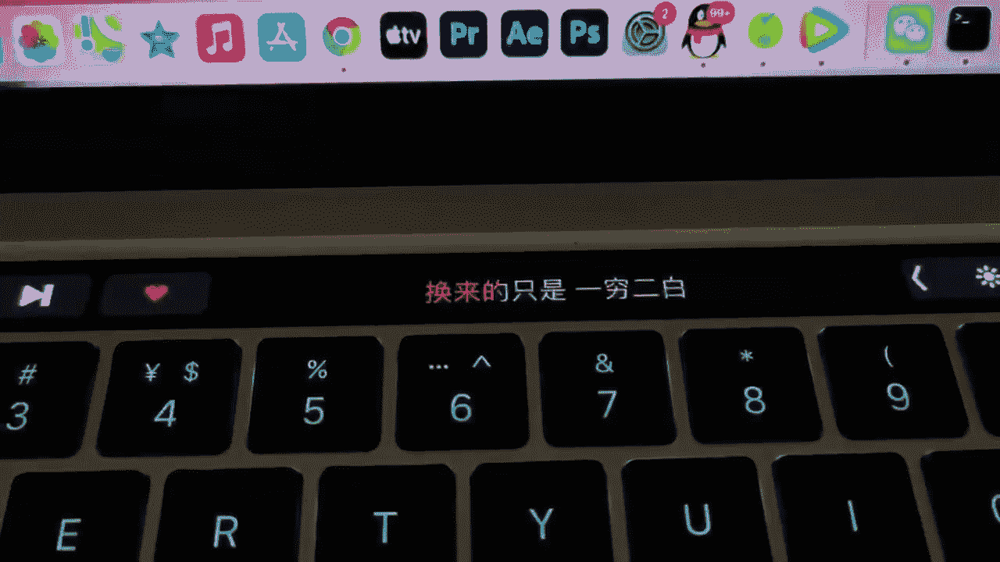
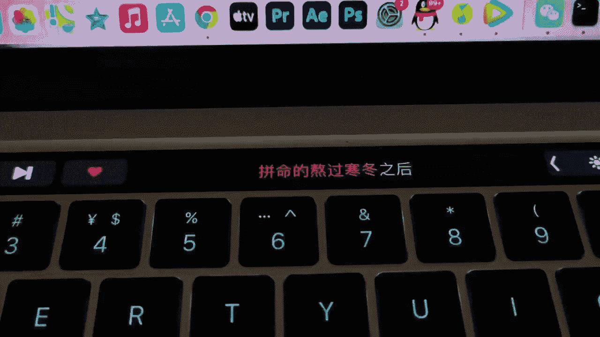

# 男哥展示面：1：展示面更新与核心概念

在本节课中，我们将学习如何更新个人展示面，并理解其背后的核心概念。展示面是个人形象在网络社交中的直观呈现，直接影响他人对你的第一印象。我们将通过分析一个具体案例，拆解其构成要素与更新逻辑。

上一节我们明确了展示面的重要性，本节中我们来看看一次具体的展示面更新包含了哪些内容。

## 案例背景分析

本次展示面更新于2022年3月21日，核心文件名为 `IMG_7200220321231036`。更新内容并非简单的图片替换，而是通过一组带有歌词的图片，传递特定的情绪与状态。

## 内容拆解与解读

以下是本次展示面更新的三个核心片段及其解读：

1.  **情绪铺垫**
    > “始终都不明白。”
    配合的图片（`1.png`）可能展示了困惑或思考的场景。这句话奠定了整个更新的基调——一种对过往经历的不解与反思。

2.  **状态陈述**
    > “透了3年不再，换来的只是一场闷。”
    配合的图片（`3.png`）可能体现了疏离或落寞的氛围。这里**“透了3年”**是一个关键时间描述，暗示了为某段关系或某个目标长期投入，但最终结果令人失望（“一场闷”）。

3.  **行动与结果**
    > “拼命的熬过。” “动之后却没看到阿卡。”
    配合的图片（`5.png`）可能展现了行动过程或对结果的探寻。这里描述了努力（“拼命的熬过”）和行动（“动之后”），但目标（“阿卡”可理解为目标或收获的象征）并未出现，强调了付出与结果的不对等。

## 核心概念总结

本节课中我们一起学习了如何通过非直白的图文组合来更新展示面。其核心逻辑在于：**展示面 = 视觉素材 + 文本语境**。本次更新通过歌词文本营造连贯的情绪叙事，再利用图片进行视觉强化，共同塑造了一个经历长期投入却未达预期的复杂形象。关键在于让观者自行解读并产生共鸣，而非直接陈述事实。