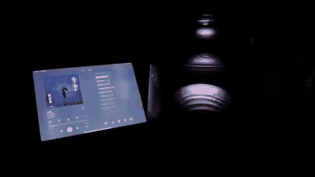

**展示面课程：1.08：男哥展示面更新**

在本节课中，我们将学习男哥于2022年3月25日更新的展示面内容，分析其构成元素与表达逻辑。

---

**概述**

本次展示面更新以一系列图文组合构成，核心是通过图片与歌词片段的穿插，营造一种文艺、感性且略带故事性的氛围。这种展示方式旨在传递个人品味与情感状态，而非直接展示具体事件或成就。

---

**图文结构分析**

上一节我们概述了本次更新的整体风格，本节中我们来具体拆解其图文排列的逻辑。

以下是本次展示面更新的核心结构序列：

1.  **开场白与意境图**：以一句歌词“总有些惊奇的际遇”开场，配以一张具有氛围感的图片（如黄昏、街道、背影），迅速建立文艺基调。
    

2.  **歌词片段递进**：随后分段展示歌词“比方说当我…不见…The…你那双温柔剔透的眼睛”。这种断句方式制造了阅读的节奏感和悬念。

3.  **核心视觉呈现**：在歌词的关键句后，连续插入两张核心人物或场景的特写图片，强化视觉冲击力和情感指向。
    
    

4.  **情感升华与收尾**：继续用歌词“出现的…我为…我的爱就像一…”作为文字引导，并以一张富有意境或留白的图片收尾，使整个展示面在情绪高潮处留下余韵。
    
    

---

**核心技巧总结**

本节课中我们一起学习了男哥展示面更新的具体案例。其核心技巧可总结为 **“用碎片化歌词叙事，用系列图片造境”**。

*   **公式**：`展示面效果 = 碎片化文艺文本 + 系列氛围感图片`
*   **关键点**：文本不直接说明，而是暗示；图片不追求信息量，而追求美感和连贯的情绪。两者交替出现，共同构建一个引人遐想的个人形象侧面。

这种方法的优势在于避免了直白的自我陈述，通过第三方内容（歌词）和视觉艺术来表达自己，显得更高级、更具吸引力。