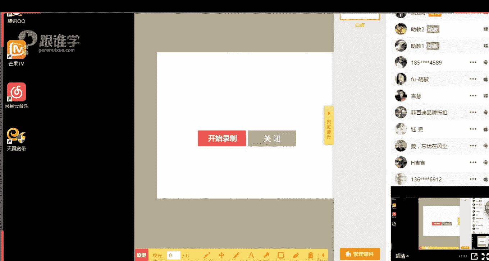
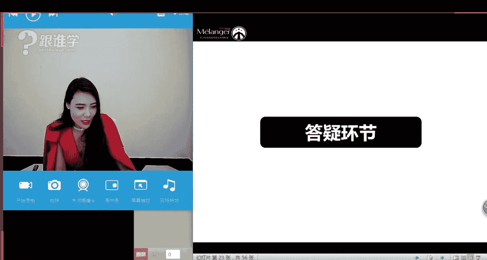
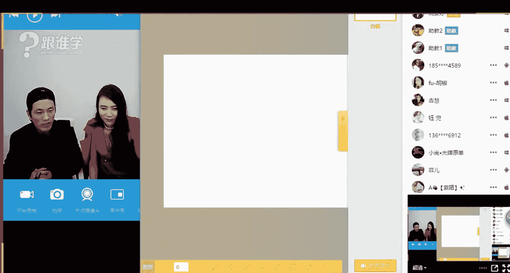
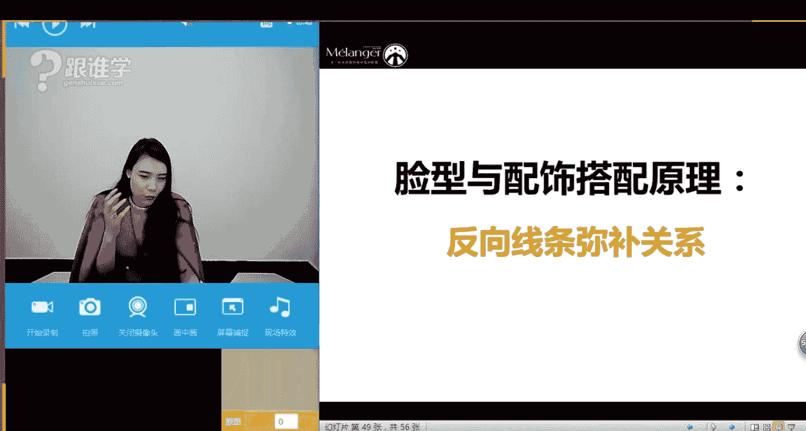
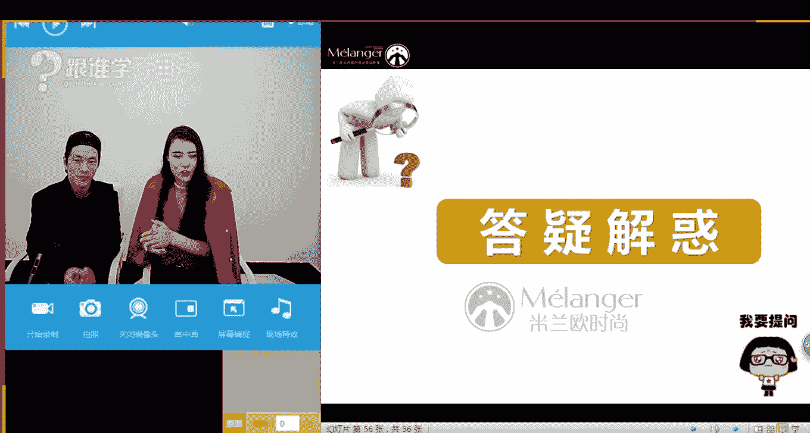

# 服装搭配秘笈之新版36计：02 脸型与发型的搭配法则

## 概述
在本节课中，我们将要学习如何根据不同的脸型，选择最适合自己的发型。我们将系统地分析八种主要脸型的特点，并掌握“反向线条弥补”的核心造型原则，帮助你通过发型修饰脸型，塑造更完美的个人形象。

---

## 认识你的脸型
上一节我们介绍了形象构成的整体概念，本节中我们来看看如何准确判断自己的脸型。这是选择合适发型的第一步。

要分析脸型，我们可以在脸上画出三条水平线和一条垂直线：
1.  **第一条线**：连接左右额骨最宽处。
2.  **第二条线**：连接左右颧骨最宽处。
3.  **第三条线**：连接左右下颌骨最宽处。
4.  **第四条线**：从发际线中点至下巴尖的纵向长度。

通过比较这四条线的长度和比例，就能判断出你的脸型。标准的脸型（如椭圆形、倒三角形）长宽比约为 **4:3**。

---

## 非标准脸型的发型搭配法则
大多数人的脸型属于非标准脸型，需要通过发型进行修饰，目标是向标准的椭圆形或倒三角形脸靠拢。其核心原则是 **反向线条弥补**。

### 方形脸与圆形脸：需要拉长脸型
方形脸和圆形脸都属于脸型偏短的类型，需要通过发型在视觉上增加长度。

**方形脸特征**：额头、颧骨、下颌骨的宽度大致相等，下颌骨方正突出，线条硬朗。
**圆形脸特征**：脸部长度与宽度相近，面部轮廓圆润丰满，下巴线条柔和。

以下是适合这两种脸型的发型建议：

**适合的长发**：
*   **有层次的卷发**：用卷发的弧度柔和面部棱角（对方形脸）或增加纵向线条感（对圆形脸）。
*   **侧分长发**：创造纵向线条，拉长脸型。避免厚重齐刘海。

**适合的短发**：
*   **避免完全暴露下颌骨**：短发长度最好能修饰下颌区域。
*   **侧分或顶部蓬松**：同样是为了制造纵向拉伸的视觉效果。

**适合的刘海**：
*   **方形脸**：适合侧分斜刘海，避免厚重齐刘海。
*   **圆形脸**：可以留刘海，但应选择轻盈的**空气刘海**，避免厚重感。

**盘发注意事项**：
*   务必用**侧分刘海**修饰额头和发际线，避免将全部头发紧贴头皮往后梳，否则会完全暴露脸型缺点。

**男士发型建议（方形脸为佳）**：
*   方形脸在男士中属于标准脸型，体现阳刚之气。
*   可通过**头顶发量蓬松、两侧剪短**的发型（如莫西干头）进一步拉长脸型。

---

### 长形脸：需要拉宽脸型
长形脸的特点是脸部长度明显大于宽度，需要通过发型在视觉上增加宽度，缩短长度。

**长形脸特征**：额头、颧骨、下颌宽度相近，但脸长明显大于脸宽。

以下是适合长形脸的发型建议：

**适合的长发**：
*   **带有纹理的卷发**：卷度应向**两侧蓬松**，以横向拉宽脸型。避免长直发。

**适合的刘海**：
*   **利用刘海缩短脸长**：刘海是长形脸的好朋友，能有效减少面部纵向留白。
*   **即使有刘海，两侧头发也应保持蓬松**，以加宽面部视觉。

**适合的短发与盘发**：
*   **短发**：顶部不宜过高，两侧保持蓬松感。
*   **盘发**：发际线不宜过高，最好搭配刘海一同造型。

**男士发型建议**：
*   避免将头顶头发梳得过高。
*   适合**侧分**或**有刘海**的发型，以降低发际线视觉高度。

---

### 菱形脸与梨形脸（正三角形）：需要弥补不足
这两种脸型都需要针对特定部位进行弥补和修饰。

**菱形脸特征**：颧骨最宽，额头和下颌较窄，面部轮廓像钻石。
**梨形脸（正三角形）特征**：下颌最宽，额头最窄，脸型像梨。

以下是针对性的发型建议：

**菱形脸修饰重点**：**加宽额头太阳穴区域**，**修饰高颧骨**。
*   **避免**：长直发（会突出颧骨）。
*   **适合**：**太阳穴处蓬松**的卷发，或用发丝修饰颧骨区域的发型。

**梨形脸修饰重点**：**加宽额头区域**，**修饰宽下颌**。
*   **核心原则**：上宽下窄。通过**顶部蓬松**的发型加宽额头视觉，用**有层次的头发**修饰下颌线。
*   **配饰原则**：选择有垂坠感、线条型的耳环，避免耳环最宽处停留在下颌角。

**男士发型建议**：
*   **菱形脸**：两侧头发不宜过短，需保持一定蓬松度以弥补太阳穴凹陷。
*   **梨形脸**：顶部头发需营造蓬松感，增加额部宽度。

---

### 标准脸型：椭圆形与倒三角形
这两种脸型是相对完美的标准，几乎可以驾驭所有发型。

**椭圆形脸（鹅蛋脸）特征**：比例匀称，线条柔和。
**倒三角形脸（瓜子脸）特征**：额头宽，下巴尖。

**发型建议**：
*   这两种脸型**非常百搭**，长发、短发、直发、卷发、有无刘海都可以尝试。
*   选择发型时，更多考虑与个人**气质、身材和着装风格**的匹配度。

---

## 现场造型与问答摘要
在课程中，我们邀请了发型师为一位圆脸学员进行了现场改造，并解答了学员的常见问题。

**造型实例**：针对圆脸学员，发型师通过改为**侧分**并**增加头顶发根的蓬松度**，成功拉长了脸型，提升了柔美感。

**常见问题解答摘要**：
1.  **发量少、细软、发际线高**：选择能**遮盖发际线**的发型，使用造型产品（如蓬松喷雾）增加发根支撑力，让头发显得丰盈。
2.  **小个子适合长发还是短发**：建议**中短发**，避免过长造成压身高，或过短对脸型要求过高。
3.  **如何选择发色**：亚洲人肤色大多偏冷，适合**冷色调**发色，如闷青、灰绿、冷棕、酒红色。可先通过试穿冷暖色调衣服判断自身肤色基调。
4.  **发质硬、发量多如何打理**：通过**修剪高层次**和**烫出纹理**来减轻重量感，避免头顶扁塌。
5.  **尴尬期发型打理**：佩戴帽子是简单有效的过渡方法。
6.  **白头发问题**：最直接有效的方法是**染发**。

---

## 总结
本节课我们一起学习了脸型与发型搭配的核心知识。我们首先掌握了通过“三条水平线”判断自己脸型的方法，然后深入了解了针对**方形脸、圆形脸（需拉长）**、**长形脸（需拉宽）**、**菱形脸、梨形脸（需弥补）** 这五大类非标准脸型的“反向线条弥补”原则。最后，我们也了解到椭圆形和倒三角形这两种标准脸型的百搭特性。

记住，发型是整体形象中至关重要的一环。正确的发型不仅能修饰脸型，更能凸显个人气质。希望本节课的内容能帮助你找到最适合自己的那一款发型。