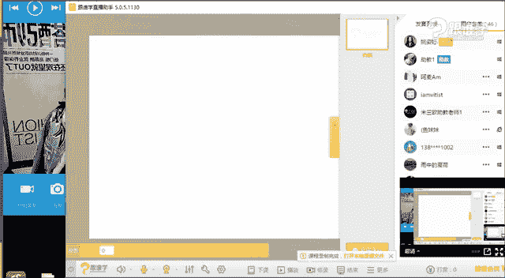
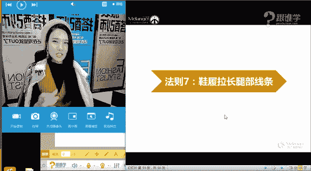

# 服装搭配秘笈：1：显瘦搭配技巧

在本节课中，我们将要学习如何通过巧妙的服装搭配，在视觉上达到显瘦和显高的效果。我们将从分析常见的搭配误区开始，逐步深入到具体的实用法则，帮助你扬长避短，穿出自信。

## 课程概述

很多人对自己的身材或多或少存在一些不满意的地方，例如觉得腿粗、肚子大、手臂粗或个子矮等。本节课的核心目标，就是学习如何通过服装的款式、色彩、面料和搭配技巧，在视觉上修饰身形，实现显瘦显高的目的。我们将摒弃“黑色一定显瘦”等固有观念，从科学和视觉原理出发，掌握真正有效的搭配方法。

## 一、 常见搭配误区分析

在深入技巧之前，我们先来澄清几个常见的搭配误区。这些观念在某些条件下成立，但并非绝对真理，理解其背后的原理至关重要。

上一节我们介绍了课程的整体目标，本节中我们来看看生活中几个常见的、可能并不完全正确的穿衣观念。

**误区一：黑色显瘦，白色显胖**

这是一个根深蒂固的观念。但请看下图对比，同样是黑色服装，收腰款式（右）明显比宽松款式（左）更显瘦。这说明，**款式**的影响力可能大于色彩。对于特别丰满的身材，厚重的黑色反而可能带来“沉重感”，而轻盈的浅色则能营造“轻盈感”。

**误区二：横条纹显胖，竖条纹显瘦**

这同样需要具体分析。稀疏的横条纹（左）因为分割了视觉，确实容易显胖；而密集的横条纹（右）则可能形成一个视觉整体，反而有收缩效果。关键在于条纹的**疏密程度**。

对于竖条纹，当它通身穿着且随着身体曲线（如胸、腰、臀）变形时（左），反而可能比合身的横条纹（右）更显胖。因此，竖条纹并非万能显瘦单品，**版型**同样关键。

## 二、 显瘦显高的核心原理

分析了误区后，我们来探讨其背后的科学原理。所有的显瘦显高技巧，都基于一个核心的视觉原理。

上一节我们破除了几个搭配误区，本节中我们来看看实现显瘦显高的根本逻辑是什么。

我们可以将身体简化成一个长方形。当服装的廓形紧贴身体或向内收时（如右图虚线所示），会形成**纵向延伸**的视觉效果，从而显高显瘦。反之，当服装廓形宽松、远离身体时（如左图虚线所示），会形成**横向扩张**的视觉效果，从而显矮显胖。

**核心公式：纵向延伸 = 显高显瘦；横向扩张 = 显矮显胖**

因此，我们所有的搭配技巧，无论是利用领口、腰线还是色彩，本质上都是在创造和强化纵向线条，避免和弱化横向分割。

## 三、 七大实用显瘦搭配法则

掌握了核心原理后，我们将学习七个具体、可操作的搭配法则。每个法则都旨在运用“纵向延伸”原理，针对身体不同部位进行修饰。

### 法则一：大领口更显瘦

领口形状直接影响脖颈和脸部的视觉感受。小领口或高领（左）容易显得局促，并强化脸部的存在感。而V领、U领等大领口（右），能有效拉长脖颈线条，形成纵向延伸，从而显瘦。对于脖子偏短或脸型偏大的同学，应优先选择大领口上衣。

以下是适合显瘦的领型：
*   **V领**：纵向拉伸效果最强。
*   **大U领**：同样能露出脖颈皮肤，增加轻盈感。
*   **方领**：具有一定复古感，也能增加露肤度。

### 法则二：遮盖法（扬长避短）

这个法则的关键在于：**展露优势，遮盖不足**。例如，如果小腿纤细但大腿较粗，就多穿及膝或过膝的裙装（右），露出优势的小腿部分。如果手臂有“拜拜肉”，选择中袖或七分袖（右）会比无袖（左）更能修饰臂型。将视觉焦点引导到你最自信的部位。

### 法则三：打造高腰线

高腰线是改善身材比例、显腿长的最有效方法之一。它能明确分割上下身，视觉上提升腿的起点。对比左右图，右图通过将上衣塞进下装或选择高腰下装，明显拉长了腿部线条。

以下是打造高腰线的几种方法：
*   **使用腰带**：最直接的方法，尤其是在穿着连衣裙或宽松上衣时。
*   **选择高腰下装**：高腰裤、高腰裙能天然地提高腰线。
*   **上衣塞进下装**：无论是全塞还是只塞前面，都能明确腰线位置。
*   **选择本身具有高腰线设计的服装**：如收腰连衣裙、高腰线连体裤等。

### 法则四：面料轻盈法

面料质感直接影响视觉上的“重量”。厚重、膨胀感强的面料（如左图的粗棒针毛衣）容易增加体积感。而垂坠感好、质地相对轻薄的面料（如右图），则能顺着身体线条向下延伸，显得人更修长轻盈。在秋冬，可以通过“上厚下薄”（如毛衣配纱裙）或露脚踝的方式来增加整体的轻盈感。

### 法则五：色彩连贯法

色彩在视觉上具有强大的引导作用。过多的色彩分割（左图：上衣、裤子、鞋子颜色各异）会将身体“切”成几段，显矮。而保持色彩的连贯性（右图），则能形成流畅的纵向线条，显高显瘦。

以下是色彩连贯的进阶方法：
*   **下身一码色**：裤子/裙子和鞋子颜色统一，延伸腿部线条。
*   **内搭一码色**：内搭的上衣和下装颜色统一，外套另选颜色。
*   **全身一码色/同色系**：这是显高效果最强的穿法，视觉延伸感一气呵成。

### 法则六：焦点上移法

将搭配的亮点或视觉焦点放在上半身，可以引导他人的视线向上看，从而忽略身高问题。例如佩戴醒目的项链、耳环、帽子、丝巾，或在上衣运用图案、设计细节。对比左右图，右图因胸前的项链和图案，视觉重心明显上提。

### 法则七：鞋履拉长腿部线条

鞋子是搭配的收官之笔，选对鞋子能事半功倍地延长腿部。基本原则是：减少脚踝处的分割，将脚面视为腿的延伸。

以下是选择显高鞋履的优先级（从高到低）：
1.  **裸色尖头高跟鞋（无绊带）**：尖头延伸线条，裸色与肤色融合，无绊带避免分割，是显高终极武器。
2.  **其他浅色尖头高跟鞋**：浅色比深色（如黑色）分割感弱。
3.  **裸色/浅色有绊带高跟鞋**：如果必须有绊带，选择接近肤色的。
4.  **裸色/浅色平底鞋**：选择露脚面的船鞋，仍有一定延伸效果。

## 课程总结

本节课我们一起学习了如何通过服装搭配实现显瘦显高的目标。我们首先纠正了“黑色必显瘦”等常见误区，理解了**纵向延伸**这一核心视觉原理。随后，我们掌握了七大实用法则：
1.  **大领口更显瘦**（创造脖颈纵向线条）。
2.  **遮盖法**（露优藏缺）。
3.  **打造高腰线**（优化身材比例）。
4.  **面料轻盈法**（减少视觉重量）。
5.  **色彩连贯法**（创造流畅纵向感）。
6.  **焦点上移法**（引导视线向上）。
7.  **鞋履拉长法**（延伸腿部线条）。

记住，搭配的目的是为了展现更好的自己，而非追求不切实际的瘦。灵活运用这些法则，找到最适合自己的方式，你就能穿出自信与风采。