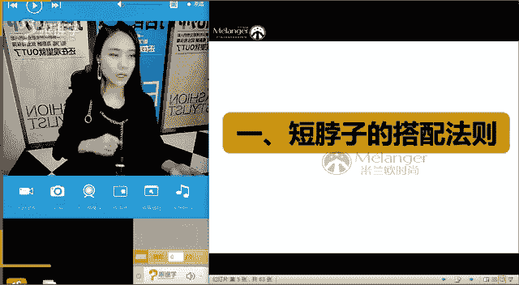
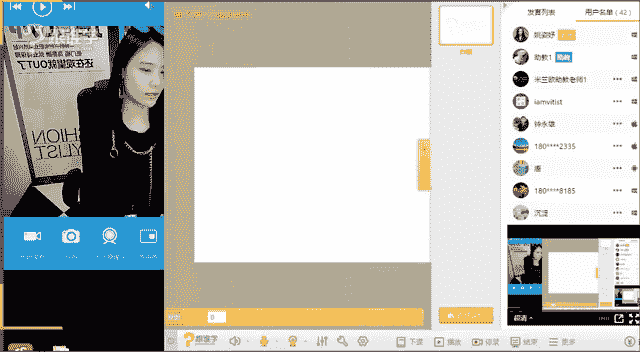
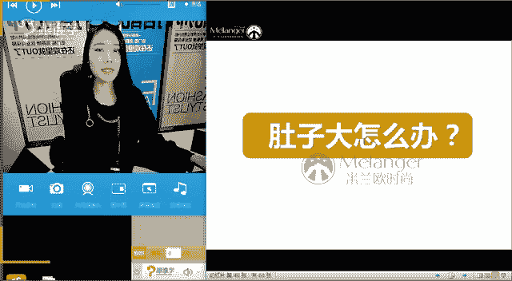

# 服装搭配秘笈：1：局部体态细节调整教程

## 概述
在本节课中，我们将学习如何针对四种常见的局部体态细节问题进行服装搭配调整。这四种问题分别是：脖子短、腰粗、肚子大和腿粗。我们将逐一分析每种问题的特点，并提供具体、实用的穿搭法则，帮助你通过服装修饰身形，提升整体形象。

---

## 脖子短的搭配法则

上一节我们概述了课程内容，本节中我们来看看如何解决脖子短的问题。

首先，我们需要判断自己是否属于脖子短的情况。标准脖长的计算方法是：从脖根到锁骨窝的长度应等于脸长（从发际线到下巴）的一半。例如，如果你的脸长是18厘米，那么标准的脖长应为9厘米。如果测量结果小于这个数值，则属于脖子偏短。

脖子短的人容易显得不够精神，甚至可能显脸大或显胖。以下是针对脖子短问题的三条核心搭配法则。

### 法则一：选择露锁骨的大领子
大领型服装能创造纵向的视觉延伸感，使脖颈区域看起来更通透、修长。

以下是适合的领型示例：
*   **大V领**：能有效拉长颈部线条。
*   **大U领**：同样具有纵向拉伸效果。
*   **一字领/铲型领**：能露出锁骨，增加清爽感。
*   **深V领**：对于能接受的场合，修饰效果极佳。

相比之下，小圆领、高领、紧贴脖子的立领（如旗袍领、衬衫立领）会加重脖子的局促感，应谨慎选择。

### 法则二：保持发型清爽
发型不应在颈部周围形成堆积感，以免加重“堵塞”的视觉印象。

以下是具体的发型建议：
*   **避免长度刚好卡在脖子位置的发型**，如某些波波头。
*   **选择更短的发型**或将头发盘起，能有效减少颈部周围的体积感，让头部看起来更小巧，脖颈更修长。
*   **长发可以自然垂下或扎起**，但避免厚重卷发堆积在肩颈部位。

### 法则三：利用配饰进行纵向拉伸
配饰可以引导视线，创造延伸的线条感。

以下是有效的配饰使用技巧：
*   **佩戴长项链**：尤其是V型长项链，能模拟V领效果，拉长脖颈线条。
*   **谨慎选择颈链**：如果喜欢颈链，应选择细款或接近肤色的款式，避免粗宽款式勒紧脖子。
*   **利用长款丝巾或毛衣链**：同样能起到纵向引导视线的作用。

**总结**：对于脖子短的问题，核心思路是通过**大领口、清爽发型和纵向配饰**来增加颈部的露肤度和纵向线条感，从而在视觉上拉长脖颈。

---

## 腰粗的搭配法则

上一节我们介绍了脖子短的调整方法，本节中我们来看看腰粗的问题如何破解。腰粗的情况大致分为两种：一种是T型体型造成的“无腰线”感；另一种是真正的腰围较大。

### 情况一：T型体型（肩宽臀窄）
这类体型的特点是肩部明显宽于臀部，腰臀差距小，因此显得腰部曲线不明显，感觉“腰粗”。调整目标是平衡上下身，塑造X型曲线。

以下是两个调整方法：
*   **加宽裙摆对比法**：通过穿着伞裙、A字裙、蓬蓬裙等下摆较宽的裙装，来对比衬托出腰线，人为制造曲线感。
*   **腰带制造腰线法**：明确使用腰带来标出腰部最细的位置，即使实际腰臀差不大，也能在视觉上强调腰线。

### 情况二：真性腰围较大
对于腰围确实较大的情况，修饰的核心是避免膨胀感，并利用视觉错觉。

以下是两个关键法则：
*   **选择修身合体的款式**：避免穿着过于宽松或膨胀感强的面料，合身略有余量的剪裁比“宽大遮肉”更显利落。
*   **巧用“瘦身阴影”设计**：利用服装本身的剪裁或色彩拼接，在视觉上“收缩”腰腹。例如，深色侧边拼接的连衣裙、腰部采用密实面料而其他部分用镂空或稀疏面料的设计，都能产生视觉上的收缩效果。

**总结**：解决腰粗问题，需先判断属于哪种类型。**T型体型重在“造曲线”**，通过加宽下身和明确腰线来实现；**真性腰粗则重在“显利落”**，通过合身剪裁和视觉收缩设计来修饰。

---

## 肚子大的搭配法则

上一节我们探讨了腰粗的解决方案，本节中我们聚焦于肚子大的搭配技巧。肚子大容易显矮、显胖，在选购衣物时也常有困扰。

以下是针对肚子大的三个实用穿搭法则。

### 法则一：外浅内深收缩法
在叠穿时，利用色彩原理来修饰腹部。

具体操作是：
*   **内搭选择深色**（如黑色、深蓝），**外套选择浅色**。
*   深色内搭具有视觉收缩和后退感，能从视觉上减小腹部的突出感，而浅色外套则不会过度吸引注意力到身体中部。

### 法则二：避免低腰裤/裙
低腰设计会卡在腹部最丰满处，不仅穿着不适，更会将视线引导并锁定在肚子上，完全暴露缺点。

正确的选择是：
*   **高腰裤/高腰裙**：能够更好地包裹和支撑腹部，将腰线上移，从而平滑腹部线条，并优化身体比例。

### 法则三：腹部避免复杂图案
复杂、鲜艳的图案或横向条纹具有视觉膨胀感，会吸引注意力并让腹部看起来更突出。

因此应注意：
*   腹部区域尽量选择**纯色、哑光面料**。
*   避免在腹部设计有大面积印花、格纹或横条纹的服装。

**总结**：对于肚子大的修饰，关键在于**视觉收缩、提高腰线和保持简洁**。通过深色内搭、高腰设计和纯净的腹部区域，能有效弱化小腹的存在感。

---

## 腿粗的搭配法则

上一节我们学习了如何修饰肚子，本节我们最后来看看腿粗的搭配要点。腿粗的烦恼通常包括不敢穿短裤短裙，以及如何选择裤装。

以下是五个针对腿粗问题的搭配法则。

### 法则一：把握下装长度
核心原则是“扬长避短”——遮盖最粗的部分，露出相对较细的部分。

具体建议如下：
*   **大腿粗但小腿细**：适合长度在膝盖附近的裙装或短裤，露出纤细的小腿。
*   **小腿也粗**：适合长裙或长度盖过小腿肚的阔腿裤，避免长度刚好卡在小腿最粗处的单品。

### 法则二：下装颜色要深沉
深色具有视觉收缩效果，能显得腿部更纤细。

选择建议：
*   优先选择**黑色、深蓝色、深灰色**等下装。
*   谨慎选择浅色牛仔裤或膨胀感强的亮色下装。

### 法则三：裤型选择至关重要
不同的裤型对腿型的修饰效果差异巨大。

以下是针对腿粗的裤型选择指南：
*   **推荐**：直筒裤、阔腿裤、喇叭裤。这些裤型能很好地隐藏腿部真实轮廓，营造流畅的线条感。
*   **谨慎**：紧身窄脚裤。如果穿，最好搭配长款上衣遮盖大腿根部。
*   **注意**：选择牛仔裤时，关注后口袋位置。位置偏高的口袋有助于视觉上提臀，让腿显得更长。

### 法则四：注意裤子材质
面料的光泽感和图案也会影响视觉粗细。

选择要点：
*   **避免**：皮革、漆皮等有反光光泽的面料，以及腿部带有大格子、大花纹图案的裤子，它们都会吸引视线并产生膨胀感。
*   **选择**：哑光、纯色的面料更为安全。

### 法则五：粗跟鞋是好朋友
鞋跟的粗细能与小腿形成对比，从而影响视觉感受。

对比原理是：
*   **粗跟鞋**：其体积感能与小腿形成对比，在视觉上反衬得小腿更细。
*   **细跟鞋**：虽然优雅，但在“显腿细”的对比效果上不如粗跟。

**总结**：修饰腿粗，需要**综合运用长度、色彩、裤型、材质和鞋履**。记住“深色、高腰、合适裤型加粗跟”的组合拳，能有效优化腿部线条。

---

## 课程总结
本节课中，我们一起学习了针对四种常见局部体态问题——脖子短、腰粗、肚子大、腿粗——的服装搭配调整方法。
*   **脖子短**：通过大领口、清爽发型和纵向配饰来拉长线条。
*   **腰粗**：区分T型体型（造曲线）和真性腰粗（显利落），采用不同策略。
*   **肚子大**：运用外浅内深、高腰设计和腹部简洁化来弱化凸起。
*   **腿粗**：综合控制下装长度、颜色、裤型、材质，并利用粗跟鞋对比显瘦。

掌握这些具体的法则，你就能更有针对性地选择服装，巧妙修饰身形，展现更自信的形象。