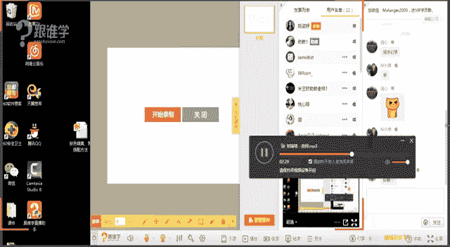
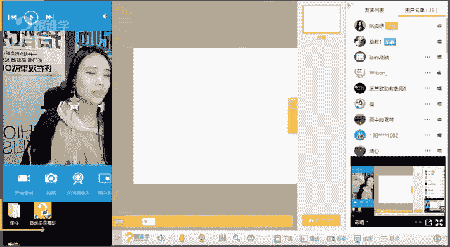
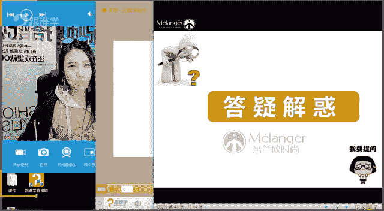

# 服装搭配秘笈之新版36计：12 肤色黑黄的搭配指南

## 概述

在本节课中，我们将要学习针对肤色偏黑或偏黄人群的服装搭配技巧。我们将打破“某些颜色不能穿”的固有观念，转而探讨如何通过巧妙的搭配方法，让各种色彩都能为你的形象加分。课程将围绕七个核心法则展开，帮助你穿出精神、穿出气质。

---

## 一、 打破色彩限制：敢于尝试亮色

上一节我们提到了肤色与色彩的关系，本节中我们来看看如何突破色彩选择的局限。

许多肤色偏黑黄的人会倾向于只穿黑白灰等基础色，认为亮色会暴露肤色缺点。然而，这种观念需要被打破。实际上，恰当使用亮色反而能提升整体精神面貌。

以下是两个对比案例，说明了鲜艳色彩的优势：

*   **案例一：蓝色系对比**
    *   **左图（效果欠佳）**：穿着灰浊的蓝色，整个人气质显得沉闷、没有精神。
    *   **右图（效果更佳）**：穿着鲜艳的蓝色，显得更有活力和精神。

*   **案例二：红色系对比**
    *   **左图（效果更佳）**：穿着鲜艳的红色，显得气色更好。
    *   **右图（效果欠佳）**：穿着浑浊的酒红色或铁锈红，显得面色黯淡。

**核心要点**：鲜艳、饱满的色彩比灰暗、浑浊的色彩更能提亮肤色，增强精神感。

---

## 二、 善用基础色：懂得运用白色

上一节我们探讨了亮色的重要性，本节中我们来看看一个最基础也最有效的颜色——白色。

肤色黑黄的人常担心穿白色会显得更黑。确实，白色与深肤色会形成对比，但这种对比带来的往往是“有精神”，而非单纯的“显黑”。关键在于选择正确的白色。

以下是关于白色选择的要点：

*   **纯白色 vs. 米白色**：对于肤色黑黄的人来说，**纯白色**比**米白色**或乳黄色更能提亮肤色，显得人更精神、健康。
*   **搭配示例**：观察对比图可以发现，内搭纯白色单品（如T恤、衬衫）能有效隔离脸部与外套的浊色（如卡其色），使整体造型更明亮、气质更上扬。

**核心要点**：优先选择**纯白色**单品作为内搭或主色，能有效提升面部光彩和精神状态。

---

## 三、 安全色的误区：黑灰不一定安全

上一节我们学习了白色的妙用，本节中我们来看看另外两个“安全色”——黑色和灰色。

黑色和灰色是衣橱必备，但通身大面积穿着对于肤色黑黄的人来说，可能并非最佳选择，容易显得沉闷、缺乏生气。

以下是关于黑灰色搭配的建议：

*   **避免通身黑/灰**：全身黑色或灰色容易吞噬气色，让人看起来不够饱满。
*   **搭配亮色或配饰**：若穿着黑灰色服装，应通过搭配亮色内搭、鲜艳配饰（如项链、丝巾）、或有设计感的细节（如金属拉链、腰带）来打破沉闷，增加层次感和透气感。
*   **对比效果**：通过图片对比可以看出，即使穿着黑灰色，通过加入白色内搭或亮眼配饰的造型，其精神面貌远胜于全身黑灰的造型。

**核心要点**：黑灰色需要**与其他亮色或设计元素搭配使用**，以避免单调沉闷。

---

## 四、 保持距离感：不要太接近肤色

上一节我们指出了安全色的搭配要点，本节中我们来看看一个需要特别注意的雷区——与肤色过于接近的颜色。

诸如驼色、卡其色、土黄色等大地色系，如果与穿着者的肤色过于接近，容易造成“面如菜色”、精神不振的视觉效果。

如果你拥有这类颜色的衣服，可以通过以下方法巧妙搭配：

*   **内搭亮色隔离法**：在接近肤色的外套（如卡其色风衣）内，搭配一件**亮色内搭**（如红色、蓝色、白色衬衫或T恤）。亮色在脸部与外套之间形成视觉隔离，能有效提亮面部。
*   **下装穿着法**：将过于接近肤色的单品（如土黄色上衣）作为下装穿着，使其远离面部，减少对脸色的直接影响。
*   **配饰提亮法**：通过佩戴鲜艳的围巾、有光泽的项链等配饰，在脸部周围形成提亮区域。

**核心要点**：通过**亮色内搭**或**配饰**，在脸部与接近肤色的服装之间建立视觉缓冲带。

---

## 五、 简化视觉焦点：服装简洁大方

上一节我们解决了颜色接近的问题，本节中我们来看看服装款式和图案的选择。

过于复杂、琐碎或柔软无形的款式，会加重肤色黑黄带来的拖沓感。选择简洁、利落的款式更能凸显精神。

以下是关于款式和图案的选择建议：

*   **款式选择**：优先选择剪裁**利落**、面料有一定**挺括感**的服装。这类服装能塑造更佳的精神轮廓。过于柔软、贴肤、无廓形的面料（如某些柔软针织）容易显得慵懒没精神。
*   **图案选择**：
    *   **推荐**：清晰的**几何图案**（如条纹、格纹、波点）。这类图案规整、利落，能增强干练感。
    *   **谨慎**：模糊、无序的**自然类图案**（如细小碎花、晕染印花）。这类图案容易显得凌乱，如果颜色再偏浊，会更显气色不佳。
    *   **补救**：如果非常喜欢自然类图案，应选择**颜色鲜艳**的款式，并尽量将其用于下半身。

**核心要点**：选择**款式简洁**、**面料挺括**、**图案清晰**的服装，有助于提升整体精气神。

---

## 六、 发色的影响：不要染黄头发

上一节我们讨论了服装本身的要素，本节中我们来看看一个容易被忽略但至关重要的部分——发色。

发色与肤色相邻，对整体肤色观感影响巨大。对于肤色黑黄的人来说，错误的发色会雪上加霜。

以下是关于发色的建议：

*   **避免浅黄色**：染成过于浅黄或与肤色接近的黄色头发，会与暗黄肤色融为一体，显得肤色更浊、发质更差，缺乏质感。
*   **推荐深色系**：保持**自然黑发**或染**深棕色**等深色系发色。深色头发吸光，不与肤色“争辉”，反而能衬托得肤色更均匀，甚至视觉上更有“变白”的效果。
*   **对比效果**：通过博主对比图可以明显看出，深色头发搭配红唇的造型，远比黄头发、无唇妆的造型显得精致、有神采。

**核心要点**：选择**深色系发色**（如自然黑、深棕），避免浅黄发色，以提升肤质感和整体精致度。

---

## 七、 画龙点睛：找到适合自己的口红

最后，我们来学习提升气色的终极利器——口红。即使服装搭配得当，妆容的缺失也会让效果大打折扣。

对于肤色黑黄的人来说，口红是快速、有效提亮面色、增强气场的法宝。

以下是关于口红选择的建议：

*   **必备色号推荐**：建议常备三支不同色调的口红以适应不同场合和服装。
    1.  **正红色**：气场强大，搭配黑白或正式着装。
    2.  **玫红色（冷色调）**：显白提气色，搭配冷色系服装。
    3.  **橘红色（暖色调）**：活力感强，搭配暖色系服装。
*   **化妆的重要性**：涂抹口红前，**底妆（如粉底、隔离）** 至关重要。均匀的底妆能修正肤色，让任何颜色的口红效果都更好。不化妆直接涂口红，效果会大打折扣。
*   **效果对比**：同一人穿着黑色衣服，涂与不涂口红（尤其是正红色）的气色和气质差异巨大。

**核心要点**：**化妆后**使用合适的**口红**，是肤色黑黄者提升整体造型完整度和精致度的关键一步。

---

## 总结

本节课我们一起学习了针对肤色黑黄人士的七条核心搭配法则：

1.  **敢于尝试亮色**：用鲜艳色彩打破沉闷，提升精神。
2.  **懂得运用白色**：优先选择纯白色进行提亮。
3.  **黑灰不一定安全**：避免通身穿搭，需搭配亮色或配饰。
4.  **不要太接近肤色**：用亮色内搭或配饰隔离接近肤色的服装。
5.  **服装简洁大方**：选择款式利落、图案清晰的服装。
6.  **不要染黄头发**：保持深色发色以提升质感。
7.  **找到适合自己的口红**：化妆并善用口红提亮气色。

记住，本课程倡导的理念是：**没有绝对不能穿的颜色，只有需要调整的搭配方法**。希望这些法则能帮助你更自信地驾驭各种色彩，展现独特魅力。