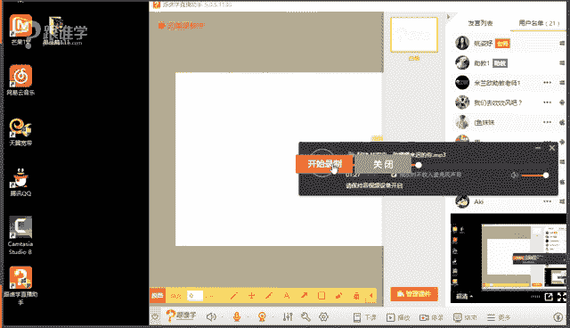
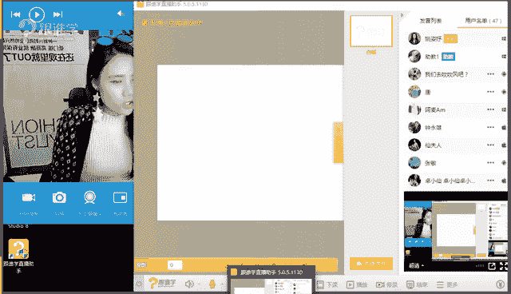
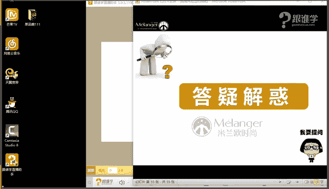

# 服装搭配秘笈之新版36计：13：脸型与眼镜搭配

## 概述

在本节课中，我们将要学习如何根据不同的脸型选择合适的眼镜。课程将涵盖眼镜的流行趋势、脸型诊断方法、以及脸型与眼镜搭配的核心法则。通过学习，你将能够找到最适合自己脸型的眼镜，提升整体造型的和谐度。

---

## 一、眼镜的流行趋势

上一节我们介绍了课程的整体框架，本节中我们来看看2017年眼镜的流行趋势。了解流行趋势有助于我们选择既时尚又适合自己的款式。

以下是2017年主要的眼镜流行趋势：

1.  **圆形镜片加猫眼镜框**：镜片为圆形，但在镜框边角处有小上扬的设计，类似猫眼。这种眼镜传递出俏皮、活泼的感觉。
2.  **透明镜框**：镜框采用透明材质，显得清新、现代。如今眼镜更多作为装饰品，不仅在夏季，冬季佩戴也很常见。
3.  **双色镜框**：镜框采用上下或左右双色拼接设计，个性鲜明，是秀场上的常见元素。
4.  **粗边框**：镜框边框较粗，线条硬朗，能传递出中性、帅气、硬朗的感觉。
5.  **塑料感眼镜**：色彩鲜艳，材质具有明显的塑料质感，风格活泼、时尚，甚至带点复古玩具感。
6.  **彩色透明镜片款**：镜片带有颜色但保持透明，常与运动、复古风格搭配。
7.  **个性类眼镜**：造型极度夸张，通常出现在秀场用于视觉效果，日常实用性较低。

---

## 二、认识脸型与核心搭配原则

了解了流行款式后，我们需要认识自己的脸型。脸型是选择眼镜、发型、帽子等配饰的基础。

### 1. 标准脸型与非标准脸型

*   **标准脸型**：主要指**椭圆形脸**（鹅蛋脸）和**倒三角形脸**（心形脸）。这两种脸型符合“三庭五眼”和“长宽比约4:3”的美学标准，比较上镜，对眼镜的兼容性很高。
*   **非标准脸型**：包括**圆形脸**、**方形脸**、**长形脸**、**正三角形脸**（梨形脸）、**菱形脸**等。这些脸型需要通过发型、配饰进行修饰，以达到更接近标准脸型的效果。

### 2. 诊断自己的脸型

以下是诊断脸型的步骤：
1.  将头发全部扎起，露出完整脸部。
2.  面对镜子或照片，找到三个最宽处：额头宽度、颧骨宽度、下颌宽度。
3.  比较这三条线的长短关系，并观察脸部轮廓的线条（圆润或棱角），对照标准脸型图，找到最接近的一种。
    *   很多人是复合型脸型（如方中带圆），判断时以最明显的特征为主。

### 3. 核心搭配原则：反向弥补

选择眼镜的核心原则是 **反向弥补**。即用眼镜的线条来平衡脸型的不足。
*   **公式**：脸型缺陷 + 相反眼镜线条 = 视觉平衡
*   **关键判断**：首先判断脸型在长度上是偏短还是偏长。
    *   **脸型偏短**（如圆脸、方脸）：应选择**拉高型**（纵向感强）的眼镜，在视觉上拉长脸型。
    *   **脸型偏长**（如长形脸）：应选择**拉宽型**（横向感强）的眼镜，在视觉上缩短脸型。

---

## 三、不同脸型的眼镜搭配法则

上一节我们学习了核心的“反向弥补”原则，本节中我们具体看看每种脸型该如何应用这一原则选择眼镜。

以下是针对不同脸型的详细搭配法则：

1.  **圆形脸 & 方形脸**
    *   **法则**：选择**拉高型**且**方圆形**的镜框。
    *   **原因**：拉高型镜框可以增加脸部纵向线条，缓解脸型的短宽感。避免选择纯圆形（重复脸型）或特别方正的镜框（可能形成生硬对比），方圆形镜框最为安全和谐。

2.  **长形脸 & 长方形脸**
    *   **法则**：选择**拉宽型**（扁宽）的镜框。
    *   **原因**：拉宽型镜框能增加脸部横向线条，有效打破脸型的狭长感。应避免镜框高度过大、纵向感过强的款式。

3.  **菱形脸**
    *   **法则**：**猫眼形**或镜框上缘有**明显边角**的眼镜最为适合。
    *   **原因**：菱形脸的特点是太阳穴凹陷、颧骨突出。猫眼形或上缘有角的镜框可以修饰和弥补太阳穴的不足，同时镜框高度应足够，以平衡突出的颧骨。

4.  **正三角形脸（梨形脸）**
    *   **法则**：选择**上宽下窄**的镜框。
    *   **原因**：梨形脸上窄下宽。上宽下窄的镜框可以加宽额头的视觉比例，与下半部分脸型形成互补，达到平衡效果。

5.  **倒三角形脸（心形脸）**
    *   **法则**：**避免重复脸型**的眼镜。
    *   **原因**：心形脸本身比较标准，但下巴过尖。应避免佩戴上宽下窄过于明显的“心形”眼镜（如一些飞行员镜），以免强化下巴的尖锐感。其他款式大多可尝试。

6.  **椭圆形脸（鹅蛋脸）**
    *   **法则**：**最为百搭**，几乎可以驾驭所有镜框形状。
    *   **原因**：标准脸型，无需过多修饰，可根据服装风格和个人喜好自由选择。

**通用注意事项**：无论何种脸型，眼镜的宽度应与脸的宽度（通常以颧骨宽度为参考）大致相当，避免过大或过小。

---

## 四、眼镜风格与服装搭配

选对了适合脸型的眼镜后，我们还需要考虑它与服装风格的协调性。眼镜本身也承载着风格语言。

以下是几种常见眼镜风格及其搭配导向：

*   **飞行员眼镜（蛤蟆镜）**：
    *   **风格**：帅气、潇洒、中性。
    *   **搭配**：非常适合与飞行员夹克、牛仔、皮革等单品搭配，打造酷感造型。
*   **猫眼眼镜/可爱框镜**：
    *   **风格**：俏皮、活泼、性感（猫眼）、文艺（圆框）。
    *   **搭配**：搭配色彩鲜艳、设计感强的服装，或用于打造复古、学院风造型。
*   **大方框/未来感眼镜**：
    *   **风格**：前卫、硬朗、个性、未来感。
    *   **搭配**：适合搭配线条简洁、结构感强的现代服装，营造强势、时髦的形象。
*   **复古黑框眼镜**：
    *   **风格**：斯文、学院、文艺、书卷气。
    *   **搭配**：与衬衫、毛衣、贝雷帽等单品组合，轻松塑造知识分子或清新学院风格。

---

## 总结

本节课中我们一起学习了眼镜与脸型的搭配体系。我们从识别自己的脸型开始，掌握了“反向弥补”的核心原则，并具体分析了圆脸、方脸、长脸、菱形脸、梨形脸、心形脸和鹅蛋脸各自适合的眼镜款式。最后，我们还了解了不同风格的眼镜如何与服装进行搭配。

记住，**认识自己是变美的第一步**。先通过发型、妆容等手段将脸型修饰到更理想的状态，再结合本节课的知识选择眼镜，你就能更自信地驾驭各种时尚配饰，提升整体造型的完整度和精致度。时尚是一个需要不断学习和积累的过程，希望本节课能为你打下坚实的基础。