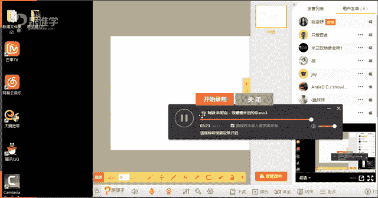
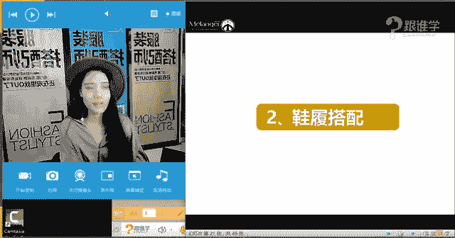

# 服装搭配秘笈：1：鞋履搭配技巧

在本节课中，我们将要学习关于鞋履搭配的核心知识与技巧。我们将从鞋履的历史发展讲起，了解脚型分类，并深入探讨不同鞋款的风格与搭配方法。无论你是初学者还是希望提升搭配水平，本教程都将为你提供清晰、实用的指导。

## 鞋履的历史发展

上一节我们介绍了课程概述，本节中我们来看看鞋履的历史。了解鞋子的历史，有助于我们理解其文化内涵，从而更好地驾驭它。

*   在古埃及，鞋子是身份与地位的象征，只有法老和王室成员才有资格穿着。
*   古罗马时期出现了罗马凉鞋，其设计注重实用性与对脚部的保护。
*   在16至17世纪的欧洲，路易十四国王因其身高原因，推动了高跟鞋的流行，并将红色鞋跟定为贵族专属。
*   鞋子的发展与社会进步紧密相关，其功能从最初的保护与象征，逐渐演变为时尚与个性的表达。

## 脚型分类与选鞋

了解了鞋履的历史后，我们来看看如何根据自身条件选择鞋子。合脚的鞋子是舒适与美观的基础，而选对鞋型的关键在于了解自己的脚型。

以下是四种常见的脚型分类：

1.  **埃及脚**：大脚趾最长，其余脚趾长度依次递减。这是最常见的脚型（约占70%），适合大多数鞋型，但穿着圆头或方头等空间较大的鞋款最为舒适。
2.  **希腊脚**：第二根脚趾最长。这种脚型穿尖头鞋通常更舒适，因为尖头能为最长的脚趾提供足够空间。
3.  **罗马脚**：前三个或四个脚趾长度几乎齐平，脚掌较宽。适合穿着方头鞋、圆头鞋或空间感较大的凉鞋，应避免过于狭窄的鞋型。
4.  **日耳曼脚**：大脚趾明显长于其他脚趾，且其他脚趾长度相近。适合选择鞋头空间充足的款式，如圆头、方头鞋或凉鞋。在材质上，柔软的羊皮或麂皮能提升舒适度。

## 鞋履的款式解析

认识了自己的脚型，接下来我们系统地认识鞋履的款式。我们可以从鞋头、鞋跟、鞋帮三个维度来解析一双鞋。

### 鞋头

鞋头的形状直接影响鞋子的风格导向。

*   **方头鞋**：线条硬朗，传递中性、帅气、利落的感觉。
*   **圆头鞋**：轮廓柔和，显得可爱、甜美、年轻。
*   **尖头鞋**：线条锐利，最具女人味，显得性感、成熟。
*   **方圆头/尖圆头鞋**：介于两者之间，方圆头带有些许复古感，尖圆头则更显优雅。

### 鞋跟

鞋跟的高度和形状同样承载着风格信息。

*   **平跟鞋/坡跟鞋**：舒适感强，常带有休闲、田园或复古风格。
*   **高跟鞋**：细高跟最具女性魅力；方跟则更偏中性帅气。鞋跟高度需结合个人身材比例考虑，接近黄金比例（1.618）的身材对鞋跟高度要求更灵活。

### 鞋帮

鞋帮的高度会影响腿部视觉比例。

*   **浅口鞋**：最大限度展露脚面，能延伸腿部线条，显高效果好。
*   **高帮鞋/中筒靴**：容易在视觉上分割腿部，尤其对小腿粗或腿型不完美者不太友好。搭配时，建议与裤装或长裙衔接，减少切割感。
*   **高筒靴/过膝靴**：如果搭配得当（如下装同色系），反而能修饰腿型，显得修长。

## 经典鞋款与搭配示范

掌握了鞋子的基本构成元素后，我们来看看如何将具体的鞋款融入日常穿搭。以下是几款经典鞋履的搭配思路。

### 女士鞋款

**1. 芭蕾舞鞋**
*   **风格**：甜美、可爱、优雅。
*   **搭配建议**：适合搭配A字连衣裙、紧身裤或迷你半裙，能强化年轻、俏皮的整体感。避免与过于大气或夸张的阔腿裤搭配。

**2. 懒人鞋（一脚蹬）**
*   **风格**：舒适、休闲、时髦。
*   **搭配建议**：多与裤装搭配，如短外套、风衣、连体裤等，营造潇洒帅气的氛围。尖头款的懒人鞋可增加女性化元素。需注意整体风格的协调，避免与过于正式或性感的服装混搭。

**3. 尖头高跟鞋**
*   **风格**：性感、妩媚、极具女人味。
*   **搭配建议**：
    *   搭配连衣裙或半裙，尽显女性魅力。
    *   搭配西装，可实现“娘man平衡”，在柔美中注入干练。
    *   搭配阔腿裤，潇洒又显高，是流行的穿搭组合。

### 男士鞋款

**1. 牛津鞋**
*   **特点**：鞋面襟片为封闭式，是最正式的男鞋。
*   **场合**：适用于商务、正式晚宴等严肃场合。光面款比雕花（布洛克）款更正式。

**2. 德比鞋**
*   **特点**：鞋面襟片为开放式，舒适度更高。
*   **场合**：正式度仅次于牛津鞋，适用于商务及商务休闲场合。

**3. 乐福鞋**
*   **特点**：无鞋带设计，方便穿脱，休闲感强。
*   **场合**：适用于休闲场合。其中，便士乐福鞋、流苏乐福鞋等均为经典款式。搭配牛仔裤或拆套式西装（上下装不同色）最佳。

**4. 孟克鞋**
*   **特点**：鞋面有横向搭扣带。
*   **场合**：休闲感较强，适合搭配休闲裤、牛仔裤等。

## 2017年流行鞋款趋势（示例）

在掌握了经典款之后，了解当时的流行趋势也能为搭配增添新意。以下是2017年备受关注的几款鞋：

1.  **绑带鞋**：设计感强，能丰富脚部视觉。
2.  **玛丽珍鞋**：带有搭扣，复古而优雅。
3.  **天鹅绒面料鞋**：材质独特，光泽感赋予造型时尚度。

## 总结

本节课中我们一起学习了鞋履搭配的完整知识体系。我们从鞋子的历史文化入手，明白了其超越功能的价值；通过了解自己的脚型，我们学会了如何选择舒适的鞋款；接着，我们拆解了鞋头、鞋跟、鞋帮的设计语言，掌握了判断鞋子风格的方法；最后，通过分析芭蕾舞鞋、懒人鞋、尖头高跟鞋以及牛津鞋、德比鞋等经典款式，我们掌握了将鞋子与服装进行有效搭配的实用技巧。记住，鞋子不仅是穿搭的终点，更是风格的宣言。希望你能运用所学，一步步构建属于自己的精致形象。