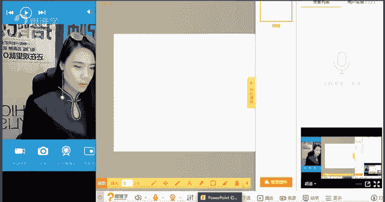
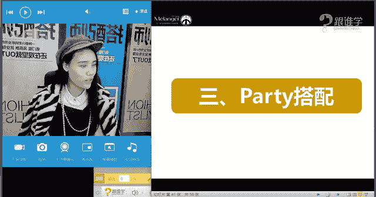
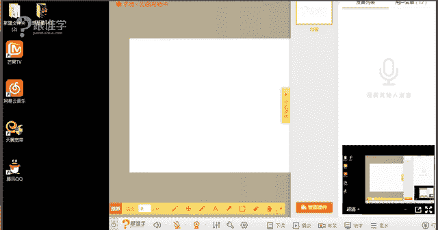

# 服装搭配秘笈：1：职场、约会、派对搭配法则

在本节课中，我们将要学习如何根据不同的场合进行得体的着装搭配。我们将重点探讨职场、约会和派对这三种常见场合的着装法则，帮助你掌握在不同情境下展现最佳形象的技巧。

## 职场搭配法则

上一节我们介绍了场合着装的重要性，本节中我们来看看职场搭配的具体法则。职场着装主要分为严肃职场和时尚职场两大类。

严肃职场通常指机关、法院、银行、金融、法律等行业。这些场合要求着装严谨、庄重，以展现专业和可信赖的形象。时尚职场则包括服装、化妆、传媒、设计、互联网等行业，着装要求相对宽松，但仍需保持职业感。

以下是职场着装的核心要点：

*   **款式选择**：应以简约、干练的款式为主。女士可选择西装、衬衫、铅笔裙、阔腿裤、风衣、简约连衣裙等。男士可选择西装、夹克、衬衫、西裤等。避免穿着过于性感、休闲（如T恤、牛仔、卫衣）或装饰繁琐的服装。
*   **色彩运用**：多选用沉稳、中性的基础色，如黑、白、灰、藏蓝、卡其色等。严肃职场应避免鲜艳色彩，时尚职场可小面积使用稳重色系的亮色作为点缀。
*   **面料与廓形**：面料应精致、挺括，体现高级感和专业度。廓形以合体、利落为主，展现干练气质。
*   **配饰与细节**：严肃职场应弱化配饰，时尚职场可适当强调。注意服装合身度等细节，例如女士裙装不宜过短，男士西装扣子需按礼仪扣好。

## 约会搭配法则

了解了职场着装后，我们进入更具个人情感表达的约会搭配环节。约会着装的核心在于通过服装传递你想展现的个人特质。

首先，了解异性的普遍偏好有助于避免失误。例如，许多男性不喜欢女性穿着厚底鞋、过于花哨或大面积豹纹的服装；许多女性不喜欢男性穿着邋遢、过于紧身或装饰夸张的服装。

关键在于明确你想在约会中表达什么。以下是两种常见的风格导向：

*   **表达温柔/知性**：可选择色彩清浅、款式修身或淑女的服装，材质多选轻盈感面料，如雪纺、真丝等。整体营造优雅、大方、有教养的印象。
*   **表达个性/强势**：可选用色彩深重、款式硬朗或中性的服装，材质多选挺括感面料，如皮革、牛仔、厚棉质等。整体塑造独立、帅气或略带“坏女孩”气质的形象。

对于男士而言，约会着装应注重体现品味、稳重感和活力。以下是给男士的建议：

*   **注重细节**：干净的皮鞋、合身的剪裁、精致的配饰（如手表、领带夹）都能体现品味。
*   **低调的奢华**：通过面料、剪裁和细节来体现品质，避免全身明显的大Logo，追求低调而有内涵的质感。
*   **稳重不失活力**：可以尝试“正装+休闲装”的混搭，例如西装搭配休闲裤或牛仔衬衫，既稳重又不失亲切感。

## 派对搭配法则

最后，我们来探讨社交场合中更显隆重的派对搭配。派对着装主要分为夜礼服（大礼服）和准礼服（小礼服），需根据活动的正式程度来把握尺度。

夜礼服适用于晚间正式宴会、红毯等隆重场合。女士礼服多为华丽的X廓形连衣裙，可能有重工装饰（亮片、钉珠）、夸张图案或鲜艳色彩。男士则需穿着特定礼服（如燕尾服），搭配领结（正式场合仅用黑、白两色）。

准礼服适用于下午或晚上的非正式酒会、派对等。女士可选择设计感较强、长度及膝或以上的连衣裙，款式相对简约但仍需有亮点。男士可穿着深色西装，需特别注意合身度与细节，如衬衫袖口应露出西装袖口1-2厘米。

派对着装的核心原则是“把握尺度”。需根据派对的性质（如朋友聚会、婚礼、商务酒会）来决定着装的隆重程度，既要尊重场合，又不宜喧宾夺主。

## 课程总结

本节课中我们一起学习了三大场合的着装法则。我们明确了职场着装需区分严肃与时尚，并遵循简约、干练、得体的原则；约会着装的核心在于明确并表达自我风格；派对着装则需根据活动正式程度，精准把握礼服的尺度。记住，每天出门前，问自己两个问题：“我今天要出席什么场合？”以及“我想在这个场合中表达什么？”这将帮助你做出最得体的着装选择。