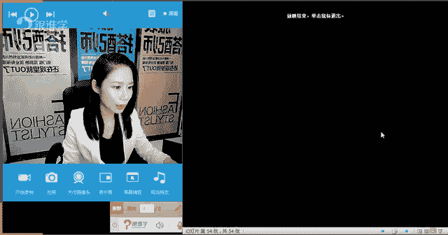
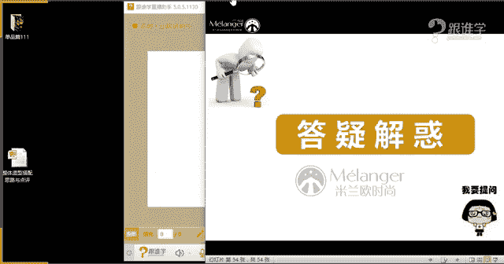

# 服装搭配秘笈之新版36计：16 整体造型搭配思路

在本节课中，我们将学习如何将之前学到的零散知识点整合起来，形成一套完整的个人造型搭配思路。我们将通过分析三位学员的具体案例，来理解如何从气质、脸型、体型和场合出发，构建适合自己的着装方案。

## 课程概述

之前的学习中，我们分别探讨了气质特征、体型分析和场合着装等独立的搭配要点。本节课，我们将把这些“点”串联成“面”，学习如何综合这些因素，为自己打造一个和谐、得体的整体形象。我们将通过三位学员的真实诊断案例，来具体演示这一整合过程。

## 整体造型思路框架

要构建个人整体造型，需要从以下三个核心方面入手：

1.  **气质与相貌特征分析**：这决定了你的整体着装风格基调。五官和脸型特点会影响发型、配饰（如眼镜、耳环）、领型及妆面的选择。
2.  **体型分析**：这是搭配中至关重要的板块。不同的体型（如A型、X型、T型、H型）决定了服装廓形、款式和修饰重点。
3.  **场合需求**：着装需符合具体场景，如社交、职场或休闲场合，其款式选择各有不同。

综合以上三点，才能得出最适合你的个性化着装方案。

## 学员案例分析

以下是三位学员的诊断过程与搭配建议，你可以对照寻找与自己相似的特征。

### 案例一：王静学员

**基本信息**：身高167cm，体重49kg，年龄25岁。脸型为标准椭圆形，相貌柔和，身材纤薄偏直线。

**1. 气质与适合风格**
*   **整体判断**：气质文静柔美、温柔优雅。身材直线，相貌柔和，属于“直曲结合”型。
*   **适合风格**：可驾驭风格较广，核心是**在造型中融入女性化元素**。最适合的风格包括：
    *   淑女法式优雅风（如收腰A型裙、小香风套装）。
    *   中式淑女风（避免过于可爱或成熟）。
    *   波西米亚风（带异域风情的潇洒淑女风）。
*   **核心原则**：无论穿着多么硬朗的中性单品（如牛仔、军装风外套），其本质搭配中必须包含女性化细节（如高跟鞋、修身裙装、精致妆发）。

**2. 脸型与配饰**
*   标准椭圆形脸，几乎不挑配饰形状。
*   **选择重点**：只需关注配饰的风格是否与服装风格匹配，无需纠结于形状（圆形、长形等均可）。

**3. 体型与适合款式**
*   **体型数据**：肩宽93cm，胸围79cm，腰围65cm，臀围87cm。属轻微倒T型（肩略宽于臀）。
*   **优势**：身高显高，腰短腿长。
*   **劣势**：上身略显壮实，肩部是修饰重点；臀窄，女性化曲线不够突出。
*   **搭配法则**：**上收缩，下膨胀**，以达到上下视觉平衡。
    *   **上装**：回避泡泡袖、垫肩、一字领。适合V领、U领、修身款式。色彩选冷色/深色，材质选哑光、精致收缩感面料。
    *   **下装**：适合伞裙、阔腿裤、A字裙。色彩可选鲜艳/浅色等膨胀色，材质可略有肌理感。
    *   **连衣裙**：选择上身修身、下身膨胀的X廓形。

### 案例二：杜勇学员

**基本信息**：身高165cm，体重56kg，年龄46岁。脸型长方偏方，线条硬朗，体型匀称偏H型。

**1. 气质与适合风格**
*   **整体判断**：气质成熟大气、干练。适合简约、利落的着装，展现成熟女性美。
*   **适合风格**：
    *   军旅风（帅气制服感）。
    *   大气淑女风（简约的淑女款式）。
    *   中性简约风。
*   **核心原则**：**简约干练**为本质。回避过于可爱、稚嫩或设计繁琐的服装。

**2. 脸型与配饰**
*   长方偏方脸，需拉长脸型。
*   **配饰选择**：
    *   **耳环**：选择长形、水滴形等有拉长效果的款式。避免过宽（圆形、方形）或长度刚好到下颌骨的耳环。
    *   **眼镜**：选择边框上翘（如猫眼镜）或略偏长型的款式，避免过扁过宽的镜框。
    *   **帽子**：选择宽帽檐，并向后上方戴，有助拉长脸型。
    *   **项链**：选择长款项链，帮助拉长颈部线条。

**3. 体型与适合款式**
*   **体型数据**：肩宽91cm，胸围88cm，腰围73cm，臀围90cm。身材匀称，接近X型。
*   **搭配重点**：**收腰放摆，制造曲线**。
    *   通过收腰连衣裙、高腰线设计来凸显女性化曲线。
    *   下装可选择A字裙、包臀裙等，强调腰臀差。
    *   整体着装注重线条的利落与上扬感。

### 案例三：兔兔蛙学员

**基本信息**：身高156cm，体重50kg，年龄28岁。脸型方圆形，相貌略带直线感，身材圆润偏曲线。

**1. 气质与适合风格**
*   **整体判断**：脸型（偏直）与身材（偏曲）存在矛盾感。适合“直曲结合”的穿搭。
*   **适合风格**：
    *   极简主义风。
    *   简约淑女风。
    *   机车短打风。
*   **核心原则**：**帅气简约为主，加入不过分的女人味**。避免穿着过于琐碎、复杂或整体甜美的款式。

**2. 脸型与配饰**
*   方圆形脸，需拉长脸型线条。
*   **配饰选择**：
    *   **耳环**：选择长形、线形，避免圆形、方形、菱形等加宽脸型的款式。
    *   **眼镜**：选择方圆适中、有拉高效果的镜框，避免太圆或太方。
    *   **帽子**：帽檐可弯曲，戴棒球帽时帽檐向上抬，选择帽身较高的款式，都有助拉长脸型。
    *   **项链**：选择V型、U型项链。

**3. 体型与适合款式**
*   **体型分析**：根据视觉判断偏A型身材（上身较瘦，下半身丰满）。
*   **搭配法则**：**上膨胀，下收缩**。
    *   **上装**：可选择肩部有装饰（如泡泡袖）、一字领、大圆领等，增加上身量感。
    *   **下装**：以收缩感为主，选择深色、简约的直筒裤、A字裙或紧身包臀裙。避免在臀部增加多余体积的款式（如哈伦裤）。
    *   **强调高腰线**：优化身材比例，显腿长。

## 课程总结

本节课我们一起学习了如何构建整体造型搭配思路。关键在于综合**气质相貌**、**体型特征**和**场合需求**三大要素。我们通过三位学员的案例看到：
*   **王静**（直曲结合）需注意“上收缩下膨胀”，在硬朗单品中融入女性化细节。
*   **杜勇**（成熟大气）应以“简约干练”为核心，通过配饰拉长脸型，通过着装制造腰线。
*   **兔兔蛙**（矛盾型）应遵循“上膨胀下收缩”，走帅气简约为主、略带女人味的“直曲结合”路线。

找到个人核心风格是第一步，但时尚的乐趣在于不断尝试与拓展。希望本课的分析框架能帮助你更清晰地认识自己，开启更自信的穿搭之旅。