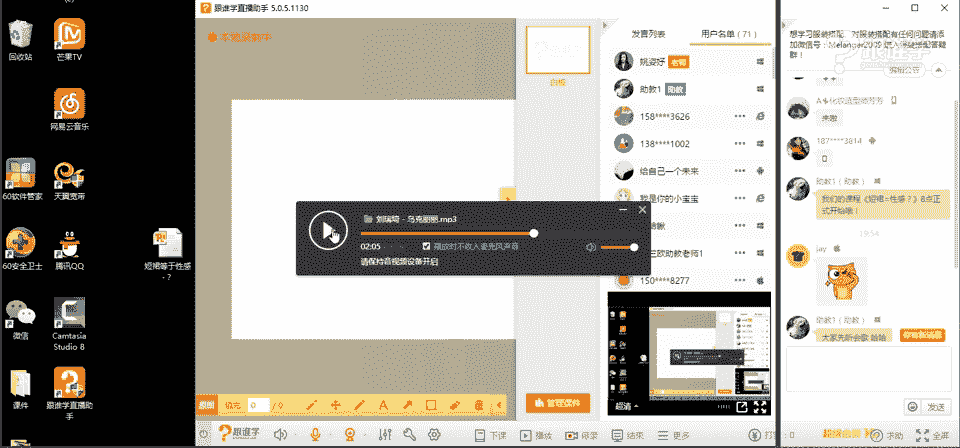
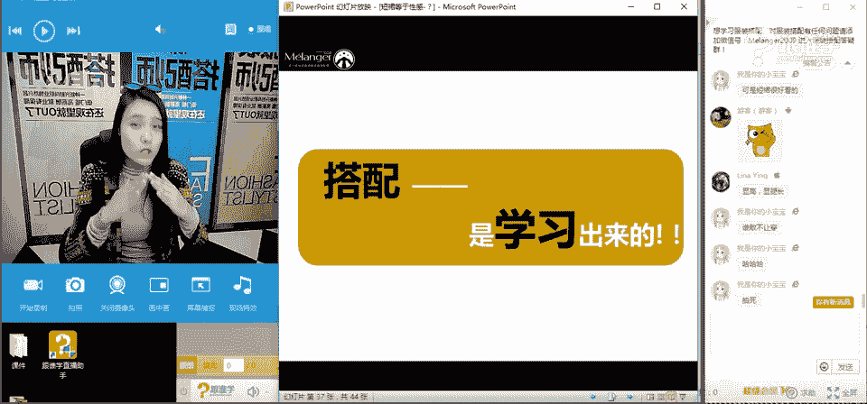
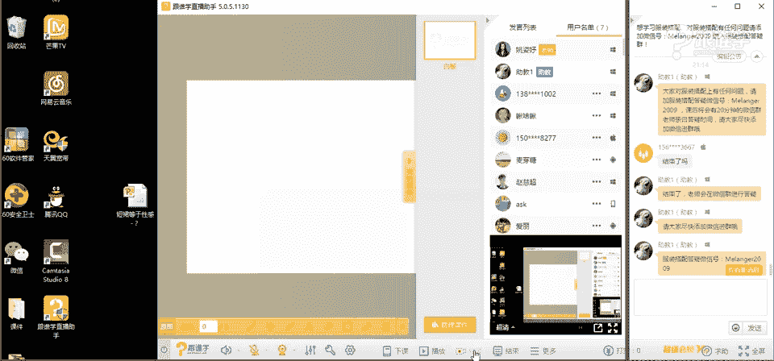

# 服装搭配秘笈之新版36计：1：短裙=性感？

在本节课中，我们将要学习如何打破“短裙=性感”的刻板印象，并掌握短裙的多种搭配技巧，使其能够演绎出不同的风格。

## 课程开场与互动

大家好，我是姚姿雨，米兰欧国际时尚教育的高级讲师。今天的课程主题是“短裙=性感？”，我们将探讨短裙的更多可能性。

首先，我想了解一下大家对短裙的印象。请在屏幕上分享你的看法。

## 短裙的穿着禁忌

上一节我们了解了大家对短裙的普遍印象，本节中我们来看看穿着短裙时需要避免的几个误区，以规避过于性感或不得体的效果。

以下是三个主要的穿着禁忌：

1.  **禁忌一：大面积暴露皮肤**
    大面积裸露皮肤会直接强化性感印象，在某些场合可能显得不够庄重。

2.  **禁忌二：极短裙加黑丝袜**
    这种组合容易产生低俗感和性暗示，特别是搭配皮革等材质时，效果会加倍。

3.  **禁忌三：穿着过于紧身**
    过于紧身的裙装会完全暴露身材缺点，例如腹部赘肉或腿部线条问题，显得不够得体。

## 认识短裙：定义与分类

了解了禁忌后，我们需要正式认识一下短裙。在专业上，裙长有不同的名称：

*   **迷你裙 (Mini Skirt)**：长度在大腿中部及以上。
*   **迷笛裙 (Midi Skirt)**：长度在膝盖上下。
*   **迷稀裙 (Maxi Skirt)**：长度到达脚踝。

本节课我们主要讨论**迷你裙**的搭配。

短裙根据款式可以分为多种类型，以下是常见的几种：

*   **短铅笔裙/包臀裙**：凸显曲线，较为性感。
*   **A型裙**：上窄下宽，活泼显年轻。
*   **百褶裙**：富有动感，学院风浓厚。
*   **蓬蓬裙**：体积感强，风格甜美。
*   **短鱼尾裙**：裙摆外扩，优雅女人味。
*   **褶皱短裙**：设计感强，时尚个性。

## A字裙的搭配实战

在众多短裙款式中，A字裙因其出色的修饰效果和风格多样性而备受青睐。本节我们将以A字裙为例，深入探讨不同面料的搭配方法。

### A字裙的历史与文化

要搭配好一件单品，了解其历史文化背景很重要。A字裙由迪奥先生在1955年设计推出。在20世纪60年代，超模崔姬 (Twiggy) 和“迷你裙之母”玛丽·官 (Mary Quant) 的演绎，使其成为年轻、活泼与解放的象征。

### 牛仔A字裙的搭配

牛仔面料给人**休闲、舒适、硬朗、年轻**的感觉。
它不适合非常正式的职场环境。

以下是两种经典的牛仔A字裙搭配方案：

**1. 经典搭配：白色上装 + 牛仔裙**
这种配色清新自然。
*   **白衬衫 + 牛仔裙**：帅气与清新结合。
*   **雪纺衫 + 牛仔裙**：柔软面料增添女人味，适合约会。
*   **针织毛衣 + 牛仔裙**：适合秋冬，温暖又时尚。

**2. 时尚搭配：里短外长法**
此方法指用长款外套搭配短款内搭裙装，能打破传统比例，极具时尚感。
*   **公式**：`长外套（风衣/大衣） + 短牛仔裙 + 打底袜/靴子`
*   这种方法在秋冬季节尤其实用，既保暖又显个性。

### 皮革A字裙的搭配

皮革面料传递出**硬朗、帅气、粗犷、个性、干练**的信息，属于直线感较强的材质。

以下是两种推荐的搭配方法：

**1. 风格强化：皮衣 + 皮裙**
上下统一的皮革材质将帅气不羁的风格最大化。

**2. 风格混搭：卫衣 + 皮裙**
用休闲中性的卫衣来中和皮裙的性感与硬朗，是当下非常流行的穿法。将卫衣下摆塞入裙中，能提高腰线，优化比例。
*   **公式**：`休闲卫衣 + 皮裙 + 短靴`

### 麂皮A字裙的搭配

麂皮面料带有**民族、自然、部落、质朴、粗犷、复古**的韵味。

其搭配灵感常来源于西部牛仔或民族风格：

**1. 西部牛仔风：麂皮 + 牛仔**
这是麂皮单品最经典的搭配组合之一，轻松打造自由不羁的西部风格。
*   **公式**：`牛仔上衣 + 麂皮裙 + 短靴/罗马鞋`

**2. 清新复古风**
麂皮也可以搭配柔软女性化的单品，碰撞出复古又清新的感觉。
*   **示例**：麂皮裙搭配蝴蝶结雪纺衬衫，或搭配毛衣与环保皮草外套。

### 印花A字裙的搭配

印花图案复杂多样，大致可分为**几何类**（条纹、波点）和**自然类**（花草、动物）。图案的连续性也会影响视觉效果：单独图案有聚焦作用，连续图案则更整体。

不同的印花直接决定了裙装的风格基调，搭配时应根据想表达的感觉来选择上装。

## 如何根据自身条件选择短裙

掌握了单品的搭配逻辑后，选择适合自己身材的款式同样关键。本节我们从体型和腿型两个核心因素来分析。

### 根据体型选择

体型是选择服装的基础。常见体型有四种：
*   **X型**：标准沙漏型。
*   **H型**：肩、腰、臀宽度接近，呈矩形。
*   **T型**：肩宽大于臀宽，呈倒三角形。
*   **A型**：肩窄于臀宽，呈正三角形（梨形）。

**以A型体型为例：**
*   **优点**：上身瘦，腰细。
*   **缺点**：臀部宽，腿可能较粗。
*   **选择原则**：**扬长避短**。上身采用浅色、有设计感（如一字领）、有膨胀感的上衣吸引视线；下身选择深色、简洁、有收缩感的裙装。
*   **错误示范**：`黑色收缩上衣 + 白色膨胀下装`，这会让缺点更突出。
*   **正确示范**：`浅色/设计感上衣 + 深色A字裙`

### 根据腿型选择

腿型影响裙长和鞋袜的搭配。

常见的非标准腿型有：
*   **O型腿**：膝盖无法并拢，脚踝可并拢。
*   **X型腿**：大腿可并拢，膝盖以下无法并拢。

**以O型腿为例：**
*   **适合裙长**：膝盖上下。这个长度可以遮盖大腿弯曲最明显的部位。
*   **搭配技巧**：利用**堆袜**或**马丁靴**等鞋靴，在脚踝处形成过渡和修饰，能在视觉上缓解小腿的弯曲感。
*   **时尚示例**：全智贤常用此方法修饰腿型。

## 课程总结与机构介绍

本节课中我们一起学习了：
1.  打破了“短裙必然性感”的迷思，认识到短裙更核心的词汇是**年轻感**。
2.  学习了短裙的三大穿着禁忌。
3.  深入剖析了**A字裙**的历史，并实战演练了**牛仔、皮革、麂皮**等不同面料的搭配公式。
4.  掌握了根据**体型**和**腿型**科学选择短裙的方法。

时尚搭配并非仅凭感觉，它建立在服装历史文化、面料语言和人体科学基础之上。希望本课能为你打开科学搭配的大门。

**米兰欧国际时尚教育**是一家专注于培养服装搭配师的职业院校。我们提供：
*   **线下**：职业培训，与秀场、品牌合作，提供实习机会。
*   **线上**：系列课程，帮助大众提升个人形象。

我们的线上课程涵盖**外套、内搭、裤装、裙装、特色场合**等全方位搭配秘籍。目前正在推广中，感兴趣的同学可以关注相关报名信息。

感谢大家的聆听，再见！