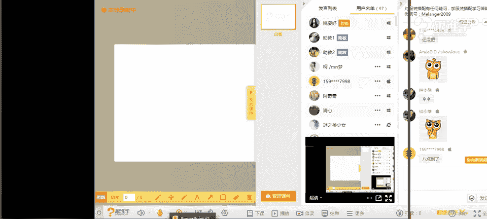
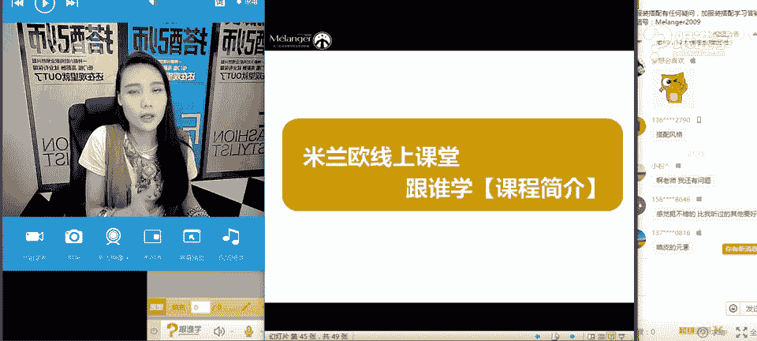

# 服装搭配秘笈之新版36计：1：牛仔裤的100种可能

## 概述
在本节课中，我们将学习关于牛仔裤的全面知识。从牛仔裤的历史文化、版型工艺，到如何根据自身体型和腿型选择最合适的款式，再到如何通过搭配实现多种风格变化。无论你是觉得腿粗、臀大不知如何选择，还是觉得牛仔裤风格单一，本节课都将为你提供清晰的解决方案。

## 牛仔裤的由来与文化
牛仔裤的起源可以追溯到18世纪美国的淘金潮。当时，矿工们的裤子因高强度劳动磨损严重。后来，一位名叫Levi Strauss的商人用滞销的帆布制作了耐穿的工装裤，这便是牛仔裤的雏形。随后，他研发了更耐用的牛仔面料，并创立了著名的Levis品牌，其经典的501系列至今仍受欢迎。

最初的牛仔裤是为蓝领工人设计的，具有极强的功能性和耐用性。例如，裤袋上的铆钉设计是为了加固口袋，防止因装载重物而撕裂。直到20世纪50年代，经奥黛丽·赫本等名人穿着后，牛仔裤才从工装转变为大众时尚单品，并在60至80年代迎来了发展的黄金时期。

## 如何选择适合你的牛仔裤
上一节我们了解了牛仔裤的起源，本节中我们来看看如何根据自身条件选择最合适的牛仔裤。选择牛仔裤需要考虑版型、工艺、腰线及口袋细节等多个方面。

### 解析牛仔裤的版型
以下是常见的牛仔裤版型及其特点：
*   **阔腿裤**：裤腿从上至下都非常宽松。
*   **直筒裤**：裤腿宽度从大腿到脚口基本一致，呈直筒状。
*   **喇叭裤**：膝盖以上合身，从膝盖向下裤腿逐渐张开。
*   **微喇裤**：喇叭效果比传统喇叭裤更含蓄。
*   **紧身裤**：非常贴身，能清晰勾勒腿部线条。
*   **锥形裤**：大腿处相对宽松，从膝盖到脚踝逐渐收窄。

### 认识牛仔裤的工艺
当前流行的牛仔裤工艺元素包括：**破洞**、**流苏**、**刺绣**、**拼接**、**磨白**、**渐变**等。这些工艺不仅影响风格，也对腿型有修饰作用。

### 关注腰线的选择
腰线位置直接影响身材比例：
*   **高腰线**（在肚脐或以上）：能有效收腹，并视觉上拉长腿部线条。
*   **中腰线**（大约在肚脐位置）：比较常见的款式。
*   **低腰线**（在肚脐以下）：容易暴露腹部赘肉，且会缩短下半身比例。
**选择建议**：目前流行中高腰款式。对于大多数希望优化比例的人来说，**高腰牛仔裤 + 高跟鞋 = 视觉上的大长腿**。

### 留意口袋的细节
口袋的设计对臀型和腿长有视觉影响：
*   **口袋位置**：口袋位置靠上，有助于视觉上提升臀位线，显得腿更长；位置靠下则容易显腿短。
*   **口袋形状**：直线条、面积较小的口袋有收缩效果，适合臀部丰满者；曲线条、有设计感的口袋有膨胀效果，适合臀部扁平者希望增加曲线感。

## 根据体型与腿型选择牛仔裤
了解了牛仔裤本身的特性后，我们需要结合自身条件做出选择。核心在于了解自己的体型和腿型。

### A型体型（梨形身材）的选择秘籍
A型体型的特点是肩窄、腰细，但臀宽、大腿较粗。
以下是针对A型体型（或单纯腿粗问题）的三个选择秘籍：
1.  **选择深色下装**：深色具有视觉收缩感，能比浅色更显瘦。
2.  **利用“瘦腿阴影”设计**：选择带有**拼接**或**竖向磨白**工艺的牛仔裤。深色部分像阴影一样，能制造腿部变瘦的视觉错觉。
3.  **露出最瘦的部位**：选择**九分裤**、**破洞裤**（破洞在膝盖或小腿处），露出相对纤细的脚踝或部分小腿，能转移注意力并显得整体更纤细。

在版型上，A型体型或腿粗者适合**直筒裤**、**喇叭裤**和**微喇裤**，应避免过于贴身的紧身裤和锥形裤，阔腿裤也需谨慎选择，以免增加下半身体积感。

### O型腿型的选择建议
O型腿在自然站立时，双脚可并拢，但膝盖和小腿无法并拢。
O型腿适合能模糊腿部线条的版型，如**直筒裤**和**阔腿裤**，**喇叭裤**也有一定修饰效果。应避免完全暴露腿型的紧身窄脚裤和过短的裙子。

## 实现风格百变：以嬉皮风为例
掌握了选择技巧，我们来看看如何让一条牛仔裤穿出多种风格。牛仔裤的可塑性极强，可以搭配出时尚运动风、西部牛仔风、机车风、混搭风、军旅风等多种风格。

本节我们将以**嬉皮风**为例，详细解析如何打造一种风格。

### 嬉皮风的文化背景
嬉皮风起源于20世纪60-70年代的美国，是当时年轻人反战、追求和平与爱与自由的亚文化运动在着装上的体现。他们崇尚自然、东方神秘主义和民族元素，反对主流社会的整齐划一。

### 嬉皮风的经典元素
以下是打造嬉皮风可以运用的关键元素：
*   **麂皮**：带有自然、做旧的质感。
*   **流苏与羽毛**：源自印第安文化，充满动感和民族气息。
*   **民族图案**：如波西米亚印花、刺绣等。
*   **珠串配饰**：被称为“爱之珠”，是嬉皮士的标志性饰品。
*   **花卉**：象征“花的力量”与和平。
*   **牛仔裤**：本身就是嬉皮士钟爱的单品。

### 现代嬉皮风穿搭
现代穿搭无需完全复刻，只需提取部分元素进行融合：
*   用**牛仔喇叭裤**搭配一件**麂皮流苏马甲**。
*   在基础款T恤牛仔裤外，增加大量**民族风珠串项链**、**手链**。
*   戴一顶**宽檐帽**或**羽毛发带**。
*   内搭一件**民族风印花上衣**。

通过混搭这些元素，即使是最简单的牛仔裤，也能立刻充满自由、浪漫的嬉皮风情。

## 总结
本节课我们一起学习了牛仔裤的丰富知识。我们从历史文化入手，理解了单品的本质；接着深入学习了如何根据版型、工艺、腰线、口袋等细节，结合自身的体型（如A型）和腿型（如O型）选择最修饰身材的牛仔裤；最后，我们以嬉皮风为例，探索了如何通过搭配不同的元素，让一条牛仔裤展现出千变万化的风格魅力。记住，搭配是需要学习的知识体系，了解规则，才能创造无限可能。