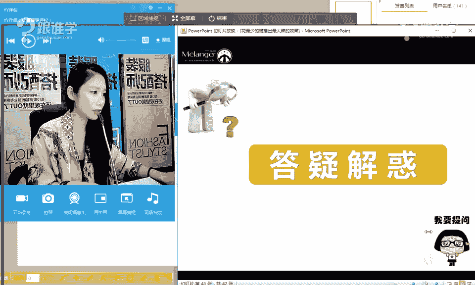

# 服装搭配秘笈：第1课：花最少的钱搭出最大牌效果

在本节课中，我们将要学习如何运用专业的搭配方法，用平价的服装单品，搭配出具有高级感和大牌效果的造型。我们将探讨大牌感的本质，并学习一个核心的美学技巧。

## 课程概述

大家好，我是韩托，来自米兰欧国际时尚教育。今天课程的主题是“花最少的钱搭出最大牌的效果”。许多人在追求时尚时，常误以为只有昂贵的品牌才能带来高级感。本节课将打破这个迷思，通过具体的方法论，教会大家如何通过巧妙的搭配，让平价服装焕发大牌光彩。

## 大牌感的迷思与真相

首先，我们需要澄清几个关于“大牌感”的常见误解。大牌感并非由单一因素决定。

上一节我们介绍了课程目标，本节中我们来看看哪些因素并不能直接等同于大牌感。

**大牌感 ≠ 高价格**
以快销品牌ZARA为例，其单品价格亲民，但通过精心的搭配和造型，完全可以在海报或杂志中呈现出高级的时装感。这说明，价格并非决定高级感的唯一因素。

**大牌感 ≠ 高颜值**
以明星范冰冰为例，同样的颜值，在不同风格的造型下，呈现出的高级感天差地别。这说明，个人的颜值并非塑造大牌感的关键。

**大牌感 ≠ 完美身材**
许多人将穿不出效果归咎于身材缺陷。然而，在时尚领域，各种体型都有其独特的表达方式。问题的核心往往在于如何通过搭配来修饰和展现，而非身材本身。

## 决定大牌感的核心要素

那么，真正决定服装“大牌感”的因素是什么呢？让我们通过对比来分析。

以下是决定服装高级感的几个关键维度：

1.  **面料与质感**：面料越精细、质感越高级，呈现的效果就越上乘。在专业上，面料的精细度常以支数来衡量，**支数越高，面料越细腻**。
2.  **风格与款式**：时装款通常比纯粹的休闲款显得更高级。例如，简约的成熟淑女风比年轻的街头朋克风更容易呈现大牌感。
3.  **廓形与设计**：设计上遵循“大道至简”的原则。**越简约的廓形，对面料和剪裁的要求越高，也越容易凸显高级与大气**。过于复杂的设计和装饰反而会削弱高级感。
4.  **整体美感**：这是最关键的一点。美感是一种协调、有秩序的视觉感受，它可以通过学习具体的方法来实现。

## 美的标准与“呼应法”

许多人认为“美”没有标准，全凭个人感觉。但实际上，美学是有规律可循的。例如，公认的“鹅蛋脸”其长宽比接近 **4:3**，这就是一种标准。在服装搭配中，“美”的本质是 **秩序感** 的体现。

上一节我们探讨了美的秩序性，本节中我们来学习一个实现秩序美的重要技巧——呼应法。

呼应法是指：**同一设计要素在整体造型中出现两次或以上，形成有节奏的强调效果**。这是创造协调美感的核心手段之一。

以下是呼应法在不同设计要素中的应用：

*   **色彩呼应**：例如，帽子的蓝色与领带、马甲中的蓝色相呼应；胸花的橙色与领带细节的橙色相呼应。这使得多色彩搭配繁而不乱。
*   **图案呼应**：例如，服装上的几何印花与配饰上的几何图案相呼应；和风樱花图案的服装搭配同主题的樱花手包。
*   **材质呼应**：例如，流苏装饰的裙子搭配带有流苏元素的包包，通过材质肌理建立联系。

通过呼应法，即使使用多个单品和色彩，也能构建出清晰、有序的视觉整体，从而提升造型的完成度和高级感。

## 实战演示：平价单品的大牌变身

理论需要实践来验证。接下来，我将进行现场搭配演示，展示如何将普通单品通过搭配技巧，提升其风格与质感。

我将演示两套造型：

1.  **飞行员夹克的法式风格改造**：一件基础的飞行员夹克，通过搭配贝雷帽（军旅元素呼应）、Choker项圈（注入女性化细节）、复古眼镜以及深色内搭，瞬间从休闲款转变为带有法式俏皮感的时尚造型。关键点是利用配饰注入风格，并通过色彩和元素的呼应建立秩序。
2.  **睡衣风的复古贵妇造型**：一件睡衣风上衣，通过搭配丝质发带、复古金色大耳环和红唇，迅速营造出复古华丽的氛围。这里运用了色彩（发带与耳环的金色系）和风格主题（复古）的强力呼应。

这两套演示表明，决定造型最终效果的，往往不是单品本身的价格，而是**搭配所注入的美学秩序和风格思想**。配饰在提升整体质感与风格中扮演着至关重要的角色。

## 课程总结

本节课中我们一起学习了：
1.  破除了“大牌感等于高价、高颜值、好身材”的迷思。
2.  认识到大牌感的核心来源于**面料、款式、廓形和整体美感**。
3.  理解了“美”是有标准的，其本质是**视觉上的秩序感**。
4.  掌握了一个核心的搭配技巧——**呼应法**，即通过重复色彩、图案、材质等要素来创造协调与高级感。
5.  通过实战演示，验证了通过巧用配饰和搭配方法论，平价单品也能实现风格飞跃。

记住，时尚不是金钱的堆砌，而是审美与技巧的结合。掌握正确的搭配方法，你就能用最少的预算，打造出最具个人风格和大牌感的造型。