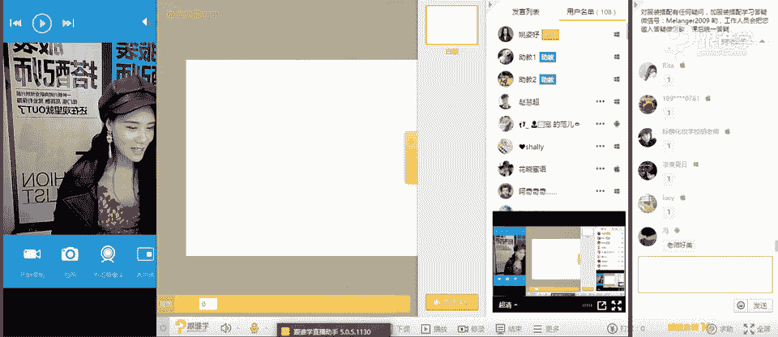
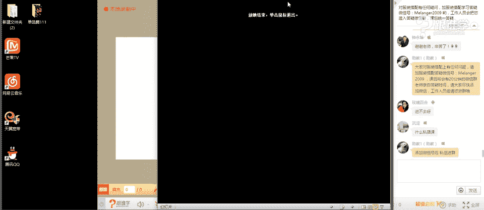
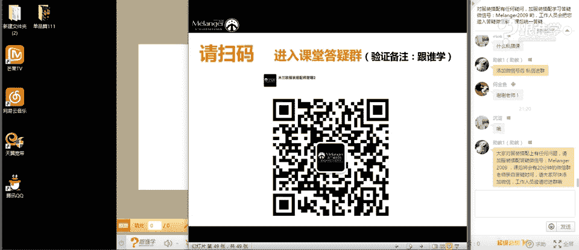

# 服装搭配秘笈之新版36计：1：鞋子越不适用看起来越贵

在本节课中，我们将要学习一个有趣的时尚观点：如何将看似“不实用”的鞋子，通过巧妙的搭配法则，转化为提升整体造型时尚度与高级感的利器。我们将从鉴赏设计师作品开始，理解其背后的文化与风格，并学习三个核心的搭配法则。

## 课程导入与理念阐述

我是姚思于，米兰欧国际时尚教育的高级讲师，同时也是一名服装搭配师和视觉策划，曾为品牌秀场及明星艺人提供形象策划服务。

今天分享的主题是“鞋子越不实用，看起来就越贵”。这与我们日常分享的实用技巧不同，旨在拓展大家对个性化审美的认知。时尚需要不断创新，了解一些看似夸张、源于历史或文化的设计，能帮助我们打开审美视野，追求更高层次的风格化需求。

## 奇趣鞋履鉴赏：理解设计之源

在探讨搭配之前，我们先来鉴赏一些秀场上引人注目的鞋履设计。理解其背后的灵感，是学会搭配的第一步。

以下是几款具有代表性的设计：

*   **亚历山大·麦昆的“犰狳鞋”**：这款近30厘米的高跟鞋，设计灵感源于海洋生物与世界变暖的遐想。它挑战了传统，是设计师个人理念的极致表达。
*   **麦昆的“乔鞋”**：其设计灵感来源于15世纪，人们为了隔离路面尘土而穿着的高底鞋，以及土耳其浴场、印度水上表演的服饰文化。
*   **艺术感高跟鞋**：例如带有金鱼装饰的陶瓷感高跟鞋，或羽毛装饰的拉丁风情鞋款。这些设计更侧重于艺术表达与视觉美感。
*   **蒸汽朋克风格鞋履**：这种风格融合了19世纪维多利亚时期的工业元素与反叛的朋克精神，常见于游戏、电影和时尚设计中，特点是机械感、复古与未来感的碰撞。
*   **洛可可风格鞋履**：灵感来源于18世纪洛可可时期，特点是清新色彩、繁复装饰（如蕾丝、蝴蝶结），旨在取悦男性，体现了当时的装饰主义风尚。

这些设计看似“不实用”，实则承载了丰富的文化、历史和艺术概念。欣赏它们，能帮助我们理解时尚的多样性与深度。

## 核心搭配法则：化“不实用”为高级

理解了设计的价值后，关键在于如何将它们融入日常穿搭。以下是三个核心搭配法则。

### 法则一：繁琐配简约

当鞋子的设计、色彩或图案比较夸张复杂时，服装应选择简约的款式和纯色。这样可以突出鞋子这一亮点，避免全身过于杂乱。

**公式**：`复杂鞋履 + 简约服装 = 视觉平衡与焦点突出`

以下是应用此法则的示例：

*   **花纹复杂的鞋子**：搭配纯色（如黑、白、米色）的连衣裙、衬衫或裤装。
*   **豹纹鞋**：作为点睛之笔，搭配简约的纯色套装，能瞬间提升时尚感与性感度。
*   **绑带设计鞋**：搭配简约的裙装，能凸显设计感，为造型加分。

### 法则二：遥相呼应法

通过色彩或图案的呼应，将鞋子与服装的其他部分巧妙连接，形成整体感。这不仅是技巧，也符合美学中的“反复”原则。

**公式**：`鞋履元素（色彩/图案） ∈ 服装元素（色彩/图案）`

以下是两种呼应方式：

*   **色彩呼应**：鞋子的颜色与上衣、包包或配饰的颜色相同或属于同一色系。
*   **图案呼应**：鞋子的图案风格（如几何纹、花朵）与服装的图案风格相协调。甚至可以采用“图案搭配图案”的高级技巧，通过虚实、远近的对比，让搭配更有层次感。

### 法则三：文化关联法

确保鞋子与服装、配饰传递同一种风格或文化语言。当所有单品都在“讲述同一个故事”时，整体造型就会和谐且富有深度。

**公式**：`鞋履风格 ≈ 服装风格 ≈ 整体造型主题`

例如：

*   **度假风情**：具有民族花纹的鞋子，搭配印花头巾、草编包和宽松的服装，共同营造休闲度假感。
*   **拜占庭风格**：装饰有十字架、华丽宝石的鞋子，搭配复古、奢华、带有宗教感的丝绒服装与首饰，统一于古典华丽的主题之下。

掌握这三个法则，就能将任何看似难以驾驭的鞋履，转化为彰显品味与个性的时尚单品。

## 实用延伸：根据腿型选靴子

除了搭配“非常规”鞋履，日常实用的靴子选择也需技巧。关键在于了解自己的腿型。

腿部常见问题有：腿粗、腿不直、小腿粗、腿短。课程时间有限，我们重点分析**小腿粗**和**腿短**两种情况如何选择靴子。

### 小腿粗的靴子选择

核心原则是**避免靴筒截在小腿最粗处**，那会放大缺点。

*   **适合**：靴筒高度超过小腿肚的靴子（如过膝靴、及膝靴），能完全遮盖小腿线条。
*   **不适合**：短靴或中筒靴的靴筒顶端刚好卡在小腿肌肉最发达的位置。

### 腿短的靴子选择

核心原则是**创造延伸感，减少分割点**。

*   **适合**：
    *   **V口或U口靴**：能延伸腿部线条。
    *   **低帮裸靴**：尽可能多地露出脚踝和腿部。
    *   **尖头鞋**：鞋头有向前延伸的效果。
*   **不适合**：
    *   **靴筒过高且过紧的过膝靴**：过多包裹腿部，显得笨重、腿更短。
    *   **靴筒刚好卡在脚踝处的款式**：形成横向切割，破坏腿部纵向线条。
    *   **搭配长度及膝的裙子**：与靴子形成多重分割，非常显腿短。

**最显腿长的鞋款**是接近肤色的浅口高跟鞋（船鞋），因为它与腿部肤色融合，延伸感最强。

## 课程总结

本节课我们一起学习了如何重新审视“不实用”的鞋履。我们从鉴赏设计师作品入手，理解了其背后的文化、历史与艺术价值。接着，我们掌握了三个核心搭配法则：**繁琐配简约**、**遥相呼应法**和**文化关联法**，这些方法能将个性鞋履完美融入日常穿搭。最后，我们还简要探讨了根据**小腿粗**和**腿短**两种腿型选择实用靴款的技巧。

时尚不仅是跟随潮流，更是拓宽审美边界、表达自我的过程。希望本节课能帮助你打开思路，勇敢尝试，发现更多搭配的乐趣与可能性。