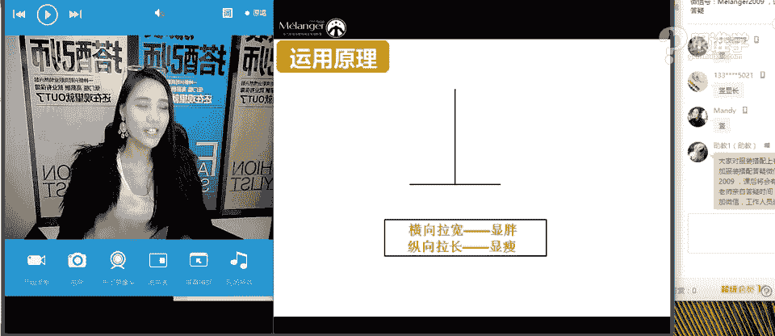

# 服装搭配秘笈之新版36计：21 为什么白衬衫充满性暗示 🧥

在本节课中，我们将要学习白衬衫（T恤）这一经典单品背后的文化历史，并掌握如何根据个人身材特点（如脸型、脖子长度、肩宽、胸围）选择最适合自己的衬衫领型。同时，我们也会探讨白衬衫的多种搭配方法，让你轻松穿出不同风格。

---

## 课程概述

白衬衫（T恤）是现代衣橱中不可或缺的基本款。本节课将从其历史起源讲起，解释为何它曾被赋予“性暗示”的标签。核心内容将分为两大部分：**白衬衫选择秘籍**与**白衬衫百搭秘籍**。我们将学习如何根据上半身的身材细节（脸大、脖子短、肩宽、胸大）选择领型，并探索白衬衫与不同下装、外套组合所能呈现的多样风格。

---

## 一、白衬衫的“前世今生”：从内衣到时尚标志

白衬衫并非生来就是外穿单品。在20世纪40年代以前，它一直被作为**内衣**穿着，主要起保暖和吸汗的作用，美国海军甚至规定士兵必须穿着白衬衫以遮盖胸毛。

其时尚地位的转变，源于20世纪50年代的电影《欲望号街车》。男演员**马龙·白兰度**在片中饰演一个叛逆青年，他将白衬衫作为外穿服饰，塑造了一种不羁的形象。自此，白衬衫才从内衣转变为代表**新青年叛逆精神**的时尚标志，这也是其“性暗示”标签的历史由来——将私密的内衣外穿，自然带有一种突破常规的诱惑力。

了解单品的历史与文化，能让我们在搭配时赋予服装更多灵魂。

---

## 二、白衬衫选择秘籍：根据身材选领型

许多人在选择白衬衫时会有各种困惑，例如显胖、透肤、搭配不出个性，或是无法修饰身材缺陷。这些问题大多集中在我们视觉的焦点区域：**脸部、颈部和肩部**。上一节我们介绍了白衬衫的历史，本节中我们来看看如何根据个人身材特点选择领型。

首先，你需要了解自己的几个关键身材指标：

### 1. 判断脖子长短
**测量方法**：用皮尺测量从**脖根**到**锁骨窝**的垂直距离。
**标准**：理想的脖子长度应约等于**脸长的1/2**（脸长指从发际线到下巴的垂直距离）。如果测量结果短于这个比例，则属于脖子偏短。

### 2. 判断脸型大小
视觉上显大的脸型通常是**方形脸**和**圆形脸**。这是因为标准脸型的长宽比约为4:3，而方脸和圆脸的长宽比更接近1:1，因此看起来更宽、更大。

### 3. 判断肩宽标准
**测量方法**：准确测量**头长**（头顶到下巴）和**肩宽**（背部两个肩峰点之间的直线距离）。
**公式**：标准肩宽应在 `头长 × 1.5` 到 `头长 × 1.7` 之间。
**体型影响**：**T型（倒三角）** 体型的人天生肩宽大于臀宽，容易有肩宽的视觉感受。

### 4. 了解白衬衫的常见领型
以下是白衬衫的几种基本领型：
*   **小圆领**：领口较小，紧贴颈部。
*   **小V领**：领口呈V形，但开口较浅。
*   **大圆领**：领口开阔的圆形。
*   **大V领**：开口较深的V形。
*   **一字领**：横向的平直领口。
*   **船领**：横向宽大，肩部露出较多。

### 5. 领型选择核心原则：利用线条修饰
选择领型的核心在于利用线条创造视觉错觉：
*   **纵向线条（如V领）**：有**拉长、显瘦**的效果，能让脸看起来更小、脖子更修长、肩部更窄。
*   **横向线条（如一字领、小圆领）**：有**拉宽**的效果，可能让脸显大、脖子显短。

以下是不同身材问题对应的领型选择建议：

**适合选择大圆领/大V领的情况（利用纵向线条修饰）**：
*   脸大
*   脖子短
*   肩宽
*   胸部丰满（希望视觉上显小）

**适合选择小圆领/小V领的情况（适合本身条件优越者）**：
*   脸小
*   脖子长
*   身形偏瘦
*   平胸

**适合选择一字领/船领的情况（利用横向线条平衡）**：
*   脸小
*   脖子长
*   肩窄或溜肩（需横向扩张显肩宽）
*   肩薄
*   平胸

**特殊脸型注意事项**：
*   **长形脸/心形脸（下巴尖）**：应避免深V领，以免重复脸型，显得更长或更尖。更适合圆领或一字领。
*   **男士选择**：原理相同，主要关注**脸大**和**脖子短**的问题，避免选择过于深V或女性化的领型。

---

## 三、白衬衫百搭秘籍：一衣多风

掌握了如何选择一件合身的白衬衫后，我们来看看如何通过搭配让它焕发多彩。白衬衫之所以被称为“衣橱万能牌”，正是因为它几乎没有风格导向，能与各种单品组合，塑造截然不同的形象。

### 1. 白衬衫 + 裤装：干练利落
搭配裤装总能传递出潇洒、干练的感觉。
*   **搭配示例**：白衬衫 + 牛仔裤/西裤/阔腿裤/背带裤。
*   **风格导向**：休闲、中性、帅气、通勤。

### 2. 白衬衫 + 裙装：多变风韵
裙装的款式和长度决定了整体风格的走向。
*   **搭配A字短裙**：风格**年轻、活泼、可爱**。
*   **搭配包臀裙**：风格**性感、女人味、成熟**。
*   **搭配飘逸长裙**：风格**仙气、优雅、成熟**。
*   **核心原则**：裙子越短越显年轻，裙子越长成熟度越高。

### 3. 白衬衫 + 外套：层次叠穿
外套是改变风格的有力工具。
*   **搭配短外套**（如皮夹克、牛仔夹克、棒球服）：风格**利落、精干、年轻**。
*   **搭配长外套**（如风衣、长款西装）：风格**潇洒、大气、有气场**。

### 4. 时尚进阶穿法
结合当下流行趋势，可以让基本款更出彩。
*   **内衣外穿法**：在白衬衫外搭配**吊带裙**或**抹胸**，增加层次感与性感度。
*   **叠穿法**：例如，衬衫内搭高领衫、T恤外穿V领毛衣，或T恤与衬衫相互叠穿，能显著提升造型的丰富度和时尚感。

### 5. 穿搭禁忌
避免以下情况，以免将白衬衫穿出“廉价感”：
1.  **内衣颜色不当**：穿着白衬衫时，内搭应选择**肤色、无痕**的内衣，避免鲜艳颜色透出。
2.  **面料劣质**：选择面料精致、有一定厚度的白衬衫，避免过于轻薄易皱的材质。
3.  **毫无配饰**：完全素净的白衬衫搭配容易显得单调。适当添加项链、丝巾、帽子或包包等配饰，能瞬间提升精致度。

---

## 课程总结

本节课中我们一起学习了：
1.  **白衬衫的文化历史**：它从功能性内衣转变为时尚叛逆符号的过程。
2.  **根据身材选领型**的核心方法：通过判断脖子长短、脸型、肩宽、胸围，并运用**纵向线条显瘦拉长**、**横向线条拉宽**的原理，选择最适合自己的小圆领、V领、一字领等。
3.  **白衬衫的多元搭配技巧**：通过与不同裤装、裙装、外套的组合，以及运用叠穿等时尚手法，可以轻松塑造出**干练、活泼、性感、优雅、帅气**等多种风格。

记住，白衬衫是一件充满可能性的基础单品。理解其背后的逻辑，就能让它成为你表达自我风格最得力的工具。