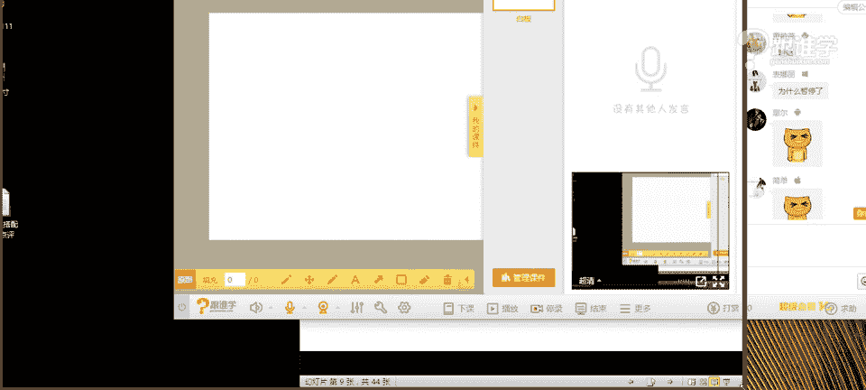
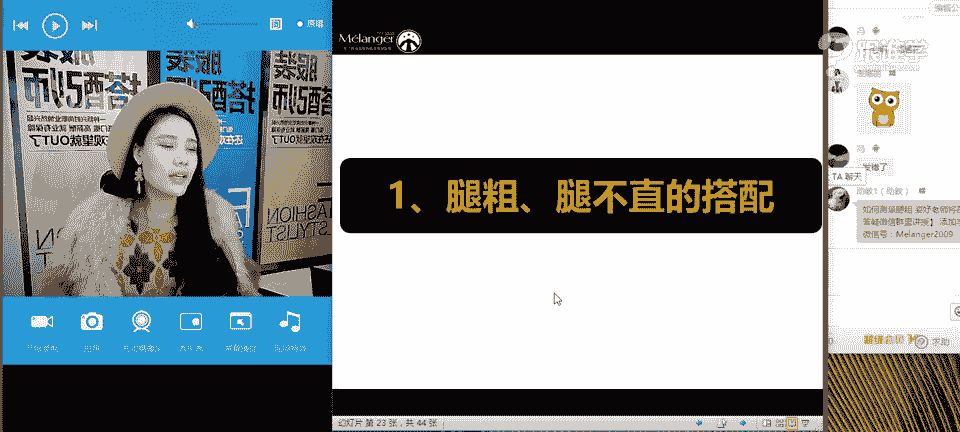
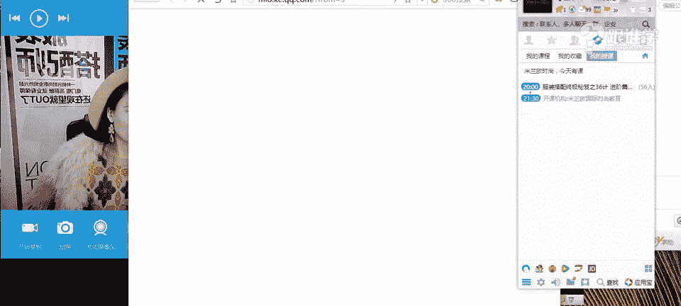
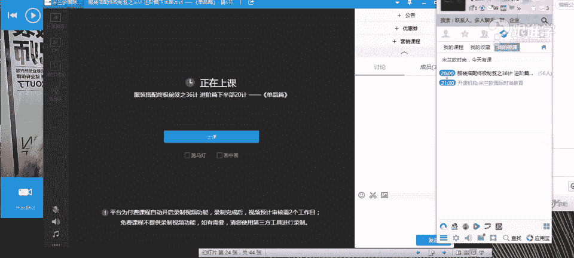
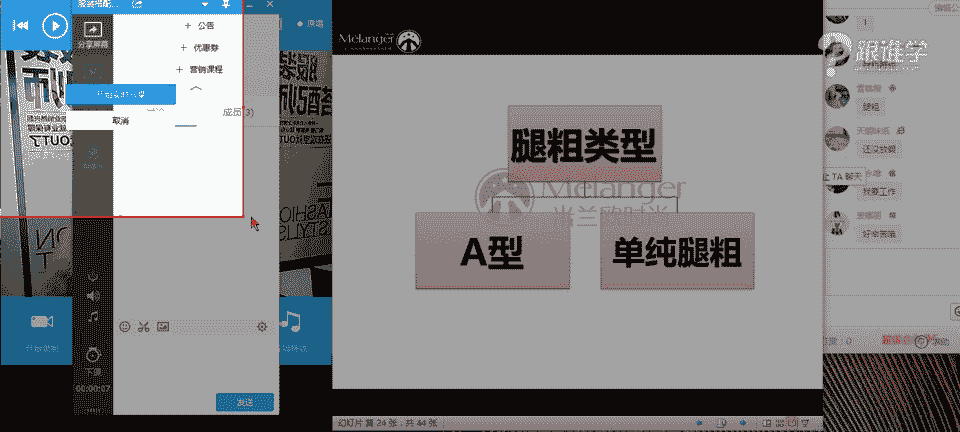
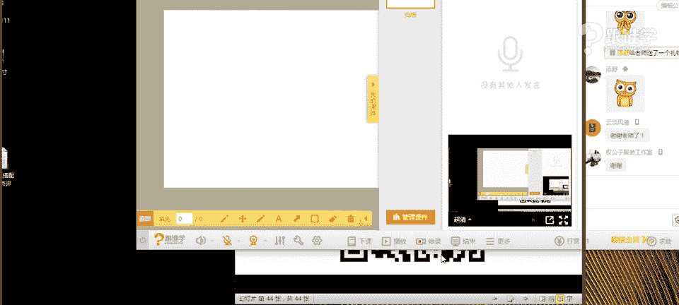

# 服装搭配秘笈之新版36计：1：打底裤不是裤子

在本节课中，我们将要学习关于打底裤的全面知识。打底裤是日常穿搭中常见的单品，但很多人对其分类和搭配方法并不清晰。本节课将从长度、色彩、图案、材质等多个维度解析打底裤，并重点讲解不同腿型（如腿粗、腿不直）如何选择和搭配打底裤，以及如何将打底裤穿出高级感。

## 课程概述

打底裤并非简单的“裤子”，它在搭配中扮演着重要的角色。本节课将系统性地介绍打底裤的分类，并针对常见的穿搭困扰提供解决方案。

## 打底裤的分类

为了更精准地选择和搭配打底裤，我们首先需要了解它的不同分类。

### 长度分类

从长度上划分，打底裤主要分为五分、七分、九分和踩脚/全长款式。

以下是不同长度打底裤的特点：
*   **五分/七分打底裤**：长度停留在小腿肚最粗的位置，容易将视觉焦点集中在小腿。对于腿型不佳或小腿较粗的人来说，需谨慎选择。
*   **九分/踩脚打底裤**：长度至脚踝或包裹脚底，是更常见且安全的选择，能更好地修饰腿型，拉长腿部线条。

上一节我们介绍了打底裤的长度分类，本节中我们来看看色彩如何影响打底裤的搭配。

### 色彩分类

打底裤的色彩多样，常见的有黑色、灰色、白色以及各种彩色。

以下是关于色彩选择的要点：
*   **黑色**：被认为是百搭色，但全身黑色搭配可能缺乏层次感，显得沉闷。
*   **灰色**：作为黑色与白色之间的过渡色，灰色其实更为百搭。它既能搭配深色和浅色服装，也能与彩色和谐共处，是冬季搭配的“百搭之王”。例如，灰色搭配粉色能营造温柔甜美的感觉。
*   **白色/彩色**：白色和彩色打底裤对搭配功力和腿型要求较高，需要更精心的色彩和款式搭配。

了解了基础色彩后，图案也是决定打底裤风格的关键因素。

### 图案分类

打底裤的图案设计丰富，主要可分为几何类、自然类和波普类等。

以下是图案的主要类型：
*   **几何类图案**：指格纹、条纹、菱形等人工设计的规则图案。
*   **自然类图案**：指花鸟鱼虫、地貌天象等源于大自然的图案。
*   **波普类图案**：色彩鲜明、常源于流行文化或生活元素，并伴有大面积撞色的图案。

图案的选择与整体着装风格紧密相关。例如，带有雪花元素的几何条纹袜适合森系风格，而国旗图案的裤袜则带有美式休闲风格。

最后，我们来看看决定打底裤质感与适用场合的材质分类。

### 材质分类

打底裤的材质直接影响其外观和穿着效果。

以下是常见的材质类型：
*   **光泽感材质**：具有反光效果，视觉上存在感强，容易显腿粗。
*   **哑光材质**：不反光，质感柔和，更显瘦，是更安全的选择。
*   **透肉材质（如丝袜）**：性感度高，搭配时需注意服装的简洁度。
*   **皮革/牛仔等特殊材质**：风格感强，常用于打造特定造型。

## 打底裤的搭配秘籍

掌握了打底裤的分类后，我们进入核心的搭配环节。首先解决最常见的困扰——腿粗和腿不直的问题。

### 腿粗与腿不直的搭配法则

对于腿粗（尤其是A型体型或单纯下肢粗壮）和腿不直（如O型腿、X型腿）的情况，搭配关键在于“扬长避短”。

以下是针对腿粗的搭配建议：
1.  **裙装优于裤装**：裙装能有效遮盖大腿根部，修饰腿型。
2.  **宽松裙摆优于紧身裙摆**：A字裙、伞裙等宽松下摆能对比显瘦，避免包裹出腿部曲线。
3.  **哑光面料优于光泽面料**：哑光材质视觉收缩，而光泽面料反光会放大腿部维度。
4.  **谨慎使用复杂元素**：对于花色、鲜艳色彩、透肉或镂空面料，建议搭配能遮住大腿最粗位置的长款上装。
5.  **上宽下窄对比**：利用宽松的上装（如外套、毛衣）与紧身打底裤形成对比，显瘦效果显著。

以下是针对O型腿的搭配建议：
*   **避免紧身且完全暴露腿型的下装**。
*   **适合及膝或过膝的裙装/大衣**，遮盖膝盖部位的弯曲。
*   **可利用堆堆袜或宽松的靴筒**，修饰脚踝至小腿的线条过渡。

解决了基础的身材修饰问题，接下来我们学习如何将打底裤穿出高级感。

### 打底裤的高阶搭配技巧

将打底裤穿出高级感，需要运用一些美学原理。

以下是不同材质打底裤的高级搭配法则：
*   **透明黑丝**：性感度高，搭配时**服装款式应极度简洁大方**，色彩以中性色/基础色为主，避免过多繁琐设计，以免显得俗气。美学原理在于保持视觉的“秩序感”，避免所有元素都争抢注意力。
*   **不透明黑色打底裤**：本身是哑光基础款，搭配时**需要在服装上制造亮点**。可以运用图案、小面积鲜艳色彩，或不同材质的对比（如皮革、针织）来提升整体层次感。
*   **彩色打底裤**：优先选择**低饱和度色彩**（如枣红、墨绿），避免荧光色。搭配时，**鞋子的颜色至关重要**：
    *   **同色系延伸法**：鞋子与打底裤颜色一致或相近，能视觉上延长腿部线条。
    *   **深色系过渡法**：搭配深色鞋子（如黑色），避免腿部被鲜艳色彩割裂。
    *   **色彩呼应法**：鞋子颜色与上装的其他配饰（如丝巾、内搭）形成呼应，体现搭配巧思。
*   **图案打底裤**：当打底裤本身图案复杂时，**上装务必简约**，并搭配具有时装感的单品和高跟鞋。也可以尝试“**娘man平衡**”的混搭，例如性感网袜搭配中性风的西装、短靴，或用破洞牛仔裤内搭网袜，只露出小面积图案。

## 课程总结

本节课中我们一起学习了打底裤的全面知识。我们首先将打底裤按长度、色彩、图案和材质进行了系统分类。接着，重点探讨了针对腿粗和腿不直等问题的具体搭配法则，核心是遮盖缺陷、运用对比和谨慎选择复杂元素。最后，我们提升了搭配层次，学习了如何通过保持简洁、制造亮点、运用色彩和混搭等技巧，将打底裤穿出高级感。记住，好的搭配在于理解单品特性并运用美学秩序，而非简单堆砌。