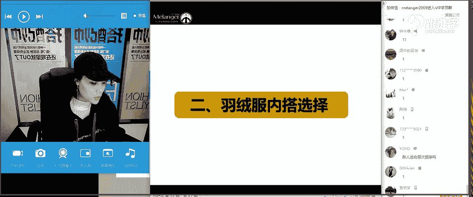
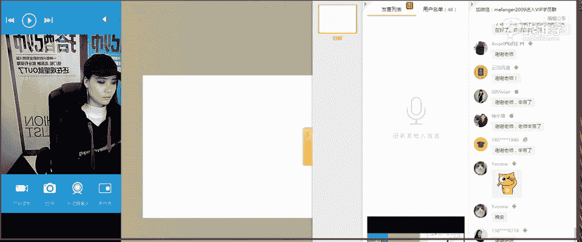

# 服装搭配秘笈之新版36计：1.23 羽绒服搭配秘籍

在本节课中，我们将要学习如何将羽绒服穿得既保暖又时尚。我们将从羽绒服的历史、如何选择、内搭搭配以及穿搭注意事项等多个方面进行详细讲解，帮助初学者掌握羽绒服的搭配技巧。

## 羽绒服的历史

上一节我们介绍了课程概述，本节中我们来看看羽绒服这件单品的发展由来。

在1940年以前，并没有现代意义上的羽绒服。羽绒制品主要用于制作棉被，且因工艺复杂、成本高昂，仅供达官贵人使用。1940年，一位名叫Eddie Bauer的户外用品店主发明了第一件羽绒服。他因一次冬季捕鱼险些失温的经历，受军队使用羽绒保暖的启发，创造了将羽绒填充在外套内的设计，并申请了菱形格纹和平行绗缝工艺的专利。这种工艺能有效固定羽绒，使其均匀分布，至今仍是羽绒服的核心工艺之一。

## 如何选择羽绒服

了解了羽绒服的历史后，本节中我们来看看如何根据自身条件选择合适的羽绒服。

选择羽绒服时，长度是关键因素之一，它与您的体型和身高密切相关。

以下是羽绒服长度的界定及选择建议：

*   **短款**：衣长在臀部以上。适合个子娇小、或X型、H型体型的人。A型体型（臀大腿粗）和T型体型（肩宽）需谨慎选择。
*   **中长款**：衣长盖过臀部或至大腿中部。适合大多数人，但需注意整体搭配。
*   **长款**：衣长至大腿中部以下。高个子更能驾驭。个子娇小者若想尝试，需运用搭配技巧（如塑造腰线）。

**核心选择原则**：需同时考虑身高与体型。例如，个子矮小者优选短款；肩宽者（T型）应避免 oversize 或大毛领设计，以免加重上半身量感。

## 羽绒服显瘦搭配秘籍

选择好合适的款式后，本节中我们来看看如何通过搭配让羽绒服看起来更显瘦。

显瘦的核心原理是 **张弛有度**。由于羽绒服本身具有膨胀感，若上下装都宽松，则会显胖。因此，搭配时要遵循“松紧结合”的原则。

以下是几种显瘦的搭配方法：

*   **秘籍一：羽绒服 + 紧身裤**。这是最经典的显瘦搭配，利用上松下紧的对比优化比例。敞开穿着更添时尚感。
*   **秘籍二：羽绒服 + 直筒裤**。直筒裤版型修身，不像阔腿裤那样宽松，能与羽绒服形成良好平衡。内搭同色系（一码色）更能显高显瘦。
*   **秘籍三：羽绒服 + 喇叭裤**。搭配喇叭裤时，建议选择短款羽绒服，以突出膝盖以上修身部分，避免上下皆宽。
*   **秘籍四：羽绒服 + 腰带**。无论搭配裙装还是裤装，系上腰带明确腰线，是瞬间显瘦的有效方法。今年尤其流行在厚重外套外系腰带。

## 羽绒服时尚搭配秘籍

解决了显瘦问题，本节中我们来看看如何将羽绒服穿出时尚感。

时尚的本质在于打破常规与创新。以下是几种提升羽绒服时尚度的穿搭方法：

*   **秘籍一：打破比例**。改变服装与人体的传统比例关系能带来时尚感。例如，**短上衣+长裙**、**长外套+短下装**或 **“下装消失法”**，都是通过打破常规比例来吸引视线。
*   **秘籍二：叠穿法**。通过里外服装的长度错落（如里长外短或里短外长），营造丰富的层次感。这需要一定的搭配功力，注意色彩与风格的和谐。
*   **秘籍三：不好好穿衣法**。这是一种更具个性的穿搭方式，如披着穿、只穿一个袖子、或将衣领拉下露出肩膀。虽实用性因人而异，但时尚感极强。
*   **秘籍四：亮色搭配**。在沉闷的冬季，一件亮色的羽绒服能让你脱颖而出。可以用中性色（黑、白、灰、藏蓝）的内搭来平衡亮色的跳跃感。

## 男士羽绒服搭配要点

以上技巧多以女装为例，本节中我们来看看男士羽绒服搭配的要点。

男士搭配可根据想要呈现的风格，分为年轻化与成熟化两种方向。

**年轻化风格搭配建议：**
1.  **不好好穿衣**：披搭、滑肩等穿法，增添不羁感。
2.  **亮色搭配**：选择鲜艳颜色的羽绒服，展现活力。
3.  **运动风格**：搭配卫衣、牛仔、运动鞋、针织帽等单品。

**成熟化风格搭配建议：**
1.  **叠穿正装**：在羽绒服内搭配**衬衫、领带、西装或马甲**，提升稳重儒雅气质。
2.  **选择大衣款羽绒服**：选择设计类似大衣、采用平行绗缝或正格纹的款式。
3.  **注重面料质感**：选择带有光泽感或毛呢等高品质面料的羽绒服。

## 羽绒服内搭选择

外套搭配得当，内搭同样重要。本节中我们来看看羽绒服内搭的选择技巧。

内搭的选择与脸型、脖长关系密切。核心目的是修饰脸型，拉长脖颈。

**内搭领型与脸型关系：**
*   **圆脸、方脸、梨形脸**：适合大领口（如V领、大圆领），有纵向拉长效果。
*   **长形脸**：避免领口过低过深，适合中等大小的圆领或高领。
*   **脖子短**：首选V领，避免包裹严实的高领。选择**接近肤色的内搭**（如裸色、浅灰）也能在视觉上延伸脖长。

**推荐内搭单品：**
以下是几类适合作为羽绒服内搭的单品：
*   **衬衫**：包括白衬衫、条纹衫、格子衬衫、牛仔衬衫等，可单穿或叠穿。
*   **针织衫**：
    *   按领型：**圆领**、**高领**。
    *   按面料：**细腻针织**显成熟，**粗棒针织**显年轻。
    *   可搭配衬衫进行叠穿。
*   **卫衣**：连帽或圆领卫衣能轻松打造休闲、运动、年轻的风格。

## 羽绒服穿搭注意事项

最后，我们来总结一下穿羽绒服时需要避免的几个常见误区。

以下是三个主要的穿搭禁忌：
1.  **慎选超大廓形**： Oversize 羽绒服虽流行，但极难驾驭，容易显得臃肿如“棉被”，若非刻意追求戏剧性效果，建议选择合身或适度宽松的款式。
2.  **慎用夸张领部装饰**：脸部较大或脖子较短的人，应避免穿着带有**大型毛领**或**厚重高领**的羽绒服，以免将视觉焦点集中在面部缺点上。
3.  **避免长款羽绒服+雪地靴**：这种组合会从头到脚带来膨胀感，即使身材苗条也易显臃肿。若需保暖，建议搭配**版型紧致的靴子**（即使内里有绒），以保持“张弛有度”。

## 总结

本节课中我们一起学习了羽绒服的全面搭配秘籍。我们从其历史起源开始，了解了如何根据自身体型和身高选择合适的长短款式。我们掌握了显瘦的核心原则——**张弛有度**，并学习了紧身裤、直筒裤、喇叭裤及腰带等具体显瘦搭配法。为了提升时尚感，我们探讨了打破比例、叠穿、不好好穿衣及亮色搭配等技巧。对于男士，我们区分了年轻化与成熟化的搭配方向。此外，我们还学习了如何根据脸型选择内搭，以及需要避免的穿搭雷区。希望本课程能帮助你打破对羽绒服的刻板印象，在寒冬中既能保持温暖，又能穿出风采与个性。