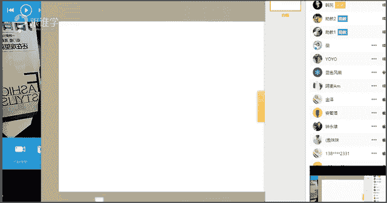
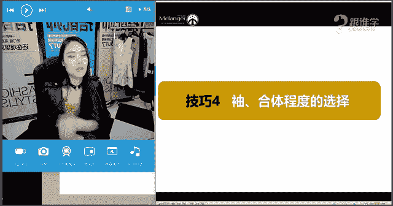
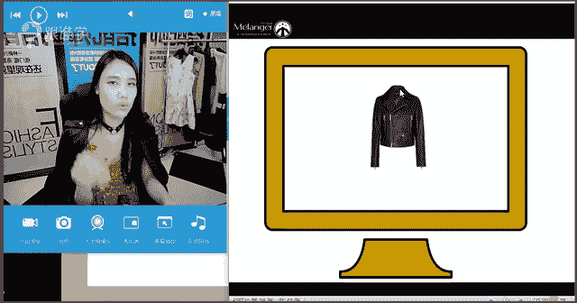
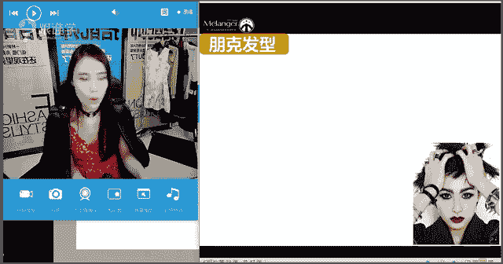
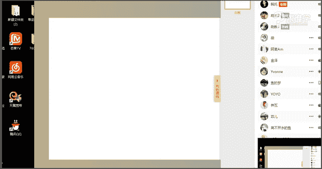

# 服装搭配秘笈之新版36计：1：机车夹克的搭配秘笈

在本节课中，我们将要学习关于机车夹克（皮衣）的全面知识，包括它的历史发展、如何根据自身条件进行选择，以及多种风格的搭配技巧。通过学习，你将能够读懂这件单品的内在精神，并运用它来精准表达自己的个人风格。

## 机车夹克的历史与发展

上一节我们介绍了课程概述，本节中我们来看看机车夹克的前世今生。了解一件单品的历史，有助于我们理解其蕴含的风格精神。

很多人对机车夹克的印象是帅气、硬朗、酷感，甚至带有一点“痞”或“坏”的感觉。这通常与朋克（Punk）和机车（Biker）这两种经典风格相关联。然而，机车夹克的发展历程远比这复杂。

*   **起源与早期应用**：人类最早使用的服装面料就是皮革，用于保暖。16世纪，皮革服装开始被罗马和埃及军队用作御寒军服。
*   **一战至二战时期**：1914年至1945年间，皮衣才真正演变为现代服装款式。当时为飞行员设计的A-2飞行夹克，采用皮革制成，配有军队徽章，并在袖口和腰际使用针织松紧设计，是一件非常“正气”的军用品。
*   **20世纪50年代**：二战后，皮衣因其良好的防寒性能被采用为美国警察制服，此时它依然保持着正面形象。
*   **叛逆标签的诞生**：二战后，出现了“机车族”群体。他们多是难以适应和平生活的退伍军人，通过摩托车寻找刺激，并常有打架、斗殴等行为。1953年电影《飞车党》中马龙·白兰度的形象，将皮衣与“叛逆”标签紧密联系在一起。
*   **文化象征**：从60年代到80年代，皮衣被猫王等众多影星、歌手演绎，叛逆形象深入人心。后来，它甚至成为一些社会运动（如黑人运动）的精神象征。

因此，机车夹克从一件功能性的军装，演变为代表叛逆、个性与自我表达的文化符号。读懂它的历史，我们才能更好地驾驭它。

## 机车夹克的穿着禁忌

在深入了解如何搭配之前，我们需要先明确穿机车夹克时需要避免的误区。

以下是两个主要的禁忌：

1.  **全身皮革搭配**：皮衣搭配皮裤，对身材和比例要求极高。除非像模特抖森那样拥有优越的身材比例，否则容易显胖或暴露身材短板（例如头身比不佳或五五分身材）。国内歌手汪峰和邓紫棋都曾因全身皮装造型引发争议。
2.  **过于暴露或传递错误信号**：皮革与捆绑设计、黑丝袜等元素结合时，容易传递出过于性感或特定的（如SM风格）信号。除非有意塑造此类形象，否则日常搭配中需谨慎。

## 如何选择适合自己的机车夹克

选择一件合适的机车夹克，需要从款式、色彩工艺、肩领设计以及合身度四个维度综合考虑。

### 技巧一：根据款式选择——决定成熟度

机车夹克主要有四种经典款式，它们传递的成熟感不同。

以下是四种主要款式及其特点：

*   **经典骑士皮衣 (Classic Biker Jacket)**：斜拉链、翻领、袖口常有拉链设计。**款式年轻、叛逆感强**。
*   **摩托车骑士夹克 (Motorcycle Jacket)**：中长款、带腰带、多口袋。**款式成熟、偏绅士和正统**。
*   **极简机车夹克 (Minimalist Biker Jacket)**：设计非常简洁，拉链和扣子很少。**款式简约，成熟感中等**。
*   **小翻领夹克衫 (Collarless Jacket)**：小翻领或无领设计。**款式最为成熟**。

**总结**：想要表现年轻、帅气、叛逆感，选择经典款；想要表现成熟、稳重、绅士感，可以选择后三种款式。

### 技巧二：根据色彩与工艺选择——决定实用性与时尚度

色彩和工艺的复杂度直接影响单品的百搭程度和是否容易过时。

以下是不同设计的搭配难度分析（以经典款为例）：

*   **设计简约 + 低彩度（如卡其色）**：**最容易搭配，最实用**，属于经典基础款。
*   **设计简约 + 中彩度**：有一定色彩，搭配难度中等。
*   **设计简约 + 高彩度（如亮红色）**：色彩鲜艳，**比较难搭配**。
*   **设计复杂（如拼色、漆皮、流行图案）**：设计元素多，**难搭配**，且容易过时。
*   **带有强烈风格化元素（如铆钉）**：风格指向性明确（如朋克风），**会限制搭配风格**。

**总结**：追求实用和长久穿着，选设计简约、色彩低调的基础款；追求出彩和时髦度，可以尝试高彩度或带有流行元素的款式，但需接受其搭配难度高和易过时的特点。

### 技巧三：根据肩型与领型选择——修饰脸型与身材

肩部和领部的设计细节，直接影响对脸型、颈长和胸型的修饰效果。

**关于肩型**：
*   **溜肩人士**：应选择**有肩章设计、垫肩、肩线清晰挺括**的款式，避免无肩线、插肩袖或面料柔软的款式。
*   **肩宽背厚（T型身材）人士**：应选择**肩部设计简洁、无过多装饰**的款式。

**关于领型**：
*   **小圆领、高领、有堆积感的设计**：容易**显脖子短、脸大、胸丰满、肩宽**。
*   **大翻领、V领设计**：能够**拉长颈部线条，显脸小**，对胸丰满者更友好。穿着时建议敞开拉链，修饰效果更佳。

### 技巧四：根据合身度选择——影响精神面貌

合身的机车夹克才能穿出利落、帅气的感觉。

*   **袖子长度**：正确的长度应在**手腕处**，过长会显得拖沓。
*   **整体合身度**：肩部应贴合，衣身不宜过于宽松。即使流行 oversized 廓形，皮衣的肩部设计通常仍保持相对合体，以保留其内在的利落感。

## 机车夹克的搭配秘籍

在了解了如何选择之后，我们进入最关键的搭配环节。搭配时需考虑体型、风格、个人喜好、年龄和场合等多个维度。本节课我们主要从**风格**维度来解析搭配方法。

### 核心风格一：朋克风 (Punk)

朋克风格起源于20世纪70年代经济萧条的英国，代表着叛逆、破坏与对社会的不满。

以下是朋克风格的经典元素：

*   **服装元素**：破洞、铆钉、皮革、金属链条、狗链项圈 (Choker)、反政府标志、涂鸦（骷髅、子弹等）。
*   **发型妆容**：莫西干头、鲜艳发色、烟熏妆、深色唇妆。
*   **配饰**：大量银质戒指、手链、鼻环、唇环等。

**现代实用搭配**：无需全盘照搬，只需**选取一两个朋克元素**（如一件铆钉皮衣、一条Choker、烟熏妆）融入日常穿搭，即可展现朋克精神。

### 核心风格二：机车风 (Biker)

机车风格来源于二战后的“机车族”，比朋克风更注重功能性和粗犷的男性气质。

*   **经典造型**：皮衣、皮裤、皮靴、皮手套、防风镜、三角巾。一切以实用御寒防风为主。
*   **风格感觉**：沧桑、粗犷、硬朗、男人味十足。

### 现代主流：风格混搭

如今，最受欢迎的是将机车夹克与其他风格单品进行混搭，尤其是“娘man平衡”的搭配法。

**核心公式**：**硬朗皮革 + 柔软女性化单品**

这种面料和风格上的强烈对比，能形成巨大的视觉冲击力，既帅气又不失女人味。

#### 搭配方案一：机车夹克 + 裤装

裤装搭配会强化中性帅气感。

以下是不同风格的裤装搭配示例：

*   **中性帅气风**：皮衣 + 黑色紧身裤/西裤 + 短靴。全身统一深色，利落干练。
*   **性感风**：皮衣 + 皮裤（对身材要求高）；或皮衣 + 丝绸吊带/睡衣风内搭。展现成熟女性魅力。
*   **运动休闲风**：皮衣 + 连帽卫衣/T恤 + 运动裤/牛仔裤 + 运动鞋。活力减龄。
*   **绅士英伦风**：皮衣（特别是摩托车骑士款） + 衬衫 + 针织马甲/领带 + 绅士帽。稳重有型。

#### 搭配方案二：机车夹克 + 裙装

裙装搭配能中和皮衣的硬朗，创造更多风格可能。

以下是不同风格的裙装搭配示例：

*   **波西米亚风**：皮衣 + 印花长裙。材质对比（挺括 vs 飘逸）强烈。
*   **优雅风**：皮衣 + 收腰伞裙（迪奥 New Look 廓形） + 尖头高跟鞋。复古优雅。
*   **甜美风**：皮衣 + A字摆连衣裙。俏皮有活力。
*   **性感风**：皮衣 + 包臀裙/开衩裙。突出女性曲线。
*   **休闲运动风**：皮衣 + 针织连衣裙 + 运动鞋。舒适随意。
*   **中性军旅风**：皮衣 + 军绿色/迷彩半裙 + 短靴。帅气飒爽。

### 场合搭配示范

我们以三种典型场合为例，进行实物搭配演示。

*   **社交场合（如约会、聚会）**：
    *   **搭配**：红色蕾丝吊带裙 + 黑色经典款皮衣 + 黑色高领打底衫（御寒）+ Choker/优雅耳饰 + 高跟鞋。
    *   **要点**：`娘man平衡`，用皮衣的硬朗中和裙装的柔美，既性感又不会过于甜腻。可根据温度内搭高领衫。

*   **职场场合**：
    *   **搭配**：白色衬衫 + 黑色西装裤 + 黑色经典款皮衣 + 设计感针织背心（叠穿）+ 黑色高跟鞋 + 精致耳环。
    *   **要点**：在专业感中融入时尚度。`叠穿`增加层次，皮衣提升气场。

*   **休闲场合**：
    *   **搭配**：基本款打底衫 + 喇叭牛仔裤 + 长款皮衣 + 民族风项链层叠佩戴 + 宽檐帽。
    *   **要点**：打造`嬉皮士风格`。核心在于配饰的运用，大量民族风珠宝是风格关键。

**配饰的妙用**：配饰是风格的“语言”。朋克风选铆钉、链条；优雅风选珍珠、水滴状耳环；民族风选彩珠、流苏。确保配饰与你想表达的风格主线一致。

## 课程总结

本节课中我们一起学习了机车夹克的完整体系。

1.  **历史**：它从功能性军装演变为叛逆的文化符号，理解其精神内核是搭配的基础。
2.  **禁忌**：避免全身皮革搭配及过于暴露的组合。
3.  **选择四要素**：
    *   **款式**：决定成熟度（经典款年轻，小翻领成熟）。
    *   **色彩工艺**：决定实用性与时尚度（简约基础款最百搭）。
    *   **肩领设计**：用于修饰身形（溜肩选有肩章，脸大脖短选大V领）。
    *   **合身度**：袖子在手腕，肩部要合体。
4.  **搭配秘籍**：掌握`朋克风`和`机车风`的核心元素，并灵活运用`混搭`手法，特别是“`硬朗皮革+柔软裙装`”的`娘man平衡`公式。根据社交、职场、休闲等不同场合，调整单品组合与配饰。

最终，所有搭配都服务于你想表达的`个人风格`。读懂单品语言，结合自身气质与内心喜好，你就能让机车夹克成为表达自我态度的完美工具。