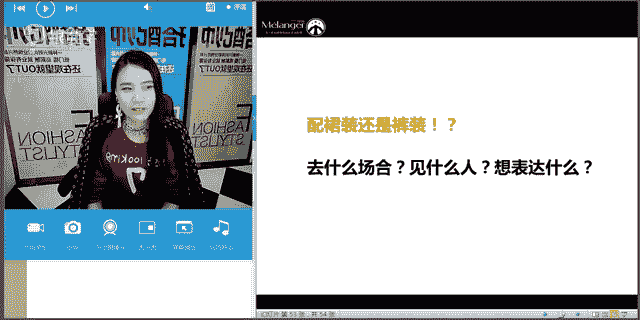
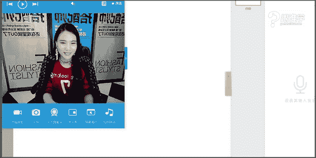

# 服装搭配秘笈之新版36计：1：卫衣单品详解与搭配

在本节课中，我们将要学习关于卫衣这件单品的全面知识，包括其历史、如何根据身材进行选择、以及多种实用的搭配方法。课程内容将帮助你解决卫衣穿着显胖、搭配普通等常见困惑，让你能更自信地驾驭这件舒适又时尚的单品。

## 课程概述与单品历史

卫衣最早出现在1930年左右，最初是为冷库工人设计的保暖工装。到了1936年，美国运动员在柏林奥运会上穿着卫衣，使其开始进入大众视野，逐渐演变为我们今天常见的休闲时尚单品。

许多功能性服装，如牛仔、飞行员夹克等，最初都并非为大众日常穿着设计，卫衣也是如此。它因其舒适性而被广泛接受。

在70年代，随着嘻哈文化的兴起，宽松舒适的卫衣成为了亚文化叛逆的象征，尤其受到嘻哈音乐人的喜爱。而嘻哈风格真正被现代大众所熟知，则是在90年代。

## 卫衣的选择基准：身材因素

选择任何服装单品都有一个基准，那就是要根据自己的身材进行选择。卫衣的选择尤其与身材密切相关，主要考虑三个维度：**体型**、**身高比例**和**体态细节**。

### 体型：横向维度的考量

体型决定了服装款式、色彩和材质的选择。常见的女性体型有四种：**X型**、**H型**、**T型（倒三角）**、**A型（梨形）**。

*   **X型**：肩、胸、臀围度接近，腰围明显较细，是视觉上平衡且富有曲线美的体型。
*   **H型**：肩、腰、臀围度差异不大，整体呈直筒形，也是平衡型身材。
*   **T型**：肩宽明显大于臀宽，上半身看起来较壮。
*   **A型**：肩窄，臀宽，脂肪容易堆积在臀部和大腿。

对于穿着卫衣，**T型体型**需要特别注意，因为卫衣本身带有膨胀感，可能加剧肩宽的视觉效果。

#### T型体型的搭配原则

T型体型搭配的核心思路是：**转移视觉焦点，塑造上下平衡**。应避免让他人过度关注上半身。

**搭配裤装时**，应遵循 **“上收缩，下膨胀”** 的原则。
*   **错误示范**：上身使用鲜艳（前进色）、宽松的卫衣，下身搭配紧身、深色（后退色）裤子。这会强化肩宽，显得更壮。
*   **正确示范**：
    1.  上身选择深色、合身或略有收缩感的卫衣，下身搭配色彩明亮、廓形宽松的裤子（如阔腿裤）。这能将注意力引向下半身。
    2.  上下装都选择宽松款式，但色彩上保持协调，整体塑造**H型**或**X型**廓形，达到视觉平衡。

**搭配裙装时**，原理相同。
*   **错误示范**：宽松卫衣搭配紧身短裙，形成明显的倒三角，显壮实。同时避免在肩颈处做过多装饰。
*   **正确示范**：
    1.  选择**H型**连身裙或上下平衡的搭配。
    2.  运用 **“上收缩，下膨胀”** 的方法，例如修身卫衣搭配A字裙或伞裙，塑造X曲线。

**公式总结：T型体型搭配 = 上身（深色/收缩感面料/合身廓形）+ 下身（浅色或亮色/膨胀感面料/宽松廓形）**

> **注**：对于男士而言，T型（肩宽臀窄）通常是标准且美观的体型，在着装上无需刻意修饰，合身或略显修身的款式更能展现优势。

### 身高与比例：纵向维度的考量

身高和比例决定了服装的长度选择和搭配手法。

*   **身高**：大致分为娇小（1.6米以下）、中等（1.6-1.7米）和高大（1.7米以上）。不同身高对服装“大气度”的驾驭能力不同。娇小身材更适合短款、轻巧的服装；高挑身材更能驾驭长款、大廓形的设计。但这并非绝对，还需结合个人气质。
*   **比例**：指上半身与下半身的长度比。比例好（更接近黄金分割比1.618）会更显高。亚洲人普遍比例在1.3-1.5之间。

无论身高如何，优化比例的关键手法都是**制造高腰线**。例如，将卫衣下摆塞进下装，或利用腰带明确腰线位置，都能有效拉长腿部线条，显高显瘦。

### 体态细节：局部问题的修饰

体态细节指脖子长短、胸围大小、腰腹粗细、腿型等局部特征。它决定了服装细节的选择。

*   **脖子短/脸大**：选择**大圆领**或**V领**卫衣，增加露肤度，延伸颈部线条。避免小圆领或高领。
*   **胸大显胖**：选择**拉链款**卫衣，通过V形领口拉长线条。避免紧身或小领口款式。
*   **腰粗**：选择有**收腰设计**的卫衣款式，或通过“塞衣角”手动制造腰线。避免直筒宽松款。
*   **臀宽/腿粗**：运用**遮盖法**，选择衣长能盖过臀部的卫衣，或搭配长裙、阔腿裤。避免紧身下装暴露缺点。

## 卫衣的选择基准：流行时尚元素

选择服装时，除了适合自己，也需要考虑时尚感，避免显得过时。我们不必盲目追逐潮流，但需保持“与时俱进”。

复古是一种流行趋势，但**复古不是穿越，不是完全复制过去的穿着**，而是将过去的经典元素与现代审美和单品相结合。

当前卫衣的流行元素体现在以下几个方面：

1.  **廓形**：流行** oversized（超大款）** 和**短款**。合身的常规款可以通过“塞衣角”打造成短款效果。娇小身材需谨慎选择超大廓形。
2.  **图案**：流行**小字母、小logo**或具有态度标语的图案。大图案、大logo的热度已减弱。
3.  **设计工艺**：流行**拼色、织带、贴布**等设计细节，能为基本款增加亮点。

## 卫衣的搭配方法

了解如何选择后，我们来看看卫衣的具体搭配方案。主要从三个维度展开：与外套、与下装、与鞋袜的搭配。

### 与外套的搭配

卫衣可作为内搭，与各种外套组合，增加层次感和时尚度。

*   **搭配大衣**：选择领部简洁的大衣（如无领、西装领），避免与连帽卫衣的帽子产生堆积感，保持颈部的清爽。内搭的卫衣领口不宜过小过高。
*   **搭配风衣**：适合春秋季节，同样需注意内外领口的协调，避免繁琐。
*   **搭配夹克**：与**机车夹克、飞行员夹克、牛仔夹克、棒球夹克**等都能完美融合，强化休闲、帅气的风格。

> **核心提示**：由于卫衣自带运动休闲属性，无论搭配何种外套，整体风格都会偏向休闲化，不太适合非常正式的场合。

### 与下装的搭配

#### 裤装搭配
*   **锥形裤**：利落帅气，但不适合T型体型（上宽下窄）。
*   **阔腿裤**：摩登且能修饰腿型。但腰粗、胯宽的人需注意，避免上下皆宽显得臃肿。可通过面料、色彩差异来营造层次。
*   **风格示例（男士）**：
    *   **欧美街头风**：Oversized卫衣+宽松裤装+运动鞋/分量感鞋靴，个性不羁。
    *   **韩系风格**：修身卫衣+清新色彩+合身裤装，显得修长、清爽。
    *   **简约系**：修身卫衣+成熟稳重色系+质感裤装，偏成熟休闲。

#### 裙装搭配
裙装能中和卫衣的运动感，带来更多女性化气息。

*   **搭配蕾丝裙**：**运动风+性感风**混搭，产生“小清新式性感”的效果。
*   **搭配百褶裙**：
    *   长款百褶裙：唯美、飘逸。
    *   中短款百褶裙：优雅、稳重（搭配深色）或清新、活泼（搭配浅色）。
*   **搭配特别设计裙装**（如不规则、开叉、拼接款）：突出个性与时尚感。
*   **搭配迷你短裙**：显得年轻有活力。可通过不同单品组合出不同风格，例如：
    *   搭配高跟鞋：**性感女人味**。
    *   搭配马丁靴和皮革短裙：**帅气中性风**。
    *   搭配浅色雪纺短裙：**甜美可爱风**。

> **搭配要点**：根据自身腿型选择裙长。腿粗可选择及膝或长裙遮盖；腿型优美则可大胆展示。

### 与鞋袜的搭配

*   **搭配过膝靴**：非常流行的“下装消失法”，显高且时尚。适合腿型不够完美的人修饰腿型。可搭配不同风格的卫衣（如性感蕾丝边、个性超长袖等）。
*   **搭配袜子**：短袜、中筒袜、过膝袜搭配运动鞋，强化运动感。但会将腿部分割，腿型不完美者慎选，更推荐用过膝靴替代。

## 课程总结与答疑思路

本节课我们一起学习了卫衣单品的核心知识。我们从卫衣的历史起源讲起，明确了选择卫衣的两大基准：**身材因素**（体型、身高比例、体态细节）和**流行时尚元素**。我们深入探讨了T型体型等特殊身材的搭配原则，并提供了卫衣与外套、裤装、裙装及鞋袜的多种搭配方案。

当你面对一柜子衣服不知如何搭配时，可以问自己三个问题来理清思路：
1.  **我要去什么场合？**（决定着装正式度）
2.  **我要见什么人？**（考虑对方喜好或场合要求）
3.  **我想表达什么？**（确定想要展现的风格，如甜美、帅气、性感等）

通过本节课的学习，希望你能更了解自己，更了解卫衣，从而创造出更多属于自己的精彩搭配。