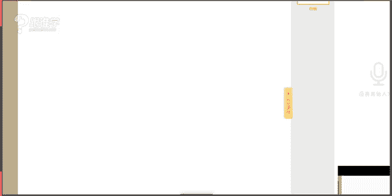
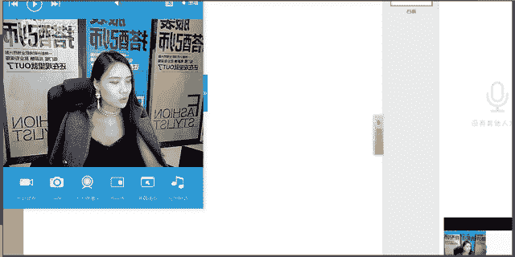
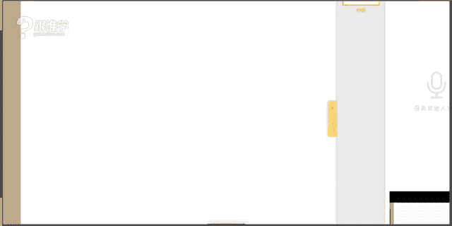
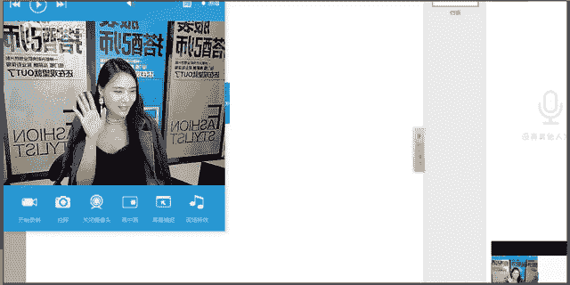

# 服装搭配秘笈之新版36计：1-26：军旅大衣搭配全解析

## 概述
在本节课中，我们将系统学习军旅大衣的搭配知识。课程将从军旅服饰的历史发展脉络讲起，重点剖析海军大衣的起源、特点及多种搭配方案。无论你是初学者还是搭配爱好者，都能通过本教程掌握将军旅元素融入日常穿搭的核心技巧。

---

## 一、军旅服饰的历史发展脉络

上一节我们概述了课程内容，本节中我们来深入了解军旅服饰的演变过程。军旅服饰的发展大致可分为两个主要阶段。

以下是军旅服饰发展的两个关键时期：

1.  **华丽繁复时期（17世纪至19世纪）**
    *   此时期的军装设计以装饰性为主，华丽而精致。
    *   以法国拿破仑时期的军装为代表，特点是运用大量金线、刺绣和盘扣工艺，色彩鲜艳，造价高昂。
    *   当时鲜艳的色彩（如红色、蓝色）在战场上具有标识己方、震慑敌军以及体现国家荣誉的实用性。

2.  **简约实用时期（19世纪至现代）**
    *   随着科技与战争形态的变化，军装转向以功能性和隐蔽性为主导。
    *   色彩变得低调（如卡其色、蓝灰色），款式简化以节省成本并提高战场生存率。
    *   德国军装是此时期的精致代表，采用立体剪裁，合体收腰，以体现身体的力量感。

**核心概念：军装功能的转变**
*   **华丽时期公式：** `军装 = 标识功能 + 震慑功能 + 荣誉象征`
*   **简约时期公式：** `军装 = 隐蔽功能 + 实用功能 + 成本控制`

---

## 二、军装的主要分类及代表单品

了解了历史脉络后，我们来看看现代生活中常见的军装风格单品是如何分类的。现代军装主要源于海、陆、空三大军种。

以下是三大军种对应的经典时尚单品：

1.  **海军**
    *   **代表单品：** 双排扣海军大衣、牛角扣大衣。
    *   **经典色彩：** 海军蓝。
    *   **设计特点：** 双排扣、宽大领子、大口袋，最初设计旨在海上防风保暖。

2.  **空军**
    *   **代表单品：** 飞行员夹克。
    *   **设计特点：** 通常带有毛领、罗纹下摆和袖口，保暖性强。

3.  **陆军**
    *   **代表单品：** 战壕风衣（如巴宝莉风衣）。
    *   **设计特点：** 肩章、枪挡、雨挡、D型环等元素，兼具防风防雨功能。

---

## 三、核心单品：海军大衣的深度解析

本节我们将聚焦今天的主角——海军大衣。我们将从它的发展、版型到如何选择，进行详细拆解。

### 1. 海军大衣的发展与版型
海军大衣的演变经历了从长款到短款，细节不断精简的过程。其经典版型多为**H型**，即直筒轮廓，不强调收腰，给人以利落、帅气的印象。

### 2. 如何选择适合你的海军大衣
选择大衣时，需综合考虑身高与体型。

以下是基于身高和体型的选购建议：

*   **娇小身材（身高<1.65米）**
    *   **建议：** 选择短款或中长款。
    *   **避免：** 超长款，以免压身高。
*   **中等/高挑身材**
    *   **建议：** 可自由选择短、中、长款，长款更能穿出气场。
*   **X体型（腰细，胸臀丰满）**
    *   **建议：** 选择H版型大衣时，内搭需**修身**，以勾勒曲线，避免整体臃肿。
    *   **公式：** `H型外套 + 修身内搭 = 突出腰线`
*   **H体型（肩、腰、臀宽度接近）**
    *   **建议：** H版型大衣是天然选择，可通过内搭打造层次感。

---

## 四、海军大衣的搭配实战教程

现在，我们进入最重要的实操环节。掌握以下搭配公式，你就能轻松驾驭海军大衣。

### 内搭选择
内搭决定了整体风格的基础。

以下是三种经典的内搭方案：

1.  **搭配条纹衫**
    *   **风格：** 经典、法式、休闲。
    *   **要点：** 条纹衫本身源于水手服，与海军大衣同源，搭配最不易出错。可将下摆塞入下装以打造高腰线。
2.  **搭配衬衫**
    *   **风格：** 知性、干练、通勤。
    *   **要点：** 选择纯色或简约格纹衬衫。同样建议塞衣角，优化身材比例。
3.  **搭配连衣裙**
    *   **风格：** 优雅、柔美、混搭。
    *   **要点：** 注意内外长度比例。`内短外长`显年轻活力；`内长外长`则显成熟大气。避免内外长度半长不短，易显拖沓。

### 下装搭配
下装搭配是平衡风格的关键。

以下是针对不同单品的下装搭配技巧：

*   **搭配紧身裤**
    *   **公式：** `宽松大衣 + 紧身裤 = 上宽下紧，显瘦利落`
    *   这是最不易出错的搭配，能形成良好的视觉节奏感。
*   **搭配阔腿裤**
    *   **公式：** `宽松大衣 + 阔腿裤 = 潇洒大气`
    *   **注意：** 小个子需谨慎，建议搭配**短款**海军大衣，并提高腰线，避免“五五分”比例。
*   **搭配半身裙**
    *   **风格：** A字裙显年轻，铅笔裙显优雅，伞裙显浪漫。
    *   **要点：** 根据裙子的风格和材质，调整整体造型的调性。
*   **搭配丝袜**
    *   适合内搭连衣裙或短裙/短裤时，增加保暖性和一丝性感韵味。

### 色彩搭配指南
色彩是风格的无声语言。

以下是海军大衣的配色核心思路：

*   **经典配色：海军蓝 + 白色**
    *   最原汁原味的海军风，清新、经典。
*   **同色系渐变：深蓝 + 浅蓝**
    *   高级且和谐，富有层次感。
*   **对比色点缀：海军蓝 + 红色/酒红色**
    *   复古且亮眼，但注意红色单品（如鞋子、围巾）的饱和度不宜过高，选择酒红、砖红更显质感。
*   **中性色搭配：海军蓝 + 灰色/黑色/卡其色**
    *   稳重、成熟，适合通勤或打造低调简约风格。

**核心概念：色彩情感**
*   `蓝色` 通常传递 **理智、沉稳、宁静** 的情感，也可能带有 **忧郁** 的意味。
*   在搭配时，可通过不同配色来强化或软化海军蓝本身的风格属性。

---

## 五、男士海军大衣搭配要点

男士搭配同样遵循上述逻辑，风格倾向略有不同。

以下是男士搭配的两种主要方向：

1.  **休闲年轻化**
    *   **搭配组合：** 海军大衣 + **牛仔裤** + 条纹衫/毛衣 + 运动鞋/靴子。
    *   **要点：** 可用亮色围巾、帽子作为点缀。
2.  **成熟稳重化**
    *   **搭配组合：** 海军大衣 + **休闲裤/西裤** + 衬衫/针织衫 + 皮鞋。
    *   **要点：** 色彩以中性色、深色系为主，整体感强。

---

## 六、核心穿搭哲学：个人优点刻画

在课程的最后，我们升华一下穿搭的核心思想。最高阶的搭配不在于追逐潮流，而在于 **“个人优点刻画”**。

**核心概念：** 你的穿搭应像一幅画，有重点、有留白。你需要发现自身最突出的优点（无论是脸部的五官、颈部的线条、肩部的平直，还是腿部的修长），并通过服装、配饰和造型手段，将这个优点变成你的个人标签。

**行动建议：**
1.  **观察自我：** 站在镜前，寻找自己最满意的一个身体部位或气质特点。
2.  **强化焦点：** 在日常搭配中，有意识地通过露肤、剪裁、色彩对比等方式突出这个优点。
3.  **简化其他：** 让其他部分的穿搭成为陪衬，服务于你的“优点焦点”。

---

## 总结
本节课中，我们一起学习了：
1.  军旅服饰从**华丽繁复**到**简约实用**的历史演变。
2.  现代**海、陆、空**军装对应的经典时尚单品。
3.  **海军大衣**的发展、版型（H型）及根据身高体型的选择方法。
4.  海军大衣与**条纹衫、衬衫、连衣裙**等内搭，以及**紧身裤、阔腿裤、半裙**等下装的多种搭配公式。
5.  从**经典蓝白配**到**同色系渐变**的色彩搭配逻辑。
6.  男士穿着海军大衣的**休闲**与**成熟**两种风格导向。
7.  最重要的穿搭哲学——**个人优点刻画**，这是打造独特个人风格的终极心法。

希望本教程能帮助你理解军旅大衣的精髓，并将其转化为属于自己的时尚语言。记住，了解服装是第一步，了解自己并将二者结合，才是风格成型的开始。