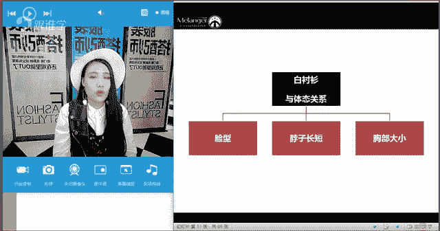
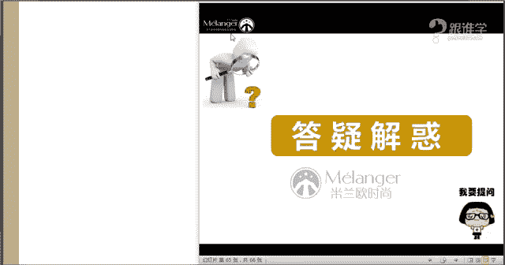

# 服装搭配秘笈之新版36计：27 百搭白衬衫 👔


在本节课中，我们将要学习如何选择、搭配和穿好衣橱中的必备单品——白衬衫。我们将从白衬衫的历史、面料、版型、领型选择，到如何根据自身体型进行搭配，系统地讲解如何让这件基础单品焕发时尚光彩。

---

## 白衬衫的历史与风格演变

上一节我们介绍了课程主题，本节中我们来看看白衬衫是如何从一件内衣演变为时尚单品的。

白衬衫并非现代产物，其历史可追溯至3000年前的古埃及。在欧洲，16世纪时衬衫已出现，但带有刺绣装饰，主要作为内搭。整个19世纪，白衬衫都如同内衣，穿在马甲和外套之下。



白衬衫在时尚界地位的确立，与香奈儿（Coco Chanel）密切相关。1920年，香奈儿是首位将白衬衫作为外穿单品，并搭配西装、毛呢外套和珍珠项链的女士，赋予了白衬衫新的时尚定义。此后至1930年代，白衬衫风格以中性、干练为主。

1940年代，奥黛丽·赫本在电影《罗马假日》中的造型，将白衬衫袖口卷起，搭配丝巾和伞裙，演绎出优雅浪漫的女性形象，为白衬衫注入了柔美气质。

1990年代，电影如《低俗小说》、《史密斯夫妇》中的角色，通过解开衬衫纽扣、搭配低胸穿法等，展现了白衬衫性感、不羁的一面。

由此可见，一件白衬衫可以通过不同搭配，演绎出**中性、优雅、浪漫、性感**等多种风格。

---

## 如何选择白衬衫：核心要素

了解了白衬衫的潜力后，我们来看看如何选择一件适合自己的白衬衫。选择时需综合考虑面料、版型、领型以及与自身体型的匹配度。

### 1. 学会选面料

面料决定了衬衫的质感、风格和适用场合。以下是三种常见面料及其特性：

*   **棉麻面料**：通常给人**自然、文艺、舒适**的感觉。纯棉衬衫挺括，适合职场；棉麻混纺则更休闲随性。棉质面料吸汗透气，但易皱。高品质棉（如埃及棉）纤维长，织出的面料更细腻。
*   **丝绸面料**：质感**细腻、华丽、高级**，富有**女人味和优雅感**。其柔软光泽能提升整体精致度。目前流行将丝绸与皮革等硬挺面料混搭。男士需谨慎选择丝绸衬衫作为外穿正装。
*   **雪纺/纱质面料**：具有**透视感和飘逸感**，能营造**性感、浪漫**的氛围。适合打造女性化或略带小性感的造型。

### 2. 学会选版型

版型直接影响穿着效果和身材修饰。基本版型可分为三类：

*   **经典直筒款**：线条垂直，不强调身体曲线，风格利落。
*   **经典修身款**：在腰背部有收省设计，能勾勒出身形，更显身材。
*   **经典宽松款**：廓形松垮，风格随性、时髦。

**选择公式**：
*   **X体型**（腰细）：建议选择**修身款**，以突出腰身优势。
*   **H体型**（肩、腰、臀宽度相近）：可选择**直筒款**或**宽松款**。

此外，现在还有许多设计感版型，如加长款、超短款、解构设计等，可根据个人风格尝试。

### 3. 学会选领型（结合体态细节）

领型是修饰脸型、颈部的关键，需与个人体态细节结合考虑。


**主要领型风格解析**：
*   **经典尖领/职业领**：传递**干练、帅气、中性、正式、严谨**的信息。
*   **V领（无领设计）**：传递**简约、优雅、性感、女人味**的信息。颈部易显空，可搭配丝巾。
*   **直领/立领**：带有**文艺、清新、儒雅**的气质。
*   **蝴蝶结领**：充满**女性化、浪漫、优雅**的元素。
*   **荷叶领**：同样强调**优雅感与女人味**，是当下的流行元素。
*   **彼得潘领（娃娃领）**：显得**甜美、可爱、清新**。
*   **背领**：指将衬衫前后反穿，露出背部，是种时髦穿法，可搭配后戴式项链。

**体态细节与领型选择法则**：
如果你存在**脸大、脖子短、肩宽或胸部丰满**其中任一情况，在选择领型时需注意：
1.  优先选择**V领**设计。
2.  若选择经典衬衫领，务必**解开上方几颗纽扣**穿着，以形成V字区域，拉伸颈部线条。
3.  可采用**叠穿法**，在白衬衫内搭配低领背心，同样能创造V形视觉效果。

**核心原则**：通过领口营造纵向线条，避免在颈部和胸部增加复杂堆积感。

---

## 白衬衫的搭配应用

掌握了选择方法后，本节我们来看看如何将白衬衫穿出彩。搭配的核心在于“扬长避短”和“风格塑造”。

### 针对特定体型的搭配建议（以A型体型为例）

A型体型（梨形）特点是肩窄、腰细、臀胯宽。搭配目标是**平衡上下身，视觉上收缩下半身，膨胀上半身**。

以下是三个实用方法：
1.  **遮盖法**：利用长款衬衫、外套等遮盖住臀部和胯部最宽处。
2.  **加强肩部线条**：选择带有垫肩、泡泡袖、荷叶边、一字领等设计的衬衫，增加上半身量感，实现上下平衡。
3.  **上浅下深法**：上身穿着浅色（高明度）如白色衬衫，下身搭配深色（低明度）下装。利用色彩将视觉焦点上移，忽略下半身。

**代码示例（搭配逻辑）**：
```
if 体型 == “A型”:
    上装 = 浅色 + 有设计感（如泡泡袖）
    下装 = 深色 + 简洁款
    目标 = 焦点上移 & 上下平衡
```

### 女士时尚搭配示范

以下是几种值得尝试的时髦穿法：
1.  **白衬衫 + 高领毛衣**：冬季叠穿经典，保暖且富有层次感。脖子短可选浅色高领。
2.  **白衬衫 + 连衣裙/半裙**：将衬衫作为内搭，搭配吊带裙、蕾丝裙等，能降低礼服的隆重感，增添休闲时尚味。
3.  **白衬衫扎下摆**：最显高显瘦的方法之一。可将衬衫全部或部分塞进下装，明确腰线。
4.  **白衬衫打结法**：在腰间随意打结，轻松打造高腰线，风格随性。
5.  **白衬衫作为外套**：内搭背心、T恤或连衣裙，敞开穿着，潇洒有型。

### 男士经典与时尚搭配

1.  **经典正装**：白衬衫 + 西装 + 领带，是职场标配。
2.  **白衬衫 + 马甲**：极具绅士感，可搭配牛仔裤和牛津鞋，混搭出雅痞风。
3.  **白衬衫 + 背带裤**：复古又帅气，男女皆可尝试。
4.  **白衬衫 + 短裤**：夏日休闲选择，对身材有一定要求，需简洁利落。

---

## 总结与答疑核心

本节课中我们一起学习了白衬衫的全面穿搭体系。

**核心总结**：
1.  **历史与风格**：白衬衫可塑性强，能演绎多种风格。
2.  **选择三要素**：根据**面料**（棉麻/丝绸/雪纺）定基调，根据**版型**（直筒/修身/宽松）合身形，根据**领型**结合**体态细节**（脸、颈、肩、胸）修饰不足。
3.  **搭配关键**：牢记“**扬长避短**”原则，利用色彩、款式和穿法（如塞衣角、叠穿）优化比例、塑造风格。
4.  **时尚秘诀**：善用**配饰**（丝巾、项链、帽子、腰带）和尝试**流行穿法**（如叠穿、打结、反穿），能为基础款注入灵魂。

**常见问题快速答疑**：
*   **Q：脖子短怎么穿？**
    *   A：选V领，或解开衬衫领扣，避免高领、小立领及颈部复杂装饰。
*   **Q：胸部丰满怎么穿？**
    *   A：选择简洁V领，避免胸部装饰。可采用内深外浅的叠穿，或将衬衫作为外套。
*   **Q：如何穿出雅痞风？**
    *   A：混搭是关键。例如：白衬衫 + 西装马甲 + 牛仔裤 + 彩色袜子 + 牛津鞋 + 休闲领巾。
*   **Q：饰品如何搭配不显乱？**
    *   A：保持材质或色彩上的呼应，遵循“虚实结合”、“重点突出”的原则，避免所有饰品都过于抢眼。



希望本教程能帮助你重新认识并驾驭好衣橱里的那件白衬衫，让它成为你风格表达中的得力助手。