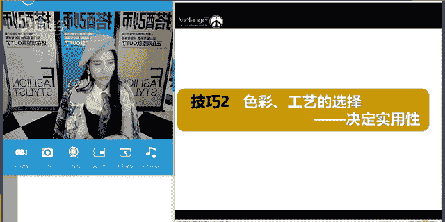

# 服装搭配秘笈之新版36计：1：双排扣风衣

## 概述
在本节课中，我们将要学习关于双排扣风衣的搭配知识。我们将从风衣的历史起源讲起，了解其经典设计细节的功能性，并学习如何根据自身情况选择合适的风衣款式。最后，我们会探讨风衣在不同风格下的搭配技巧，包括与裤装、裙装及各类配饰的组合。

---

## 风衣的起源：从军装到时装
上一节我们介绍了课程主题，本节中我们来看看风衣的历史。

现代时装中有许多单品都是从军装演变而来的，风衣便是其中之一。它是一件从军装蜕变而来的时装单品。

在17世纪到19世纪之间，军装多以奢华的装饰为主。到了19世纪，由于世界大战的爆发，出于实用性的需求，出现了简约的现代军装款式。我们今天看到的许多单品，如海军大衣、战壕风衣（即双排扣风衣）以及飞行员夹克，都是在这一时期以功能性为主设计出来的。

战壕风衣，直译过来也叫“壕沟风衣”。在战争时期，士兵们在战壕（即防御用的坑道）中作战。因为英国多雨的天气，士兵们需要一件能防风防雨的服装。大约在1889年，品牌Burberry的创始人托马斯·巴宝莉发明了一种名为“华达呢”的面料。这种面料在纱线阶段就经过防水处理，织成布后具有优异的防雨防风功能，雨水打在上面会像荷叶上的露珠一样滑落。这种风衣被军队采用后，极大地改善了士兵们在恶劣环境中的状况，这就是Burberry风衣的起源。

---

## 经典风衣的设计与功能性
了解了风衣的起源后，本节我们来解析其经典设计，你会发现每一个细节都有其存在的理由。

Burberry的创意总监曾说过，风衣之所以经典，是因为它起源于战争时期，每一个设计细节都具备功能性。以下是风衣的一些关键设计点及其原始功能：

*   **肩章**：最初用于区分军衔，也可用于固定防毒面具或夹住手套。
*   **枪托垫（位于右肩前方）**：下雨时可用于覆盖枪口，防止火药受潮。
*   **拿破仑领（可竖起的立领）**：竖起时可以防风、防寒、防雨水。
*   **双排扣与防雨兜**：增强防风防雨性能。
*   **D型扣环（位于腰带两侧）**：最初用于悬挂短剑、水壶等物品，现在多用于固定腰带。
*   **防风片（背部下方的额外布料）**：进一步防止雨水渗透，现代也起到修饰身形的作用。
*   **防雨腕带（袖口处的带子）**：可收紧袖口，防止雨水和风灌入。
*   **背部开叉**：最初是为了方便骑马，现在增加了透气性和活动便利性。

一件经典的风衣通常有10颗扣子，最初多为过膝长度。现代风衣为了适应不同审美和需求，衍生出了短款、中长款等多种长度。

---

## 如何选择适合自己的风衣？
上一节我们了解了风衣的经典设计，本节中我们来看看如何根据自身条件选择风衣。

选择风衣主要从**款式长度**和**色彩工艺**两个维度考虑。

### 1. 根据款式长度选择
风衣长度主要分为短款、中长款和长款。

*   **短款（及臀或臀下）**：显得年轻、精干。更适合个子娇小的女性，能避免压身高。
*   **中长款（大腿中部至膝盖）**：最经典和百搭的长度，能适应大多数身高和场合。
*   **长款（过膝）**：显得成熟、大气、潇洒。更适合高挑的女性，小个子女性如要尝试，建议直接当作连衣裙穿着，并强调腰线。

**选择公式**：`娇小身材/追求年轻感 -> 优选短款/中长款`；`高挑身材/追求成熟感 -> 可选中长款/长款`。

### 2. 根据色彩与工艺选择
色彩和工艺决定了风衣的实用性和搭配难度。

*   **色彩**：无彩色（黑、白、灰）或低彩度颜色（如经典卡其色、深海军蓝、墨绿、酒红）最为百搭，实用性最强。高饱和度、鲜艳的颜色（如亮红、鲜绿）搭配难度较高，更考验搭配功力。
*   **工艺与设计**：设计简洁的经典款式最耐穿，不易过时。设计复杂、带有特殊装饰（如大面积拼接、特殊材质）的款式时尚感强，但流行周期较短，搭配局限性较大。
*   **材质**：常规棉质、华达呢面料不挑人。皮革、漆皮等光泽感强的面料视觉膨胀感强，较显胖，不适合丰满体型。麂皮材质质感特别，但打理相对麻烦。

**核心建议**：对于初学者，投资一件**中长款、卡其色、设计简洁**的经典风衣是最稳妥的选择，可以穿着多年。

---

## 风衣的风格搭配秘籍
选好了风衣，接下来我们看看如何将它搭配出不同的风格。风衣本身具有军装的帅气基底，因此非常适合进行风格混搭。

### 1. 军旅风
这是最契合风衣本源风格的搭配。通过运用军装元素，强化帅气、硬朗的感觉。

以下是打造军旅风可以运用的元素：
*   军绿色、橄榄绿色系的风衣或下装。
*   宽腰带、带有金属纽扣的军装风格单品。
*   军帽、马丁靴、军靴。
*   徽章、肩章等装饰。

### 2. OL通勤风
风衣是打造时尚职场形象的绝佳单品，它比西装外套更潇洒，比针织开衫更挺括。

以下是适合OL风的搭配单品：
*   内搭：衬衫、简约针织衫、西装马甲。
*   下装：直筒西裤、烟管裤、及膝铅笔裙。
*   鞋履：尖头高跟鞋、乐福鞋、简约短靴。

### 3. 时尚混搭风
这是最能体现个人时尚感的搭配方式。将风衣与不同风格的单品结合，创造出多变造型。

**（1）风衣 + 帅气/休闲感单品**
此路线主打利落、时髦。以下是一些搭配思路：
*   搭配牛仔裤（紧身、直筒、阔腿均可），配以T恤、衬衫或卫衣。
*   搭配当下流行的休闲裤，如运动卫裤、阔腿西装裤。
*   鞋履可选择运动鞋、马丁靴、切尔西靴。

**（2）风衣 + 女人味单品**
此路线在帅气中注入柔美，形成对比。以下是一些搭配思路：
*   搭配连衣裙：首选经典的小黑裙或小白裙。A字裙显清新，包身裙显优雅。
*   搭配半身裙：长度建议与风衣相仿，或略短/略长于风衣，避免长度尴尬。
*   搭配高跟鞋（特别是尖头鞋）是提升女人味的利器。

---

## 风衣搭配的实用技巧与禁忌
在掌握了风格搭配后，本节我们来看看一些让搭配更出彩的细节技巧和需要避免的误区。

### 搭配技巧
1.  **提高腰线**：无论内搭是衬衫还是T恤，将下摆塞进下装，可以明确腰线，优化身材比例，尤其对小个子显高至关重要。
2.  **善用配饰**：
    *   **丝巾**：系在颈间或包柄上，能瞬间增加优雅与精致度。
    *   **腰带**：风衣自带的腰带可以系在后方或侧方，打造随性感；也可用更特别的腰带来强调腰线。
    *   **帽子**：贝雷帽与风衣是经典组合，充满复古文艺气息。
    *   **鞋履**：尖头高跟鞋最显优雅且百搭；想增加休闲感可换为短靴或运动鞋。
3.  **内搭长度**：内搭的裙子或上衣长度，最好与风衣长度形成层次差（如内短外长，或内长外短但差距不大），避免完全齐平显得呆板。

### 搭配禁忌
1.  **包裹过于严实**：将风衣所有扣子扣紧、腰带系紧，如果搭配不当（如裤脚堆积、鞋子笨重），容易显得臃肿沉闷，像真的“战壕”。适当敞开穿着，或内搭轻薄衣物露出领口、袖口，会更显轻盈。
2.  **裙长过分长于风衣**：当内搭的裙子长度远远超过风衣下摆时，容易将身体分割成好几截，显得拖沓、比例失调。内搭裙装长度以在大腿中部、膝盖附近或小腿中部为佳。

---

## 总结
本节课中我们一起学习了关于双排扣风衣的全面知识。

我们首先追溯了风衣从一战战壕中的功能性军装演变为时尚单品的历程。接着，我们解析了经典风衣上每一个设计细节（如肩章、D型环、防风片）的原始功能，理解了其经典背后的原因。

在选购环节，我们学习了根据**款式长度**（短款显年轻，长款显成熟）和**色彩工艺**（低彩度、简约款最百搭）来选择适合自己的风衣。

在搭配部分，我们探讨了风衣的多种风格可能：本源**军旅风**、干练**OL通勤风**，以及通过混搭打造的**时尚休闲风**或**刚柔并济风**。我们明确了搭配裤装（如牛仔裤、阔腿裤）和裙装（如连衣裙、半身裙）的不同要领，并强调了**提高腰线**和**善用配饰**（丝巾、帽子、腰带）等实用技巧。最后，我们指出了**包裹过严**和**内搭裙长失控**等需要避免的搭配禁忌。

希望本教程能帮助你更好地理解和驾驭双排扣风衣这件经典单品，穿出属于自己的风格。