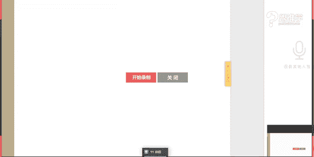
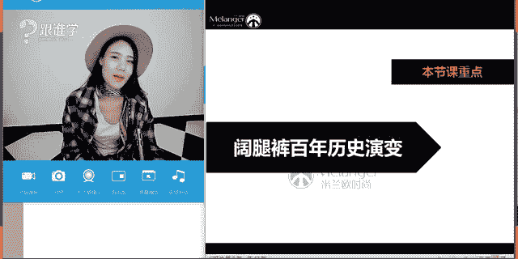

# 服装搭配秘笈之新版36计：29：阔腿裤秘笈

## 概述
在本节课中，我们将学习阔腿裤的穿搭技巧。课程将分为两个主要部分：首先，了解阔腿裤的百年历史演变；其次，掌握阔腿裤的选择与搭配方法。我们将解答关于阔腿裤显胖还是显瘦、小个子能否穿着以及如何搭配平底鞋等常见困惑，并通过简单直白的讲解，让初学者也能轻松掌握。

---

## 阔腿裤的百年历史演变

上一节我们概述了课程内容，本节中我们来看看阔腿裤是如何发展至今的。

阔腿裤的历史可以追溯到大约100年前。在20世纪初，西方女性的典型着装是裙装，并依靠紧身塑身内衣来塑造曲线。直到1920年代，女性的着装才开始发生变化。

这一时期被称为“女男孩”时期。社会背景（如第一次世界大战）要求女性参与工作，繁琐的裙装不再便于活动。可可·香奈儿是推动这一变革的关键人物。她穿着男友的条纹衫和阔腿裤，成为欧洲首位公开穿裤装的女性之一。她以水手服为灵感推出的条纹衫和水手裤，逐渐流行开来。

条纹衫本身源于军装，其经典的21条条纹设计，据说是为了纪念拿破仑时期的21次胜利。

在1920至1930年代，阔腿裤最初是作为泳装的一部分来穿着的，并未成为日常正装。直到1966年，伊夫·圣罗兰设计了著名的“吸烟装”，它以男性晚礼服为灵感，是时装史上经典的中性造型。但此时的裤装剪裁仍偏男性化。

真正的转变发生在1980年代。乔治·阿玛尼在设计阔腿裤时，在保持简约线条的同时，注入了柔美、流畅的女性气息，使其如同人的第二层皮肤。至此，阔腿裤才真正拥有了鲜明的女性特质。

了解服装背后的故事，能让我们更懂得欣赏和搭配它们。

---

## 阔腿裤的选择与搭配

了解了阔腿裤的历史后，本节我们将聚焦于如何选择并搭配阔腿裤。

### 如何选择阔腿裤
选择阔腿裤的第一步，是选对款式。阔腿裤虽形态统一，但在风格、材质、长度和宽度上各有不同。

以下是阔腿裤常见的几种分类：

1.  **基础款**
    *   **特点**：设计简约、线条流畅、无过多装饰。
    *   **建议**：最好选择基础色（如黑、白、灰、卡其、深蓝）。**基础款 + 基础色**的组合最百搭。款式简约是“基础款”，色彩中性是“基础色”，两者结合搭配可能性最广。

2.  **印花图案款**
    *   **特点**：带有花朵、几何等图案。
    *   **风格**：可搭配出嬉皮、度假、优雅等多种风格。花朵图案更显柔美女性化。

3.  **海军款**
    *   **特点**：常有纽扣排列等海军元素。
    *   **风格**：极易搭配出经典的海军风格，清新又干练。

4.  **牛仔款**
    *   **特点**：材质硬挺，风格休闲。
    *   **风格**：可通过搭配呈现知性、帅气、淑女等不同风格。

除了风格，材质也至关重要：

*   **毛呢/西装面料**：挺括有型，适合秋冬。
*   **天鹅绒**：高级但挑人，需谨慎选择。
*   **真丝/雪纺**：飘逸清爽，适合春夏，显得轻盈。
*   **棉麻**：易皱且垂感不佳，容易显胖，建议少选。

裤管的宽度直接影响视觉效果：

*   **过宽**：容易显矮、显邋遢，需谨慎选择。
*   **适中宽度 & 微喇/直筒**：最显高、显瘦，推荐选择。

裤子的长度也需注意：

*   **七分裤**：长度在小腿肚，容易显腿短，最难搭配。
*   **八分/九分裤**：露出脚踝最细处，好搭配。
*   **盖脚面长裤**：能延伸腿部线条，若搭配高跟鞋隐藏鞋跟，显高效果最佳。

### 如何搭配阔腿裤
选好了裤子，接下来看看如何搭配上装和鞋子。

**1. 阔腿裤与上装的搭配**
阔腿裤作为下装，需考虑与内搭和外套的配合。

*   **内搭：毛衣**
    *   **领型**：V领最显脸小脖子长；高领或圆领需搭配清爽发型。
    *   **长度**：建议选择在腰带以上的长度，或将衣角塞进裤子里，以制造高腰线。长毛衣可选侧开叉款式。

*   **内搭：衬衫**
    *   **款式**：白衬衫、设计感衬衫（如荷叶袖、飘带）都是好选择。
    *   **领型**：脖子短或脸大，建议选择敞开穿的法式领或V领，避免复杂领型堆积在颈部。

*   **外套**
    *   **短款夹克/西装**：能自然提高腰线。
    *   **长款大衣**：敞开穿时，内搭一定要塞进裤子或系腰带，以明确腰线比例。

**2. 阔腿裤与鞋履的搭配**

*   **尖头高跟鞋**：最显高、有女人味。
*   **短靴/及踝靴**：适合搭配九分阔腿裤，利落时髦。
*   **绑带鞋/罗马鞋**：增加造型感和时尚度。
*   **平底鞋**：完全可以搭配。秘诀是：**裤腿不能过宽 + 选择高腰款式 + 最好为盖脚面长度**，以保持良好比例。

### 阔腿裤搭配四大黄金法则
无论高矮胖瘦，只要遵循以下四点，就能穿好阔腿裤：

1.  **上身简洁修身**：避免“上宽下宽”，上身合体能平衡下半身的量感。
2.  **制造高腰线**：通过高腰裤、塞衣角、加腰带等方式，拉长下半身比例。
3.  **善用高跟鞋**：能进一步优化身材比例，增强气场。
4.  **贴合臀部曲线**：选择在臀胯部合身、不过分宽松的款式，能保留身体曲线，避免显得臃肿。

只要运用好这四大法则，小个子（如1.55米的时尚博主）或臀腿较丰满的人，都能驾驭好阔腿裤。

### 男士阔腿裤搭配（简要）
阔腿裤并非女性专属，它本就源于男装。现代男士也可尝试，在秀场和街拍中已不鲜见。搭配休闲单品或正装大衣，都能穿出独特的雅痞或文艺风格。选择九分长度更易驾驭。

---

## 总结
本节课我们一起学习了阔腿裤的穿搭秘籍。我们从其百年历史演变入手，理解了这款单品的由来。更重要的是，我们掌握了如何根据风格、材质、宽度和长度来选择阔腿裤，并学习了它与毛衣、衬衫、外套及各种鞋履的搭配技巧。最后，牢记 **“上身简洁、高腰线、高跟鞋、贴合臀胯曲线”** 这四大黄金法则，你就能轻松驾驭阔腿裤，穿出自信与风采。