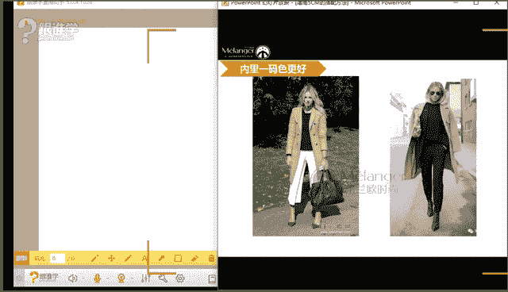
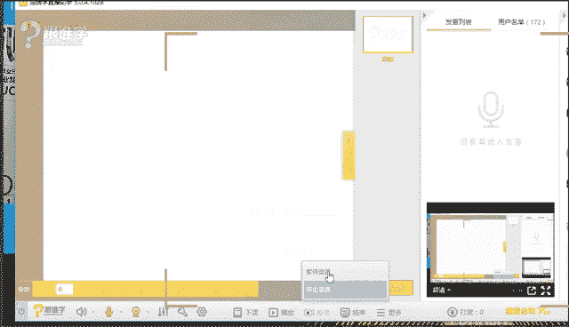
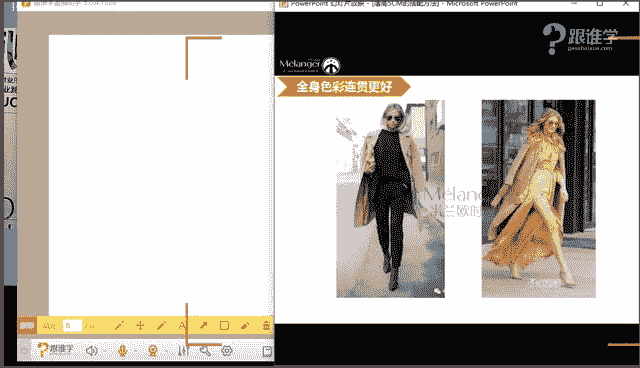
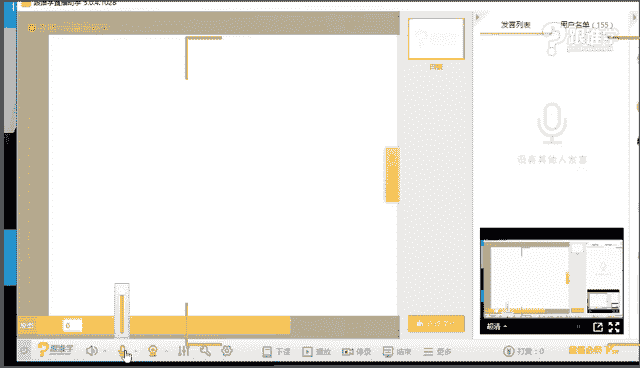
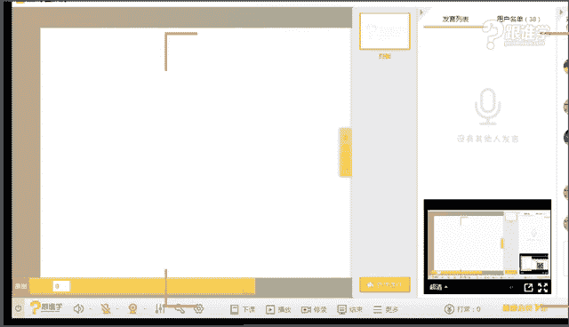

# 服装搭配秘笈之新版36计：1-2：增高5厘米的搭配方法

在本节课中，我们将要学习如何通过服装搭配，在视觉上实现增高5厘米甚至更多的效果。我们将从核心原理出发，介绍四个简单实用的搭配法则，并通过实例演示，让初学者也能轻松掌握。

## 课程概述

许多人都希望自己看起来更高挑。本节课将围绕“视觉线条拉伸”这一核心原理，详细讲解四种具体的服装搭配方法：色彩连贯法、腰线提高法、焦点上移法和鞋履拉长法。掌握这些方法，无需依赖高跟鞋，也能在视觉上有效增加身高。

## 核心原理：视觉线条拉伸

在开始具体方法前，我们首先要理解一个基础的视觉原理。

以下是两个长度完全相同的线条，一个横向，一个纵向。请大家判断哪个线条在视觉上感觉更长？

**视觉对比图示例**

绝大多数人都会觉得纵向的线条更长。这就是人类视觉的直观感受：**纵向线条具有拉长效果，而横向线条具有加宽效果**。

在服装搭配中，这个原理同样适用：
*   **纵向拉伸**：让服装线条向中间集中、向下延伸，能使人显得更高挑。
*   **横向截断**：服装线条向两侧扩张，或在身上形成明显的横向分割，会使人显得更宽、更矮。

我们所有的增高技巧，都基于“创造纵向线条，避免横向截断”这一核心思想。

## 增高四大法则

理解了核心原理后，我们来看看四个具体的实践法则。

### 法则一：色彩连贯法

色彩是制造视觉连贯性最直接的工具。当全身色彩被分割成多个色块时，就会形成横向截断感，显矮；当色彩形成纵向连贯时，则能拉长身形。

以下是三种常见的色彩搭配方式及其效果对比：

1.  **上下装、里外装色彩均不同**：这是显矮效果最明显的方式。例如，白色内搭、黑色外套、蓝色裤子，身上会形成多条明显的横向分割线。
2.  **内搭与下装同色，外套不同色**：这种方式显高效果居中。内搭与裤子同色，形成了内里的纵向线条，但外套与下装的颜色差异仍会形成一条腰部的分割线。
3.  **上下装为同色系，并有渐变感**：这是显高效果最好的方式。全身色调统一或渐变，最大限度地消除了横向截断，形成了流畅的纵向线条。

**核心要点**：对于身高在163cm以下的朋友，建议优先采用第2和第3种方式。身高较高者则可以更自由地尝试第一种方式，但若想极致显高，同色系依然是优选。

**男装示例**：该法则同样适用于男士。一套深色西装（外套、裤子同色）搭配浅色衬衫，就运用了“外深内浅”的色彩连贯法，比上下身颜色对比强烈的搭配更显修长。

> **针对特殊体型**：对于肚子较大的男士，可以采用“外浅内深”的搭配。即外套用浅色显得轻盈，内搭和裤子用深色收缩腹部，同时内搭与裤子同色以形成纵向线条。

上一节我们介绍了通过色彩制造纵向连贯性的方法，接下来我们看看如何通过调整身体比例来显高。

### 法则二：腰线提高法

腰线的位置直接决定了上下身的视觉比例。提高腰线，可以制造“上短下长”的完美比例，从而显高。

*   **利用腰带**：这是最直接的方法。即使在穿着宽松的连衣裙或长外套时，系上一条腰带，明确标出腰线（最好在肚脐以上），能瞬间拉长腿部线条。
*   **选择高腰设计单品**：高腰裙、高腰裤本身就是为提高腰线而设计的。搭配短款上衣或把上衣塞进下装，效果更佳。
*   **服装自带的高腰线**：许多连衣裙、外套在设计时就会收腰，且收腰位置较高。选择这类款式比选择腰线设计模糊或偏下的款式更显高。

> **针对特殊体型**：有小肚子的朋友不必担心无法提高腰线。可以选择裙摆较大的A字裙或伞裙，利用“裙摆越大，对比之下腰越显细”的原理，同时将腰线系在胃部附近（最细的位置），而非腹部。

我们学会了通过色彩和腰线来塑造纵向线条，那么还有没有其他方法可以引导视线，进一步强化增高效果呢？

### 法则三：焦点上移法

人们的视线总会首先落在穿搭的焦点上。将视觉焦点吸引到上半身，尤其是头部和肩颈区域，可以引导视线向上走，从而产生拔高的感觉。

*   **使用醒目的配饰**：佩戴设计感强的耳环、项链、丝巾或帽子。
*   **上衣设计**：选择有图案、亮色、特殊领型（如V领）或肩部设计的上衣。
*   **妆容与发型**：一个精致的妆容或利落的发型也能让视觉重心上移。

例如，一套全身同色的搭配，如果搭配一对夸张的耳环和一顶帽子，其显高效果会比没有任何配饰时更好，因为视线被牢牢锁定在了上半身。

我们已经从色彩、比例和视线引导三个方面学习了显高技巧，最后，我们来看看脚下功夫——鞋子如何为增高助力。

### 法则四：鞋履拉长腿部线条

鞋子是腿部线条的延伸，选对鞋子能让腿“长”出一截。

1.  **高跟鞋优于平底鞋**：高跟鞋能直接增加物理高度，同时绷直脚背，使脚背成为小腿线条的延伸。
2.  **浅口鞋优于绑带鞋**：脚面露肤越多，腿部线条延伸感越强。复杂的脚踝绑带会切割脚踝，显腿短。
3.  **鞋袜裤色彩连贯**：鞋子的颜色尽量与裤子或袜子的颜色接近。例如，穿黑色裤子时配黑色鞋子，穿肤色丝袜时配裸色鞋子。目的是减少脚踝处的色彩分割，保持腿部线条的流畅性。

**核心公式**：**腿部视觉长度 = 实际腿长 + 脚面长度 - 横向分割点**。因此，我们要做的就是增加脚面贡献的长度，并减少横向分割。

> **总结回顾**：这四个法则——**色彩连贯、腰线提高、焦点上移、鞋履拉长**——其本质都是对“纵向线条拉伸，避免横向截断”这一核心原理的应用。在实际搭配中，综合运用多个法则，效果会更显著。

## 现场搭配演示

为了让大家更直观地理解这些法则，我们进行了一个现场搭配改造。

**改造前分析**：模特原本身着色彩分割明显的三件套（内搭、外套、裤子颜色各异），形成了多条横向分割线，且腰线不明确，整体显得不够高挑。

**改造后运用法则**：
1.  **色彩连贯**：选择了复古刺绣连衣裙，本身具有统一的色调和纵向花纹。
2.  **腰线提高**：连衣裙自带高腰线设计，明确了身材比例。
3.  **焦点上移**：搭配了复古小领巾、斜戴的贝雷帽和复古眼镜，将所有视觉焦点集中在上半身和头部。
4.  **鞋履拉长**：搭配了与肤色接近的裸色浅口高跟鞋，延伸了腿部线条。

通过综合运用这些法则，模特的整体造型在视觉上显得更高挑、更精致，风格感也大大增强。

## 课程总结

本节课我们一起学习了通过服装搭配实现视觉增高的核心原理与四大法则：
*   **核心原理**：创造纵向线条，避免横向截断。
*   **四大法则**：
    1.  **色彩连贯法**：利用同色系搭配制造纵向延伸感。
    2.  **腰线提高法**：制造“上短下长”的完美比例。
    3.  **焦点上移法**：利用配饰将视觉重心引导至上半身。
    4.  **鞋履拉长法**：选择能延伸腿部线条的鞋款和颜色。

记住，穿搭的最终目的是了解自己，并通过服装展现更美好的自己。不要畏惧尝试，从这些简单的法则开始，一步步建立自己的穿搭自信吧。