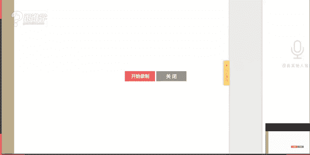
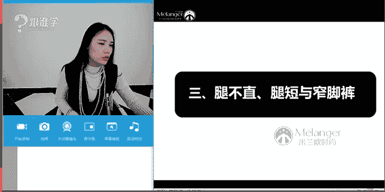
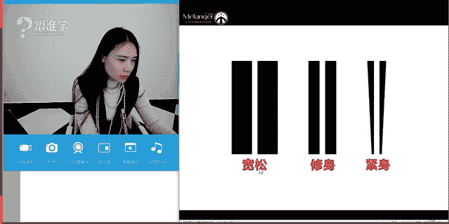
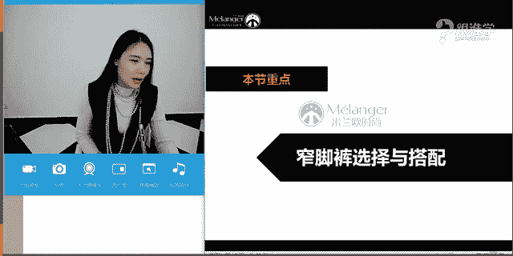
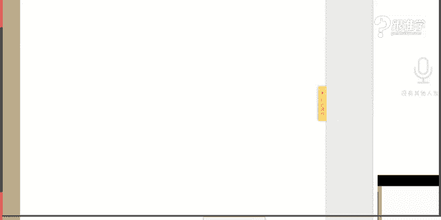

# 服装搭配秘笈之新版36计：1.1：窄脚裤与鞋履搭配



在本节课中，我们将要学习窄脚裤的分类、选择与搭配方法，特别是铅笔裤和烟管裤这两种经典裤型。课程将涵盖如何根据腿型选择裤型，以及如何搭配上装和鞋履，让初学者也能轻松掌握搭配技巧。


## 裤型分类概览

上一节我们介绍了课程主题，本节中我们来看看常见的裤型分类。了解不同裤型是进行有效搭配的基础。

以下是常见的七种裤型：
1.  喇叭裤
2.  直筒裤
3.  阔腿裤
4.  锥形裤
5.  烟管裤
6.  铅笔裤
7.  哈伦裤

其中，**锥形裤、烟管裤、铅笔裤、哈伦裤**都属于窄脚裤的范畴，因为它们都具有从宽到窄的裤型特点。本节课将重点讲解铅笔裤和烟管裤。

## 铅笔裤的前世今生


了解了裤型分类后，本节我们来深入了解铅笔裤。铅笔裤是一种紧身裤型，因外形像铅笔而得名。

铅笔裤最初由男士穿着。在欧洲中世纪文艺复兴时期，男士通过穿着紧身马裤来展示腿部线条，以体现力量和美感。直到20世纪，铅笔裤才逐渐被女士接受并流行起来。现代铅笔裤已成为实用且百搭的单品。

## 烟管裤的特点

上一节我们介绍了铅笔裤，本节中我们来看看另一种重要的窄脚裤——烟管裤。烟管裤是介于直筒裤和铅笔裤之间的裤型。

烟管裤的公式可以描述为：**直筒裤的宽松度 > 烟管裤的宽松度 > 铅笔裤的紧身度**。它包裹臀部但不紧包腿部，裤腿线条笔直，修饰腿型的效果非常好。烟管裤流行于20世纪50年代，通常是中高腰、九分长度，拉链常设计在侧面或背面。

## 窄脚裤的选择与搭配

掌握了两种核心裤型的特点后，本节我们进入实战环节，学习窄脚裤的选择与搭配。这部分内容将分为裤子的选择、鞋履搭配以及上装搭配三个部分。

### 铅笔裤的选择

以下是几种常见的铅笔裤类型及其特点：
*   **黑色基础款**：经典必备，百搭指数高。
*   **铅笔皮裤**：时髦，但皮革光泽感有膨胀效果，对腿型要求高。
*   **牛仔铅笔裤**：百搭单品。腿粗宜选深色；腿细可尝试浅色或磨白款式。
*   **破洞铅笔裤**：流行单品。需注意破洞位置和大小，避免勒出赘肉。
*   **印花铅笔裤**：时尚感强，较挑人。几何印花显帅气，曲线印花显女人味。
*   **白色基础款**：清新百搭，但有膨胀感，腿粗者需谨慎。
*   **彩色/糖果色铅笔裤**：亮眼，但搭配难度较高，考验配色功力。

**核心概念**：影响裤子视觉效果的几个关键因素是 **色彩**、**材质** 和 **图案**。深色收缩，浅色膨胀；哑光材质收缩，光泽材质膨胀；简洁图案收缩，复杂鲜艳图案膨胀。

### 铅笔裤的鞋履搭配

铅笔裤与鞋子的搭配需要注意营造透气感。

在春夏季节，可以搭配单鞋或凉鞋，并微微卷起裤脚，露出脚踝。代码如下所示，这能视觉上显腿长。
```
搭配方案：铅笔裤 + 单鞋/凉鞋 + 卷起裤脚（露出脚踝）
```
在秋冬季节，可以搭配切尔西短靴或运动鞋。切忌将裤脚堆积在鞋面上，会显得邋遢不精神。男士搭配原理相通，常搭配板鞋、工装鞋、切尔西靴或休闲皮鞋。

### 烟管裤的选择与风格搭配

烟管裤是值得投资的单品，选择**白色、蓝色、灰色、黑色**等经典色最为稳妥。它自带简洁、干练、知性的气质。

烟管裤可以通过搭配演绎多种风格：
*   **优雅女人味**：搭配尖头高跟鞋、带有印花、透视或女性化设计的上装。
*   **复古成熟**：搭配复古发型、妆容及展现曲线感的单品。
*   **中性帅气**：搭配西装、夹克等中性化单品。
*   **简约知性**：搭配简洁单品，适合职场。
*   **休闲舒适**：搭配卫衣、毛衣、运动鞋等休闲单品。

### 烟管裤的鞋履搭配

烟管裤（通常为九分长度）在鞋履搭配上非常灵活，几乎可以与各种鞋型搭配，如：
*   短靴
*   凉鞋
*   帆布鞋/运动鞋
*   一字扣袢鞋/玛丽珍鞋
*   平底鞋
需要注意的是，烟管裤不适合搭配靴筒过高（如超过脚踝很多）的靴子，以免造成尴尬的截断感。

### 窄脚裤与上装的搭配


窄脚裤（包括铅笔裤、烟管裤、锥形裤等）与上装的搭配原理是相通的。无论是男士还是女士，都可以运用以下组合：
*   **搭配针织衫**：呈现优雅或学院风。
*   **搭配衬衫**：经典搭配，可休闲可知性。
*   **搭配T恤**：简单休闲，可通过外加马甲或西装增加层次。
*   **搭配西装/外套**：可打造干练通勤或时尚街拍造型。

## 特殊腿型的搭配建议


前面的章节我们学习了通用搭配法则，本节我们针对腿短、腿不直、腿粗等常见问题，提供具体的窄脚裤搭配建议。



### 腿短的选择



腿短的关键在于提高腰线，优化身体比例。应尽量选择**高腰裤**，并将上衣扎进裤子里，以在视觉上拉长下半身线条。

### 腿不直的选择




对于O型腿、X型腿等腿不直的情况，应避免穿着过于紧身的铅笔裤，以免暴露缺点。推荐选择**烟管裤**或**修身直筒裤**，利用笔直的裤管线条来修饰和矫正视觉上的腿型。男士尤其应避免穿着紧身窄脚裤，选择修身款式更为得体。

### 腿粗的搭配

腿粗的搭配主要有两种方法：
1.  **遮盖法**：当穿着紧身铅笔裤时，利用长款上衣、外套或长衫来遮盖大腿和臀部。
2.  **选择烟管裤或直筒裤**：这两种裤型对腿部的包容性更好，既能修饰腿型，又不会紧绷暴露缺点。

## 课程总结



本节课中我们一起学习了窄脚裤的核心知识。我们首先认识了铅笔裤和烟管裤这两种经典裤型及其历史。接着，深入探讨了如何根据色彩、材质和图案选择裤子，并掌握了它们与鞋履、上装的多种搭配方案。最后，针对腿短、腿不直、腿粗等常见体型问题，给出了具体的窄脚裤选择与搭配建议。记住，**烟管裤**是修饰腿型、提升比例的利器，值得大家尝试。