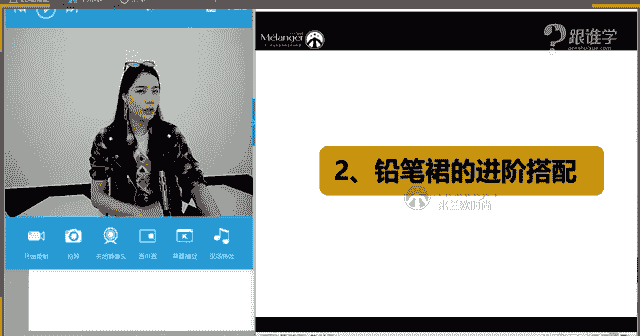

# 服装搭配秘笈之新版36计：1：性感铅笔裙

在本节课中，我们将要学习关于铅笔裙的全面知识，包括它的历史发展、不同款式的特点、以及如何根据个人体型和风格进行选择和搭配。铅笔裙是展现女性魅力的经典单品，掌握其搭配技巧，能让你在各种场合都自信得体。

## 铅笔裙的历史发展

上一节我们介绍了课程概述，本节中我们来看看铅笔裙的百年演变历程。

铅笔裙的发展有非常漫长的时期。它在1910年就已经出现。但当时的形态并非大家现在看到的铅笔裙形态。它的前身叫“蹒跚裙”。从字面上听，你可以感受到它的形象。再看图片中裙装的形态。说到蹒跚裙，它的设计灵感比较有意思。莱特兄弟，也就是飞机的发明者，因为有一位女士在乘坐飞机时，怕她的裙装夹到机器里，就用一根绳把她的裙子给系起来了。这就是蹒跚裙灵感设计的来源。保罗·波烈把蹒跚裙设计出来后，同时风靡了法国街头。当时在法国街头上经常有人听到一声惊呼，然后就看到一个特别时髦的女子摔倒在法国大街上了。因为这种蹒跚裙在行走时非常不便。字面传达的含义就是蹒跚。老人家走路才是蹒跚的步伐。蹒跚裙为什么被人们喜爱？因为它跟中国的旗袍有异曲同工之妙。中国女性穿着旗袍时，身姿也是非常摇曳的。蹒跚裙其实也有这样的感觉。所以那时的女性觉得即使是痛苦的。为什么说痛苦？因为穿着蹒跚裙时，她们在上马车时非常不方便。那时的交通工具就是马车。她们在上马车时其实非常不方便。现在我们在学习女性礼仪姿态时，有一节课程是关于应该如何上车。最简单的从轿车来讲，我们一般都是把门打开，然后右脚进去，钻进去之后就进来了。其实在正确的礼仪标准中，你会发现所有明星名人在坐轿车时，都是先把屁股坐下去，也就是说先把身姿坐到车子里面，再把脚放进来。那时蹒跚裙就是这样的坐姿。其实是非常不便的。可是女性为了爱美可以牺牲很多。那时蹒跚裙就已经出现了，这就是铅笔裙的前身。

我们继续来看铅笔裙什么时候才发展到现在的形态。在二战时期。战争导致物资紧缺，物资紧缺之后导致服装的面料也要变得少。所以在那个时候，铅笔裙的长度和宽度都会有所精简。在用料和面料上都要精简。因为战争物资的缺乏，这是客观原因导致的。直到1947年，迪奥先生设计了我们现在大家见到的铅笔裙，以H廓形为主。也就是说铅笔裙是以弹性的包身的形态。这种铅笔的形状，也就是我们为什么叫它铅笔裙，就是因为它像一个铅笔的形状而得名。这就是一开始迪奥先生设计的铅笔裙形态。可是在二战期间，女性穿着铅笔裙是因为面料缺乏的原因。在二战之后，战争结束之后，女性穿着铅笔裙的最大原因是因为她们也想像男人一样出去工作。而铅笔裙就是既正式又能展现女性美感的裙装，所以被大量穿着。大家可以想象一下，现在在银行、包括空姐等相对来说比较严肃的职场当中，他们的职业着装是不是都以铅笔裙为主？到膝盖位置的铅笔裙是最传统、最正式的裙装。

我们继续来看，在50年代，一些比较经典的款式已经出现了。例如说格子的，包括现在大家了解的鱼尾裙样式，其实在50年代就已经出现了。在50年代，玛丽莲·梦露以及奥黛丽·赫本这两位最经典的女明星，一位走性感路线，一位走优雅路线，他们都分别演绎过铅笔裙的形象。特别是梦露的铅笔裙形象，可以说是让万千男性都心动的荧幕形象。

如果说在20世纪50年代以前，时装的流行趋势都是由上流社会的人群引起的，例如名媛、名人、明星、贵族来带领时尚。而在20世纪50年代之后，也就是60年代、70年代、80年代，平民已经能够掀起时尚风潮。例如朋克风、机车风、摇滚风、嬉皮士都是在60年代、70年代、80年代之后出现的。这时你会发现这些年轻的群体认为铅笔裙会比较老气横秋。因为铅笔裙的形象非常女性化，裙子的长度也给我们感觉不是特别的短，又不性感，又不是特别的个性。所以他们会觉得非常老气。直到80年代，铅笔裙才重新回到人们的视线当中。因为在这个时候，女性特别是想要掀起一阵女性独立自主的风潮。但这个时候的铅笔裙在搭配上会发生一些变化。例如在50年代以前，铅笔裙一般都是非常能够彰显曲线感的形象，上身也是紧身，下身也是紧身。但是大家可以看到，在80年代，铅笔裙的搭配上发生了变化，它会搭配大垫肩，非常能够展示男性化或中性的感觉，要展示女性力量的美感。因为女性要跟男人在社会上确立地位，并非说要跟他们争地位，而是要在社会确立女性也可以有所贡献的地位。这就是20世纪80年代。其实到80年代的时候，铅笔裙的形态基本上就已经确定了，跟现在没有太大的区别了。大家可以看到现在名人的一些演绎，其实有很多名人明星都非常爱铅笔裙这件单品。

以上给大家介绍的就是关于铅笔裙的发展。为什么要介绍铅笔裙的发展？因为从100年的历史发展过程中，它一直都是演绎着非常女性的形象。其实它是一个标签。裙装是最能够彰显女性曲线美的状态。裙装在50年代之前，女性的形象都是以取悦男性为标准。直到50年代之后，女性才开始有了自我想要表达的东西。对于现在来讲，我们非常幸福。因为我们可以想穿什么就穿什么，这都是我们可以自由去做主的，不会像以前封建主义，人们都要裹小脚。在中国的古代，女人都要戴护甲，或者戴那种非常长的护甲，其实都是为了要约束女人的行为。包括戴旗头、穿花盆底，都是为了让女性的姿态变得更加能够让男性觉得有一种美感。例如为什么戴护甲，其实也是约束行为。如果手上戴了护甲，拿杯子肯定是翘兰花指的形态。这种形态就是为了让男人觉得女人这样做时非常优雅。包括戴旗头，大家可以想象一下，如果戴了旗头，走路为了不让旗头掉下来，或者旗头上面还有很多流苏状的碎穗，在清朝的礼仪中，会讲到你走路时两边的穗子不能摆动得太厉害，那就说明头颈颈部必须非常笔直，身姿必须非常笔直。然后走路还不能有太大的动作，所以姿态一定是非常端庄典雅优雅的状态。其实这都是为约束女性的行为。包括花盆底等等，都是为了约束女性的行为。这个话题虽然有点远，但要告诉大家的是，其实我们现在真的非常幸福。

这就是铅笔裙的发展。

## 铅笔裙的选择与搭配

上一节我们回顾了铅笔裙的百年历史，本节中我们来看看如何根据款式和自身特点选择并搭配铅笔裙。

铅笔裙的款式非常多。因为现在的一些品牌、设计师，每个品牌设计师想要传达的理念是不同的。所以虽然铅笔裙很经典，但在每一季它其实都会有特别的一些设计。我们在选择铅笔裙的时候，很多人不知道如何去选。它跟我们的体型也有一定的关系。例如大腿太粗了，就不知道该怎么去选择铅笔裙。我们会在课程中介绍如何去选择铅笔裙，腿粗的、臀部胯部比较大的等等，都有关于这样的搭配与选择。

铅笔裙的款式非常多元化，但最最经典的一个款式是黑色的经典款。就是因为它很经典，同时它也给我们感觉有一点点老气。在平时生活当中，特别是在职场、餐厅、美容机构等，他们的工作服都会以黑色的铅笔裙为主。所以这种感觉是有一点点老气的感觉，因为本身的款式就太过于正式了，长度也是刚刚好在膝盖。裙装的长度有到大腿中间的、有到膝盖的、有到小腿位置的、包括到脚踝位置的。裙装的长度不同，表达的感觉也是不一样的。到膝盖的位置，它属于最传统的位置。为了让这种长度上的保守感觉把它破坏掉，可以在款式上，也就是它的面料上以及它的特别设计上做一些比较特别的选择。

以下是铅笔裙的主要款式分类：

*   **经典黑色款**：最传统、正式，但也容易显得老气，需在搭配上突破。
*   **皮革款**：材质上区别，传递野性、性感、干练、硬朗的感觉。
*   **牛仔款**：毫无疑问，一定是非常年轻以及休闲感为主的。
*   **蕾丝款**：蕾丝也有不同的感受，例如有大花形成的镂空蕾丝感，有的蕾丝给人感觉非常轻薄，有的蕾丝非常精致，有一点小优雅。蕾丝的形状不同，产生的视觉效果也会不一样。
*   **印花款**：印花面料，传递女性元素，且通常是成熟的感觉，带有一定的民族或异域风情。
*   **开叉设计款**：在两边开叉或者是后开叉，增加个性感和性感度，也给女性更多的自由。

以上给大家介绍的这些裙装，你会发现其实它包含了服装当中的色彩、材质、图案以及工艺。铅笔裙会因为细微的变化，在你表达上呈现不同的感觉。例如皮革一定给我们感觉是比较力量感的、硬朗的、性感的感觉。牛仔一定给我们感觉年轻化。经典的黑色一定是成熟的感觉。蕾丝一定给我们感觉是非常女性化的。印花给我们的感觉是比较时尚的，并且这种印花是有民族感的。开叉的也是有个性感的、有女性化的，特别是玫红色传递的印象是妩媚的、女人的，相对来说比较有点小妖气，加上侧开叉给人感觉会更加妩媚性感。

基本上给大家已经介绍了铅笔裙的款式。在这样的板块中，给大家介绍到了因为铅笔裙的色彩、材质、图案、工艺的变化，所以它会产生不同的感觉。你们在搭配和选择的时候，就要清晰你自己想表达什么样的感觉，包括你个人适合什么样的感觉。例如如果一个女性长相特别硬朗，看起来气质比较偏干练，那她一定非常适合皮革版的裙装。如果一个女性长得感觉特别的精致柔美，她穿蕾丝裙装一定没错。印花裙宁静穿着一定会好看，因为这种印花非常的大气、浪漫的感觉。这就是关于裙装，它不同的感觉传递给我们的情绪是不一样的。

## 铅笔裙的具体款式搭配解析

上一节我们了解了铅笔裙的各大款式类别，本节中我们将深入分析每一类款式的具体搭配技巧。

### 1. 黑色经典款铅笔裙

黑色经典的铅笔裙，因为它本身就太过于保守。在选择的时候，可以在搭配上做文章。例如这种款式太过于老气的时候，可以选择特别休闲的以及特别时髦感的T恤。一件白色的T恤，它不是普通的白衬衫，是带有印花、字母以及涂鸦感，这种涂鸦感以及纯棉的面料，会带来休闲的年轻的感觉。再加上佩戴时尚的项链，它传递给我们的感觉是既有女性化的性感感觉，又有休闲感。包括它的项链表现了女性的元素更多，包括它的高跟鞋。有三件单品都在传递女性化元素。经常有同学问到底应该怎么混搭，混搭其实就是你想要表现哪个为主风格，你就要去搭配相应的感觉。例如在这一套当中，我想表现女人味的时候，一定是高跟鞋加这种非常柔美、女性化的曲线感项链，然后头发是侧分的。如果整体展现的都是女性化的感觉，包括裙装的面料的选择是非常紧身的。铅笔裙的面料，一般我们会选择莱卡的面料或者是纯棉的面料，给我们的感觉都会比较有弹性感，不要选择棉麻的或丝绸的，因为不好打理，容易皱。

混搭的技巧非常重要。在一套服装风格当中，如果你搭配了两个不同的元素。搭配这条铅笔裙，它给我们感觉是女性化的，而这件T恤它给我们感觉是休闲运动化的。如果你在搭配这套服装的时候，你首先要想好，我今天去哪，我想要表现什么？例如我今天想要表现女人味儿，我想去一个相对来说有一点点小正式的场合，那么你的上装选择，可能不能选择这件T恤，你可能选择的T恤是简约款的白T，然后配上西装外套，配上这条铅笔裙，然后配上高跟鞋，戴上精致的耳环，拿一个手拿包。这个时候你的整体展现的感觉一定是非常干练的、女性化的、有正式感的。如果你今天想去的是休闲的场合，你想表现的是舒适状态，那你可能是戴棒球帽，穿运动的棒球衫，搭的是运动鞋。那么你的单品的数量很多，你传递出来的信息，就是那个感觉。这就是混搭的技巧。

通过这一套的搭配，大家对铅笔裙是不是已经有了一个新的概念？我们继续来看第二套。第二套你会发现这个模特是怎么演绎黑色铅笔裙的。首先它在色彩上其实没有太大的亮点，因为都是以灰色黑色为主，在生活当中经常穿这些颜色。包包是一个亮点，但还有一个亮点是它的衣服的设计，这种纽扣的设计也非常有设计感，包括它的眼镜的配搭，为它整体增加了很多时髦元素。包括它的高跟鞋是以银色的选择，他没有选择黑色。如果他选择的是黑色，这一套给我们的感觉不会那么的时尚。选择的是银色，银色给我们感觉是非常时尚的，因为它是有未来主义的感觉。

第三套大家可以看到的是，它选择的是一个后开叉的铅笔裙。这种后开叉的铅笔裙，加上绑带式的高跟鞋也是今年特别流行的，再加上它穿着的有点内衣外穿感的高腰短上装，整体传递就是性感的女人的这种感觉。所以说想要把黑色经典的铅笔裙搭配的不那么老气的话，首先可以在款式上做突破。例如选择一些相对来说比较时装款的，比如说休闲的、有特别设计的T恤，包括有点小性感的设计元素的上装来打破本来铅笔裙的老气的感觉。再进行配饰的组合搭配，这是非常重要的。

### 2. 皮革款铅笔裙

皮革刚才其实已经给大家讲过，皮革给我们感觉是性感的、硬朗的。其实皮革的话，它更多是展示野性的、性感的、干练的、硬朗的为主。首先给大家讲的是皮革不要选择过短的裙装。例如有一些女性选择皮裙到大腿，再穿上一双黑丝，而且或者是穿上一双网袜，虽然今年特别流行网袜，但是千万不要用这种皮革配上这种网袜，再穿这么短的裙子。你要是真的走在街上，别人还有晚上要去夜店的感觉。这种着装，它给我们感觉太过于性感化，就是太过于性感了。短的皮革裙装一定要想想怎么去搭配。建议如果你穿这条短的皮革裙的时候，不要搭太过于紧身的服装，因为本身露肤面积比较大，再加上你过于紧身的时候就会给人感觉太过于性感。建议你可以搭配宽松的上装，宽松的毛衣，然后包括卫衣，因为今年其实特别流行oversize的，你可以穿这种大廓形。并且下身不要选择搭配黑丝，你可以直接搭配一双堆袜，然后穿上运动鞋，或者是穿上堆袜之后穿高跟鞋，它也会非常漂亮，而且时尚度好。

第一套的搭配其实不太适用于我们在生活当中的着装，因为这着装给人感觉太过于性感。第二套其实非常的适用。因为这种颜色上来讲，皮革它有很多的颜色，皮革只是一种材质，并不是只有黑色，它可以有暗红色，包括卡其色。卡其色的面料一定会传递一种复古感。可以搭配一些民族感，包括它可以搭配一些比较知性和优雅的感觉。而这种暗红色其实也是比较雅致，同时它是有女人味的。因为红色本身即使是暗红色，它也是从红色加了黑才变成了暗红色，红色一定是一个能够彰显女性美感的色彩，就是女性味儿比较浓重的色彩。包括勃艮第酒红，它一定是给我们感觉非常的雅致的，非常的有品味感的。建议这种打扮在30岁以上的女性穿着，所以它会比较成熟的感觉。这一套模特的展示妙点在于它的包包，包包的图案跟衣服的图案是重复的，这叫同一图案的搭配。有的时候我们都会觉得身上有图案了，是不是应该拿一个相对来说没有那么复杂的、款式简约的包包呢？其实是可以图案搭配图案的。点在于都是星星的图案，这叫同一图案的搭配。在服装的美学课程上来讲，其实我们是有叫同类图案、同一图案、不同类的图案的搭配，这叫同搭配。

第三套是美国名媛奥利维亚，其实这一套搭配不太适用于腰比较粗的、胯比较宽的，因为本身胯就宽，在这个地方加荷叶边的设计，就会显得你胯更宽，所以会比较适合比较瘦的人。这是皮革款的搭配。第一款它会给我们感觉过于比较性感。第二，它给我们感觉是优雅的。第三套它给我们感觉依然也是优雅的女性的形象。

### 3. 牛仔款铅笔裙

牛仔因为它本身就已经是一个非常年轻化的单品。面料因为牛仔是比较年轻的面料，但是把它设计成铅笔裙的款式的时候，它就让这种牛仔的年轻感减弱了。比如说牛仔的A字裙，今年特别流行那种牛仔A字裙里面有一排扣子，那种款式你会觉得好像很年轻化，但是设计成铅笔裙之后，它就会变得女性化了。但在所有的铅笔裙当中，牛仔的面料依然是最年轻的，最年轻，因为它特别的休闲化的感觉。在牛仔的款式当中，如果你想把它搭配得女人味儿的时候，其实你可以把它搭配成有点小性感的这种感觉。

牛仔的经典款，它搭配了一件黑色的上装，其实这个搭配就没有太多的亮点，也就是说它的上装跟它的下装，其实它的时尚感是不够的。所以它在包包上做了这样的一个时尚元素。它用的包包是豹纹。豹纹其实是特别难搭配的单品。例如豹纹的鞋子、豹纹的包包，这种单品相对来说比较难搭配，大众会认为它难搭配。但是其实告诉大家一个诀窍，豹纹的鞋子其实也非常经典，如果你的服装当中基本上都是以暗色为主的，而且款式都是非常简约的，建议你可以买一个豹纹的鞋子，豹纹的鞋子它可以增添你每套服装的时尚度。因为你本身服装的亮点不多，那豹纹就成了你整套装的亮点。但是不建议豹纹大面积去穿着，包括豹纹的皮衣，建议以后少买那种大面积的豹纹，因为穿不好的话，如果你的那件皮衣的质感还是非常好的，有的豹纹看起来质感会非常不好，包括豹纹大面积去使用的时候，它总会有一种太过于野性的感觉，穿不好会给人感觉非常俗气。其实建议小面积去使用也是非常棒的，就是用在配饰上鞋子。第一套的服装，它的豹纹其实是整套服装的亮点。这种搭配方式，建议同学们也可以经常去使用。比如说你的整套服装当中没有亮点的时候，你就使用一个亮色去搭配，或者是说使用一个有设计感的包包去搭配。比如说今年特别流行那种刺绣的宽背带的包包，包括包包上面有很多的刺绣，那个其实如果你穿着服装非常简约的时候，你背一个那个包就足够抓眼力了，就很吸睛。

牛仔上衣加牛仔裙装，这一套的话其实非常时尚。这种牛仔上衣跟牛仔下装的搭配的话，没有几个人，其实生活当中很少有人会这样搭配，因为很多人会觉得牛仔上装跟牛仔下装去搭配的时候，好像太过于统一，没有时尚感了。其实牛仔搭配的时候一样也可以把它搭配得好看。但是建议这一套服装还可以加一条小丝巾，例如在脖子位置加一条那种小小的细的丝巾，就是以前很土气，但是其实今年特别流行，然后再配一顶牛仔帽，看起来就是一个西部牛仔女郎的感觉了，风格化就会非常明显了。如果不想系在脖子上，有同学觉得脖子短不太适合戴在这儿，那就可以系在手腕上，或者可以把它系在腰间，都是一个亮点。

第三套今年特别流行的这种破洞的牛仔，设计师已经把它运用到牛仔裙里面，这种牛仔裙给人感觉做了破坏感的牛仔裙，它其实是非常时髦，而且我认为非常性感。如果在搭配的时候，有一个诀窍是：如果你的下装是非常性感的时候，那么你的上装就保守起来。你看到这条牛仔裙，它是不是款式比较保守？所以它的领口比较低。包括这一件其实它是上面也开叉，下面也开叉了。下面它是做了性感的设计，它上面就做的比较保守。这种上下开叉，因为奥利维亚的胸部不是非常丰满，所以她敢这样穿，如果一个胸部非常丰满的女性这样去穿着的时候，你会觉得很俗气，因为太过于暴露，太过于性感。因为它上面也开叉，下面也开叉，它给我们展现的感觉是过于性感的时候，尺度把握不好，我们就觉得俗气了。破洞牛仔裙还是非常性感的。

### 4. 蕾丝款铅笔裙

如果说铅笔裙是非常性感的一件单品，那蕾丝的铅笔裙其实是更加能够展现女性魅力的单品了。当然蕾丝它也会有不同的丝的花朵图案，所以它呈现出来的感觉也会不一样。你会发现这个蕾丝它是属于大片的花朵组成的，它会感觉特别的大女人的感觉。而这一件你会发现它是小清新的感觉，它的花这种感觉是比较碎的，就是比较缝隙也很小，它看起来是比较碎的花朵，那么它给人感觉是清新感。这个明星在搭配的时候，它是搭配了一身白色的蕾丝配了一个小野花，你会觉得好像有一种度假感。这一套裙装会更加适合度假的感觉，郊游的感觉，非常的清新，海边也可以这样搭配。

这一套其实它是在做混搭。你会发现蕾丝因为它本身就是非常女性化的，所以如果中性的女生或者长得比较硬朗的女生，你想把自己变得有女人味儿，又想要这种硬朗的一面的时候，就建议这样的搭配方法。如果一个人他长相特别硬朗，那他上身的服装其实应该是直线条的服装，就是偏直线感的服装，更加符合他这种直线感的轮廓。那么他的裙装，他的下半身选择的是这种蕾丝的柔美的裙装，运用到下半身。那它其实是远离你的脸部的，所以它不会有对你有太大的影响。可以这么理解，适合你的放在上半身，不适合你的放到下半身。或者说相对来说没有适合你那么适合你的放到下半身，这种搭配的方法就非常适合一些感觉很硬朗的人，又想变得女性化就很适合。同样的道理，长得特别的女性化的人，他想硬朗一点，那他是不是就反过来，上半身穿蕾丝，下半身穿皮裙，一样能够达到这种又有硬朗的感觉又帅气，叫“娘man平衡”。

第三套非常适合去约会，白色配粉色，它给我们的感觉是非常清新感的，男生应该都喜欢这样的配色关系。从场合出发的话，其实第二套会更加适合度假感觉的。第一个它其实偏欧美，说明大家现在的审美都比较偏欧美了。第三个它其实虽然非常女性化，但是它款式非常简约。

在这张内容中，给大家讲到的一个知识点是关于，例如说你想要把自己打扮得女性化的时候，你就可以加入蕾丝的元素。那么如果你长相是比较硬朗的感觉，偏直线感的，那你可以上身穿硬朗的，下身穿柔美的单品。那么如果你长得是比较柔美的，那你就上身蕾丝，下身穿皮革的感觉，就比较能够适合你个人的气质了。

### 5. 开叉设计款铅笔裙

铅笔裙开叉设计，其实也是在50年代左右就已经有了这样的设计。它会在两边开叉或者是后开叉，因为这种两边开叉以及后开叉，它会给女性更多的自由。以前没有开叉的裙装，走路还是相对来说太过于拘谨的感觉。虽然很爱铅笔裙，但有一条铅笔裙就很少会穿，因为那条铅笔裙它是后面开叉的，但是只开了一点点缝隙。每次穿那种铅笔裙的时候，感觉言行举止都会受到约束。所以不太喜欢太过于受约束，开叉设计其实给我们感觉会更加的自由感。但是开叉的不同位置，它给我们呈现的感觉也会不一样。现在有侧开叉、侧开叉、后开叉、前开叉。你们认为哪一个最性感？认为侧开叉性感的人，你们都属于闷骚型的。这种侧开叉它是隐隐约约的暴露，然后你会觉得一点点小小的性感，好像不是那么赤裸裸的性感的感觉。后开叉因为它开叉度非常的小，而且它在后面我们基本上看不到。前开叉其实它给我们的感觉会比较的性感。但是侧开叉的设计，它会比较的有个性感。侧开叉其实是比较有个性感的。因为人的传统面和个性面一般往往是在侧面或者是背面设计的时候，你会发现所有的服装如果是侧面设计、背面设计的时候，它会给人感觉会更加的个性感。而如果在正面的时候，其实它没有那么个性。例如我们的衣服，我们一般都是前开襟，如果有一件衣服是从侧面打开的，比如说有侧面拉链的，你会觉得这种就给人感觉是个性的。

今年建议大家可以买侧开叉，但是这个侧开叉上面有绑带，很流行。因为今年特别流行运动风，这种侧开叉本身的铅笔裙带有侧开叉的时候，它是结合了时尚运动感，既有女人味，又有运动感。所以那种裙装它其实又性感，然后又有运动的这种感觉，其实非常好看。开叉的前后侧它呈现给我们的感觉的不同，当然它在搭配的时候，搭配的一些元素也会影响到你最后搭配的效果，也会影响到我们的视觉感。例如这一件衣服它其实搭配的就没有太多的，从背面看，因为看不到它正面感觉，其实相对来说是有一定的时尚度的。因为它本身这件衣服的黑白拼色，再加上印花的感觉设计，再加上它穿上工字背心，它其实是有点小性感的，然后又有点休闲，又有点时装感，叫时尚休闲的造型。这个运动感比较强烈，运动加上性感的元素在。这个就是有点小性感，因为本身红色其实就是女性化的代表，再加上开叉，包括绑带的设计，其实它是传递了一种女性的性感的味道。最后一套泰勒的这样的一套感觉，泰勒因为它本身的气质偏甜美，所以你会发现它的裙装选择的都是小碎花，它不喜欢选就是这种小小的图案、小小的格子，它不太适用于太过于大的感觉。第二套它给我们感觉比较符合当下人的需求，因为又舒适，然后又好看。

### 6. 印花款铅笔裙

印花其实之前跟大家讲过，印花它有分不同的感觉。例如第一套和第三套叫自然类的图案。这个是属于大自然的花鸟鱼虫，都是属于大自然当中的。这种蛇纹的感觉，它其实是属于虫类，也就是叫自然类的感觉。而这种格子它是属于叫人工化的图案。自然界当中没有那么特别工整的东西，所以它都是属于叫人工化的。自然类的图案，它给我们传递的，一定相对来说其实都是有点自然感，例如相对来说它也会柔和一些。格子、条纹，它都给我们感觉是比较硬朗的。而这一套给我们感觉相对来说柔和。这一套野性就是有野性的女性的美感，因为裙子中的蛇纹，蛇也是来自于动物身上的，而且它是有攻击力的动物，所以它给我们感觉是有野性感的，包括豹纹、蛇纹、鳄鱼纹，你会发现这种带有攻击性动物的图案，它看起来都会有野性的美感。花花草草看起来就会非常柔美。今年非常流行刺绣，所以每个人看起来都很柔美，包括男生都变得柔美起来了。印花的话，大家可以想象一下，如果你是一个长得比较柔美的，那么建议你可以选择相对来说比较柔和的图案，以花、然后柔和的写意的感觉。这种它相对来说特别适合给到长得比较硬朗的人去穿着，包括这种搭配手法也是性感，有机车皮衣的搭配，看起来有红唇的配搭，既性感，然后又有硬朗的感觉。这一套其实是相对来说比较休闲的状态。第三套有点小野性。

以上是关于所有铅笔裙款式的搭配问题。铅笔裙有多少款式？第一个叫黑色的经典款。建议黑色经典款，大家可以打破不要再选择过于保守的单品，要选择个性和时尚的一些单品。第二个就是皮革，皮革它给我们感觉是非常性感的，包括硬朗的感觉，所以大家可以这个根据自己的个人气质去选择。第三个是牛仔款，牛仔它给我们感觉是休闲的感觉。第四个是蕾丝款，蕾丝它给我们比较女性化的感觉。第五个开叉款式，开叉款式它给我们感觉也会比较个性时尚，然后性感。还有印花的款式。以上是给大家介绍的几种铅笔裙的款式，以及它们的配搭。

## 铅笔裙的进阶搭配与体型解决方案

上一节我们详细拆解了各类铅笔裙的搭配方法，本节中我们将探索铅笔裙的更多风格可能，并解决不同体型的穿着难题。

### 铅笔裙的风格演绎

刚才我们一直反复强调铅笔裙是有性感的感觉在的。铅笔裙就只能搭配性感了吗？它不能传递其他的感觉了吗？当然可以。其实刚才我们已经大概给大家介绍到，比如说铅笔裙，它可以搭配一些休闲的感觉，它也可以搭配一些柔美的感觉。我们来看一下它还能搭配哪种感觉。比如运动感跟运动卫衣去搭配，搭配运动鞋。包括帅气感，帅气是因为它跟牛仔夹克的搭配，包括这一套的单品的格子，因为铅笔裙的格子硬朗的感觉，再配上牛仔外套，所以它整身传递会比较硬朗感，所以它会有种帅气感。包括第三套淑女的感觉，这种有点一字肩小淑女的感觉。最后一套优雅感，这一套其实非常有50年代复古的感觉，它看起来有点像梦露的感觉，虽然它的身材没有那么性感，但是它是带有那个50年代的味道，复古的包头巾的造型，还有点像赫本在50年代中的感觉。所以说铅笔裙它不只是只能驾驭性感的风格，它也可以运动、帅气、淑女和优雅，只是看我们要怎么去搭配。

### 铅笔裙与上装的搭配组合

我们来看一下铅笔裙与上装的搭配。第一个就是铅笔裙加休闲T恤。刚才在黑色铅笔裙中跟大家介绍到，本身黑色的单品太过于老气，所以加休闲款式的时候，就能够缓解它过于老气的感觉，把年龄感降下来。休闲T恤其实也有很多款式，大家可以根据自己的这件铅笔裙来做一些搭配的组合。例如这件单品搭配的简单的白衬衫，为什么要搭配这么简单的白衬衫？因为这条裙子，它的bling bling的感觉，裙子已经非常有特色了，所以它的上装尽量选择简约的款式来衬托这件裙子，因为这件裙子是主角。这件裙子非常吸睛，所以它的上装的款式选择的相对来说是比较简约的。第二套为什么选择这一件单品？上衣有红色的元素可以呼应颜色对比，印花突出风格感，上衣降低成熟度，朋克风格降低色彩纯度，印花。红色可以跟裙装去呼应，这是第一点。第二点就是上衣降低成熟度没错，因为这条裙子太过于成熟了，而且它是红色的，上衣选择一件朋克的单品，因为这件朋克的休闲T恤它会中和掉过于成熟和女性化的感觉。而且朋克是非常年轻的风格，我们经常都会说每个人心里都住了一个朋克，因为朋克其实心里代表的是一种叛逆感，而这种叛逆感是青少年群体身上会出现的风格，这种风格单品会中和掉红色紧身铅笔裙的成熟度。包括撞色也有，身上的黄色的字母形成了小面积的撞色，跟红色形成了撞色关系。红黄蓝是色彩的三原色，红色和黄色的配搭关系也会非常漂亮，但是要谨慎选择大面积的碰撞，因为大面积碰撞就变成麦当劳叔叔了，所以小面积的配搭是非常好的。第三套再来解析一下为什么会选择这件上衣。下装比较华丽，裙装太女人。这件衣服跟第二套的原理非常相像，下装的面料华丽感非常强，所以选择了相对来说比较简约的质朴的纯棉单品来跟它做呼应。而且因为裙给人感觉太过于女人，所以选择运动休闲感的单品来搭配，这一套叫时尚运动的搭配方法。上下色彩呼应，银色有未来感，上下色彩呼应，统一的贯穿色彩的感觉会拉伸一个人的比例显高。全身同色拉长，材质对比，鞋子制造焦点，鞋子跟眼镜的边框呼应，跟口红色彩是呼应的。上衣颜色跟下装色彩属于同色系，下装有亮片，所以上衣选择比较简单的。混搭，直曲结合，直线型人，色彩呼应，前襟上面的字母和包包呼应。上装跟下装是属于同色，它会有显高和显瘦的作用。上装跟下装的材质区分，下装太过于华丽，上身选择普通的面料，让整身不要太过于隆重，风格也会年轻化，减弱成熟感和女性化的感觉。从整身的色彩上来分析，鞋子的眼镜边框和口红的颜色是呼应的，眼镜的镜片与包包、字母、手上的珠串是呼应的。手表以及饰品，与裙子的亮点是呼应的。没有无缘无故出现在身上的任何一件单品，所有身上出现的单品都形成了连贯性，跟身上的服装都有关系。我们在穿衣服的时候，也要让你身上所有的单品跟你身上的服装都形成关系。

休闲T恤加铅笔裙。我们来看衬衫加铅笔裙，衬衫加铅笔裙。衬衫有很多款式，比如说丝绸感的、格子的、牛仔的衬衫，都可以跟铅笔裙做搭配。刚才都属于我们讲到的，简单的跟复杂的、复杂的跟简约的，这件也是属于牛仔的搭配。其实这个牛仔它就比奥利维亚穿的那个牛仔来的性感，所以身材其实非常性感的，所以会觉得这种感觉有点太过于饱满了。奥利维亚的感觉是属于有点优雅的，又有点休闲的感觉。但是这种感觉，男人应该会比较喜欢。

卫衣加铅笔裙。刚才我们讲到了T恤和衬衫，其实卫衣也依然跟铅笔裙可以做搭配，而且今年特别流行卫衣。但是卫衣跟铅笔裙做搭配的时候有一个问题，卫衣太厚了，太厚的卫衣把它塞到裙装中的时候，就会显得腰特别的粗。所以在选择卫衣的时候，要么就选择薄一点的款式，要么就选择底下有可以调整的，或者可以塞一个边角到铅笔裙中，要不然会显得比例会很不好。这就是关于卫衣加铅笔裙搭配时会有这样的问题。而且这种卫衣如果给T形体型的人穿的话，其实会有一些难调整，因为T型本身上身就宽松，铅笔裙又比较窄。

针织衫加铅笔裙，套头针织衫加铅笔裙的话，针织衫有不同的感觉。针织衫是非常温暖的单品，非常柔和的单品，所以搭配任何单品时都会有一种温柔感，搭配铅笔裙都会有一种温柔的感觉。当然针织会有不同的针织，有精致和细腻的针织，包括粗棒针的针织。粗棒针的针织就是那种肌理感看起来特别粗犷的感觉，针棒织特别大的感觉。那种针织看上去会更加休闲感，而这种精致一些的细腻一些的，细腻感会有成熟度。所以如果想要成熟感的人就选择细腻的，如果想要年轻感，就选择粗犷感的。

吊带加铅笔裙的搭配。吊带加铅笔裙比较适用于夏天，但是现在应该怎么去搭配？例如衬衫外面套这种吊带可不可以搭配？也是现在比较流行的搭配方法，就是用背心款搭配在衬衫，或者是里面穿高领毛衫，外面搭配背心款，其实现在这个季节就可以穿了。在夏天的话也可以穿，铅笔裙配吊带的感觉，是有比较性感的感觉，非常的女人。所有的搭配他们都在使用整合的原理，也就是色彩整合。红色黑色、红色黑色，其实它都在做一个反复交替。搭配方法就是这里，有的人可能是这样搭配的，不是说要相互呼应吗？黑色加红色，然后红色加黑色，那样看起来绝对没有这样看起来和谐，因为它是有秩序感的。黑色、红色、黑色、红色，是有叫反复交替的原理在的，所以看上去更加的有美感，这就是在搭配中的美学原理。

露肤短上衣加铅笔裙。这种搭配方法比较适用于小个子的人。小个子如果想要显高的话，就一定要用短上衣加高腰铅笔裙，它会非常适用比较娇小的女生。如果比较娇小的一些女生可以使用这样的搭配方法，而且同色有显高和显瘦的作用。包括开叉就叫线条拉伸，她也会显高显瘦。如果接受不了太过于短，可以选择把上衣塞到裙装当中，把上衣塞到裙装中，可以选择高腰，这种款式会显高，矮个子就会非常适用了。奥利维亚、杜玛他们都会经常这样穿着。

oversize上衣加铅笔裙。这种会特别的舒适感。铅笔裙的长度其实也有一些变化。铅笔裙的话，一般也会在膝盖上方位置、膝盖下方位置、小腿肚位置，基本上到这个位置就差不多了，这就是铅笔裙，而且它的形状是属于笔直的H版型。如果它外扩了，它就变成伞裙了，或者它特别飘逸的话，它也变成那种大的及踝裙装了，就不是铅笔形状了。铅笔裙的形状一般就是以直线条下来的。这种是今年比较流行的搭配方法，它给我们感觉会比较舒适，休闲感会比较重。但是如果想要搭配oversize上装，一定要穿高跟鞋，如果不穿高跟鞋，看起来比例会不好。所以如果选择这种搭配方法，一定要穿高跟鞋。

短装外套加铅笔裙，它也是显高和显瘦的搭配方法。但是这种高饱和度的单品，尽量少选择。当然如果皮肤非常白皙，包括想要尝试一些鲜艳的颜色，可以买一些，不建议衣橱中太多高饱和度的单品，因为太过于高饱和度的色彩单品，从搭配角度、人的驾驭能力、包括质感上看起来没有那么强烈。可以买低饱和度，比如说颜色特别暗沉的绿色，或者说比较浅的绿色，太过于鲜艳的绿色建议少去购买一些，不要太多，不要一打开衣橱跟彩虹似的、调色盘似的。短外套加铅笔裙的搭法，也是显高和显瘦，包括因为它也是属于短装加下面的长装的比例，高腰系都会显高和显瘦。特别是第一套从外到内、从上到下都是同色系的感觉。

长款外套加铅笔裙，长款外套的内搭依然都是选择了短款。这是万年真理，高腰线是万能的。所以一定要短装，选择衣服的时候，要么就是把内搭塞到裙装当中，它会让你显高显瘦，比例在这里就不做强调了，外套的搭配，西装等等都可以去搭配。

在整套搭配中，这几套搭配全都是非常休闲的。建议个子比较娇小的，如果身材比例不是特别好，少穿这种搭配方法。第一，穿平底鞋的时候，臀部的线条，再加上包臀裙，它能够把你的臀位线勾勒出来，再加上穿了平底鞋之后，看起来比例就没有那么好。

以上讲到的是关于铅笔裙与上装的搭配。上装当中你会发现几乎所有的上装都可以搭配，比如说T恤、衬衫、短外套、毛衣等等，脸上所有内上装类内搭类的单品都可以跟铅笔裙组合搭配。我们只需要遵守一点，就是一定要上装短下装长，也就是说使用高腰线的原理，这样的话会提升你的比例问题，能够显高和显瘦。

### 铅笔裙与体态细节的搭配

我们再来看一下铅笔裙跟体态细节的搭配关系。基本上体态