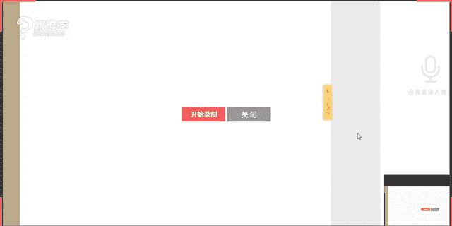
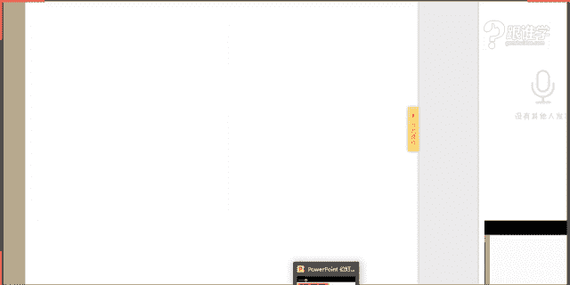
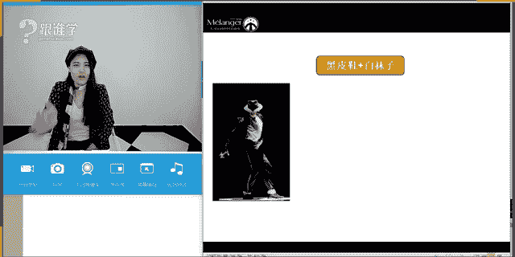

# 服装搭配秘笈之新版36计：32：裤装与鞋履搭配全攻略

在本节课中，我们将要学习裤装与鞋履的搭配法则，包括当下流行的单品组合、袜子作为“第三者”的巧妙运用，以及通过细节处理实现显高效果的实用技巧。

---

## 一、裤装与鞋履的时尚搭配

上一节我们介绍了课程的整体框架，本节中我们来看看当下流行的裤装与鞋履如何搭配。

### 1. 热门裤装单品解析

以下是今年流行的几种裤装款式及其风格特点：

*   **破洞牛仔裤**：核心风格为**朋克风**，其设计理念源于“破坏性”的叛逆精神。大腿较粗者适合选择破洞较小、轻微透肉的款式，利用视错觉营造轻盈感。
*   **毛边牛仔裤**：流行焦点在裤脚处的毛边工艺。这类单品流行周期较短，建议适量购入。
*   **运动裤（校服裤）**：侧边带有条纹或字母装饰，充满复古校园感。可与板鞋搭配，打造时尚运动风。
*   **喇叭裤**：本季流行的喇叭裤多为七分或九分长度，露出脚踝，不同于70年代的超长款式，是复古元素的新演绎。
*   **阔腿裤**：具有解放女性着装的历史意义。现代阔腿裤更注重柔美线条与飘逸面料。搭配时需注意裤脚与鞋子的衔接。

### 2. 裤装与鞋履的组合示范

不同的裤装需要搭配相应风格的鞋履，以下是几种常见组合：

*   **阔腿裤**：可搭配运动鞋、短靴或一字带高跟鞋。关键点是**裤脚与鞋面需无缝衔接**，避免堆积。小个子女生应选择高腰、合体直筒版型，慎搭平底鞋。
*   **喇叭裤**：适合搭配板鞋、夹脚拖鞋、系带凉鞋或及踝靴。
*   **运动裤**：与板鞋是天生一对。若搭配短靴，应选择及踝款式，避免裤脚盖住靴筒。
*   **牛仔裤（毛边/破洞）**：可搭配运动鞋、及踝靴或高跟凉鞋。

### 3. 关键“第三者”：袜子的搭配艺术

袜子是连接裤子与鞋子的重要元素，能极大丰富造型层次。

**网袜的时尚逆袭**
网袜曾被认为俗气，但通过正确搭配可以变得高级。**搭配原则**是：**用中性或运动单品中和其性感度，并小面积使用**。
*   **搭配建议**：
    *   **破洞牛仔裤 + 网袜**：是当前热门组合。可选择中格纹密度，娇小身材者更合适。
    *   **运动鞋/高跟鞋/皮鞋 + 网袜**：选择密集格纹的短袜，能增加视觉层次感。
*   **避雷指南**：避免与极短、极紧或皮革材质的裙装/裤装搭配，以免产生低俗感。

**其他流行袜款**
*   **袜子 + 凉鞋**：可通过袜子色彩与服装呼应。今季流行几何图案袜或透明刺绣袜。
*   **运动袜 + 运动鞋**：带有螺旋条纹的中筒袜能强化运动风格，搭配帆布鞋或板鞋。
*   **袜子 + 牛津鞋**：强化学院风格。搭配复古配色（如酒红、墨绿）袜子，可增添复古雅痞感。

**男士袜搭指南**
*   **正式西装**：搭配**深色长袜**与正装皮鞋，确保坐下时不露腿肤。**黑皮鞋配白袜子**是禁忌。
*   **休闲西裤/牛仔裤**：可尝试**彩色袜子**搭配布洛克鞋或乐福鞋，打造雅痞风。
*   **休闲裤/短裤**：搭配短袜与运动鞋、休闲鞋或短靴。

---

## 二、显高搭配技巧

上一节我们探讨了时尚单品组合，本节中我们来看看如何通过搭配技巧优化身材比例，达到显高目的。

### 1. 鞋裤同色延伸法
**裤子、袜子、鞋子采用同色或相近色**，能在视觉上形成连贯的线条，拉长腿部比例。对比色搭配则会产生分割感，显腿短。
> **公式**：视觉延伸感 = 同色系 (裤子 + 袜子 + 鞋子)

### 2. 裤腿高于靴口法则
裤脚在靴口处堆积会显得邋遢且压身高。应将裤腿卷起或直接选择九分裤，**确保裤脚高于靴口**，露出最细的脚踝部分，显得利落且轻盈。

### 3. 鞋履拉长腿部线条
选择合适的鞋款对显高至关重要。
*   **高跟优于平跟**：尤其对腿部线条不够纤细者。
*   **无绊带优于有绊带**：脚踝处的横向绊带会产生切割感。若喜欢绊带鞋，可选择**纵向交叉绑带**或**裸色一字带**，以减少视觉断层。
*   **终极显高利器**：**裸色无绊带高跟鞋**。因其与肤色融为一体，能将脚部长度计入腿长。

---

## 三、卷裤脚实用攻略

卷裤脚不仅能避免裤脚堆积，露出脚踝显瘦，本身也是一种时尚装饰。其方法需根据裤型和鞋款调整。

### 1. 根据裤型决定卷法
*   **紧身裤**：卷边应**薄而整齐**，通常1-2层即可。
*   **宽松裤**：可卷得**稍厚**，并可尝试**不规则卷边**，更显个性。

### 2. 根据鞋款决定宽窄
*   **鞋子存在感强**（设计醒目、颜色鲜艳）：裤脚可以**卷得稍宽**。
*   **鞋子存在感弱**（设计简约、颜色低调）：裤脚应**卷得窄而精致**。

### 3. 常见组合示例
*   **单折卷边 + 尖头高跟鞋**：薄薄一层即可，保持清爽女人味。
*   **双折卷边 + 系带凉鞋**：若鞋子设计简约，裤脚可卷得复杂些；若鞋子本身设计繁琐，裤脚则应卷得平整整齐。
*   **双折细卷 + 乐福鞋**：卷边宽度不宜过宽，以窄卷为佳，更显时髦。

---

本节课中我们一起学习了裤装与鞋履的整套搭配逻辑：从识别流行单品并正确组合，到巧妙运用袜子增添层次，最后通过**鞋裤同色、裤脚管理、鞋款选择**三大技巧优化身高比例，并掌握了实用的卷裤脚方法。记住，搭配的精髓在于对细节的关注和整体比例的把握。