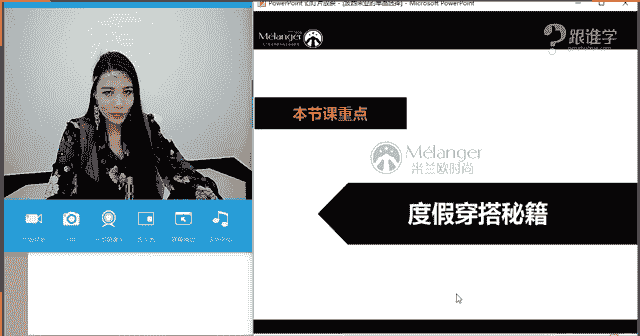
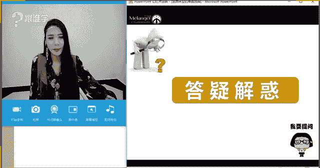
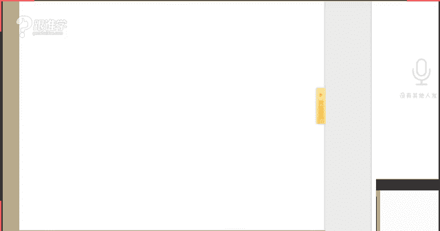
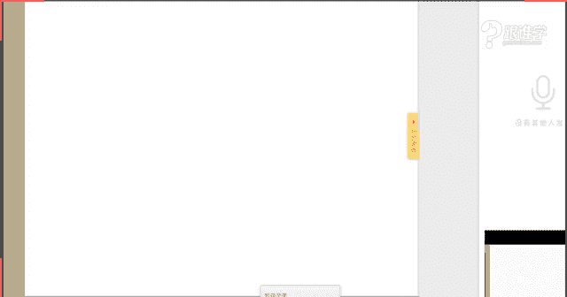

# 服装搭配秘笈之新版36计：33 波西米亚单品 🌟

在本节课中，我们将要学习波西米亚风格的核心概念、历史渊源以及如何通过单品选择和搭配技巧，打造出充满异域风情与浪漫气息的波西米亚造型。课程内容将分为两大板块：波西米亚风格的单品选择与度假穿搭秘籍。

---

## 波西米亚风格概述

波西米亚风格源于中欧捷克布拉格地区，与历史上以游牧生活为主的吉普赛人密切相关。这种风格并非刻意制造，而是源于其自由、浪漫、甚至略带颓废的生活状态。它传递的核心感受是**柔美、浪漫、女性化**，并带有浓郁的民族与自然气息。

在都市生活中，波西米亚风格常与度假、休闲场景关联，给人一种神秘、自由、逃离日常的愉悦感。

---

## 经典波西米亚风格解析

上一节我们介绍了波西米亚风格的起源与核心感受，本节中我们来看看构成经典波西米亚风格的具体元素。我们可以从服装构成的几个核心维度来分析：廓形、色彩、材质、图案与配饰。

### 廓形：柔美与浪漫感

波西米亚风格的廓形强调女性化元素，以柔美、飘逸的线条为主。

以下是波西米亚风格中常见的廓形特点：
*   **大裙摆/飘逸长裙**：营造轻盈、浪漫的视觉效果。
*   **层叠波浪感裙装**：增加造型的层次感和动态美。
*   **收腰设计**：明确腰线，强化女性曲线。**收腰长裙**是波西米亚的经典代表。

**注意**：波西米亚与嬉皮士风格有区别。波西米亚更**柔美、女性化**；而嬉皮士风格则更**硬朗、中性、叛逆**。裙装是波西米亚的标志性单品。

### 色彩：自然与低饱和度

经典的波西米亚色彩通常取自大自然，明度较低，带有一种“做旧”或质朴的感觉。

*   **常见色系**：棕色系、大地色、芥末黄、砖红色等。
*   **色彩特点**：多为**着色**（即加入了灰色调），色彩饱和度低，看起来复古、耐脏，富有自然与异域风情。
*   **现代演变**：现代波西米亚风格也融入了更鲜艳或更高明度的色彩，但经典款仍以低饱和度色彩为主。

### 材质：天然与手工感

波西米亚风格偏爱天然、质朴或有手工感的材质。

以下是波西米亚风格中常用的材质：
*   **棉麻**：最经典，贴近自然，舒适透气。
*   **蕾丝**：增添柔美、浪漫的女性化气息。
*   **麂皮**：带有粗犷肌理感，能增加造型的质感与民族风。
*   **编织材质**（如草编、绳编）：常用于包包、皮带、帽子等配饰，建议**小面积使用**，以免造型过于厚重。
*   **珠绣与亮片**：指带有民族风手工感的珠绣和亮片，而非夜店风格的闪片，能体现艺术感和精致度。

### 图案：民族与异域风情

图案是强化波西米亚风格的关键。

*   **民族印花**：波斯图案、非洲风情、中东纹样、中国扎染等带有民族特色的印花。
*   **扎染工艺**：色彩不均匀，有独特的渐变和纹理，每件都是独一无二的。

### 配饰：风格的点睛之笔

配饰在波西米亚造型中至关重要，能极大地强化风格。

**鞋履**
*   罗马绑带凉鞋/靴
*   麂皮短靴/长靴
*   编织坡跟鞋
*   夹脚凉拖

**包包**
*   手工编织包
*   流苏包
*   珠片刺绣包
*   粗犷皮革包

**首饰及其他**
*   羽毛耳环/项链
*   多层珠串
*   编织手链/头绳
*   藏银、绿松石等民族风饰品
*   宽檐草帽/麂皮帽

### 妆容与发型：慵懒与颓废感

*   **妆容**：常用**大地色系**眼影，可画**小烟熏妆**，营造颓废、神秘感。脸上贴片或使用**汉娜纹身贴**也能增强民族风。
*   **发型**：追求**慵懒、自然、略带凌乱**的效果，如波浪长发、松散辫子，避免过于精致整齐的发型。

---

## 现代波西米亚风格

上一节我们深入了解了经典波西米亚的构成元素，本节中我们来看看它的现代演变。现代波西米亚在保留核心精神的基础上，在色彩、材质和搭配上更加多元化。

*   **色彩更丰富**：不再局限于低饱和度色，黑白、霓虹色等鲜艳色彩也被运用。
*   **品质感提升**：出现了“波波族”（BoBo）风格，即高学历、高收入群体追求精神自由，其波西米亚着装更注重面料质感、设计感和奢华元素的融入（如皮草、精致珠宝）。
*   **廓形与元素不变**：柔美、浪漫、女性化的廓形，以及流苏、荷叶边、编织等核心元素依然被保留。

---

## 波西米亚风格搭配实操

掌握了波西米亚的单品元素后，我们来看看如何将它们组合搭配。

### 波西米亚裙装的搭配公式

波西米亚长裙是核心单品，可以通过搭配不同配饰变换风格。

**1. 波西米亚裙装 + 宽檐帽**
*   **搭配逻辑**：实用性与风格感的结合。帽子既能遮阳，又能强化度假浪漫风情。选择草编或麂皮材质帽子最佳。

**2. 波西米亚裙装 + 各类鞋履**
*   **罗马绑带靴**：增加民族感和造型感。
*   **麂皮长靴**：适合春秋季节，增添硬朗质感，可与裙装的柔美平衡。
*   **一字带凉鞋/人字拖**：适合夏季，营造轻松度假感。
*   **搭配建议**：娇小女生可选择短款A字裙搭配带跟靴子；成熟女性可选择开叉、低胸设计的长裙展现风情。

**3. 波西米亚裙装 + 流苏包/民族感配饰**
*   **搭配逻辑**：利用配饰集中强化风格。流苏包、珠串项链、多层手链、粗腰带等都是不错的选择。

### 混搭技巧：让波西米亚更日常

波西米亚风格也可以与日常单品混搭，降低夸张度，增加时尚感。

*   **+ 皮衣/牛仔夹克**：用皮衣的硬朗中和裙装的柔美，形成风格碰撞，是常见的时尚混搭手法。
*   **+ 运动卫衣**：用休闲感单品混搭，打造更年轻、个性的造型。
*   **搭配要点**：混搭时，仍需保留部分波西米亚核心配饰（如民族风耳环、靴子、帽子）来点明风格。

---

## 度假穿搭秘籍：泳装与体型搭配

波西米亚常让人联想到度假，而度假离不开泳装。选择适合自己体型的泳装至关重要。

### 泳装款式分类

*   **裙摆式**、**平角式**、**分体式（比基尼）**、**高腰式**、**连体式**。

### 根据体型选择泳装

**X型体型（沙漏型）**
*   **特点**：肩臀宽度相近，腰细。
*   **适合**：尽情展现曲线。**分体式比基尼**、**收腰连体泳衣**。
*   **避免**：平角泳裤（易显腿粗）、丁字裤（可能不协调）。

**H型体型（矩形）**
*   **特点**：肩、腰、臀宽度接近，腰线不明显。
*   **适合**：创造曲线感。选择**腰部有镂空、拼色、褶皱设计**的泳衣，视觉上收腰。
*   **避免**：毫无腰线设计的直筒款式。

**A型体型（梨形）**
*   **特点**：肩窄臀宽。
*   **适合**：**上繁下简**。上身选择有设计感、图案、一字肩等款式；下身选择简约、深色款式。
*   **避免**：下身装饰复杂或平角短裤（会放大臀部）。

**T型体型（倒三角）**
*   **特点**：肩宽臀窄。
*   **适合**：**上简下繁**。上身选择简约、深V款式；下身可选择有图案、荷叶边等装饰的款式。
*   **避免**：上身装饰过多或肩部设计夸张。

**O型体型（苹果形）**
*   **特点**：腹部脂肪较多。
*   **适合**：**连体式泳衣**，有效遮盖腹部。选择腹部有褶皱或深色拼接的款式。
*   **避免**：分体式泳装（暴露腹部）。

---

## 男士度假穿搭建议

男士度假穿搭以简约、舒适为主。
*   **上装**：蓝白条纹T恤（海军风）、简约纯色背心、印花衬衫（适合气质柔和的男士）。
*   **下装**：百慕大短裤、棉麻短裤。
*   **配饰**：巴拿马草帽、棒球帽等。

---

## 总结与答疑

本节课中我们一起学习了波西米亚风格的完整体系。我们从其历史起源入手，解析了经典波西米亚在**廓形、色彩、材质、图案、配饰及妆发**上的特点，并了解了它的现代演变。接着，我们掌握了波西米亚单品的**搭配公式**和**混搭技巧**。最后，延伸学习了**度假场景下的泳装选择**，根据不同体型给出了针对性建议。

**核心回顾**：
1.  **波西米亚核心**：柔美、浪漫、女性化、民族感、慵懒颓废。
2.  **搭配关键**：**大裙摆+收腰设计**是标志；**配饰**（羽毛、流苏、珠串、编织品）是灵魂。
3.  **体型匹配**：无论波西米亚还是泳装，选择适合自己体型的款式是变美的第一步。

希望本教程能帮助你理解并驾驭波西米亚风格，打造出属于自己的独特浪漫造型。