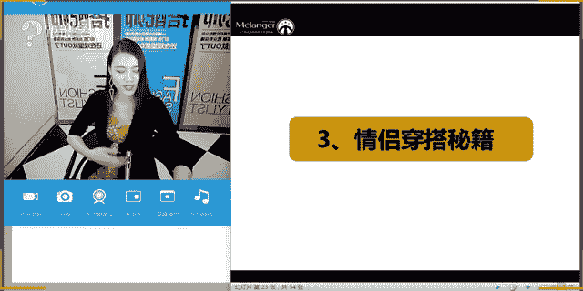
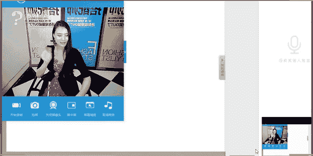

# 服装搭配秘笈之新版36计：34：海滩情侣度假

在本节课中，我们将要学习关于海滩度假的服装搭配知识，特别是情侣出行的穿搭技巧。课程将涵盖度假着装的常见误区、不同度假地的风格选择、情侣装的搭配法则，以及实用的度假单品推荐和拍照技巧。

---

## 一、度假服装搭配秘籍

上一节我们介绍了波西米亚风格，本节中我们来看看更具体的度假穿搭知识。首先，我们需要明确一个核心概念：着装需考虑场合。在休闲场合（如度假）中，我们可以更自由地表达自我。

### 1. 度假着装纠错穿搭

以下是度假时常见的四个穿搭误区，了解并避免它们能让你的旅行体验更舒适、造型更出众。

1.  **误区一：无论去哪都穿高跟鞋。**
    高跟鞋虽能提升气质，但在需要大量行走的度假场景中会带来不便，影响自己与他人的游玩体验。建议携带一双以备特殊场合（如派对），但日常活动以舒适平底鞋为主。

2.  **误区二：户外一身冲锋衣万事大吉。**
    冲锋衣属于功能性运动装，适合登山、徒步等专业活动。在一般的海滩、野餐等休闲度假场景中，穿着冲锋衣会显得过于严肃且与环境格格不入，应选择更具休闲感的服装。

3.  **误区三：演绎异域风情只知道鲜艳撞色。**
    提到民族风，很多人只想到大红大绿的鲜艳撞色。实际上，不同地区的民族风情各异（如日本的和风、斯里兰卡的纱丽），应根据旅行地的文化特色选择服装，而非一味追求鲜艳配色。

4.  **误区四：阳光沙滩就等于飘逸长裙。**
    印花长裙、宽檐帽和太阳镜已成为海滩度假的“标配三件套”。若想脱颖而出，可以尝试更多元化的单品组合，例如衬衫裙、阔腿裤等，避免造型单一。

### 2. 度假地与服装风格

着装风格应与度假地的氛围相契合。以下是不同度假地对应的服装风格示例：

*   **海岛风**：可分为唯美沙滩型（色彩明亮柔和、面料轻盈）和悬崖礁石型（色彩偏暗沉、带有些许民族或忧郁感）。
*   **民族风**：如日本的禅意和服、尼泊尔的绚丽服饰、泰国的传统服装等。出行前可了解当地特色，适当融入穿搭。
*   **其他风格**：还包括复古风（如欧洲乡村）、清新风（如北海道）、休闲风等。

### 3. 情侣穿搭秘籍

情侣装绝非穿得一模一样。高级的搭配在于默契与呼应，而非简单的复制。

以下是四种实用的情侣穿搭法则：

1.  **法则一：色彩呼应。**
    选择对方服装中的某个颜色作为自己搭配的主色或点缀色。例如，女士的比基尼颜色与男士的短裤颜色相呼应。

2.  **法则二：色彩对比。**
    运用对比色（如蓝与黄、紫与黄）进行搭配，能营造出视觉冲击力强、丰富有趣的造型效果。

3.  **法则三：图案呼应。**
    双方选择同类图案的单品，如一方穿条纹，另一方穿格纹（同属几何图案）；或一方穿花卉印花，另一方穿树叶图案（同属自然图案）。

4.  **法则四：同一风格。**
    双方穿着不同单品，但共同演绎同一种风格，如西部牛仔风、波西米亚风或航海风。

---

## 二、度假拍照技巧

除了穿得美，拍得美也是度假的重要环节。掌握一些简单技巧，能让旅行照片更具质感。

以下是几个实用的拍照小技巧：

1.  **戴上墨镜，不看镜头。**
    墨镜是绝佳的造型道具。不看镜头时，可以尝试侧脸、低头或仰望等多角度姿势，营造自然随性的感觉。

2.  **只拍背影，留下遐想空间。**
    背影照能营造神秘感和故事感。可以搭配有特色的帽子、露背装或奔跑甩发的动态，让画面更生动。

3.  **留意脚下的风景。**
    不要只拍人像特写。将镜头对准脚下的沙滩、落叶或特色地砖，并将人物的脚步融入其中，能拍出别有韵味的场景照。

4.  **善用手中的道具。**
    利用冰淇淋、饮料、当地特色美食甚至一朵花作为道具进行特写拍摄，能让照片更具生活气息和趣味性。

---

## 三、度假单品选择

根据不同的度假场景和风格，选择合适的单品是打造完美造型的基础。

### 1. 女士单品推荐

*   **上装**：条纹衫、一字肩上衣（如荷叶边、V领款式）、各式背心（包括流行的胸衣式背心）。
*   **下装**：牛仔短裤、阔腿裤、飘逸半身裙、灯笼裤（选择雪纺、丝绸等轻薄面料）。
*   **连衣裙**：印花长裙、围裹裙、小白裙（极其百搭，适合海边）。
*   **配饰**：
    *   **包包**：编织包、流苏休闲包、斜挎包、帆布包（容量大，实用）。
    *   **鞋履**：凉鞋、拖鞋（非居家款）、运动鞋、一脚蹬、罗马鞋。
    *   **其他**：丝巾（可作头巾、披肩、腰带）、墨镜（根据脸型选择）、帽子（宽檐帽、巴拿马帽等）。

### 2. 男士单品推荐

男士单品选择相对较少，更需注重细节和搭配。

*   **上装**：棉麻衬衫、牛仔衬衫、白T恤、条纹T恤、Polo衫、针织衫。
*   **下装**：百慕大短裤、印花沙滩裤、棉麻休闲长裤。
*   **配饰**：人字拖、时装感拖鞋、帽子（可与女士同款）、墨镜。

---

本节课中我们一起学习了海滩度假的完整穿搭体系。我们从纠正常见误区开始，明确了着装需与度假地风格相符的原则，并深入探讨了高级情侣装的四种搭配法则。此外，我们还分享了让旅行照片更出彩的实用拍照技巧，并列举了男女度假单品的选购清单。希望这些知识能帮助你未来打造出既舒适又时尚、充满默契感的完美度假造型。