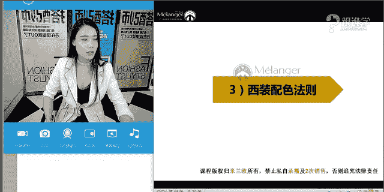

# 服装搭配秘笈之新版36计：1：36时尚西装

## 概述
在本节课中，我们将要学习关于西装这一核心单品的知识。课程将涵盖西装的历史演变、版型分类、穿着细节以及如何通过搭配技巧，将传统的西装穿出时尚感。无论你是职场新人还是希望提升日常着装品味，本教程都将为你提供清晰、实用的指导。

---

## 西装为何是必备单品
西装被认为是每个人步入社会后的必备单品，它已成为全球的职业着装标准。本节我们将探讨西装如何从古典时装演变为代表个人社会地位的重要服饰，并理解其在日常穿着中可能遇到的“过于正式”或“不够时尚”等困惑。

西装之所以必备，源于它对体型的绝佳修饰作用、对视觉中心的强化装饰能力，以及其所代表的社会地位与专业感。

---

## 西装对体型的修饰作用
上一节我们介绍了西装的重要性，本节中我们来看看西装如何具体修饰人的体型。好的西装是修饰体型的最佳单品。

以下是西装修饰体型的三个关键部位：

1.  **塑造胸肌力量感**：高品质的西装在前胸部位通常采用多层构造，并可能加入弹力面料，以塑造出饱满、挺括的胸部轮廓，增强男性的力量感。
2.  **增强肩部厚实感**：通过垫肩或挺括的肩部设计，西装可以有效修饰肩部过窄或溜肩的问题，塑造出理想的T型或倒三角体型，让人看起来更精神、更有安全感。
3.  **塑造腰部线条**：西装通过收腰设计能够明确腰线位置。特别是对于微胖或腹部较大的体型，定制西装时提高腰线（从肋骨处开始收腰）能有效在视觉上显瘦。

---

## 西装的视觉与社会功能
刚才我们了解了西装对体型的修饰，接下来我们探讨西装在视觉聚焦和社会角色中的功能。

1.  **强化与装饰视觉中心**：西装与衬衫、领带共同构成的V区（头面部至胸部以上），形成了一个视觉倒三角，能将他人的注意力集中于此，让人看起来更有精神、更具变化和美感。相比之下，完全包裹的中山装则显得较为沉闷。
2.  **表现社会地位**：西装的发展与贵族和职业文化紧密相连。穿着西装能带来庄重感和权威感，是职场和专业场合的着装规范。一个能将西装穿得得体的男人，通常被认为具有良好的事业心和生活品味。

---

## 西装的发展与分类
我们已经了解了西装的功能，现在让我们追溯其源头，认识西装的不同类型。西装的发展大致经历了四个阶段。

以下是西装发展的主要阶段与款式分类：

*   **古典主义阶段**：现代西装三件套（外套、马甲、西裤）的雏形，源于路易十四时期的外套“鸠斯特科尔”、略短的“贝斯特”（马甲前身）以及紧身半截裤“克尤罗特”。
*   **礼服阶段**：在维多利亚时期，贵族们在晚宴后为舒适而换上的“拉翁基夹克”成为现代休闲西装的起源。同时，正式的礼服体系开始完善。
*   **标准套装阶段**：形成接近现代日常穿着的标准西装套装，成为职业装的主流。
*   **休闲西装阶段**：西装款式、面料、色彩更加多元化，融入更多休闲与时尚元素。

根据使用场合，西装主要分为以下几类：

*   **燕尾服**：夜间第一大礼服，用于极其隆重的晚宴。枪驳头、真丝缎面、前短后长是其标志。
    *   **公式/代码描述**：`场合 = “极隆重晚宴”；特点 = [“枪驳头”， “缎面领”， “前短后长”]`
*   **晨礼服**：日间正式礼服，与燕尾服区别在于前片设计多出两片，且通常搭配领带而非领结。
*   **吸烟装**：源于贵族吸烟室便服，青果领、丝绒或缎面是其特点，现已成为一种时尚款式。
*   **黑色套装**：最常见的正式商务西装，有单排扣与双排扣之分，色彩以黑、深蓝为主。
*   **商务休闲西装**：款式、面料、色彩更多样化，常采用明线、贴袋等休闲设计，适合半正式场合。

---

## 西装的版型分类
认识了西装的种类后，我们来看看不同国家文化影响下的西装版型。选择合适的版型对穿着效果至关重要。

以下是四种主要的西装版型：

1.  **英式版型**：强调修身与礼仪，呈现明显的X型线条，收腰明显，适合身材较为纤瘦的南方男士。
2.  **意式版型**：肩部稍宽，整体呈T型或Y型，风格雄壮、硬朗，适合身材高大的北方男士。
3.  **美式版型**：追求舒适自由，多为宽松的H型或O型版型，不开衩或开衩方式简单。
4.  **日式版型**：基于亚洲人身形改良，版型相对宽松，且通常**不开衩**。这是因为其版型已预留足够活动量，且适合身高普遍不高的亚洲人群体态。

> **核心概念**：**开衩目的**是为了方便活动。日式西装因版型宽松，故常省略开衩设计。

---

## 西装穿搭必知的7个细节
了解了西装的版型后，要穿好西装，尤其是男士，必须关注以下七个合身细节。这些细节决定了西装是“穿衣服”还是“驾驭衣服”。

以下是七个必须检查的合身细节：

1.  **确认肩部**：合身的肩线应恰好落在肩骨末端，前后无多余褶皱。过小会产生横向褶皱，过大则肩部塌陷无形。
2.  **衬衫与西装领高度**：衬衫领应始终高于西装领，标准高出约1-2.5厘米。这不仅是礼仪，也能约束姿态，使人不自觉地挺直。
3.  **胸部周围是否合体**：扣上纽扣后，胸部应平整无拉扯褶皱。一个简单的衡量方法是：扣好后，能在胸口与西装之间轻松插入一个拳头。
4.  **袖子长度**：西装袖长应刚好到手腕骨凸起处。同时，衬衫袖口应露出西装袖口1-1.5厘米。
5.  **上衣长度**：标准西装下摆应盖住臀部80%以上，或与虎口、裆部齐平。过短显时尚但不够正式，过长则显拖沓。
6.  **臀部与裤腿线条**：选择西裤时，应以臀部和腿部合身为首要标准，腰部可通过修改调整。从后侧拉起裤腿，裤腿与腿之间应有2-3厘米的宽松度。
7.  **裤子长度**：标准长度是前裤脚盖住鞋面，后裤脚在鞋跟上方轻微堆积。如今流行更短的九分长度以显时尚。

---

## 时尚西装搭配秘籍：单品选择与搭配
掌握了合身细节后，我们就可以学习如何将西装穿出时尚感。核心秘诀在于**打破正式感**。本节将从单品重组开始。

**打破正式化：拆分与重组**
传统的三件套（同色同质西装、马甲、西裤）最为正式。要打破这种正式感，可以尝试“两件同色同质”搭配法：
*   西装与马甲同色同质，搭配不同色/质的西裤。
*   西装与西裤同色同质，搭配不同色/质的马甲。
*   马甲与西裤同色同质，搭配不同色/质的西装。

**调整比例与细节**
即使穿着成套西装，也可以通过细节调整增加时尚度：
*   敞开西装穿着。
*   将西装袖子**向上拉起**（而非卷起），露出手腕。
*   将裤脚挽起，露出脚踝。

**更换内搭单品**
将正式的内搭衬衫替换为休闲感单品，是瞬间降低正式感的最有效方法：
*   **西装 + 针织套头衫 + 衬衫**：叠穿增加层次感与柔和度。肌理感强的粗针织更显年轻。
*   **西装 + 针织开衫 + 衬衫**：开衫形成的V领能修饰脸型与颈脖，适合脖子较短或脸大的男士。
*   **西装 + T恤**：用白T、黑T或条纹T代替衬衫，立即注入休闲与年轻活力。注意鞋履等配饰需与T恤保持风格共性（如运动鞋配T恤）。

**更换下装单品**
将正式的西裤替换为其他时尚下装：
*   **男士**：可搭配牛仔裤、九分休闲裤、短裤等。确保鞋履与新的下装有风格呼应。
*   **女士**：选择更为广泛，可搭配紧身/破洞牛仔裤、阔腿裤、皮裙、流苏裙、短款包裙或连衣裙。用中性西装搭配柔美裙装，是经典的混搭手法。

**更换鞋履**
鞋履是决定风格走向的关键：
*   将正式的系带皮鞋（牛津鞋、德比鞋）换成休闲鞋，如运动鞋、乐福鞋、帆船鞋等。
*   同样需遵循“共性原则”：休闲鞋应与身上其他休闲单品（如T恤、牛仔裤）风格呼应。

**巧用配饰**
男士可用配饰在V区打造亮点，彰显品味：
*   口袋巾、领带、领针、眼镜、手表、帽子、围巾等都是提升时尚度的利器。
*   搭配时，可运用色彩呼应或图案同属性（如条纹配格纹）等法则。

---

## 时尚西装搭配秘籍：不同风格派系演绎
除了单品搭配，整体风格的塑造也能让西装穿搭更具个性。以下是几种常见的西装风格派系。

以下是几种经典的西装穿搭风格派系：

*   **绅士大叔派**：风格成熟、稳重，充满男人味，适合五官大气、气质成熟的男士。
*   **经典英伦绅士派**：风格精致、合身、严谨，用色偏保守暗沉，适合身材纤瘦、气质秀气的男士。
*   **英伦复古学院风**：带有稚嫩感和书卷气，常用单品包括圆框眼镜、针织衫、徽章西装、百褶裙、牛津鞋及中筒袜等。
*   **新潮色彩时尚派**：敢于运用高饱和度鲜艳色彩，极具视觉冲击力。更适合五官立体、肤色白皙或通过化妆增强面部对比度的人驾驭。
*   **吸烟装派系（女士）**：源于伊夫·圣罗兰为女性设计的西装，风格帅气、利落、性感。通常收腰明显，裤装合体，可搭配高跟鞋，也可真空穿着，展现强大气场。

---

## 时尚西装搭配秘籍：配色法则
最后，我们学习让西装造型更出彩的配色法则。正确的色彩搭配能极大提升时尚感与高级感。

**经典配色方案**
*   **蓝白配**：海军蓝西装搭配白色内搭或下装，经典、清爽且极具美感。
*   **儒雅灰**：灰色西装自带低调儒雅感，可搭配黑、白或不同明度的灰色，通过色差拉开层次。

**深浅搭配法则**
*   **上浅下深**：视觉重心下沉，显得稳重、保守、端庄。
*   **上深下浅**：视觉重心上移，打破传统，更显年轻、活泼与时尚。

**西装与下装的色彩搭配（拆套穿时）**
*   黑、灰、深蓝等经典色西装，可互相搭配，或与卡其色、浅灰色裤子组合。
*   **注意**：黑色西装尽量避免搭配深蓝色裤子，因色差过小显得沉闷。
*   棕色系西装（休闲感强）与蓝色、卡其色、灰色搭配都很出彩。

**西装与鞋履的色彩搭配**
*   **规律**：西装色彩越深，搭配的鞋色也应越深；西装色彩越浅，可搭配的鞋色范围越浅。
*   **百搭鞋色**：黑色皮鞋最为正式百搭；棕色皮鞋休闲感强，适用场景广，但避免在非常正式的场合搭配黑色西装。
*   **搭配示例**：深色西装配黑色或深棕色鞋；浅灰色西装可配棕色、深棕甚至白色鞋。

---

## 总结
本节课中，我们一起深入学习了关于西装的全方位知识。

我们从**西装的历史演变与分类**入手，理解了其从礼服到职业装再到休闲装的发展脉络。接着，我们分析了西装的**四大版型**（英、意、美、日）及其适合的身材。

穿好西装的基础在于**七个合身细节**，从肩线、衣长到袖长、裤长，每一处都影响着最终效果。

而将西装穿出时尚感的核心在于**打破正式感**。我们学习了通过**拆分套装、更换内搭（如T恤、针织衫）、替换下装（如牛仔裤）、改换鞋履（如运动鞋）以及运用配饰**等一系列方法来达成这一目标。同时，了解不同的**风格派系**（如绅士、学院、新潮）和实用的**配色法则**（如蓝白配、深浅对比），能帮助我们更系统地构建自己的西装穿搭风格。

希望本教程能帮助你重新认识西装，并自信地将其融入日常穿搭，展现出独特而时尚的个人魅力。