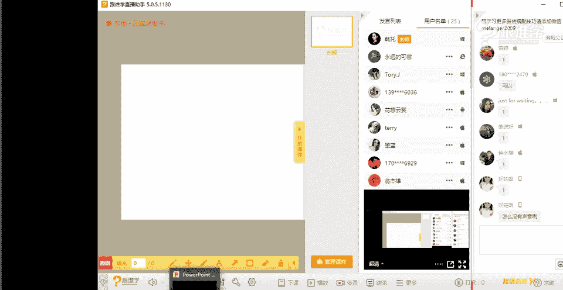
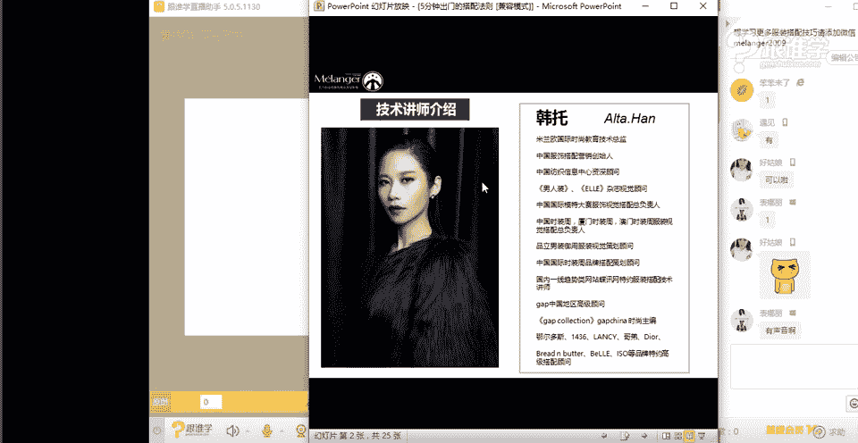
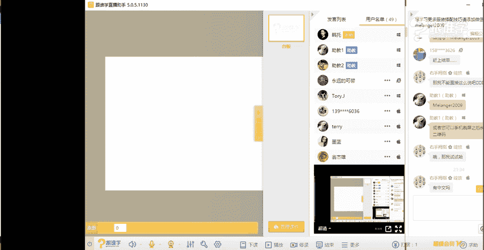
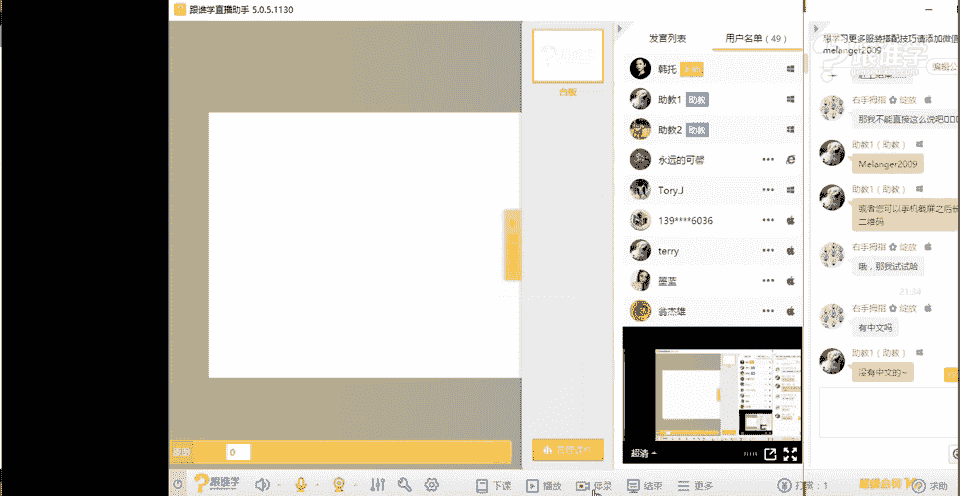

# 服装搭配秘笈之新版36计：1.3 五分钟出门的搭配法则

## 概述
在本节课中，我们将学习如何在五分钟内快速完成出门搭配。课程将剖析导致出门拖延的常见问题，并提供一套系统性的解决方案，帮助你高效规划衣橱，实现快速、得体的日常穿搭。

---

## 衣橱的常见困扰与核心问题
上一节我们介绍了搭配的基本概念，本节中我们来看看阻碍我们快速出门的核心问题是什么。许多人在早晨面对衣橱时感到困扰，主要原因可以归纳为以下几点。

以下是导致出门选择困难的三个核心问题：

1.  **衣橱混乱，缺乏规划**：衣服很多，但排列杂乱，难以快速找到所需单品。
2.  **服装与场合不匹配**：衣橱中的服装无法覆盖日常所需的各种场合（如职场、社交、休闲），导致在特定场合无衣可穿。
3.  **单品搭配性差**：许多衣服是冲动购买的流行款或重复单品，缺乏百搭性，难以与其他衣物组合。

---

## 高效衣橱的规划法则
了解了问题所在，接下来我们学习如何规划一个高效的衣橱。一个合理的衣橱是快速搭配的基础。

### 1. 上下装比例合理化
衣橱中上下装的数量需要保持合理比例。因为视觉焦点通常集中在上半身，频繁更换上装比更换下装更能给人带来“焕然一新”的感觉。

**核心公式**：`上装数量 : 下装数量 = 3:1 至 5:1`

这意味着，至少需要3到5件上装来搭配1件下装（裤子或裙子）。如果你的比例接近1:1，甚至下装多于上装，就需要进行调整。

### 2. 确保单品具有多搭性
衣橱中的单品应尽可能具备与其他单品搭配的潜力。这意味着需要平衡经典款与流行款的比例。

*   **经典款**：指设计简约、无明显时代印记、不易过时的单品。例如：白衬衫、基本款西装、风衣、牛仔裤、小黑裙。**建议在经典款上投入更多预算**，因为它们使用率高、寿命长。
*   **流行款**：指包含当季流行元素（如特殊袖型、图案、面料）的单品。它们容易出彩，但也容易过时。**建议将流行款的比例控制在较低水平**，作为点缀即可。

一个健康的衣橱结构应是经典款为主，流行款为辅。

### 3. 按场合规划服装
根据你生活中最常出现的场合（如通勤、约会、休闲），将衣橱分区规划。确保每个场合都有足够且合适的服装选择，避免“衣服很多，但正经场合没得穿”的窘境。

---

## 核心搭配技巧演示：一件白衬衫的多种可能
掌握了衣橱规划法则后，我们通过实际演示来看看如何运用单品。下面以最常见的**白衬衫**为例，展示如何通过搭配技巧，在5分钟内变换出适应不同场合的造型。

以下是两位老师演示的四套搭配方案：

1.  **职场时尚风**（资宇老师演示）
    *   **搭配组合**：白衬衫 + 不对称设计西装 + 黑色皮裙 + 珍珠项链 + 黑色礼帽。
    *   **技巧解析**：运用“时尚假珠宝”概念，用珍珠项链和礼帽软化西装的硬朗感，融入香奈儿式的中性优雅，适合时尚职场。

2.  **复古嬉皮风**（韩托老师演示）
    *   **搭配组合**：白衬衫 + 流苏马甲 + 民族风项链 + 发带 + 复古墨镜。
    *   **技巧解析**：通过具有民族感的配饰（流苏、项链、发带）改变衬衫的基础气质，打造自由、个性的嬉皮风格，适合音乐节等休闲场合。

3.  **简约时髦风**（资宇老师演示）
    *   **搭配组合**：黑色高领打底 + 白衬衫（作为外套敞开穿）+ 长款白色马甲 + 金色细腰带 + 金色耳环。
    *   **技巧解析**：运用“叠穿”技巧，增加层次感。金色配饰作为点睛之笔，提升整体时髦度。腰带的位置可以调节，适应不同腰型。

4.  **青春俏皮风**（韩托老师演示）
    *   **搭配组合**：白衬衫 + 印花牛仔外套 + 贝雷帽 + 彩色塑料耳环。
    *   **技巧解析**：选用色彩活泼、带有趣味图案的牛仔外套，搭配减龄的贝雷帽和彩色耳环，瞬间营造出活泼年轻的学院感。

---

## 影响快速搭配的其他维度
除了衣橱本身，还有一些个人因素会影响搭配效率和效果。在规划时也需要将这些维度考虑在内。

*   **身材体型**：不同的体型（如X型、A型、H型）适合不同的服装廓形。了解自己的体型，选择扬长避短的款式，能减少试错时间。
*   **心理年龄与风格**：着装反映的是你的心理年龄和 desired style（期望风格）。想显得年轻，可选择短款、色彩明亮、风格活泼的单品；想显得成熟，则选择长款、线条简洁、质感高级的单品。
*   **提前规划**：**最重要的秘诀是：在前一天晚上准备好第二天的全套着装！** 包括衣服、鞋子和配饰。这样可以避免早晨的慌乱和纠结。

---

## 总结
本节课我们一起学习了实现“五分钟出门”的完整法则：

1.  **诊断问题**：认识到衣橱混乱、场合缺失、搭配性差是导致拖延的主因。
2.  **规划衣橱**：遵循 `3:1` 的上下装比例，以**经典款**为主，按**场合**分区，打造一个高效、多搭的衣橱系统。
3.  **掌握技巧**：通过**叠穿**、**配饰点睛**（如腰带、项链、帽子）等技巧，让基础款（如白衬衫）焕发多种可能。
4.  **考虑个人维度**：结合自身**身材**和 desired **风格**选择单品。
5.  **养成习惯**：**提前一晚**完成搭配，是节省早晨时间的终极秘诀。

记住，服装搭配是理性的方法论，而非仅凭感觉。掌握这些核心原则，你就能从容应对每个清晨，快速搭配出得体又精彩的造型。