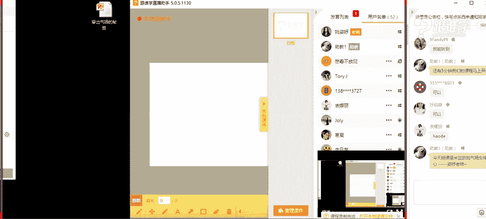
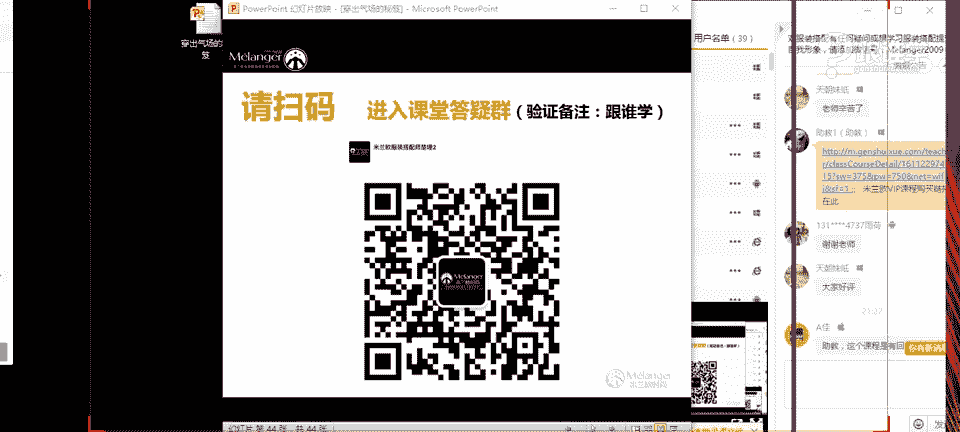
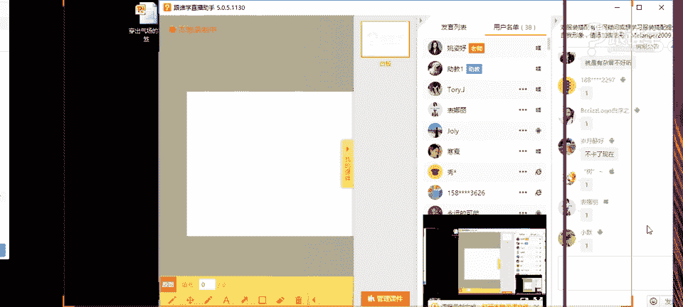

# 服装搭配秘笈之新版36计：4：穿出气场的搭配秘笈 🧥

在本节课中，我们将要学习如何通过服装搭配来塑造强大的个人气场。我们将从色彩、款式和风格三个核心方面入手，解析如何通过巧妙的搭配技巧，让任何人，无论身高或长相，都能穿出自信与力量感。

## 课程概述

大家好，我是今天的主持人龙飞。本次课程将由米兰欧国际时尚教育的高级导师——思宇老师，为大家带来“穿出气场的搭配秘笈”。思宇老师拥有丰富的整体造型与策划经验，将带领我们打破关于气场的常见误区，并掌握实用的穿搭法则。

很多人认为气场与身高、长相密切相关，个子高或长相成熟的人似乎天生更有优势。但事实并非如此，气场完全可以通过后天的着装技巧来营造和提升。在今天的课程中，我们将逐一拆解这些技巧。

## 秘籍一：选对色彩 🎨

上一节我们介绍了课程的整体框架，本节中我们来看看如何通过色彩的选择来奠定气场的基础。色彩是视觉的第一要素，不同的色彩能传递截然不同的情绪和力量感。

### 色彩的性格与力量

色彩有其独特的“性格”。例如，红色代表积极、活泼与张扬；蓝色则显得理智、严谨；黑色则是最为稳重、有力量的色彩，堪称“气场之王”。在重要场合，黑色往往是首选。

### 如何用色彩营造稳重感

并非所有颜色都天生显得稳重。通常，加入黑色调形成的深色系（如暗红、墨绿、藏蓝）会比加入白色调形成的浅色系（如粉色、鹅黄、天蓝）显得更有分量感和成熟度。

以下是利用配色提升气场的关键方法：

1.  **使用“气场色”**：多选择色调图中偏深沉、浓郁的颜色，这些色彩自带稳重感。
2.  **巧用黑白配**：这是最经典的营造气场的方法。想要清新甜美，可以用活泼色搭配白色；想要稳重硬朗，则用活泼色搭配黑色。
3.  **控制色彩比例**：在一套搭配中，面积占主导的主色决定了整体风格的基调。若想突出气场，应让黑色或深色占据较大面积，浅色或亮色作为点缀。

例如，粉色搭配白色显得甜美，但粉色搭配黑色，并让黑色作为主色时，整体感觉就会变得稳重而有气场。

## 秘籍二：选对款式 ✂️

掌握了色彩的奥秘后，我们来看看服装的款式如何影响气场。人们常说“5米看廓形”，服装的轮廓和线条是塑造整体印象的关键。

### 简约与挺括的力量

线条简洁、廓形挺括的服装往往比设计繁琐、面料柔软的服装更能塑造出利落、自信的形象。挺括的面料（如西装面料、皮质）能约束人的体态，让人不自觉地抬头挺胸，从而显得更有精神。

以下是判断款式是否有气场的两个要点：

1.  **线条是否简洁**：避免过多装饰、蕾丝、荷叶边等柔美元素。干净的直线条比复杂的曲线条更有力量感。
2.  **面料是否挺括**：硬挺的面料能塑造出清晰的轮廓，软塌的面料则显得随意、休闲，气场感较弱。

### 根据体型选择廓形

了解自己的体型是选对款式的前提。常见的女性体型有X、H、T、A型，男性体型有T、H、O型。选择服装时，应起到修饰体型的作用，而非重复或暴露缺点。

例如，A型体型（肩窄臀宽）应避免选择上窄下宽的A型大衣，而应选择有明确肩线、上半身有一定体积感的款式来平衡上下比例。

## 秘籍三：穿对风格 🕶️

在选对色彩和款式之后，风格的精准把握是提升气场的最后一步。服装风格是内在个性的外化，选择与“气场”契合的风格至关重要。

### 风格的文化与指向

不同的服装风格源于不同的文化背景，传递的情感也不同。例如，朋克风（Punk）带有叛逆、破坏的街头感；而机车风（Biker）则源于军装，显得更加硬朗、稳重。后者显然更容易穿出大气场。

### 选择更显气场的风格

在众多风格中，中性风、简约风、欧美风通常比少女风、甜美风、森系等风格更能凸显干练与力量感。这并不意味着必须放弃个人喜好，而是可以在搭配中融入这些风格的元素，来提升整体的气场值。

例如，一件皮衣，搭配破洞牛仔裤和铆钉靴是朋克风；搭配简洁的西装裤和短靴，就更偏向于干练的现代中性风，后者气场更强。

## 实战演示与总结

本节课中我们一起学习了穿出气场的三大秘籍：**选对色彩、选对款式、穿对风格**。

*   **色彩是基础**：多使用深沉的“气场色”，或通过“黑白配”法则来控制色彩的稳重感。
*   **款式是关键**：选择线条简洁、面料挺括的服装，并根据自身体型选择合适的廓形。
*   **风格是升华**：了解服装风格背后的文化，倾向于选择中性、干练的风格来强化气场印象。

记住，气场并非高个子和成熟长相的专利。通过科学的搭配方法，每个人都可以驾驭属于自己的强大气场。关键在于了解自己，并运用这些穿搭法则来扬长避短，最终通过服装外化出内心的自信与力量。

（注：课程中提到的专业体型测量、详细配色法则、服装风格历史等更多深度内容，将在系统性的专业课程中展开。）