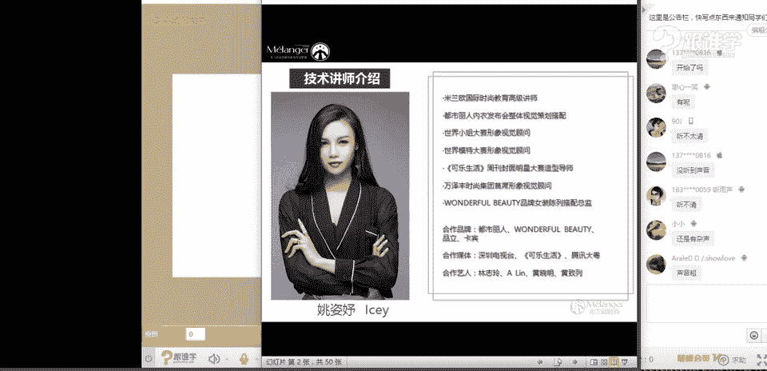
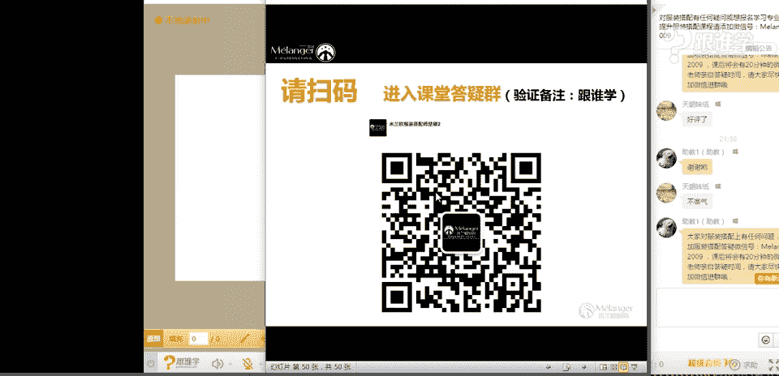
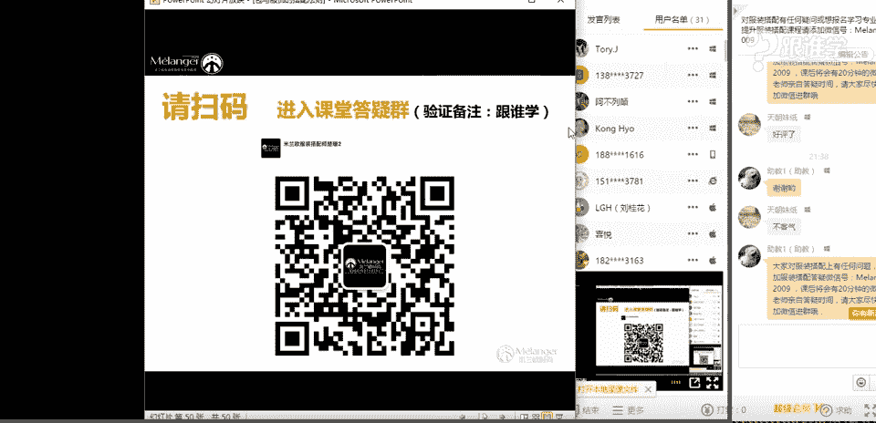
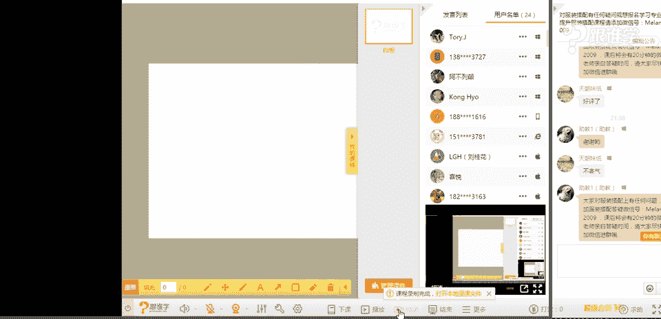

# 服装搭配秘笈：1：包与服饰的搭配法则 👜

## 概述
在本节课中，我们将学习包与服饰搭配的核心法则。课程将分为两个主要部分：首先，了解具有收藏价值的经典包包及其背后的故事；其次，掌握包与服饰在色彩、场合、风格等维度的实用搭配技巧。通过学习，你将能够更自信地选择和使用包包，提升整体造型的完整度与时尚感。

---

## 一、十大经典包包收藏指南

上一节我们概述了课程内容，本节中我们来看看那些值得投资和收藏的经典包包。这些包包不仅设计隽永、工艺精湛，更承载着品牌的历史与文化，即使作为二手品也保有相当价值。

以下是十款具有代表性的经典包包：

1.  **路易威登 Speedy**：因奥黛丽·赫本的定制需求而诞生，是一款解放女性双手的肩背包，经典实用。
2.  **香奈儿 2.55**：诞生于1955年2月，故得名2.55。其链条肩带、菱格纹、酒红色内里等设计均有独特故事。
3.  **迪奥 Lady Dior**：因戴安娜王妃的喜爱而闻名，又称“戴妃包”。制作需经95道工序，菱格纹灵感来源于拿破仑三世的座椅。
4.  **巴黎世家 机车包**：设计粗犷不羁，是搭配机车风格的经典单品。
5.  **古驰 Bamboo**：手柄采用竹节设计，融入了东方元素，别具特色。
6.  **赛琳 Classic Box**：设计简约时尚，线条利落，迅速成为经典款。
7.  **芬迪 Baguette**：外形简约，打开后内有“小恶魔”脸图案设计，充满趣味。
8.  **马克·雅可布 Stam**：带有学院风与复古感，显得年轻有活力。
9.  **爱马仕 Kelly/Birkin**：顶级工艺与稀缺性的代表，是终极收藏目标。
10. **普拉达 Galleria**：设计简约，皮质与做工俱佳，是通勤百搭的选择。

了解经典包背后的故事，能帮助我们理解其设计内涵，从而选择更符合个人气质与想表达态度的单品。

---

## 二、包与服饰搭配的核心维度

在认识了经典包包之后，我们进入今天的核心主题：包与服饰的搭配。搭配需考虑内在因素（如年龄、职业、性格、场合）和外在因素（如体型、色彩、服装款式）。本节将重点讲解两个最实用的外在维度：色彩与场合。

### 1. 色彩搭配三大法则

色彩是搭配中最先被感知的元素。掌握以下三个法则，能让你的包成为整体造型的点睛之笔。

以下是三种实用的色彩搭配方法：

*   **基础色+亮色法**：这是最保险不易出错的方法。当你穿着黑、白、灰、棕、藏蓝等基础色服装时，搭配一个亮色（如红、黄、绿、蓝）的包包，可以瞬间提亮整体造型，增加活力。反之，穿着鲜艳服装时，搭配基础色包包则能平衡视觉。
    *   **公式**：`深色服装 + 亮色包包` 或 `亮色服装 + 深色/中性色包包`。
*   **呼应搭配法**：此法能营造强烈的整体感和高级和谐度。它遵循“反复”的美学原理，即让同一元素在全身出现两次以上。
    *   **应用**：包的颜色可以与服装中的某个颜色、图案、甚至配饰（如耳环、鞋子、指甲油）的材质或颜色相呼应。
    *   **公式**：`包包颜色/元素` ≈ `服装或配饰中的颜色/元素`。
*   **小面积撞色法**：此法非常出彩，能迅速抓人眼球。关键在于控制色彩面积的比例，让鲜艳的包包作为小面积点缀，与服装的大面积颜色形成碰撞。
    *   **要点**：包包不宜过大，确保其色彩面积小于服装主色面积。
    *   **公式**：`大面积服装色` + `小面积对比色/互补色包包`。

### 2. 场合与包款选择

不同的场合需要不同的着装，包包的选择也应随之调整。根据场合准备以下几类包包，能应对大多数需求。

以下是四种必备包款及其适用场合：

*   **晚宴包**：小巧、精致、重工，常用闪钻、丝绸、金属等华丽材质。用于搭配晚礼服或小礼服，提升整体精致度。
*   **休闲包**：以实用性和方便性为主，容量通常较大。包括斜挎包、手提包、单肩包、双肩包、腰包等。适用于日常出行、购物、旅行等休闲场合。
*   **时装包**：装饰性强，包含当季流行元素（如刺绣、特殊图案），非常时尚出彩。但容易过时，建议每年选择性地购入少量，用于点缀简约穿搭。
*   **通勤包**：款式简约、大方、优雅，线条偏硬朗（直线感）。颜色多以黑、白、灰、棕等中性色为主。适用于职场，给人稳重、专业的印象。

选择包包时，需综合考虑场合所需的正式度与服装风格。

---

## 三、风格搭配的终极考验

色彩和场合都选对后，风格的和谐才是搭配的终极目标。包包的风格（如民族风、朋克风、极简风）必须与服装的风格保持一致或巧妙混搭。

**案例分析**：
*   一套**中性帅气**的套装，搭配一个银色简约手拿包（呼应鞋子和配饰金属色）比搭配一个复古编织感的黑色包包更和谐。
*   一件**民族风**连衣裙，搭配流苏包能强化风格；若外搭皮衣、佩戴铆钉项圈，则可转向**朋克混搭民族风**，此时搭配带有骷髅、铆钉元素的包包更能体现混搭精髓。

读懂包包的设计元素（颜色、材质、线条、装饰），并将其与服装想要表达的风格进行联结，是完成高级搭配的关键。

---

## 总结
本节课我们一起学习了包与服饰的搭配体系。我们从了解经典包的文化价值入手，进而掌握了**色彩搭配**的三大法则（基础色+亮色、呼应法、小面积撞色），明确了不同**场合**应如何选择包款（晚宴包、休闲包、时装包、通勤包），最后认识到**风格统一**是决定搭配成败的深层逻辑。记住，包包不仅是工具，更是表达个人风格与品味的重要配饰。通过不断练习和感知，你一定能成为自己的搭配专家。