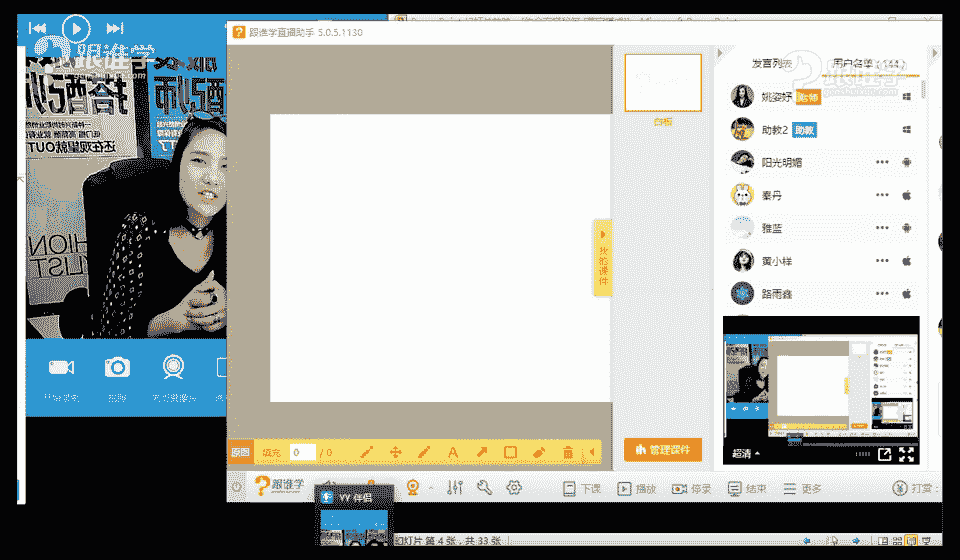
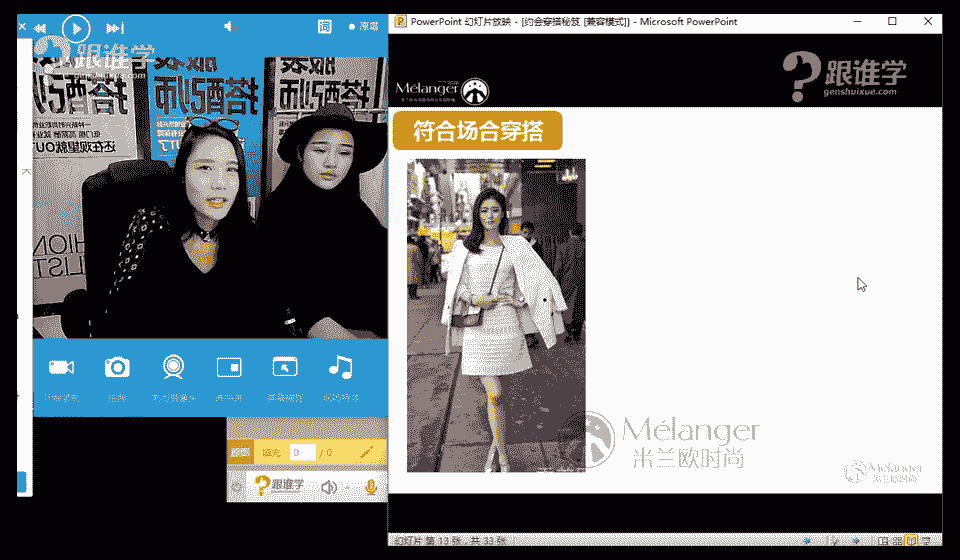
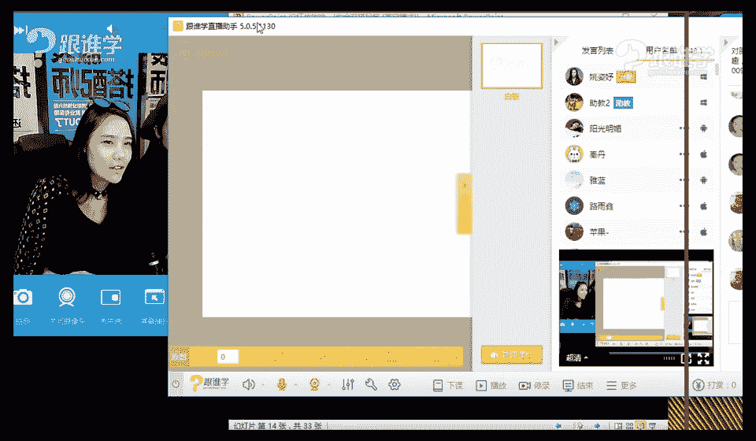
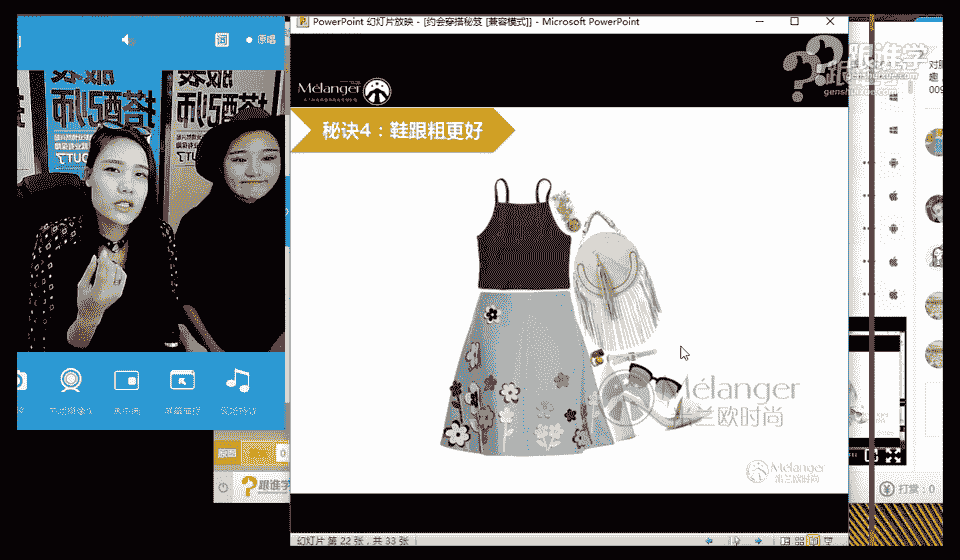
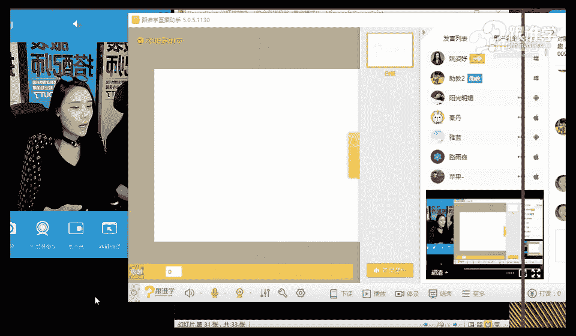

# 服装搭配秘笈之新版36计：6 约会场合的穿搭秘笈

在本节课中，我们将学习约会场合的穿搭技巧。课程将涵盖不同约会场景的着装要点，并通过实际搭配演示，帮助初学者掌握如何根据场合选择合适的服装，展现最佳形象。

---

## 课程开场与互动

大家好，我是姚思瑜，大家可以叫我杨老师或思瑜老师。我是米莱欧国际时尚的高级讲师，曾为多个品牌、艺人及秀场提供整体视觉搭配与策划。

今天，我们非常荣幸地邀请到了网红达人兼平面模特——楠楠，她将与我一同为大家分享和演示今天的课程内容。

约会穿什么，一直是许多人感到困扰的问题。无论是单身男女，还是已有伴侣的成年人，甚至学生，都会面临这个挑战。在课程开始前，我们先进行一个小互动。

**以下是关于约会着装喜好的小调查：**

*   **女生不喜欢的男生穿搭**：过于花哨的黑T恤（如带有夸张图案）、紧身皮裤皮衣、吊裆哈伦裤、夹脚拖鞋、将裤子提得很高暴露啤酒肚、留过长指甲等。
*   **男生不喜欢的女生穿搭**：妆容过于浓烈（如深色/黑色唇膏）、穿着过于暴露性感、涂黑色指甲油、穿防水台过高的高跟鞋等。
*   **男生喜欢的女生穿搭**：修身但不紧身的轻熟女风格、清新有气质的风格、可爱萌妹风格。

通过互动我们发现，双方都更倾向于对方穿着**干净、得体、符合场合**，并能让自己感到舒适的服装。这为我们接下来的学习奠定了基础。

---

## 不同约会场景的穿搭分析

上一节我们了解了基本的着装喜好，本节中我们来看看如何将这些原则应用到具体的约会场景中。

### 西餐厅约会

西餐厅环境相对正式，注重用餐礼仪。着装应体现一定的正式感与优雅度，但不宜过于夸张。

**以下是错误穿搭示范：**

1.  **过于性感**：大面积露肤、超短裙、蕾丝透视面料，更适合夜店而非正式餐厅。
2.  **过于帅气/强势**：全身黑色、皮革材质、墨镜等元素，会给人距离感，不够柔和。

**以下是正确穿搭建议：**

*   选择色彩清浅、款式淑女的连衣裙（One-piece）。
*   着装整体应温婉、大方，避免过度个性。
*   男生也应穿着得体，避免过于休闲。

**核心公式：西餐厅着装 ≈ 适度正式 + 柔和色彩 + 优雅款式**

### 游乐场约会

游乐场以休闲、运动、欢乐为主。着装应优先考虑舒适性与便利性。

**以下是错误穿搭示范：**

1.  **穿高跟鞋**：不便于行走和参与游乐项目。
2.  **二次元风格**：过于特殊的风格可能让对方难以接受。
3.  **野性风格（如豹纹）**：与游乐场轻松的氛围不搭。

**以下是正确穿搭建议：**

*   首选裤装，如休闲裤、牛仔裤，行动更方便。
*   搭配休闲鞋、运动鞋。
*   可选择有一定弹性、裙摆较长的连衣裙，但需避免短裙。
*   风格以休闲、活泼、清新为主。

**核心公式：游乐场着装 ≈ 舒适面料 + 便利款式 + 休闲鞋履**

---

## 实战穿搭演示

接下来，我们通过楠楠的三套变装，来直观感受不同约会场景的穿搭应用。

### 演示一：田园郊游风

*   **单品**：黄色棉麻长裙 + 浅蓝色针织开衫 + 编织帽 + 编织包 + 清新配色饰品（耳环、颈链、蝴蝶结）。
*   **发型**：侧边三股编发，增加甜美清新感。
*   **适合场合**：户外踏青、郊游、度假等阳光下的约会。
*   **要点**：色彩明快柔和，材质自然，配饰风格统一，营造浪漫轻松的田园气息。

### 演示二：晚宴/正式场合风

*   **单品**：粉色修身连衣裙 + 夸张纱质半身裙 + 皮质短外套 + 华丽耳环 + 手拿包 + 墨镜。
*   **发型**：利落的丸子头，提升气质与正式感。
*   **适合场合**：晚宴、酒会、红毯等正式约会场合。
*   **要点**：通过外套、配饰（皮衣、墨镜、手包）提升气场；华丽感单品（纱裙、亮钻）适应晚间光线；整体造型隆重且有范儿。

### 演示三：日常聚会/约会风

*   **单品**：吊带裙 + 白衬衫 + Choker颈链 + 牛仔帽。
*   **适合场合**：日常约会、朋友聚会、逛街、看电影。
*   **要点**：裙装与衬衫叠穿，增加层次感；颈链是时尚亮点；搭配高跟鞋可提升精致度，搭配平底鞋则更休闲舒适。

通过演示可以看出，同一个人通过服装、发型、配饰的变化，能完美适应从休闲到正式的不同约会场景。

---

## 针对性穿搭技巧：腿粗如何穿？

在约会中展现自信，需要懂得扬长避短。以下是针对腿粗问题的四个穿搭口诀。

**以下是四个显瘦穿搭口诀：**

1.  **遮盖法**：直接遮盖粗壮部位。例如，大腿粗可穿过膝直筒裙、阔腿裤，避免紧身裤和短裤。
2.  **上宽下窄对比瘦**：上身选择宽松款式（如oversize外套、飞行员夹克），与下身形成对比，在视觉上显腿细。
3.  **微喇裤型显腿细**：选择大腿处合身、小腿处呈喇叭形散开的裤型。裤脚的宽度能反衬大腿的纤细。
4.  **粗跟鞋更好**：避免过细的鞋跟，选择粗跟、方跟的鞋子。粗跟与小腿的对比不如细跟强烈，因此更显小腿协调。

**核心思路：隐藏缺点，突出优点。通过服装的廓形、长度和对比，优化身材比例。**

---

## 约会穿搭核心原则与课程总结

综合以上内容，我们可以总结出约会穿搭的几大核心原则：

1.  **符合场合**：根据约会地点（西餐厅、游乐场、电影院等）选择相应正式度与风格的服装。
2.  **色彩清浅**：避免全身深色（尤其是黑色），清浅柔和的色彩更能营造积极、亲切的第一印象。
3.  **材质轻盈**：选择柔软、垂顺的面料，避免过于厚重或挺括，减少距离感和压迫感。
4.  **款式合体**：服装应合身，过于宽松或紧身都不利于展现最佳状态。
5.  **配饰点睛**：善用耳环、项链、帽子、包包等配饰，能快速提升造型完整度与时尚感。

本节课中，我们一起学习了约会场合的穿搭秘笈。我们从了解彼此的着装喜好开始，分析了西餐厅和游乐场等具体场景的穿搭要点，并通过实战演示直观感受了风格变换的魅力。最后，我们还学习了针对腿粗问题的实用显瘦技巧。记住，穿搭的本质是**通过外在服装，得体、自信地表达内在自我**。希望今天的课程能帮助你在下一次约会中，展现最迷人的风采。

> **形象匹配原则**：就像咖啡用咖啡色包装，绿茶用绿色包装一样，人的外在着装也应与内在气质、场合需求相匹配。好的穿搭，是让你成为“更好的自己”，而非变成“另一个人”。