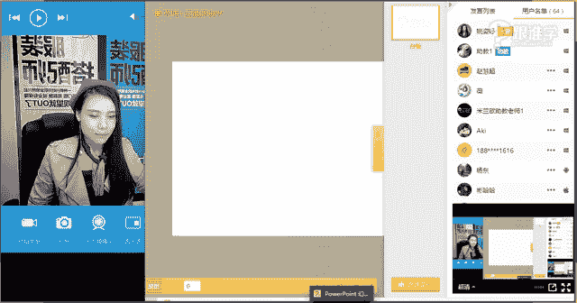
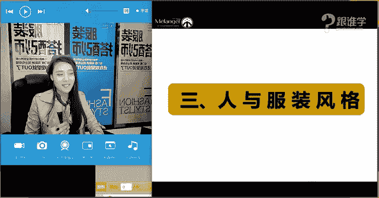

# 服装搭配秘笈：1：人与服饰的搭配法则 👔

在本节课中，我们将要学习如何认识自己，并找到最适合自己的着装风格。我们将从人的气质、服装风格以及人与服装的匹配法则三个维度进行深入分析，帮助你摆脱“衣品时好时坏”的困扰，穿出属于自己的神韵。

## 课程概述

我们从小到大，很少有机会系统学习如何穿衣搭配、认识自己的外在特征。很多人来到课堂，都希望拓展自己的着装风格，不再局限于单一的穿着模式。本节课的核心目标，就是帮助你了解自己的外在气质，并学会将其与相应的服装风格进行匹配，从而提升整体形象。

## 一、人的气质 👤

上一节我们介绍了课程的整体框架，本节中我们来看看人的气质。每个人都有与生俱来的独特气质，这决定了我们适合哪种感觉的服装。气质大致可以分为“直”（硬朗、干练）和“曲”（柔美、亲和）两种感觉。

以下是几种典型的气质类型举例：

*   **甜美可爱型**：例如赵丽颖，给人清新、活泼、灵动的感觉，常被形容为“少女感”。
*   **优雅知性型**：例如高圆圆，给人温婉、典雅、有女人味的感觉，是传统的审美典范。
*   **美艳浪漫型**：例如张雨绮，给人浓郁、性感、大气的感觉。
*   **帅气硬朗型**：例如李宇春，给人个性、独立、干练的感觉。

**核心概念**：人的气质并非单一标签，而是动态的。一个长相甜美的人也可以尝试融入帅气元素，关键在于找到风格的平衡点。公式可以表示为：`个人气质 = 面部特征 + 体质特征`。

## 二、服装风格 👗

了解了人的气质后，我们来看看服装风格。服装本身也自带风格属性，并且种类繁多。

以下是几种常见的服装风格分类：

*   **年轻可爱风格**：包括尚书风（18-25岁）、学院风（如英伦格纹）、田园风（棉麻、清新）等，共同特点是显年轻、裙长较短。
*   **干练利落风格**：包括简约风（直线剪裁、设计简洁）、机车风（皮衣、利落）、中性风等，给人硬朗、帅气的感觉。
*   **成熟浪漫风格**：包括民族风、淑女风、性感风等，通常裙长及膝或更长，体现成熟韵味。

**核心概念**：服装的“直”与“曲”可以通过款式、面料和线条来判断。例如，裤装、挺括的皮质面料通常更“直”；而裙装、飘逸的雪纺面料则更“曲”。

## 三、人与服装风格的结合 🔗

前面我们分别了解了人的气质和服装风格，本节中我们来看看如何将二者结合，这是搭配的核心法则。首先，我们需要进行自我诊断，而起点就是观察自己的脸型，因为面部是视觉重心。

### 1. 判断脸型与气质

脸型大致可分为标准型（如椭圆形、倒三角形）和非标准型。非标准型中：
*   **偏曲线感的脸型**：圆形脸、椭圆形脸、梨形脸（正三角形脸）。这些脸型线条圆润，给人亲和力。
*   **偏直线感的脸型**：方形脸、长方形脸、菱形脸。这些脸型骨骼感强，棱角分明，给人距离感。
*   **中间型脸型**：心形脸（倒三角形脸），可直可曲。

**判断方法**：将头发全部梳起，拍一张正面照。从额角最宽处、颧骨最宽处、下颌骨最宽处画三条线，然后勾勒脸部轮廓，对照上述脸型找到最接近的一种。同时，结合眼神（犀利坚定为直，柔和无害为曲）综合判断个人气质偏向。

### 2. 判断体质特征

体质特征指身材的丰满与纤薄程度。
*   **女生**：体质丰满、曲线明显（如玛丽莲·梦露）为“曲”；体质纤薄、骨感（如奥黛丽·赫本）为“直”。
*   **男生**：身材健壮、有肌肉感为“直”；身材过于纤薄或圆润肥胖为“曲”。

### 3. 四种结合方案

将面部气质与体质特征结合，可以得到四种类型，并对应不同的穿搭建议：

1.  **面部直 + 体质直**：例如维多利亚·贝克汉姆。适合穿着**直线感、硬朗**的服装，如极简风、中性风、军旅风。公式：`直 + 直 -> 穿直`。
2.  **面部曲 + 体质曲**：例如米兰达·可儿。适合穿着**曲线感、柔美**的服装，并注意收腰，凸显女人味。公式：`曲 + 曲 -> 穿曲`。
3.  **面部直 + 体质曲**：例如蕾哈娜。适合**直曲混搭**，例如用帅气的西装（直）搭配收腰裙装（曲），达到平衡。公式：`直 + 曲 -> 直曲混搭`。
4.  **面部曲 + 体质直**：例如高圆圆。这种组合**驾驭风格范围较广**，既可帅气也可柔美，是最“百搭”的类型。公式：`曲 + 直 -> 风格范围广`。

**核心概念**：对于大多数身材丰满（体质曲）的人，无论面部直曲，在穿搭中**注重收腰**是关键，这能避免显胖并提升精神气。

### 4. 男生篇补充 👨

男生的气质类型多样，如帅气阳光、邻家暖男、个性高冷、成熟硬汉等。服装风格也有绅士儒雅（英伦风、雅痞风）、帅气炫酷（嘻哈风、机车风）、阳光活力（运动风、学院风）等。

男生的“直曲”判断：
*   **面部**：与女生标准类似，方形、菱形脸更直，圆、椭圆脸更曲。
*   **体质**：健壮有肌肉为“直”；过于纤瘦或肥胖为“曲”。

穿搭建议：男性着装普遍偏向直线感。体质偏“曲”（太瘦或太胖）的男士，建议通过健身调整体型，以便更好地驾驭各类服装。气质年轻的适合阳光活力风格，气质成熟的适合儒雅或硬朗风格。

## 课程总结

本节课中我们一起学习了如何通过三个步骤来找到个人着装定位：
1.  **认识自我**：分析自己的面部特征（直/曲）和体质特征（直/曲）。
2.  **理解服装**：了解服装风格的直曲属性。
3.  **进行匹配**：根据“面部+体质”的组合，选择最适合的服装风格方向（纯直、纯曲或混搭）。

记住，了解自己是变美的第一步。你的脸型和身材特点决定了你的气质基底，而服装是表达和强化这种气质的工具。课后，请尝试分析自己的“直曲”属性，并观察衣橱里的衣服是否符合你的气质吧！