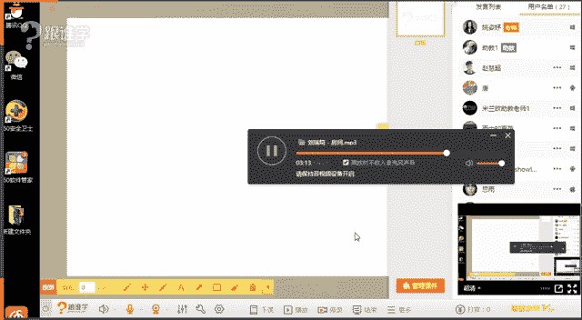
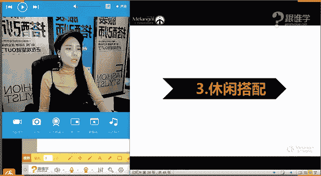

# 服装搭配秘笈之新版36计：1.8：衣橱规划

## 课程概述
在本节课中，我们将学习如何进行科学的衣橱规划。我们将从检视现有衣橱开始，分析其存在的问题，并学习如何通过合理的单品比例、场合分类和色彩搭配，构建一个高效、实用且能应对各种场合的衣橱。课程的核心是掌握“一周搭配法”，让你轻松管理每日着装。

---

## 回顾上节：认识自我风格
上一节我们学习了如何认识自己的风格，包括分析脸型、眼神、身材和气质。这是打造个人形象的第一步。只有清晰了解自身的“直”与“曲”，才能选择最适合的服装风格。

本节中，我们来看看如何将这种自我认知应用到实际的衣橱管理中。

## 衣橱的重要性
你的衣橱是个人形象的基石。一个规划良好的衣橱能让你快速找到所需单品，从容应对各种场合，反之则会导致搭配混乱、效率低下。

以下是几个关键问题，可以帮助你审视自己的衣橱现状：
*   **单品清晰度**：你是否清楚自己衣橱里有哪些单品？
*   **寻找效率**：能否快速找到适合特定场合（如面试、婚礼）的服装？
*   **缺失判断**：你是否了解衣橱里缺少哪些必备单品？
*   **场合满足度**：你的衣橱能否满足你所有生活场景的需求？

如果以上问题你的答案多为否定，那么系统的衣橱规划就非常必要了。

## 第一部分：衣橱大考验——四步检视法
要规划衣橱，首先需要科学地检视现有衣橱。请遵循以下四个步骤：

### 1. 上下装比例
视觉重心通常在上半身，因此上装应多于下装。合理的比例能最大化搭配可能性。

**核心公式**：`上装数量 : 下装数量 = 3:1 到 5:1`

例如，拥有70件上装和30件下装，其搭配组合远多于99件上装和1件下装。上装包括打底衫、衬衫、外套等；下装包括裤子、裙子。

### 2. 场合分类与服装比例
你的服装比例应与生活场景比例相匹配。首先，列出你的主要场合（如通勤、休闲、聚会、运动），然后评估每个类别服装的占比是否合理。

例如，一位银行职员（王女士）的场合与服装比例可能如下：
*   职业装：50%
*   休闲装：20%
*   聚会装：10%
*   运动装：10%
*   正式场合装：10%

大学生则可能休闲装占比极高，而职业装几乎没有。请根据自身实际情况进行调整。

### 3. 衣橱色彩比例
色彩是搭配的灵魂。一个健康的衣橱色彩体系应平衡基础色与点缀色。

**核心公式**：`基础色（黑白灰、米色、藏蓝等）: 鲜艳色（红黄蓝绿等） ≈ 70% : 30%`

如果你的衣橱全是黑白灰，会显得冷淡、缺乏情感；如果全是鲜艳色，则容易显得杂乱、缺乏质感。根据现有衣橱的色彩状况，有针对性地补充基础色或鲜艳色单品。

### 4. 衣橱款式多元化
避免单品过于单一。例如，下装不应全是牛仔裤或黑色打底裤。

以下是女士下装多元化的示例清单：
*   **半裙**：铅笔裙、A字裙、鱼尾裙、波西米亚长裙（需区分长短、材质）
*   **裤装**：紧身裤、阔腿裤、喇叭裤、直筒牛仔裤、西裤

男士下装则可涵盖：牛仔裤、休闲裤、西裤、短裤等。品类的丰富性能显著提升搭配的趣味性和适应性。

## 过渡：从检视到规划
通过以上四步检视，你应该对自己的衣橱现状有了清晰的认识。接下来，我们将进入实战环节，学习如何利用规划好的衣橱进行高效搭配。

## 第二部分：玩转搭配——一周搭配法
我们以“一周”为周期来学习搭配规划，此法可轻松扩展至一个月。

一周的场合通常可归纳为三类：**职场**、**派对**、**休闲**。

### 职场搭配（周一至周五）
职场着装要求庄重、专业。

**操作步骤**：
1.  **步骤一：集中单品**。将所有适合职场的“制式服装”全部取出，挂放或平铺，以便清晰看到所有上装与下装。制式服装包括：西装、衬衫、简约连衣裙、风衣、呢子大衣、直筒裤/裙等。
2.  **步骤二：以外套为核心**。确定一周五天分别想穿哪五件外套（如：夹克、风衣、西装、大衣、连衣裙）。
3.  **步骤三：搭配内搭与下装**。根据每件外套，搭配不同的内搭和下装。例如：`星期一：皮夹克 + 针织衫 + 铅笔裙`；`星期二：风衣 + 衬衫 + 西裤`。

**职场搭配注意事项**：
*   回避薄、露、透的服装。
*   款式应庄重，避免过于休闲（如落肩设计）。
*   鞋跟高度建议不超过5厘米。
*   面料选择精致、挺括的材质。
*   色彩上回避过于稚嫩（如粉蓝色）或随意的颜色。

### 派对搭配
国内派对着装通常一件得体的连衣裙即可应对。关键在于区分“隆重感”与“简约感”。

*   **隆重感连衣裙**：色彩鲜艳或闪耀（如红、金）、有重工艺（亮片、钉珠）、廓形夸张（大裙摆、深V领）、露肤面积大。
*   **简约感连衣裙**：设计简洁、色彩素雅（如小黑裙）、款式低调。小黑裙是必备经典款，适合多种派对场合。

选择时需考虑自身体型，例如X型（沙漏型）身材适合收腰放摆的款式，H型身材则适合H版型连衣裙。

### 休闲搭配
休闲搭配风格多样，关键在于掌握不同单品的风格语言。

以下是几种常见的休闲风格及其核心单品元素：
*   **运动风**：侧边条纹、透气网眼面料、字母Logo、束脚裤、运动鞋。
*   **牛仔风**：牛仔夹克、牛仔裤、牛仔衬衫。可与西装、马甲等进行混搭。
*   **机车风**：基础款皮夹克（无过多装饰）。搭配裙装可柔化硬朗感。
*   **棉麻风**：棉、麻质地的宽松服装，带有自然、文艺或度假气息。

## 衣橱管理小秘诀：加减乘除
最后，分享一个购物决策心法：

*   **加法（穿衣）**：一件衣服最好能与衣橱里至少三件其他单品搭配。
*   **减法（买衣）**：不能与衣橱里三件衣服搭配的，坚决不买。
*   **乘法（跨季）**：优先购买能跨越三个季节穿着的单品，提高利用率。
*   **除法（投资）**：购买高价单品时，用“价格 ÷ 穿着次数 ÷ 预计穿着年限”计算每次穿戴成本，判断是否值得。例如：`1000元大衣 ÷ 每年穿20次 ÷ 穿5年 = 每次10元`。

## 课程总结
本节课我们一起学习了衣橱规划的核心方法。
1.  我们首先学习了**四步检视法**，从上下装比例、场合比例、色彩比例和款式多元化四个方面评估衣橱健康度。
2.  接着，我们掌握了**一周搭配法**，通过以职场搭配为核心，辅以派对和休闲搭配，轻松规划每日着装。
3.  最后，我们了解了**加减乘除**购物原则，帮助我们在添置新衣时做出更明智的决策。

记住，衣橱是自我风格的延伸。一个规划有序的衣橱，不仅能提升你的形象效率，更能反映你积极、有序的生活态度。课后请立即动手检视并规划你的衣橱吧！