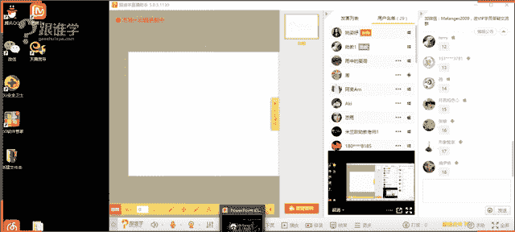

# 服装搭配秘笈：1.9：体型判断与款式选择

## 课程概述

在本节课中，我们将学习如何科学地判断自己的体型，并了解不同体型应如何选择合适的服装款式。掌握这些知识，能帮助你避免“买家秀”与“卖家秀”的尴尬，让每一件衣服都穿出理想效果。

## 体型判断的重要性

你是否曾疑惑，为什么同一件衣服，别人穿起来好看，自己穿上却效果不佳？这通常与个人的体型、气质和脸型有关。在人物造型中，我们根据脸部和身体进行整体设计。购买服装时，更是直接与体型挂钩。如果不了解自己的体型，选款就容易出错。

例如，拥有完美沙漏型身材的人，若选择了错误的款式，反而会掩盖其身材优势。因此，认识体型是打造个人形象的第一步，核心在于“扬长避短”。

## 体型测量方法

在开始判断前，我们需要一个客观的测量工具——皮尺。请确保测量时站立姿势标准：抬头挺胸，双腿并拢，双手自然下垂。

以下是女性体型的四维测量法：

1.  **肩围**：测量肩部最外缘的“蘑菇点”（肩胛骨外上缘与肩关节相接的凸起骨点）之间的围度，绕身体一圈。
2.  **胸围**：测量胸部最高点（乳高点/B.P点）的水平围度。
3.  **腰围**：测量腰部最细处。可将手肘夹起，肘尖所对的腰部位置通常是腰最细处，或触摸肋骨最下缘。
4.  **臀围**：测量臀部最翘处的水平围度。

**男性测量方法**：与女性类似，但无需测量胸围。需额外测量**腹围**，即腹部最突出处的围度。

## 女性体型分类与选款指南

根据测量数据，女性体型主要分为四类：X型、H型、T型和A型。**X型**被视为标准体型，其他非标准体型在穿搭时，都应努力向X型的视觉效果靠拢。

### 1. X型（沙漏型）

*   **判断公式**：肩围 ≈ 臀围，且腰围比肩围/臀围小**20厘米以上**。
    *   *示例*：若肩围=臀围=90cm，则腰围需≤70cm。
*   **特点**：肩、胸、臀比例协调，腰部纤细，女性化线条明显，最具曲线美。
*   **穿搭核心**：**突出腰线**，强化身材优势。
*   **选款建议**：
    *   **适合**：收腰放摆的X廓形服装、有腰带的款式、合身的收腰连衣裙或上衣。
    *   **注意**：避免过于宽松、没有腰线的H版型服装，否则会掩盖优势，显得臃肿。
    *   **进阶技巧**：若想尝试宽松外套，内搭务必选择收腰款式，形成“外松内紧”的层次。

### 2. H型（矩形/竹竿型）

*   **判断公式**：肩围 ≈ 臀围，且腰围比肩围/臀围小**20厘米以内**。
    *   *示例*：若肩围=臀围=90cm，则腰围在71cm至90cm之间。
*   **特点**：肩、腰、臀宽度接近，身材匀称但曲线不明显，腰身不够纤细。
*   **穿搭核心**：**创造腰线**，或走利落中性风。
*   **选款建议**：
    *   **适合**：
        *   **创造曲线**：收腰放摆的款式、高腰线设计、腰带。
        *   **强化风格**：H版型、直线条服装，可打造帅气、干练的中性风。
    *   **注意**：H体型较为百搭，但若偏胖，则应以合身为主，避免复杂膨胀的设计。

### 3. T型（倒三角型）

*   **判断公式**：肩围 > 臀围 **5厘米以上**。
*   **特点**：肩部宽阔，臀部相对较窄，上半身显壮硕，男性化线条较强。
*   **穿搭核心**：**收缩上身，膨胀下身**，平衡上下视觉量感。
*   **选款建议**：
    *   **上身（收缩）**：
        *   **款式**：选择简洁的肩部设计（如削肩、插肩袖）、V领、U领等纵向拉伸的领型。避免垫肩、泡泡袖、一字领等横向扩张元素。
        *   **色彩**：多用深色、冷色等收缩色。
        *   **面料**：选择哑光、纹理细腻的面料。
    *   **下身（膨胀）**：
        *   **款式**：选择A字裙、阔腿裤、伞裙等有量感的下装。
        *   **色彩**：可用浅色、暖色或图案吸引视线。
        *   **装饰**：可在下身使用口袋、褶皱等设计细节。

### 4. A型（正三角型/梨形）

*   **判断公式**：肩围 < 臀围 **5厘米以上**。
*   **特点**：肩部较窄，臀部较宽，下半身量感集中。
*   **穿搭核心**：**膨胀上身，收缩下身**，平衡上下视觉量感。
*   **选款建议**：
    *   **上身（膨胀）**：
        *   **款式**：选择泡泡袖、飞袖、垫肩、一字领、荷叶边等加宽肩部的设计。
        *   **色彩**：多用浅色、亮色、印花图案。
        *   **面料**：可选择有光泽感、肌理感的面料。
        *   **配饰**：佩戴有存在感的项链、耳环，吸引视线上移。
    *   **下身（收缩）**：
        *   **款式**：选择直筒裤、微喇裤、简约的A字裙。避免紧身包臀裙或裤子。
        *   **色彩**：多用深色、纯色。
    *   **遮盖法**：利用长度及臀或过臀的上衣、外套，遮盖较宽的臀部。

## 男性体型分类与选款指南

男性体型主要分为三类：T型、H型和O型。**T型**被视为最具男性魅力的标准体型。

### 1. T型（倒三角型）

*   **判断公式**：肩围 > 臀围 **10厘米以上**。
*   **特点**：肩宽背厚，臀部较窄，显得健壮、有力量感。
*   **穿搭核心**：**凸显优势**，展现阳刚之气。
*   **选款建议**：选择合身、修身的款式，如剪裁利落的西装、夹克，可以完美展现倒三角身材。避免过于宽松肥大的服装。

### 2. H型（矩形）

*   **判断公式**：肩围 ≈ 臀围。
*   **特点**：身材匀称，但肩部不够宽阔，男性化线条不明显，显得儒雅。
*   **穿搭核心**：**塑造肩部线条**，增加上半身量感。
*   **选款建议**：
    *   **款式**：选择有垫肩、肩章设计的服装，宽翻领的夹克或大衣。
    *   **层叠穿搭**：利用衬衫、毛衣、外套的层叠，增加上半身体积感。
    *   **面料**：挺括的面料能更好地塑造轮廓。

### 3. O型（苹果型）

*   **判断公式**：腹围 > 臀围。
*   **特点**：腹部突出，腰围较粗，常见于中年发福的男性。
*   **穿搭核心**：**修饰腹部**，视觉上显瘦。
*   **选款建议**：
    *   **色彩搭配**：采用“内深外浅”或“上深下浅”的配色，深色内搭或上衣有收缩效果。
    *   **款式**：选择单排扣西装/夹克（避免双排扣），面料挺括、剪裁合身但不过紧。
    *   **避免**：在腹部区域有大型图案、复杂褶皱或横条纹的设计。
    *   **细节**：裤装选择中高腰、直筒款式，避免低腰裤。

## 课程总结

本节课我们一起学习了体型判断与款式选择的核心知识。

首先，我们掌握了科学的**四维测量法**（肩、胸、腰、臀），这是客观认识自身体型的基础。

其次，我们详细剖析了**女性四种体型**（X, H, T, A）和**男性三种体型**（T, H, O）的判断标准、特点及穿搭法则。核心要点在于：**X型（女）和T型（男）是标准体型，其他非标准体型的穿搭目标，是运用款式、色彩、面料等手段，向标准体型的视觉效果靠拢**，最终达到扬长避短的目的。

记住，了解自己是变美的第一步。现在，拿起皮尺，开始你的探索之旅吧！