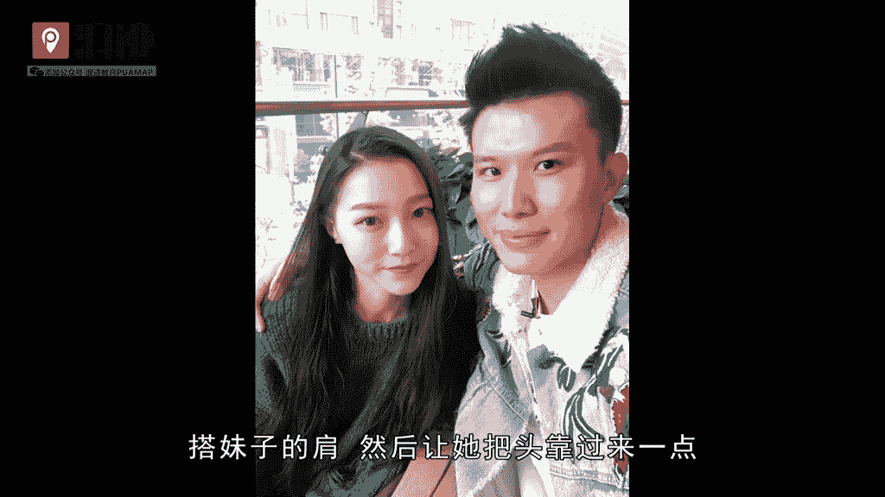

# 老吴《装逼课》：7：如何拍摄预选

在本节课中，我们将要学习如何在与女生约会时，通过拍摄“预选”照片来提升自身社交吸引力。我们将详细讲解拍摄时机、距离控制、拍摄技巧以及发布策略，确保你能掌握这一社交技巧的核心要点。

---

## 拍摄时机与邀请

上一节我们介绍了课程概述，本节中我们来看看如何开始拍摄预选。与女生在咖啡厅约会时，通常面对面而坐。在约会进行约40分钟至1小时后，是提出合影的合适时机。

你可以以“你今天打扮得很漂亮，想合影留念”为由，邀请女生坐到你旁边。这个理由自然且不易被拒绝，为后续拍摄创造了条件。

## 拍摄距离的控制

成功邀请女生并排坐后，就进入了拍摄环节。拍摄时，你与女生的距离是关键，它直接决定了照片所传达关系的暧昧程度。

以下是两种主要的距离控制策略：

*   **安全距离（朋友感）**：适用于不想显得过于亲密的情况。可以请服务员或其他人在对面帮忙拍摄。两人并排坐，但身体保持一定间隔。公式表示为：`拍摄距离 > 亲密距离`。这种距离在镜头中呈现的感觉就像普通朋友。
*   **进阶距离（适度暧昧）**：如果你想制造一些暧昧氛围，可以让她坐得稍近一些。两人前后略微错开坐，你的身体可稍向前倾。这比安全距离更近一步，但依然没有肢体接触，便于解释彼此关系。

## 自拍技巧与软件选择

如果你想自己用手机拍摄，有几个要点需要注意。

首先，务必使用带有美颜功能的拍照软件，例如美颜相机、B612或轻颜相机。因为女生通常介意别人手机里有自己的“丑照”。使用美颜软件能让她更乐意配合自拍。

其次，关于座位和角度：

*   如果你左脸比较上镜，就让女生坐在你的**右边**。
*   如果你右脸比较上镜，就让女生坐在你的**左边**。

由于男生的手臂通常较长，由男生持手机拍摄更容易控制角度和距离，避免因镜头太近而拍出大脸。

## 需要避免的亲密姿势

在拍摄预选照片时，应避免过于亲密的姿势，否则会带来不必要的麻烦。

以下姿势不建议用于预选拍摄：

*   **搂肩或搂腰**：这明确传达了亲密关系。
*   **脸贴脸**：这是情侣间典型的拍照姿势。
*   **女生挽手**：同样是非常亲密的信号。

这些姿势拍摄的照片一旦发布，很容易让其他女生认为你们是情侣，从而失去“预选”制造竞争感和吸引力的作用。

## 朋友圈的图文搭配与发布策略

拍摄完成后，如何发布到朋友圈也至关重要。通常可以搭配三张图：一张咖啡厅环境图、一张饮品或甜品图、一张与女生的合影。这构成了一组完整的生活记录。

配文不能过于暧昧，可以暗示只是朋友聚会，例如“和老朋友喝杯咖啡”。但这里存在一个矛盾：如果你对合影的女生本人有好感，这样的配文可能会让她误以为你只把她当朋友。

为了解决这个矛盾，可以采用分组发布策略：

1.  **核心操作**：将合影的女生单独放入一个分组（例如命名为“预选屏蔽组”）。
2.  **发布两条内容**：
    *   **公开内容**：发布合影，配文说明是“朋友”，并屏蔽“预选屏蔽组”。
    *   **私密内容**：发布同样的合影（或不同角度的），配文可以更友好或略带欣赏（但不过分），设置**仅“预选屏蔽组”可见**。

这样，既能对其他女生展示你的预选，又能避免伤害你正在追求的这位女生的感受。

---

本节课中我们一起学习了拍摄预选照片的全流程：从时机选择、距离把控、自拍技巧，到最终的图文搭配与高级发布策略。记住，预选的目的是微妙地展示吸引力，而非公开炫耀亲密关系。掌握好其中的分寸，才能有效提升你的社交形象。

---

如何添加浪迹教育微信公众号？

在添加朋友里点击公众号。

在搜索框里输入浪迹教育。

点击浪迹教育。

点击关注。