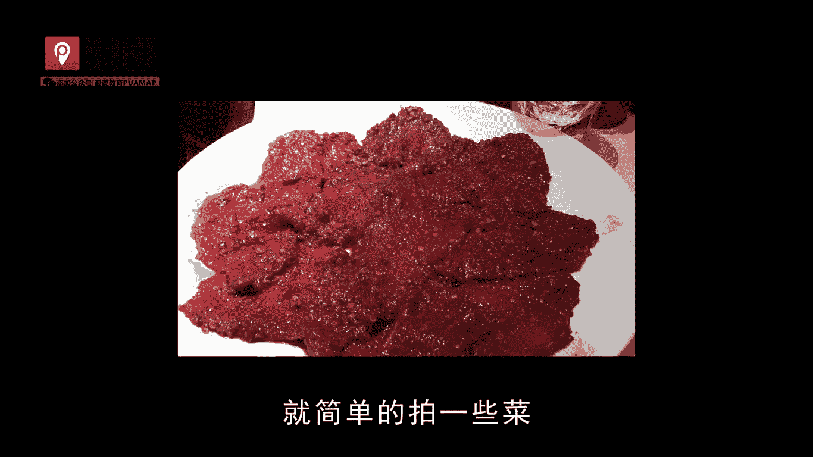

**装逼课：9：火锅装逼指南 🍲**

在本节课中，我们将学习如何在火锅店等中餐环境中，拍摄出具有互动感和生活气息的“装逼”照片。课程将涵盖拍摄食物与人物肖像的技巧，并分享如何通过构图和后期处理提升照片质感。

---

上一节我们介绍了课程主题，本节中我们来看看选择火锅作为拍摄场景的原因。

选择火锅店进行拍摄有几个原因。很多好看的姑娘喜欢吃火锅，包括小龙虾、酸菜鱼这类辣味食物。当然，普通姑娘也喜欢吃火锅。因此，在这种场合如何拍照就显得尤为重要。

---

在了解了场景选择后，我们来看一个具体的创意拍摄案例。

我曾在朋友圈发过一张有创意的火锅照片，被很多人模仿。那张照片的拍摄方法是：我面对镜头，夹起一块烫好的肉，眼睛看着镜头。例如，我夹起一块肉，配文可以是“张嘴”。这种动态的配文结合当时的动作，能让手机另一端的看照片的人产生互动感，仿佛我在喂他吃东西。这是一个有效的技巧。

---

除了人物互动，食物的拍摄也至关重要。以下是拍摄火锅食材的方法。

拍摄火锅时，一定要等到锅底沸腾，拍出热气腾腾的感觉，这样照片才有食欲和质感。我拍摄火锅通常采用长方形构图和正方形构图两种方法。需要注意的是，火锅锅体本身是主体，食材只是搭配。我习惯从45度角进行拍摄。通过不断调整位置来寻找最佳感觉。你也可以单独拍摄锅体和各种食材。

以下是拍摄示例，请注意观察构图感觉：

可以看到，这些食材从45度角拍摄显得特别诱人。记住这种感觉，拍摄时边缘要留出一些空间。对于长方形构图，锅体位于画面中心线，周围搭配食材。另一种拍摄角度是从上往下俯拍，如果你掌握不好角度，这是最简单的方法。拍摄时注意，如果有人影，身体需稍微侧开，相机垂直拍摄能营造丰盛感，再结合后期修图，照片效果就出来了。侧拍的关键是拍出纵深感。

---

拍完食物，接下来我们学习如何拍摄人物肖像。

如果要拍摄你自己，可以进行演示。你假装要吃火锅，让朋友按照之前教的构图方法摆好镜头。最重要的是画面不要歪斜。手机按此方式拍摄即可。可以拍出认真吃饭的感觉，后期再进行调整。如果觉得画面顶部有多余部分，可以裁剪掉或让镜头更近一些。**千万不要从下往上仰拍**，那样会压缩人物比例。平拍能营造很好的氛围感，表情丰富会让看照片的人好奇你当时为何做那个表情。基本比例如此，主要是记录生活。

---

掌握了基本拍摄技巧后，我们来看看如何通过选择地点和发布内容来提升整体效果。

火锅这个素材受欢迎，是因为我认识的很多漂亮姑娘都爱吃火锅。在与妹子聊天时，常会聊到食物。火锅有一个优点，你需要知道哪些品牌比较好。例如成都春熙路的小龙坎，需要排很久的队；上海的歌老官，也非常著名。知名火锅还有很多，如大龙燚、大龙燚等。吃火锅一定要选择知名一点的店，然后在朋友圈定位，配上自己的照片。这样整个朋友圈内容就丰富了。

---

最后，我们来总结一下核心要点并避免常见错误。

照片的重点是不要显得刻意。之前有人说拍照时玩手机，我认为不要这样做，因为太多人这样做，而且吃饭拍照时盯着手机会显得很奇怪。你可以放慢动作，让朋友架好镜头连续拍摄，然后从中挑选最自然的一张即可。这就是记录吃火锅的过程。讲解这个重点是因为火锅确实很多女生喜欢。

---

**本节课总结**
本节课我们一起学习了在火锅店拍摄“装逼”照片的完整流程。我们从选择场景的原因讲起，学习了创意互动拍摄、食物构图技巧（45度角侧拍、俯拍）、人物肖像拍摄方法，以及如何通过选择知名店铺和自然抓拍来提升朋友圈内容的质量。核心在于营造自然的生活感和互动性，避免刻意摆拍。

---

如何添加浪迹教育微信公众号？
在添加朋友里点击公众号。
在搜索框里输入浪迹教育。
点击浪迹教育。
点击关注。
