# 男士个人形象班（中级版）VIP课程：第10节：单品搭配技巧

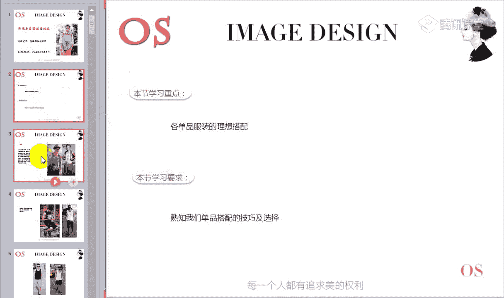

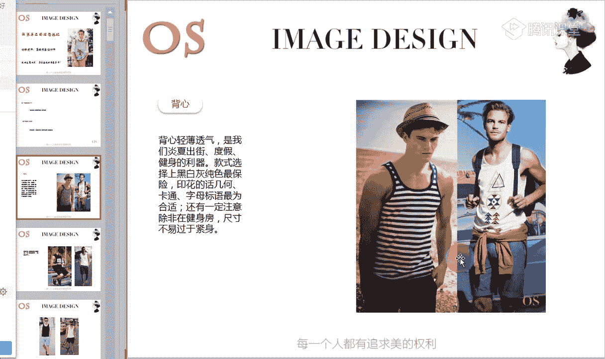

在本节课中，我们将学习各类服装单品的理想搭配方法。我们将从内搭到外套，逐一讲解不同单品的搭配技巧、选择要点以及需要避免的误区，并结合之前学习的体型与配饰知识，帮助你构建协调且有型的整体造型。

---

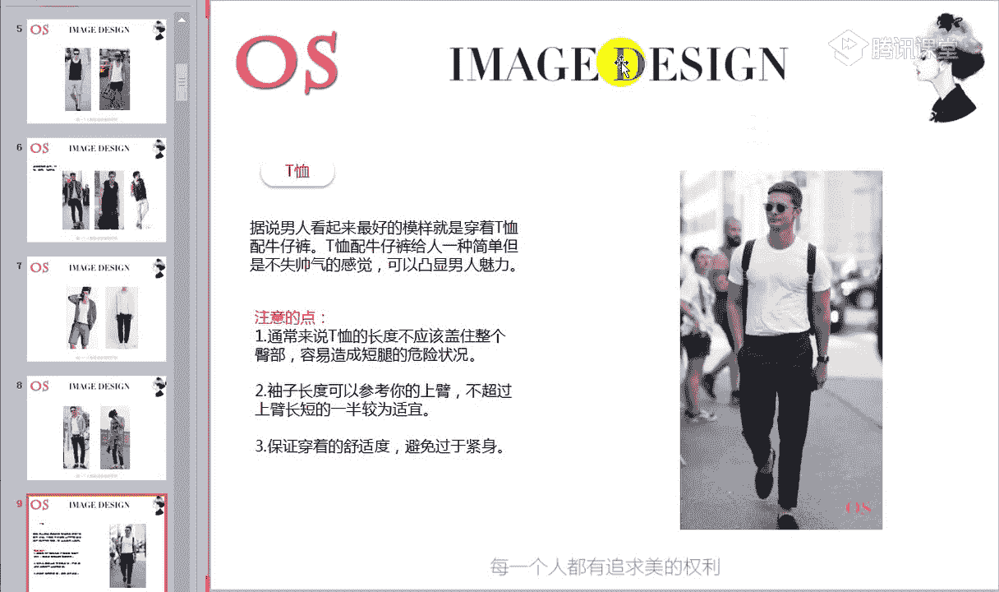

上一节我们介绍了体型与配饰的运用，本节中我们来看看如何将衣橱中的各类单品进行有效搭配。

## 内搭：背心

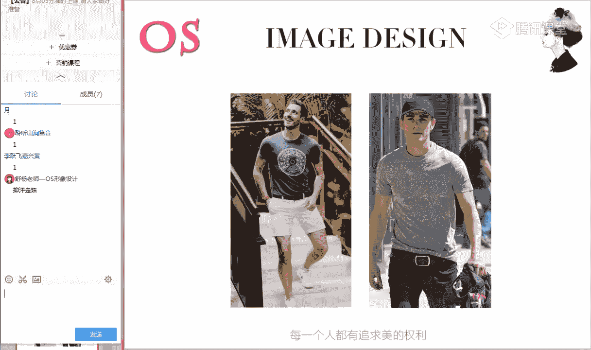

背心是男士夏季的常备单品，因其轻薄透气，适合出街、度假或健身等场合。

以下是背心的选择与搭配要点：

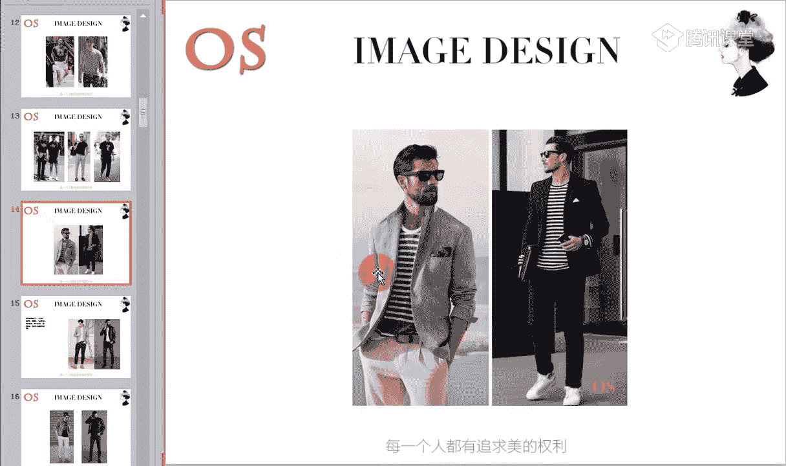

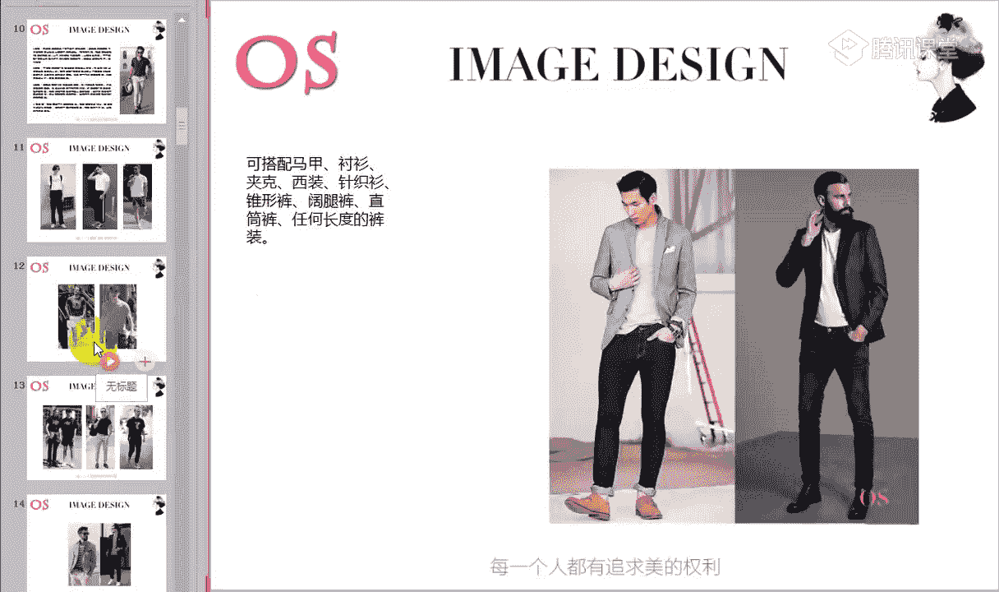

*   **款式选择**：黑白灰等纯色款式最为保险。印花、几何、卡通或字母标语的款式也合适。
*   **版型注意**：除健身场合可选择紧身运动背心外，日常休闲穿着应避免过于紧身，以**适当宽松**的版型为主。
*   **搭配建议**：
    *   **单穿时**：最佳搭配是短裤，能凸显休闲感。搭配长裤时协调度较低。
    *   **作为内搭时**：可与马甲、衬衫、夹克或针织衫进行叠穿，此时再搭配长裤就会显得协调。

## 核心上装：T恤

T恤搭配牛仔裤是经典的休闲造型，简单帅气。锥形裤搭配T恤同样好看，并能帮助拉长下半身比例。

以下是T恤穿着与搭配的核心要点：

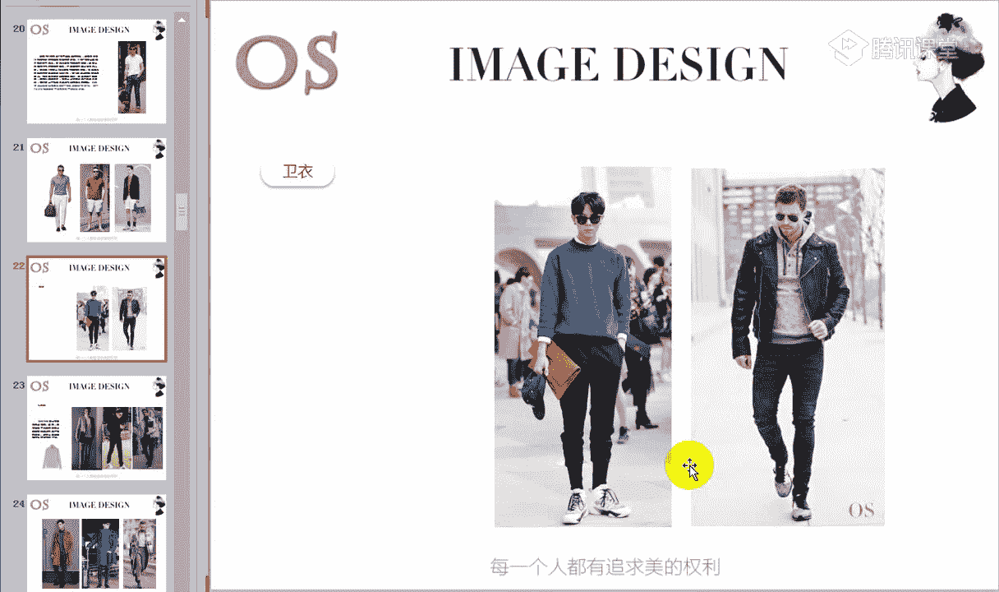

*   **版型与尺寸**：
    *   **衣长**：单穿时，衣长不宜盖住整个臀部，以免显腿短。公式：`理想衣长 < 臀部底端`。
    *   **袖长**：短袖长度以上臂一半为宜，最能凸显雄性感。五分袖可根据款式选择。
    *   **松紧度**：避免过于紧身或过于宽松，选择**合身且略有宽松度**的版型最为适宜。
*   **四种百搭色彩**：
    1.  **白色**：基础必备款。作为内搭可搭配任何外套（牛仔外套、机车夹克、休闲西装、风衣等）；单穿可搭配任何裤型。它还能在叠穿中作为“配饰”，露出边角以增加层次感。
    2.  **灰色**：中性色，适合大多数人，能通过阴影效果凸显身材。但出汗时汗渍较明显，需注意使用止汗产品。
    3.  **黑色**：百搭，但夏季全身黑色易显沉闷。搭配时可通过**浅色下装**、**有趣印花的裤装**或利用**配饰**（亮色鞋子、包包）和**不同材质**的对比来增加层次与清爽感。
    4.  **海军蓝**：比黑色更显轻松，明度较高。搭配浅色牛仔裤或米色系棉麻裤都很合适。
*   **图案选择**：条纹T恤今年很流行，适合打造清爽休闲风格，适合自然、阳光前卫等风格。
*   **外套搭配**：T恤可作为内搭，与马甲、衬衫、夹克、休闲西装、针织衫等搭配，适应从休闲到一般职业的多种场合。
*   **领型选择**：
    *   **V领**：能拉长颈部线条，有显高显瘦效果，适合圆脸或宽脸型。但长窄脸型或胸部单薄者应避免深V领。
    *   **圆领**：适合大多数脸型，对瘦弱体型有平衡作用。
    *   **Polo衫**：材质较硬挺，有显瘦效果，适合O型或上半身偏胖的体型，在一般职业场合和休闲场合都适用。
*   **穿着方式**：将T恤下摆塞进裤子可以塑造更好的身材比例，显得利落帅气。

## 休闲上装：卫衣与针织衫

### 卫衣
卫衣搭配自由度很高。
*   **外搭**：可搭配夹克、大衣、风衣等。
*   **内搭**：可选择T恤或衬衫。
*   **下装**：建议搭配休闲款式的裤装，如牛仔裤、运动休闲裤等。

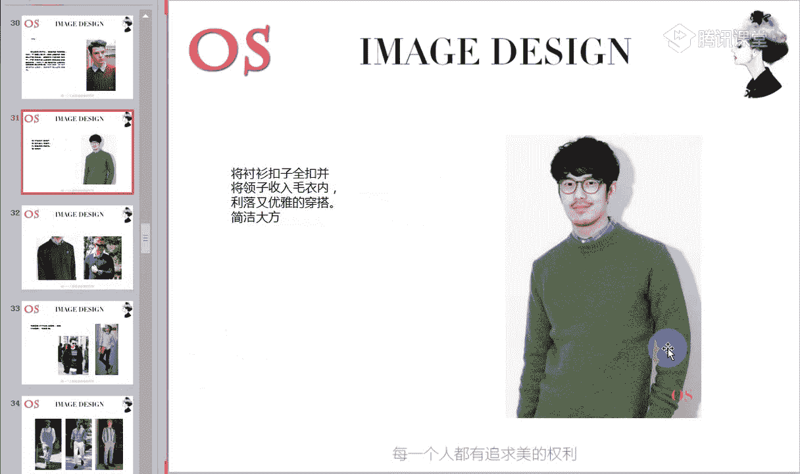

### 针织衫
我们重点介绍薄款贴身针织衫，因其品质感强，适用场合广泛。
*   **高领毛衣**：
    *   **适合人群**：脖子修长者。脖子短或偏胖者应避免，可选择V领。
    *   **搭配**：可搭配西装、夹克、大衣。北方室内有暖气，可采用“薄款高领毛衣+夹克+大衣”的层搭法。
*   **圆领/V领毛衣**：
    *   **内搭**：可搭配衬衫或T恤。
    *   **外套与下装**：搭配选择与高领毛衣类似，下装选择适合自己体型的裤型即可，如直筒裤、锥形裤。
*   **开襟毛衣**：
    *   同样可与衬衫或T恤做内搭，具体选择需结合个人风格。

## 经典单品：衬衫

衬衫通过细节调整能散发不同味道。

*   **穿着细节**：
    *   **扣子全扣，领子外翻**：显得斯文，有学院风。
    *   **解开1-2颗扣子，领子拉出**：显得随性。
    *   **扣子全扣，领子收入毛衣内**：显得利落、优雅、成熟。
*   **花色搭配原则**：当毛衣/卫衣为花色时，内搭衬衫应选素色；反之亦然。
*   **古巴领衬衫**：今年非常流行，适合休闲场合。各风格男士均可尝试，主要在**材质、色彩和图案**上根据自身风格调整（如古典风选硬挺材质，浪漫风可选重磅真丝）。
    *   **搭配方法**：内搭圆领T恤，外搭古巴领衬衫是经典穿法。可搭配短裤、直筒裤、锥形裤或阔腿裤。外套可搭配休闲西装或风衣，领子无需藏入。
*   **下摆处理**：
    *   **休闲衬衫（平摆）**：适合放出来穿。衣长不宜超过裤子拉链中部，以免显腿短。也可采用“塞一边放一边”的穿法。
    *   **正式衬衫（圆弧摆）**：需塞进裤子里。

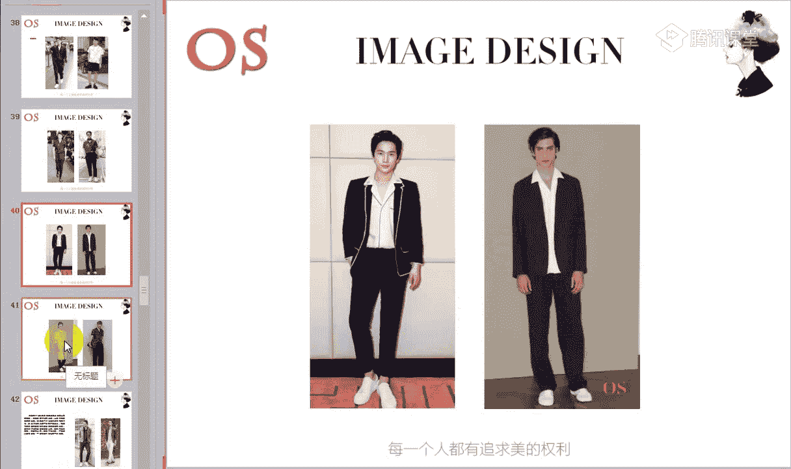

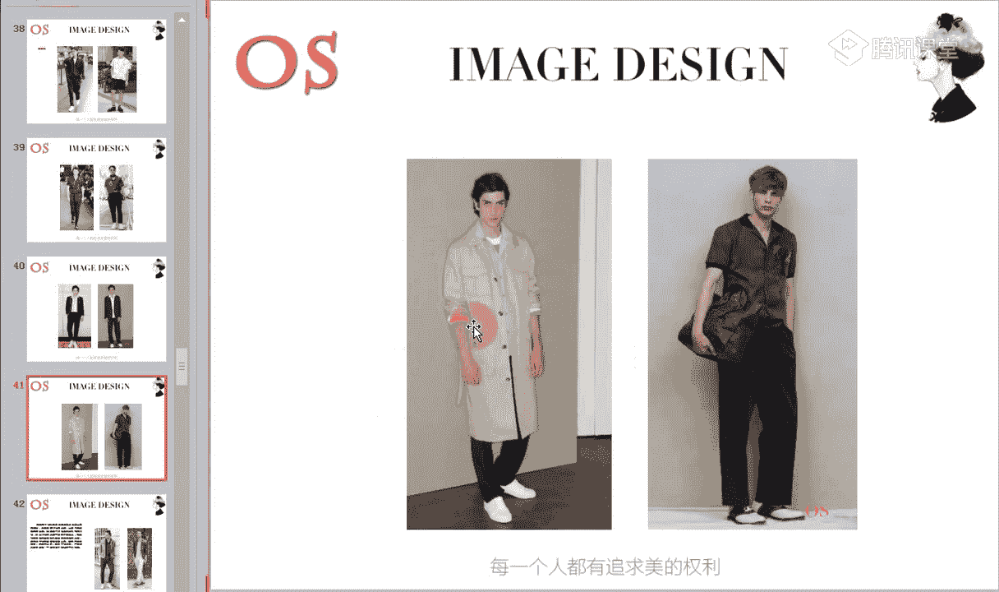

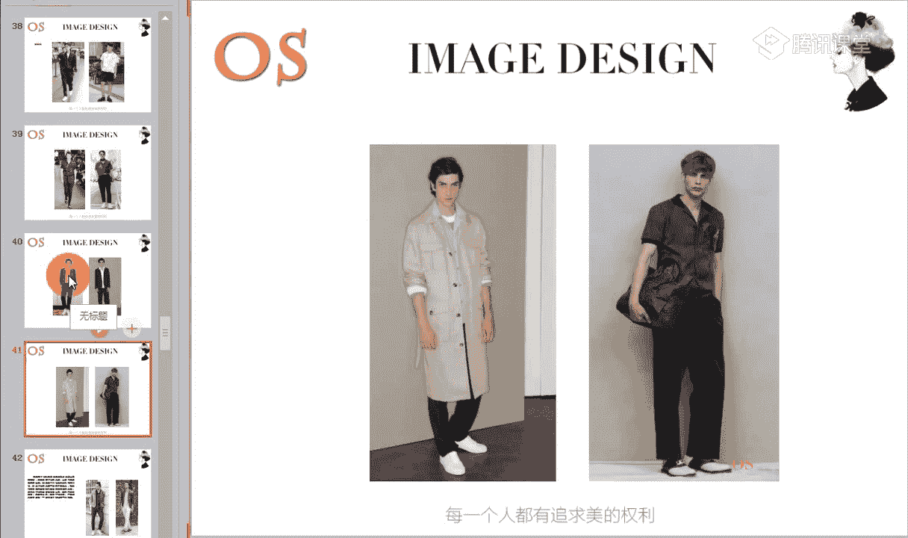

## 层次利器：马甲

马甲能在整体搭配中画龙点睛，增加层次感，尤其超短款马甲能帮助强调腰线。

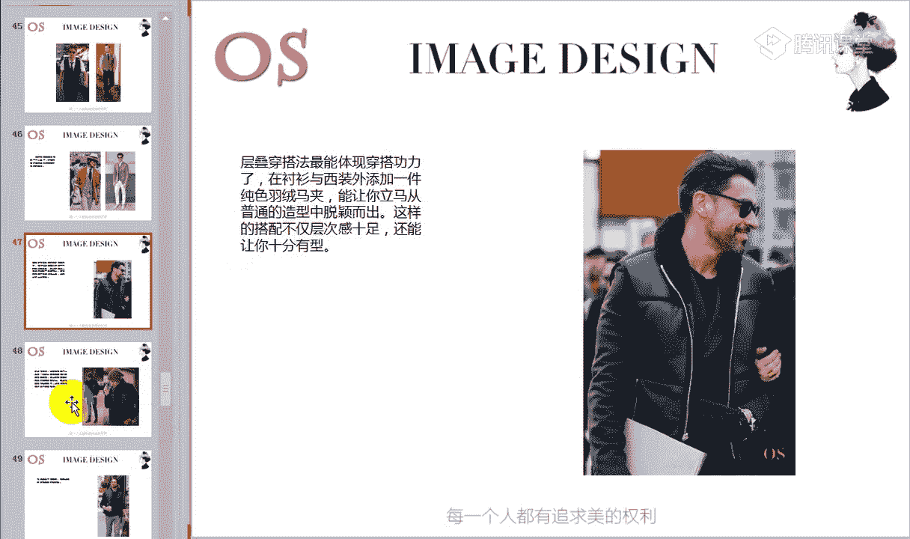

*   **搭配**：休闲款可搭配T恤；稍正式的可搭配衬衫。
*   **季节运用**：春秋或初冬，可在服饰内搭配一件马甲，兼具时尚与装饰性。
*   **层叠示范**：例如“衬衫+西装+羽绒马甲”的混搭。
*   **色彩注意**：与格纹衬衫搭配时，马甲尽量选择纯色或深色系，避免视觉杂乱。

## 外套类：夹克、羽绒服、风衣、大衣

这些外套的选择主要依据个人风格，搭配方法已在上文各类内搭中多次提及。

*   **通用原则**：选择适合自己风格的款式，结合体型进行修饰，运用常规搭配手法即可。
*   **羽绒服/棉服内搭**：避免简单套穿。即使内搭圆领或开衫毛衣，也建议内叠衬衫或T恤（露出白边），以增加质感。
*   **风衣**：通常内搭时尚正装，但也可搭配T恤或休闲装。需注意内搭单品的**质感**，应选择精致、平整的面料（如细针织衫、有质感的T恤），避免粗糙款式。
*   **大衣**：可搭配毛衣、T恤、卫衣或正装西装。根据个人风格和身材选择合适的款式与材质。

## 下装焦点：阔腿裤

阔腿裤是近年流行趋势，2018年依然盛行。

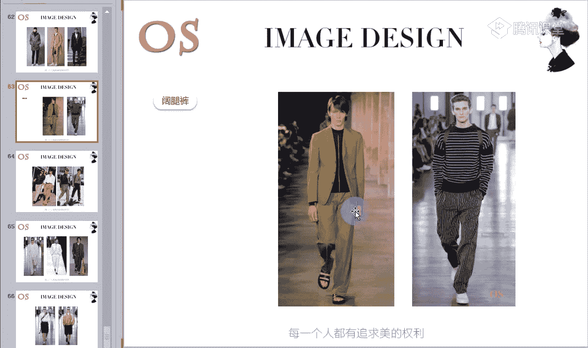

*   **适合人群**：风格适合且**个子高**的男士。个子不高的男士因其外放廓形容易显矮，应避免。
*   **搭配**：非常百搭，可与西装、针织衫、风衣、夹克等上衣搭配。“宽松上衣+阔腿裤”或“合体上衣+阔腿裤”都能塑造不同感觉。
*   **五分阔腿裤**：同样流行，适合高个子男士，可搭配运动夹克、衬衫或T恤。
*   **连体裤**：选择时可参考适合自己风格的夹克款式（如飞行员夹克式）。但臀部大的男士不适合。

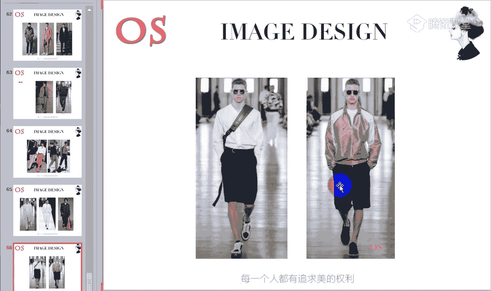

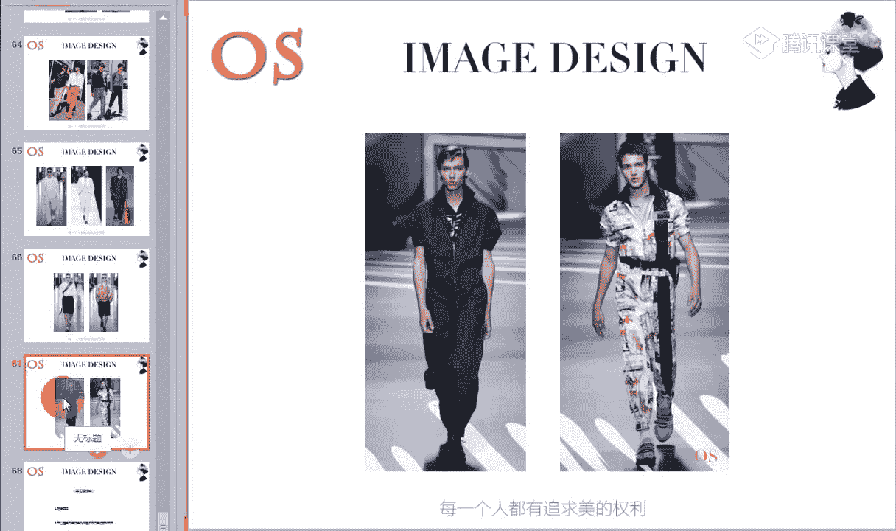

---

本节课中我们一起学习了从背心、T恤到外套、裤装等各类单品的搭配技巧。核心在于：**首先根据个人风格、体型和场合选择适合自己的单品，然后运用今天所学的常规搭配手法与细节技巧进行组合**。从基础搭配开始，多参考时尚资讯，逐步培养自己的搭配感觉，你就能轻松塑造出有型且得体的个人形象。

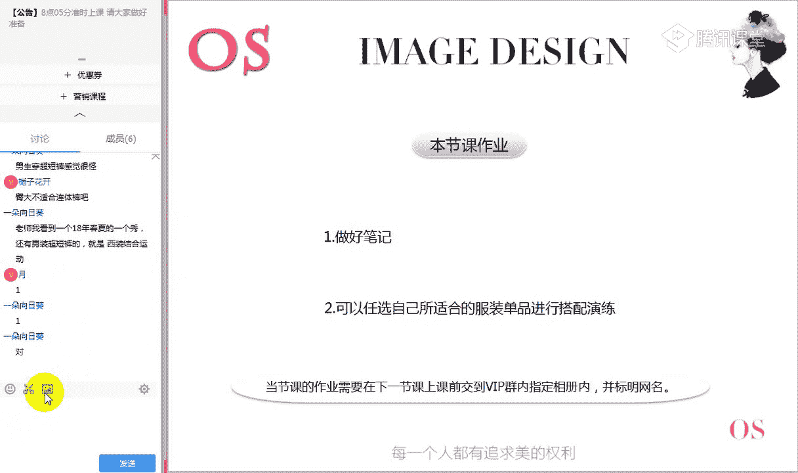

请根据本节课所学，整理笔记，并尝试用自己衣橱中适合的单品进行搭配演练，或寻找对应的搭配图片作为作业。通过实践来巩固和提升你的搭配功力。