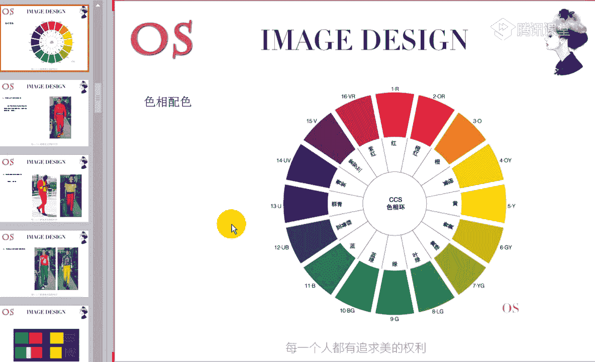
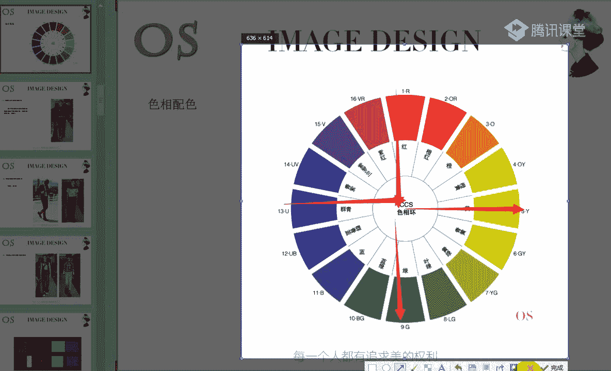
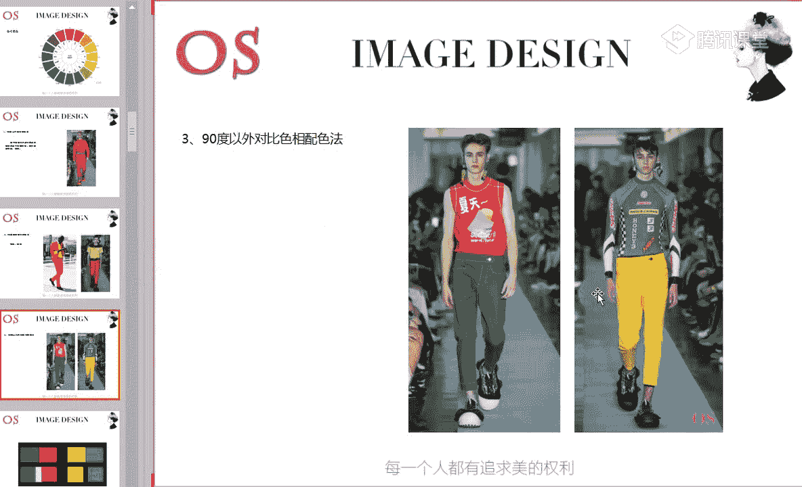
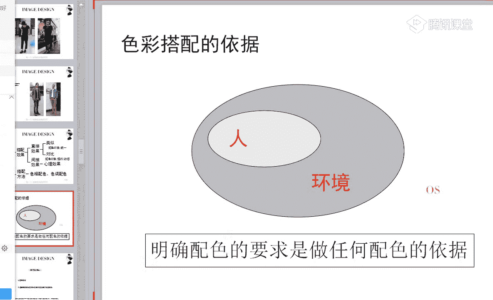

# 男士个人形象班（中级版）VIP课程：第11节：服装配色原则 👔

在本节课中，我们将要学习服装配色的核心原则与实用技巧。色彩搭配是塑造个人形象的关键环节，掌握其规律能让你的着装更具风格与和谐感。我们将从基础概念入手，逐步解析色相与色调的搭配方法，并学习如何在实际穿搭中运用主色、辅助色与点缀色。

---

## 色相配色与色调配色

上一节我们介绍了色彩搭配的重要性，本节中我们来看看其两大基础：色相配色与色调配色。服装色彩搭配的本质，可以概括为以下两个核心方面：

*   **色相配色**：以色相环为基础进行的颜色组合。
*   **色调配色**：以颜色的明度和纯度（即色调）为基础进行的颜色组合。

理解这两点，就掌握了色彩搭配的绝大部分精髓。

### 色相配色法

色相配色，即以色相环为基础进行色彩搭配。专业的形象顾问会使用CCS色相环作为工具，其中标注了每个色彩的名称、位置及英文缩写。

以色相环上颜色的角度关系为依据，色相配色可分为以下三类：

1.  **90度以内的色相配色**
    *   **概念**：在色相环上选择角度在90度以内的两个邻近色彩进行搭配。
    *   **效果**：这种搭配会带来**稳定、统一、和谐**的视觉感受。例如，红色与橙色的搭配。

2.  **90度左右的色相配色**
    *   **概念**：在色相环上选择角度大约为90度的两个色彩进行搭配。
    *   **效果**：这种搭配会带来**活泼、动感、丰富**的视觉感受。例如，红色与黄色的搭配。如果想减弱这种活泼感，可以调整两个颜色的面积比例。

3.  **90度以外的对比色相配色**
    *   **概念**：在色相环上选择角度大于90度（尤其是180度对比色）的两个色彩进行搭配。
    *   **效果**：这种搭配会产生**夸张、戏剧化、与众不同**的视觉效果。例如，蓝色与橙色的搭配。
    *   **注意事项**：使用此法时需注意两点：一是**控制面积比**，明确主次；二是可使用**黑白灰等中性色进行隔离**，以缓和强烈的对比冲击。

### 色调配色法

接下来我们看看色调配色。色调图是专业形象顾问使用的另一工具，它展示了色彩因加入黑、白、灰后形成的不同明度与纯度关系。

色调图主要分为三大区域：
*   **明清色调**：原色加白形成的色调。
*   **暗清色调**：原色加黑形成的色调。
*   **浊色调**：原色加灰形成的色调。

在色调图中，横向代表纯度变化，纵向代表明度变化。

以色调的邻近关系为依据，色调配色也可分为三类：

1.  **同一色调配色法**
    *   **概念**：在色调图中选择**同一个色调**内的不同颜色进行搭配。
    *   **效果**：带来**极度和谐、统一**的视觉效果。即使色相不同（如红与蓝），因色调一致，整体依然和谐。

2.  **类似色调配色法**
    *   **概念**：在色调图中选择**相邻的两个色调**中的颜色进行搭配。
    *   **效果**：表达**类似的色调情感**，效果和谐且富有层次感。可以是相同色相不同色调，也可以是不同色相。

3.  **对比色调配色法**
    *   **概念**：在色调图中选择**间隔较远（如隔一至两个色调以上）** 的两个颜色进行搭配。
    *   **效果**：形成**鲜明的对比效果**。若想使对比更和谐、有质感，可遵循一个原则：**色调远，则色相近**。即当两个颜色色调对比强烈时，让它们的色相在色相环上尽量靠近。

---

## 服装配色的角色

理解了基础配色方法后，我们来看看如何在具体穿搭中组织色彩。就像戏剧中有主角和配角，服装配色中的色彩也有主次之分，即**主色、辅助色和点缀色**。

以下是各角色的定义与作用：

*   **主色**
    *   **定义**：占据全身服装面积**60%以上**的颜色，如大衣、套装、长裤或长裙。
    *   **作用**：决定了整体服装配色的**风格和基调**。例如，深蓝色主色带来稳重感，丹宁蓝主色则更显休闲轻松。

*   **辅助色**
    *   **定义**：与主色搭配，占据全身面积**40%左右**的颜色，通常是上衣、衬衫、背心等。
    *   **作用**：与主色共同构成搭配的主体框架，丰富层次。

*   **点缀色**
    *   **定义**：面积小（约**5%-15%**），但**视觉效果醒目**的颜色或图案。常见于领带、丝巾、腰带、鞋子、包袋、饰品或服装的局部设计中。
    *   **作用**：起到**画龙点睛**的作用，提升造型的精致度和层次感。
    *   **关键原则**：全身的**视觉焦点（亮点）最好只有一个**。若要突出点缀色，其他服装的色彩应相对低调暗淡，以形成衬托。

---

## 实用配色技巧与注意事项

在实际搭配中，除了掌握角色，还有一些实用技巧能让你的配色更出彩。

### 1. 呼应法
当穿着有复杂图案或多种颜色的单品时，可以从该单品中提取一种颜色，用于其他配饰（如鞋子、腰带），形成色彩呼应。这能使整体配色融为一体，更具整体感。

### 2. 同色系搭配的层次感
穿着上下同一种颜色时，为避免沉闷，需通过以下三点营造层次：
*   **工艺**：利用服装本身的剪裁、口袋、纽扣、铆钉等设计细节。
*   **材质**：运用不同面料的光泽感、纹理差异（如哑光与亮光、针织与皮革）。
*   **配饰**：巧妙使用围巾、胸针、包包等配饰增加亮点。

### 3. 显高技巧
对于希望显高的男士，有一个简单原则：**让鞋子的颜色与裤子的颜色尽量接近或一致**。这能在视觉上延伸腿部线条，避免因色彩分割而显腿短。尽量避免裤子和鞋子颜色对比强烈，或穿着高帮鞋搭配短裤。

### 4. 万用搭配色
当你不想在配色上花费太多心思时，**黑、白、灰**是永恒的万能色，它们能与任何颜色和谐共处。

---

## 总结与核心心法

本节课中我们一起学习了服装配色的系统知识。我们来回顾一下核心要点：

1.  色彩搭配基于**色相配色**和**色调配色**两大原理。
2.  在实际穿搭中，要分清色彩的**主色、辅助色和点缀色**，并遵循“一个焦点”原则。
3.  通过**呼应法**、注重**同色系的层次感**、利用**鞋裤同色**等技巧，可以提升搭配效果。
4.  一切配色行为的根本依据是：**明确配色的要求**。这要求综合考虑**个人风格与色彩季型、所处场合、以及你想要表达的视觉感受**。

记住这句话：**当你了解自己的用色范围，再根据场合、环境及想要达到的效果，运用色彩搭配技巧进行组合，就一定能打造出和谐又具个人风格的着装。** 色彩搭配并不复杂，掌握规律，大胆实践，你就能成为配色高手。