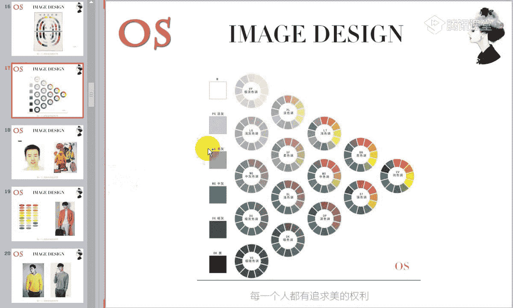
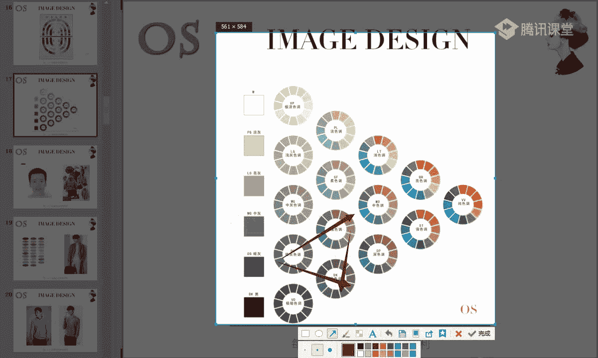
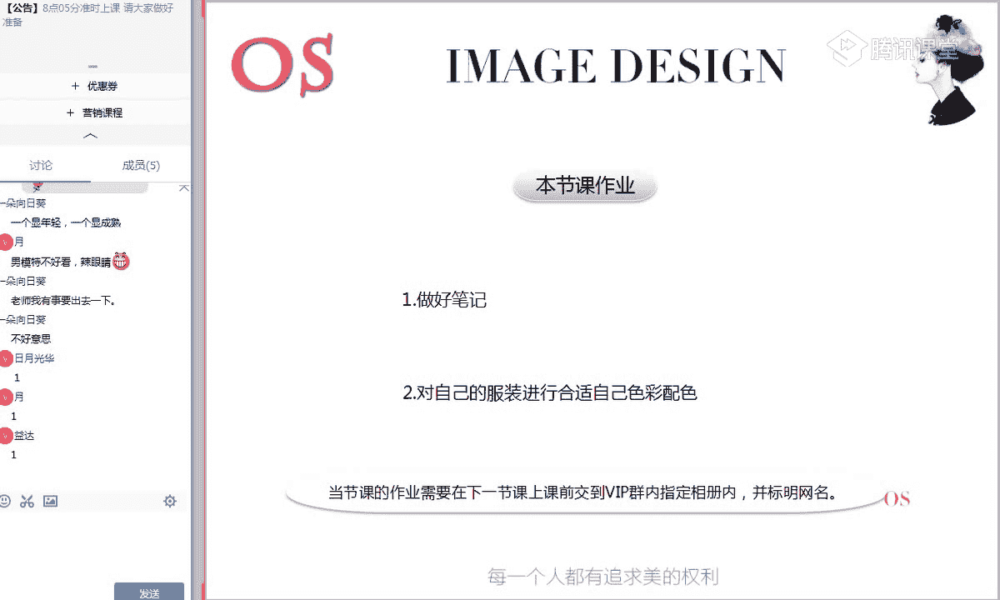

# 男士个人形象班（中级版）VIP课程：第12节：色彩季型分析 🎨

在本节课中，我们将要学习色彩季型分析。上一节课我们学习了色彩搭配的技巧，其中提到了对比、类似等配色手法。本节课，我们将根据不同的色彩季型，为大家推荐合适的配色方案。

## 课程概述

本节课的学习重点有两个：
1.  了解各色彩季型的用色特征。
2.  掌握自身色彩季型的配色规律。

对于大家的要求是：掌握好自身用色的范围，以及服装配色的规律。

## 四季色彩理论简介

首先，我们来简单介绍一下四季色彩理论及其由来。

我们现在使用的四季色彩理论，是当今国际时尚界十分热门的话题。它于20世纪70年代，由“色彩第一夫人”——美国的卡洛尔·杰克逊女士发明，随后迅速在欧美风靡。之后，由日本的佐藤太子引入日本，并研制成了适合亚洲人肤色的体系。

因此，在运用四季色彩理论判断他人季型时，切勿以欧美人为例。因为我们目前适用的理论是经过改良的，更适合亚洲人。

在1998年，由于西蔓女士将四季色彩理论引入中国，并针对中国人的肤色特征进行了相应改造。四季色彩理论带来了巨大的影响，也为各行各业的色彩应用技术带来了巨大进步。目前，色彩季型与风格分析在国内仍处于发展阶段。

## 人体色彩与三属性

人和万事万物一样，也是有颜色的，因此同样具有色彩的三属性特征。

我们通常会用形容词来描述一个人，例如“头发乌黑”、“皮肤白皙”、“嘴唇暗红”等。虽然在通常认识中，亚洲人被认为是黄皮肤、黑头发，但事实上，只要稍加留意，就会发现没有两个人的肤色、眼睛和毛发颜色是完全一致的。

科学证明，人体的体色主要由以下三种色素综合影响决定：
1.  **血红色素**（血红素）
2.  **核黄素**（胡萝卜素）
3.  **黑色素**

这三种色素都受遗传基因影响。因此，在没有基因病变或人为改变的情况下，人体色基本呈现终身不变的特征。它会像血型、指纹一样伴随每个人一生。即使脸上出现瑕疵、皱纹或逐渐衰老，人体色属性也不会改变。

在人体色中，头发的颜色可以染烫，嘴唇和眉毛的颜色可以描画或纹绣，瞳孔色也可以通过有色隐形眼镜改变。但只有肤色是相对稳定的，且在人体中比例最大。因此，在研究人体色时，我们主要以皮肤为主要对象，毛发、瞳孔色和唇色等作为辅助。

## 肤色与色彩三属性的关系

接下来，我们回顾一下色彩三属性对肤色的影响。

### 冷暖之分

肤色同样有冷暖之分。
*   **暖肤色**偏向珊瑚红，整体不泛青色，皮肤中透出自然的红润感。
*   **冷肤色**整体会有泛青的感觉，无论肤色深浅。

通过冷暖色布的对比可以发现：暖肤色的人驾驭色彩的范围相对更广。当暖肤色遇到冷色相时，可能只是显得皮肤有些暗黄；而冷肤色的人如果尝试暖色相，皮肤会显得不清透、有厚实感。

### 明度之分

肤色也有高明度、中明度和低明度之分。皮肤的明度决定了你对色彩明度的选择。
*   如果你是**高明度肤色**（如夏季型、春季型），就更适合高明度的色彩。
*   如果你是**低明度肤色**（如冬季型、秋季型），则更适合低明度的色彩。

如果低明度肤色选择了中高明度的色彩，会显得皮肤不仅厚实，还会显黑。色彩具有很大的修饰作用，是最快调整肤色视觉效果的方法。

### 纯度之分

肤色同样有纯度高低之分。
*   **高纯度肤色**（如春季型、冬季型）可以驾驭高纯度的色彩。
*   **低纯度肤色**（如夏季型、秋季型）则需要选择低纯度的色彩。

合适的色彩会让皮肤更加通透、自然，呈现好看的红润感，起到类似薄透粉底的修饰作用，能调整痘印、斑点等瑕疵。而不适合的色彩则会让毛孔问题明显，皮肤显得呼吸不畅。

## 四季色彩象限与心理联想

四季色彩可以用一个十字象限图来概括：纵向为“轻”与“重”，横向为“暖”与“冷”。

根据视觉平衡原理，当服饰色与人体色具有共同属性时，易于调和，会产生和谐美感。根据自己的“冷暖、轻重、艳浊”等关键词来搭配组合，会呈现一定的规律性。

以下是各季型用色范围带来的心理联想：

*   **春季型**：色彩给人类似**活力、青春、阳光、明快、生机勃勃**的感觉。整体印象是年轻、活泼、健康、朝气、时尚。
*   **夏季型**：色彩给人类似**清新、柔和、宁静、淡雅、朦胧**的感觉。整体印象是知性、儒雅、潇洒。
*   **秋季型**：色彩给人类似**浓郁、华贵、丰收、稳重、成熟**的感觉。整体印象是亲切、随性、敦实。
*   **冬季型**：色彩给人类似**鲜明、纯正、庄重、理性、大气**的感觉。整体印象是鲜明、理性。

## 各季型详细分析与搭配要点

接下来，我们逐一详细分析每个色彩季型。

### 春季型分析

春季型男士是暖色基调，肤色较为白皙，脸颊有自然的珊瑚粉或桃粉色红润感，整体印象年轻、有朝气。

**用色特征**：
*   **色调**：适合**明清色调**（所有加白的色彩）和**浊色调**（所有加灰的色彩）中的浅灰色调。
*   **正式场合**：可采用**极暗色调（VD）** 和**暗色调（DK）** 中的色彩。
*   **配色**：适合**对比配色**，突出**清晰的色相感**。适合色相配色，即红是红、黄是黄，色相明确。
*   **基础色**：可大量使用白色、驼色、暗灰色。

**搭配要点**：
1.  商务场合使用暗青色（VD/DK色调）时，搭配要尽量清晰对比（如藏蓝西装配白衬衫）。
2.  场合允许时，可适当点缀鲜艳色（如领带、口袋巾）。
3.  非严肃职业场合可大胆使用大面积浅淡色彩。
4.  **避免**搭配出陈旧、暗浊的色彩印象，避免使用浊色调中过于浑浊的颜色。

### 秋季型分析

秋季型男士同样是暖色基调，但肤色更显密实、匀整，泛橙黄色，脸颊不易出现红润感。整体印象沉稳、成熟、稳重。

**用色特征**：
*   **色调**：适合**浊色调**和**暗青色**调中浓郁、浑厚的暖色相色彩。
*   **配色**：适合**突出色调感**。适合类似配色、弱对比或中对比的色调配色。
*   **领带**：适合选择深色、稳重的领带。棕色系与无彩色（黑、白、灰）搭配能凸显贵气感。

**搭配要点**：
1.  商务场合以暗青色与明清色的搭配为主。
2.  隆重场合可适当点缀中高纯度的颜色（如深色调色彩）。
3.  非严肃场合可大面积使用浊色调色彩进行搭配。
4.  **必须回避**明显鲜艳的色彩。

### 夏季型分析

夏季型男士是冷色基调，肤色泛青的米白色，可能带有淡淡粉色红润。整体印象温和、亲切。

**用色特征**：
*   **色调**：适合清新、浅淡、恬静的冷基调色彩。多使用**浊色调**中浅淡的色彩，以及**明清色调**中浅淡的色彩。
*   **挑战暖色**：如要尝试暖色，选择挺括面料，且**浅淡暖色优于深色暖色**。
*   **配色**：适合**突出色调感**，避免色相配色。

**搭配要点**：
1.  商务场合选择严谨色彩，搭配时色相尽量类似（如同色相不同调子的蓝色搭配）。
2.  尽量使用明清色中的浅淡色彩。
3.  非严肃职业场合大量采用清浅的浊色调。
4.  休闲场合可适当点缀高明度的鲜艳色，但尽量使用浊色调或明清色调。
5.  **避免**穿着过于沉稳的色彩。

### 冬季型分析

冬季型男士是冷色基调，肤色密实、厚重，可能带暗黄褐色或发青的黄白色，脸颊不易红润。头发乌黑浓重，与肤色对比鲜明。整体印象个性分明、与众不同。

**用色特征**：
*   **色调**：适合纯正、饱和度高的冷基调色彩。非常适合**暗青色**调和部分**明清色**调，以及深的艳色。
*   **配色**：适合**对比清晰的搭配效果**，突出**色相感**。适合色相配色。
*   **基础色**：黑色和正蓝色非常适合。适合有光泽感、有图案的服装。

**搭配要点**：
1.  超商务场合可大胆运用清晰的青色做对比搭配（如白衬衫配极暗色调西装）。
2.  非严肃职业场合可适当点缀饱和的鲜艳色。
3.  在需凸显个性的场合，可大胆搭配无彩色和适合的用色。
4.  **必须回避**搭配出浑浊的色彩印象。

## 各季型发型与配饰建议

以下是针对各季型的发型与配饰补充建议：

*   **冬季型**：
    *   发色：保持黑色最佳，也可染深灰色、葡萄紫（酒红色系）。
    *   饰品：亮的银色、钻石类饰品。
    *   眼镜：亮银边框或黑色边框眼镜。
*   **夏季型**：
    *   发色：紫红色、酒红色调。风格驾驭度高者可染灰色。
    *   饰品：铂金、白银、钻石类饰品。
    *   眼镜：银质金属边框、冷灰色树脂框。职业场合也可用精致细黑框。
*   **秋季型**：
    *   发色：棕色、铜色、金红色调。
    *   饰品：金色、金镶银饰品。
    *   眼镜：深棕色金色边框或深棕色树脂边框眼镜。
*   **春季型**：
    *   发色：棕黄色调。
    *   饰品：亮黄金类、有光泽感的泛黄铂金类饰品。
    *   眼镜：金丝边、浅棕色或浅橙色眼镜框。

## 课程总结

本节课我们一起学习了色彩季型分析。我们了解了四季色彩理论的由来，明白了人体色与色彩三属性（冷暖、明度、纯度）的关系。重点分析了春季型、夏季型、秋季型、冬季型四种季型的肤色特征、用色范围、配色规律以及搭配要点。

核心要点总结：
1.  **春季型**与**冬季型**适合**突出色相感**，多用**对比清晰的色相配色**。
2.  **夏季型**与**秋季型**适合**突出色调感**，多用**柔和、浑浊的色调配色**。
3.  选择合适的色彩能极大程度修饰肤色，提升个人形象质感。

请务必做好笔记，并根据自己的色彩季型，对现有服装进行合适的色彩搭配练习。