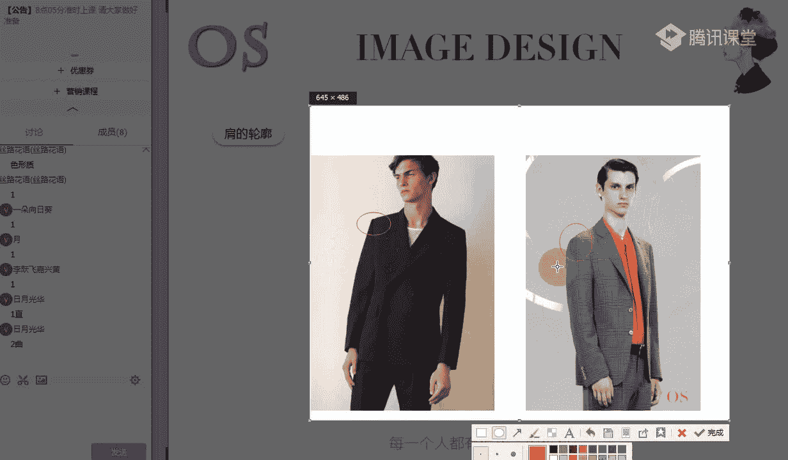
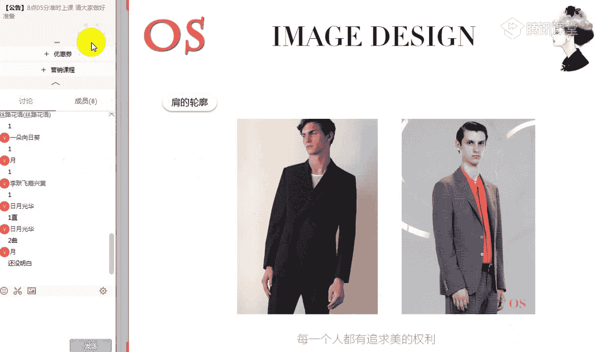
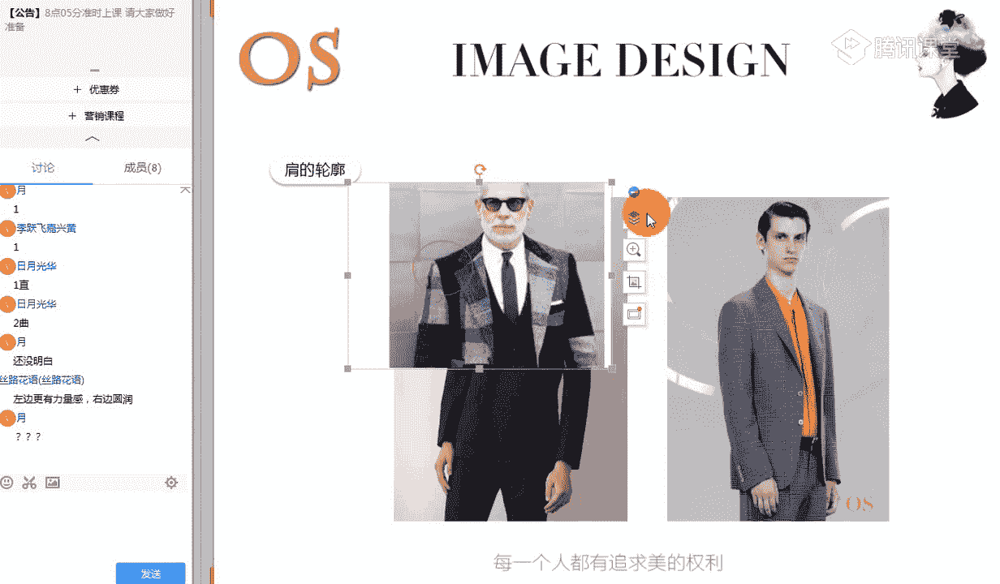
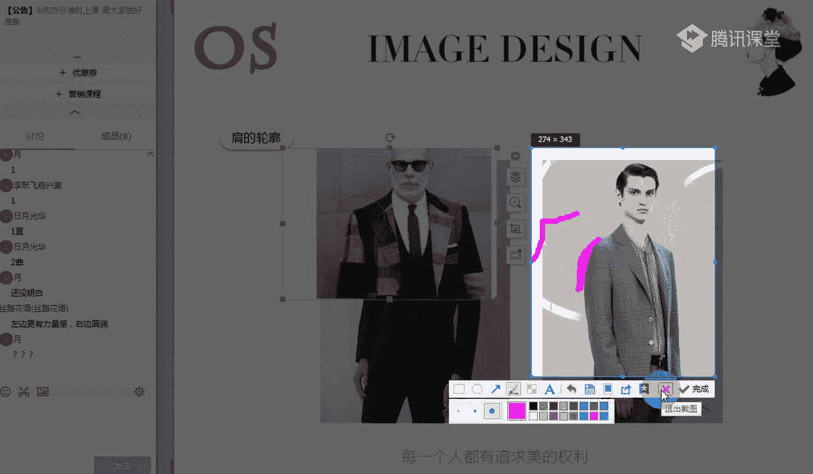

# 男士个人形象班第二期（中级版）VIP课程：第13节、款式风格认知 👔

在本节课中，我们将要学习如何认知服装的风格。我们将根据每个人的个性气质、神态、体态和性格等特征，将男士分为六种基本服饰风格类型，并重点分析构成服装风格的“型、色、质”要素，特别是“型”特征。通过学习，你将能够判断一件服装的风格属性，并理解如何为不同风格的人选择合适的服饰，从而在搭配时思路更加开阔灵活。

## 风格是什么？

上一节我们介绍了课程目标，本节中我们来看看风格的本质。风格指的是某一类事物之间的共性特征。这种共性特征必须占据主导地位，因此我们也称之为主导因素。

为了便于理解，我们可以参考两张卧室的图片。虽然它们都是卧室，但给人的视觉感受截然不同：图一可能让人感到温暖、可爱；图二则可能显得柔和、清淡或自然。这是因为它们在床的款式、色彩、材质等元素上没有共性。因此，风格就是由这些一致的“形、色、质”元素共同营造出的整体氛围与感觉。

将这个概念应用到穿搭上：如果你是自然风格的男士，就应选择自然风格的服饰；如果你是古典风格的男士，则应选择古典风格的服饰。当人的风格与服装的风格具有共性时，搭配才会和谐。当然，在主导风格明确的前提下，适当融入一些其他风格的元素，只要存在一定的共性联系，也是可以达成和谐效果的。

## 风格构成的要素：形、色、质

理解了风格的定义后，我们深入探讨其构成要素。风格的整体印象特征是由**量感**、**轮廓（直曲）**和**形态（动静）**共同奠定的。不同风格在这三方面都有差异。例如，戏剧风格与浪漫风格虽然量感都偏大，但戏剧风格轮廓偏直，而浪漫风格轮廓偏曲。

接下来，我们将对服装的“型”特征进行综合分析。

### 1. 量感的判断

首先，我们来学习如何判断服装的量感。量感在人物上指长相的年轻或成熟程度。同样，服装也会给人年轻或成熟的视觉感受。这种感受是受物体的颜色、材质、体积、粗细、宽窄、厚薄等因素综合影响产生的视觉效果，而非真实的物理尺寸。

以下是判断服装量感的几个要点：

*   **服装整体**：短款、合体、设计简洁的服装量感偏小；长款、宽松、设计复杂的服装量感偏大。
*   **领型**：领口开得深、领面宽的领型量感大；领口开得浅、领面窄的领型量感小。
*   **面料**：面料厚实、硬挺的服装量感大；面料轻薄、柔软的服装量感小。
*   **图案**：图案夸张、醒目的量感大；图案小巧、柔和的可量感小。

**核心要点**：选择服装时，服装的量感应与你面部及身材的量感相和谐。大量感风格（如戏剧型）应选择量感大的服装；小量感风格（如阳光前卫型）应选择量感小的服装。

### 2. 轮廓的直与曲

接下来，我们分析轮廓的直与曲。男装大多为直线剪裁，但仍有直曲之分，主要体现在肩型、领型、面料和图案上。

以下是判断轮廓直曲的几个角度：

*   **肩部轮廓**：肩部线条与袖子外形形成的夹角接近90度，为直线型；肩部线条自然圆润柔和，为曲线型。
    *   **公式判断**：`肩袖夹角 ≈ 90°` -> **直线型**；`肩袖线条柔和圆润` -> **曲线型**
*   **领部轮廓**：线条硬朗、有尖锐角度的领型（如标准衬衫领）为直线型；线条有弧度、圆润的领型（如青果领）为曲线型。
*   **面料质地**：面料硬挺、不易起皱的（如厚牛仔、哔叽）带来直线感；面料光滑、柔软、有光泽的（如丝绸、某些针织面料）带来曲线感。
*   **服装图案**：图案为条纹、方格等有棱角的几何图形，具有直线感；图案为圆点、花朵、流线型线条，具有曲线感。

### 3. 形态的动与静

最后，我们来探讨形态的动与静。男装的动静感与女装不同，不在于元素数量的多少，而在于元素之间搭配的效果是类似还是反差。

**核心原则**：形态的动静在于元素之间搭配效果看上去是**类似**还是**反差**。

*   **静态感**：当上下装或服装与配饰之间的材质、色彩、图案等元素搭配效果类似，对比不强时，呈现静态感。
*   **动态感**：当单品之间的元素（如材质、色彩、图案、设计）形成强烈反差时，呈现动态感。

例如，一套材质类似、色彩调子统一的棉麻套装是静态的；而一件带有多个异色口袋、图案反差大的外套，即使单独看，也因其自身设计元素间的反差而具有动态感。

## 六大男士服饰风格分析

在掌握了量感、直曲、动静的判断方法后，我们将其应用到具体的男士服饰风格中。以下是六大风格的简要分析：

1.  **戏剧型**
    *   **量感**：大（或中偏大）。
    *   **轮廓**：偏直（但直曲皆可驾驭）。
    *   **形态**：动（需穿出元素反差感）。
    *   **服饰要点**：适合夸张、醒目、摩登、存在感强的服装，如宽松大领口、枪驳头西装。适合舞台感、时尚度高的搭配。

2.  **自然型**
    *   **量感**：中偏大。
    *   **轮廓**：偏直。
    *   **形态**：中偏静（适合穿出类似感）。
    *   **服饰要点**：适合宽松、随意、潇洒、运动感强、天然质感的面料和花纹，如棉麻、格纹、几何纹。

3.  **古典型**
    *   **量感**：中至大（中偏大）。
    *   **轮廓**：偏直。
    *   **形态**：适中（需穿出一定反差，但不宜过大）。
    *   **服饰要点**：适合精致、合体、面料挺括、图案规则匀称的服装。对材质和工艺要求高，追求高级感和严谨感。

4.  **浪漫型**
    *   **量感**：中至大（中偏大）。
    *   **轮廓**：曲。
    *   **形态**：动（需穿出反差感）。
    *   **服饰要点**：适合华丽、有光泽感、细腻柔软的面料，以及曲线感的图案。通过材质和设计体现性感、华美的氛围。

5.  **新锐前卫型**
    *   **量感**：小（或中偏小）。
    *   **轮廓**：偏直（可用直线元素控制少量曲线元素）。
    *   **形态**：动（需穿出反差与个性）。
    *   **服饰要点**：适合时尚、个性、别具一格、对比分明的服装，如皮夹克、光泽感面料、造型独特的配饰。

6.  **阳光前卫型**
    *   **量感**：小。
    *   **轮廓**：偏曲。
    *   **形态**：中偏静（适合穿出类似感）。
    *   **服饰要点**：适合年轻、有活力、带学生气、时尚感强的服装。可使用一些有光泽或新颖的面料，以及利落的小领口、可爱图案等来适当表现曲线感。

## 总结与作业

本节课中，我们一起学习了服装风格的认知方法。我们首先明确了风格是事物间的共性特征，然后重点分析了构成风格的三大“型”特征：**量感**、**轮廓（直曲）**和**形态（动静）**，并详细讲解了各自的判断方法。最后，我们将这些知识应用到六大男士服饰风格中，梳理了各风格在量感、直曲、动静上的特点及服饰选择要点。

**课后作业**：
1.  **做好课程笔记**，巩固三大特征判断法。
2.  **实践分析**：寻找你认为适合自己风格的服装图片（可以是整套或单品），并从**量感**、**直曲**、**动静**三个角度简要分析其为何适合你。通过多看多分析，培养对服装“形、色、质”的认知能力。

> **特别提示（以古典型为例）**：即使某些风格（如古典型）通常不适合休闲感过强的单品（如牛仔裤），若必须选择，也需遵循风格原则：选择材质硬挺、色泽平整、无明兜明线设计或明线与面料色彩反差极小的款式，以保持所需的精致与整洁感。