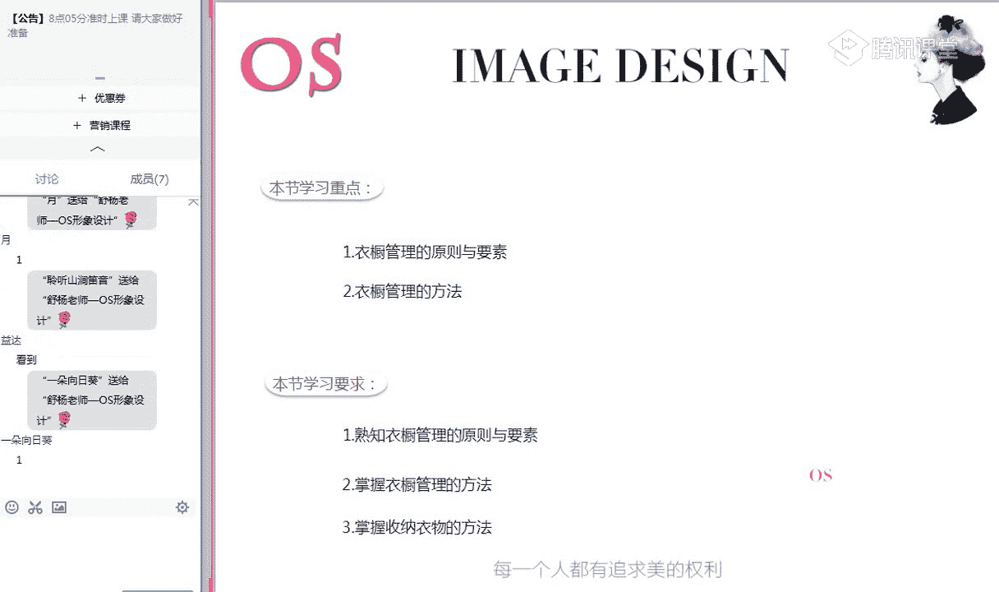
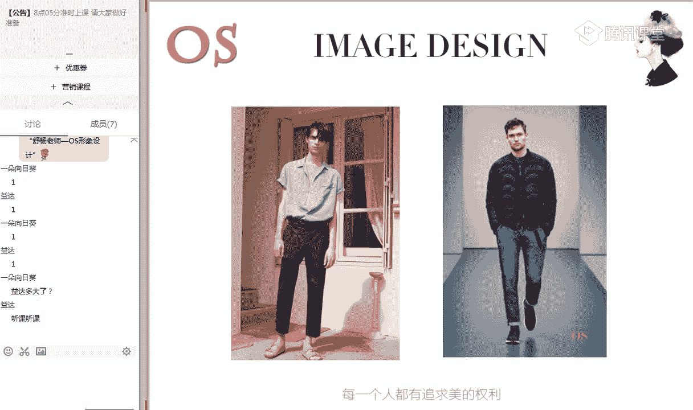
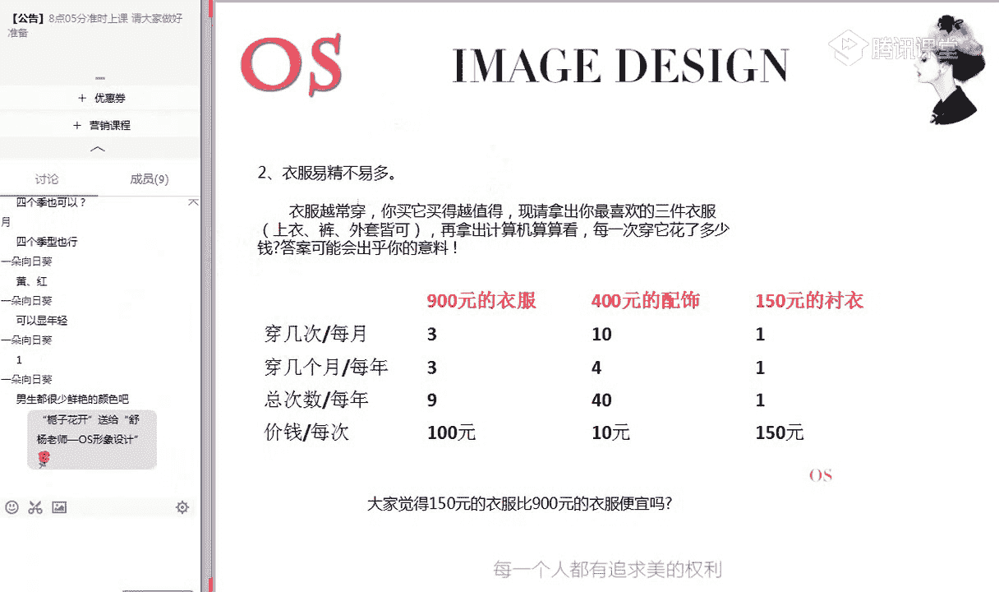
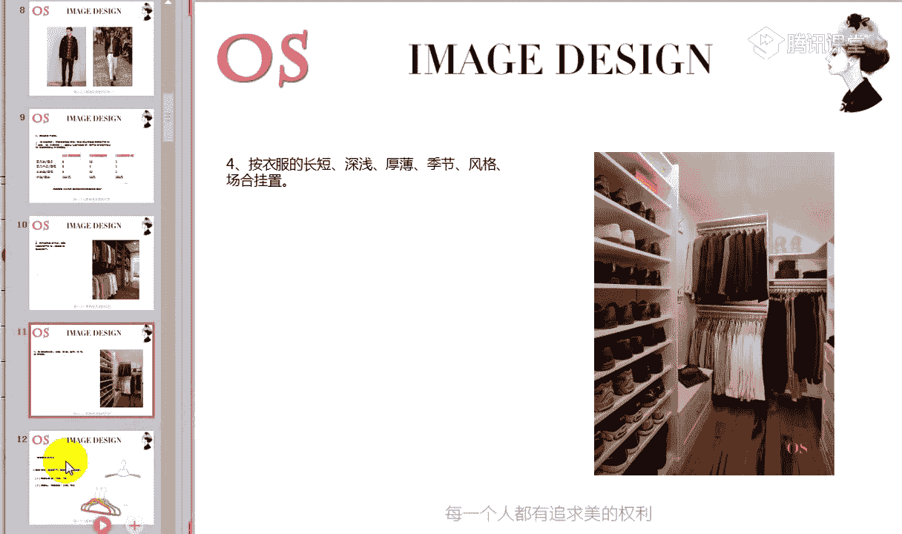
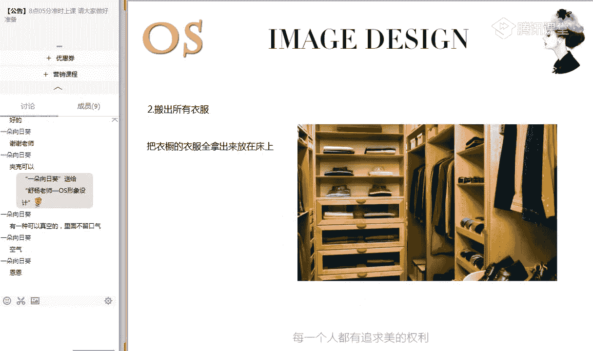
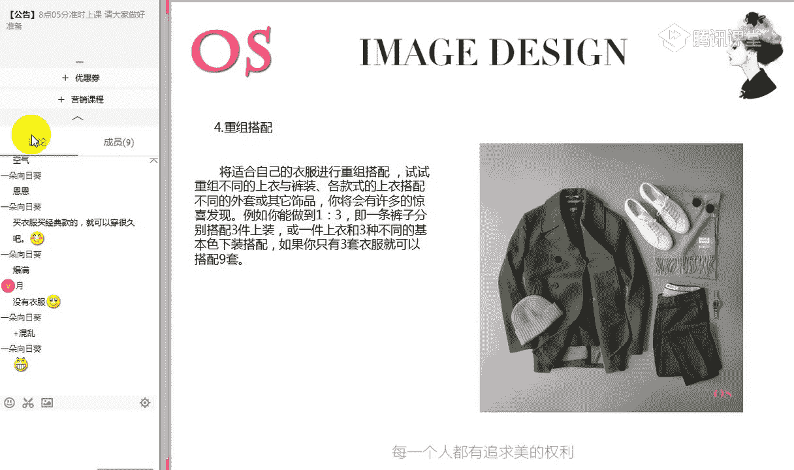
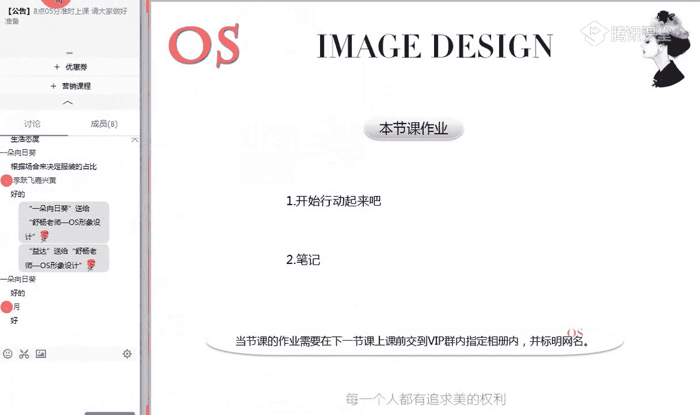

# 男士个人形象班（中级版）VIP课程：第14节：衣橱管理 👔

在本节课中，我们将要学习如何进行有效的衣橱管理。通过系统的学习，大家已经对发型、体型修饰、服装常规搭配方法、场合着装分类、配饰选择搭配以及自身色彩风格有了认识和掌握。同时，我们也会发现自身单品的缺失以及衣橱中不适合自己的单品。因此，掌握衣橱管理的原理和方法至关重要。

本节课的学习重点是掌握衣橱管理的原则和要素，同时学会管理自己衣橱的方法，懂得收纳整理服装。

## 第一部分：衣橱管理的原则和要素

上一节我们介绍了课程概述，本节中我们来看看衣橱管理的核心原则和要素。

### 1. 基础色应占据主导地位

衣橱中必须至少包含三种基本色。基本色是指搭配率最高的颜色，例如黑白灰、咖啡色、深蓝色等。

回顾自己的衣橱，如果拥有至少三种类似的基础色，例如棕色系、极淡色调或极暗色调中的色彩，说明你的衣橱基础色配置良好。下一步的目标是让这些基础色占据衣橱服装的70%。

可能会有疑问：这与个人的四季色彩季型是否冲突？答案是：不冲突。原因如下：
*   **场合适用性**：男士着装最重要的是场合。以上提到的基础色在各个场合中都适用。
*   **搭配便利性**：基础色非常好搭配，可以任意组合，只需注意表达的效果和环境即可。
*   **包含于各季型**：四季色彩季型的用色范围都包含了这些基础色。例如，春季型可以使用白色、棕色系或极淡色调中的暖色作为基础色；冬季型可以选择黑色、白色或极暗色调中的有彩色作为配色。

因此，基础色占据衣橱70%的比例是合理且必要的。

### 2. 搭配色作为点缀

搭配色指的是鲜艳的颜色，例如明亮的红色、黄色等。这些颜色醒目，在搭配中能起到画龙点睛的作用。

当鲜艳的搭配色与基础色搭配时，能形成焦点和秩序感，提升整体着装的品质和艺术感。但如果运用不当或过多，则会显得俗气且不合时宜。

因此，搭配色在衣橱中的比重应控制在30%到40%。在职业场合中，搭配色的运用比例建议在5%到30%之间，具体需根据职业场合的严肃程度调整。在休闲场合中，则可以根据搭配技巧和个人用色范围来选择。

对于不适合在靠近面部使用鲜艳色的同学，可以将搭配色用于下装或配饰，如鞋子、腰带、包包或裤子。

以下是检查衣橱色彩比重的建议：
*   如果衣橱中都是基础色，下次购物时可适当添置搭配色。
*   如果衣橱中搭配色占据主要地位，下次购物时应以添置基础色为主。

### 3. 重质不重量，注重利用率

衣服的价值不在于数量多少，而在于穿着频率。一件常穿的高品质服装，其单次穿着成本可能远低于一件廉价但只穿一两次的服装。

我们可以通过一个简单的公式来计算单次穿着成本：
`单次穿着成本 = 衣服价格 / 穿着次数`

例如：
*   一件900元的外套，一年穿9次，单次成本为100元。
*   一件150元的衬衫，只穿1次，单次成本为150元。

由此可见，那件900元的外套反而更具性价比。随着年龄增长和步入职业场合，男士应注重服装的品质感和精致感，而非盲目追求数量。

### 4. 合理悬挂，注重细节

能够悬挂的衣服最好悬挂，尤其是衬衫、西装等易皱的服装。悬挂时，衣服应面朝同一个方向，衣架颜色最好统一，这能使衣橱看起来更加精致整齐。

养成熨烫衣服的习惯。服装经过熨烫，其品质感和精神面貌会得到显著提升。对于经常出差的人士，可以考虑购置便携式熨斗。

### 5. 科学分类，便于取用

悬挂衣服时，建议按以下维度进行分类：
*   按长短、深浅、厚薄。
*   按季节。
*   按风格。
*   **按场合**（如职业装区、休闲装区）。

科学分类可以节省日常挑选服装的时间，提高效率。例如，上班时直接从职业装区域挑选，约会时从休闲装区域挑选。

## 第二部分：衣橱管理的方法

了解了衣橱管理的原则后，本节中我们来看看具体的整理步骤和方法。

### 第一步：准备整理工具

以下是整理衣橱前需要准备的基本工具：

*   **细塑料衣架**：用于悬挂夏季衬衫、T恤等轻薄衣物。
*   **厚塑料/绒面衣架**：用于悬挂春秋外套、毛衫等，其厚度能更好地承托衣物肩部。
*   **木质衣架**：承重力和保护性最佳，适合悬挂大衣、风衣等厚重外套。
*   **裤架**：用于悬挂西装裤、西裤等，能保持裤线笔挺，方便取用。
*   **收纳箱**：用于收纳过季或暂时不穿的衣物。
*   **防尘罩**：用于罩住厚重外套，防尘防潮。建议选择透气性好的材质，因为服装也需要“呼吸”。

### 第二步：清空与分类筛选

将所有衣物从衣橱中取出，放在床上，然后进行筛选。以下是需要挑出来考虑处理的五大类衣物：

1.  **超过一年未穿着的衣物**。
2.  **因身材变化或风格不符而不适合的衣物**（结合之前学习的色彩季型和风格量感、直曲、动静知识进行判断）。
3.  **已经过时的衣物**。
4.  **不适合当前工作性质或生活情形的衣物**。
5.  **有无法弥补的瑕疵或污渍的衣物**。

将这些衣物处理掉（如捐赠、转卖），只留下适合且心仪的衣物。

### 第三步：重组搭配与查漏补缺

将留下的适合衣物按季节和场合分组悬挂。然后，运用所学的搭配技巧进行重组搭配。

尝试用一件上衣搭配不同的下装，或用一条裤子搭配不同的上衣。目标是实现 **“一衣多搭”** 。例如，三件上衣和三条裤子理论上可以搭配出九套不同的造型。

在搭配过程中，可以拍照记录，并为每套搭配注明适合的场合。这样，日常穿衣时就能快速做出选择。

搭配后，你会发现有些单品无法与其他衣物很好地组合。将这些单品单独放置，并记录下需要与之搭配的缺失单品（如“这条裤子需要一件浅蓝色衬衫”）。下次购物时，就可以有目的地进行采购，避免盲目消费。

### 针对不同衣橱类型的建议

通常，衣橱可以分为三种类型，针对不同类型有不同建议：

*   **爆满型衣橱**：
    *   建议：暂时不宜再添置衣物。
    *   行动：对现有衣物进行彻底分类、搭配。至少淘汰掉 **2/5** 左右不合适的服饰。整理工作可能需要分次完成。

*   **精简型衣橱**：
    *   建议：在整理搭配后，有计划地添置衣物。
    *   行动：添置时，应在**色彩和款式**上寻求变化，避免重复购买类似单品。同时，注意增加适合的配饰，改变可能过于保守的着装习惯。

*   **混乱型衣橱**：
    *   建议：坚决淘汰不合适的衣物，并在专业人士指导下理性添置。
    *   行动：淘汰比例约为 **1/3**。在购买新衣时，务必咨询形象顾问或老师，确认其是否适合自己的色彩季型、风格和场合。平时需加强学习，提升审美，确立正确的着装观念。

## 第三部分：收纳技巧与最终法则

最后，我们来看看一些具体的收纳技巧和贯穿始终的衣橱管理法则。

### 收纳注意事项

1.  **针织衫/毛衣**：细腻、垂感强的针织衫建议叠放，避免悬挂变形；硬挺的粗棒针织毛衣可悬挂。
2.  **腰带与配饰**：使用专用抽屉、分隔收纳盒或门后挂钩来分类存放腰带、领带、围巾等，方便搭配时取用。
3.  **鞋子保养**：经常擦拭鞋子。不穿的鞋子清洁保养后，用鞋盒存放。雨雪天后，需及时擦干皮鞋。
4.  **家居服与T恤**：可叠放收纳，但同一摞不要超过6件，以免压皱且取用不便。
5.  **小件衣物**：善用多层收纳盒或带格子的收纳工具存放袜子、内衣等小物件，保持整洁。

### 衣橱管理“加减乘除”法则

*   **穿衣做加法**：一件衣服应能与三件其他衣服或配饰进行搭配。
*   **买衣做减法**：购买新衣时，如果它不能与你衣橱里至少三件现有衣物搭配，就不要买。
*   **跨季做乘法**：购买和搭配时，思考一件衣服能否穿三个季节（如一件衬衫在春、秋、冬三季的搭配可能）。
*   **贵价做除法**：购买价格不菲的衣服时，用公式 `每次穿着成本 = 价格 / (穿着次数 × 预计穿着年限)` 计算其价值。如果单次穿着成本合理且利用率高，就值得投资。

## 总结与作业

本节课中我们一起学习了衣橱管理的核心原则、具体整理步骤、针对不同衣橱类型的建议以及实用的收纳技巧和“加减乘除”法则。

**课后作业**：请利用休息时间，按照本节课教授的方法，彻底整理一次自己的衣橱。完成分类、筛选、搭配和记录缺失单品的全过程。只有亲自动手整理，才能更清晰地了解自己的着装需求，从而在未来进行更理性、高效的购物。

整理好衣橱，是建立个人风格、提升形象效率的重要一步。希望大家都能拥有一个整洁、高效、充满个人品味的理想衣橱。