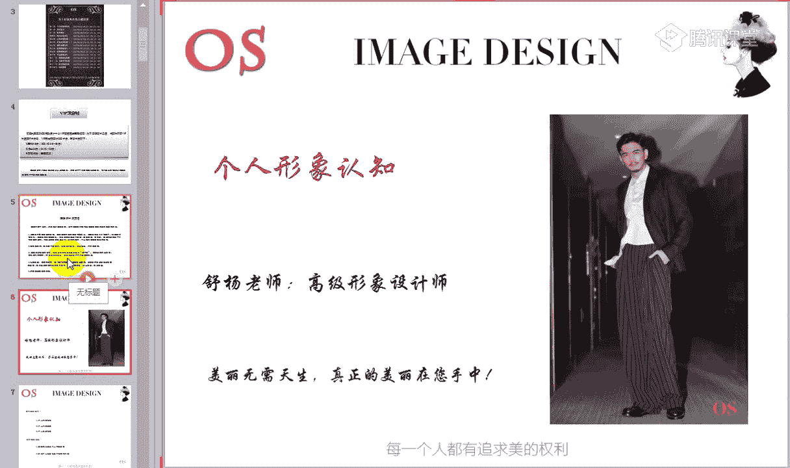
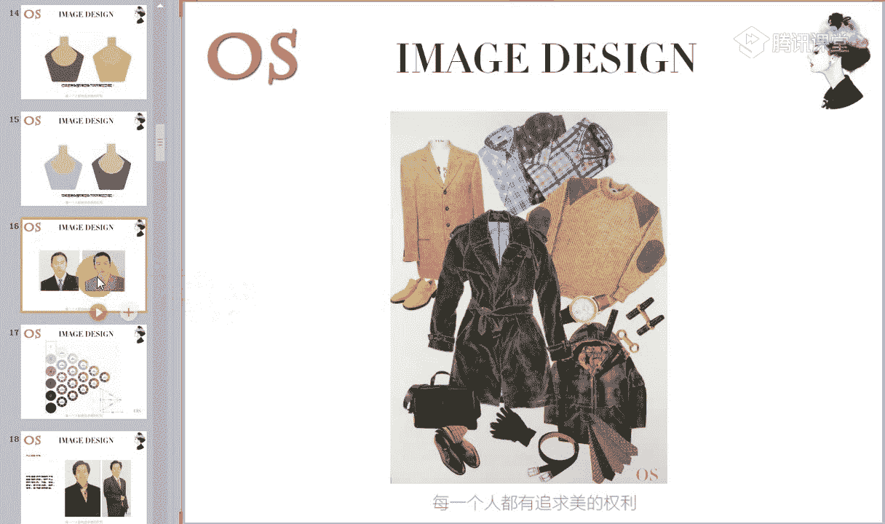
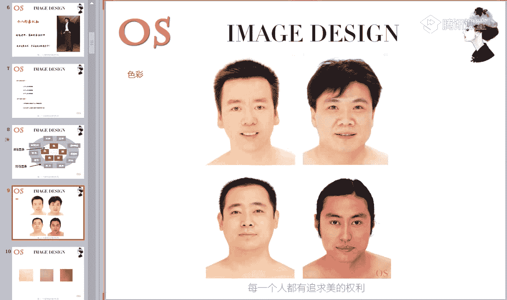
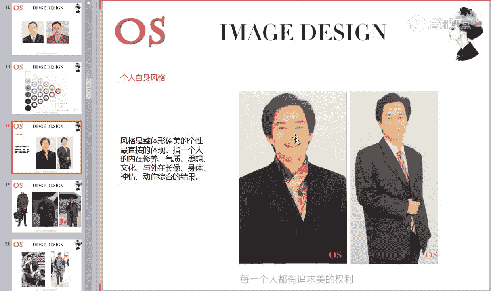
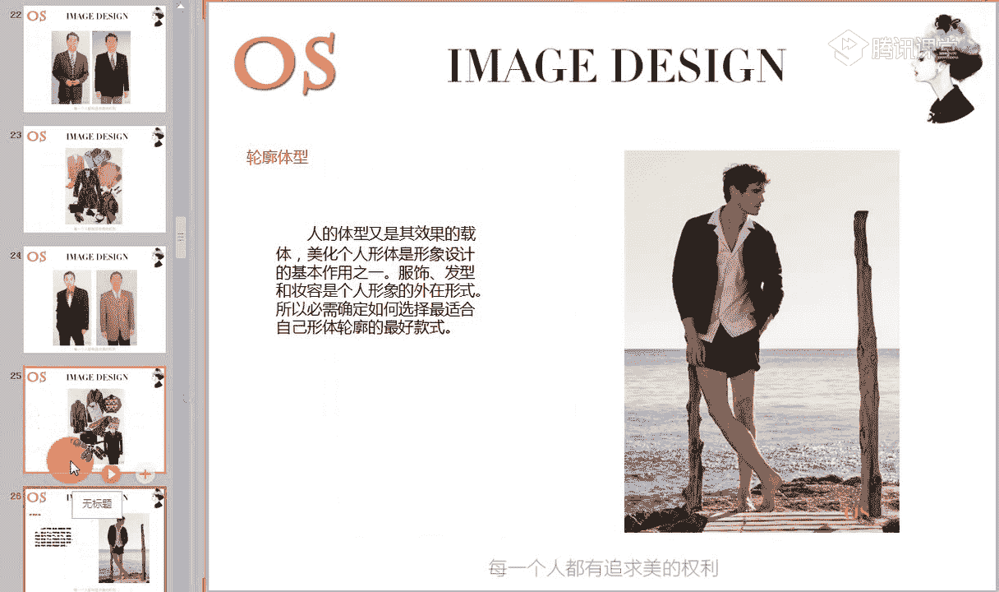
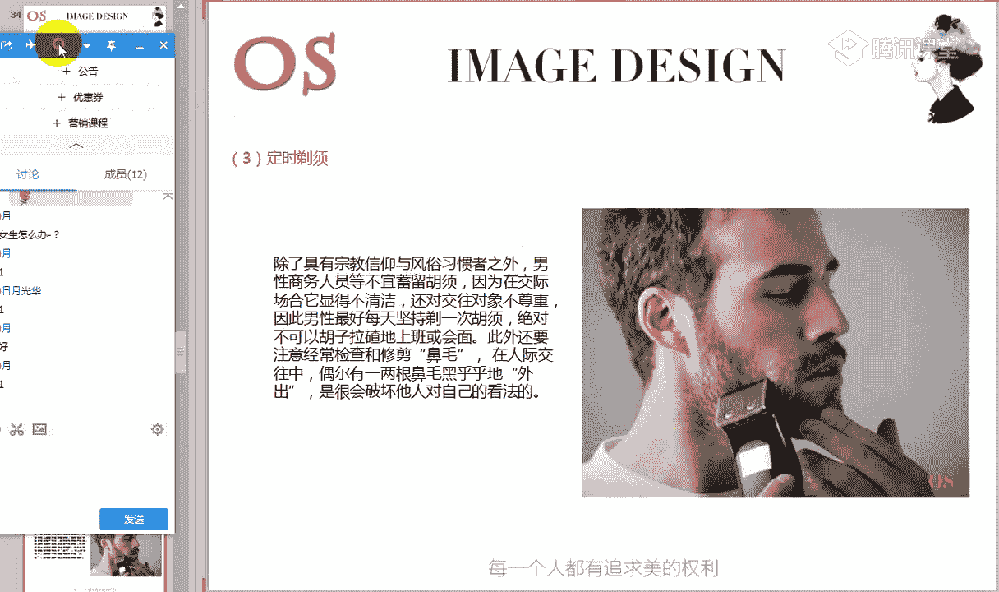
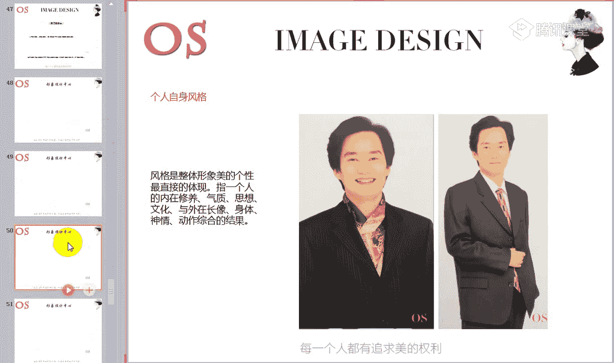
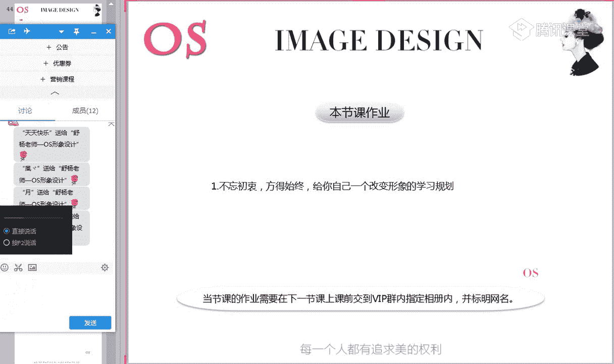

# 男士个人形象班（中级版）VIP课程：第1节：个人形象的价值

在本节课中，我们将一起探讨个人形象的重要性，了解构成个人形象的关键要素，并学习如何通过基础的仪容仪表管理来提升自我形象。课程将从认识彼此开始，逐步深入到形象塑造的核心概念。

## 开学典礼与相互认识

首先，我们进行一个简短的欢迎仪式。感谢大家的到来，希望大家在后续课程中都能保持第一节课的积极与认真。

以下是相互认识的环节：
*   请各位同学在公屏上打出自己的名字和所在城市，做一个简单的自我介绍。
*   老师先来：大家好，我叫舒阳，来自长沙。
*   大家可以快速进行自我介绍，方便日后交流。

## 学习初衷与形象公式

在相互认识之后，我们来思考一个问题：为什么报名学习本课程？请将你的答案打在公屏上。

接下来，我们来看一张图片，这是一个重要的公式：

**个人价值 = 体力 × 智力 × 形象力**

看到这个公式，你有什么感想？它揭示了人生战略与人生质量的关系。我们一生中都在做重大选择，这些战略性选择构成了现在的人生。这个公式中的三个要素深刻影响着我们：

*   **体力**：一个多病的身体无法确保人生的质量。
*   **智力**：一生中智力资源的积累厚薄，关乎个人能力结构，并决定在社会中可获取的回报。
*   **形象力**：这是很多人容易忽略的。一个人能否将健康状态和内在能力结构，精准地从外在表现出来，直接关乎社会对你资源总值的评估。

当体力不支时，我们会感知并努力维护健康。当智力能力不足时，我们会感到恐惧并通过学习来管理。然而，当形象资源缺乏时，往往不易察觉和重视，更难以找到有效方法去控制和管理。这成为了人力资源的重大缺口。

无论身份如何，外在形象都与个人命运、事业密切相关。形象力决定了机遇与好运光顾的频率，也决定了你对人生质量的取舍。因此，请务必重视形象问题。

## 课程安排与学习方法

既然我们想要改变个人形象，接下来我将介绍男士班的课程安排与学习方法。

### 课程体系与学分制

本课程共计14节，将从发型、体型、服装搭配到衣橱管理，系统性地讲解个人形象的各个因素。

本VIP课程采用学分制，共计100学分。学分获取途径如下：
*   **课程考试**：每门课程结束后会有理论试卷，占总评分的46%。
*   **平时作业**：每节课后需按时提交作业（包括理论笔记和实操），每次提交计1分。
*   **实操作业**：实操完成情况是评分的关键。

课程结束后，总评分需达到80分以上，方可进入下一阶段（如高级班）的学习。未达标者需留级继续学习。

### 正确的学习方法

掌握正确的学习方法能事半功倍。以下是四个关键习惯：

1.  **做好笔记**：好记性不如烂笔头。听课抓住重点记录，课后结合录播视频整理，使笔记更全面、有条理。
2.  **巩固复习**：定期复习笔记，并通过大量实操来加强理解。形象设计重在实践，试穿、总结越多，体会越深。
3.  **独立解决问题**：遇到困难先尝试自己解决，这个过程本身也是强化学习和实践的过程。
4.  **学会观察与思索**：在日常生活中，尤其是在购物时，养成发现问题、提出问题、解决问题的习惯。例如，拿到一件衣服时，思考它是否适合自己，适合什么风格的人，如何调整才能适合自己。

养成主动学习的习惯，对知识点的理解将会有巨大突破。只要按照要求和方法学习，每节课你都能发现自己的变化。

## 核心知识：个人形象的认知

现在，我们正式进入今天的核心知识。本节课的重点分为三大板块：
1.  个人形象的概念。
2.  个人形象的要素。
3.  个人仪容仪表的问题。

学习要求是：能够清晰表述个人形象的要素，并熟记个人仪容仪表所包含的内容。

### 个人形象的构成要素

个人形象受显性因素和隐性因素共同影响。

**显性因素**是直观的表述，主要包括以下五点：

1.  **色彩**
    衣服有色彩，人也有色彩。它受发色、瞳孔色、唇色、肤色影响。男士主要分为春、夏、秋、冬四大季型，这决定了服装色彩的选择。判断季型的核心是皮肤，因为皮肤占据面积最大。
    *   皮肤中含有胡萝卜素、血红素和黑色素。血红素多则有粉色倾向；胡萝卜素多则有黄色倾向；两者适中则有自然倾向。
    *   色彩有冷暖、纯度、明度三属性。皮肤同样具备这三属性。选择服装色彩时，需与自身皮肤的冷暖、明度、纯度保持一致。例如，冷肤色穿冷色服装会更协调、透亮；若穿暖色，则可能显得皮肤暗沉、厚重。

2.  **风格**
    服装有风格，它由“形、色、质”（款式、色彩、材质）构成。人的长相、体型也有风格。
    *   例如，有的人长相粗犷大气、线条硬朗（戏剧型），适合线条分明、对比强烈的服装；有的人长相柔和、随性（自然型），适合面料天然、款式宽松的服装。
    *   服装风格的选择必须与个人长相、体型相结合，达到人与衣的和谐。选择错误会显得突兀，选择正确则能凸显气质。

3.  **体型**
    不是所有人都是标准的T型（倒三角）身材。我们需要懂得利用服装来扬长避短。
    *   可以通过服装的款式（如垫肩、口袋设计）、色彩、材质和图案，来修饰肩宽、胸肌等部位，在视觉上塑造更理想的体型。

4.  **配饰**
    配饰在整体搭配中起到画龙点睛的作用，能增加层次感和时尚度。
    *   配饰的选择也要结合个人风格。存在感强的风格（如戏剧型）可选择个性化配饰；风格柔和的则应选择协调、不突兀的配饰。

5.  **发型**
    适合自己的发型至关重要，它被称为“第二张脸”。
    *   发型选择需综合考虑脸型、个人气质与风格。例如，方脸型男士可根据不同风格选择不同的发型变体。在后续课程中，我们会详细讲解如何根据脸型和风格选择最佳发型。

**隐性因素**同样不可忽视，主要包括：流行元素、性格、生活方式、年龄、爱好、身份地位、居住地、职业、修养和**场合**。其中，**场合**是隐性因素中最重要的知识点。

*   **场合着装（TPO原则）**：指着装需考虑时间（Time）、地点（Place）、场合（Occasion）。例如，白天与晚上的婚礼着装要求不同；室内与室外、听音乐会与看电影的着装也应不同。
*   **重要性**：对于男士而言，场合和风格的选择，甚至比根据皮肤选色更重要。严肃场合需着装严肃，休闲场合则可随意轻松。

### 个人仪容仪表管理

外在形象提升了，但行为举止不美，依然不完美。因此，我们需要关注礼仪礼节。

**个人礼仪基本原则**是“修饰避人”：整理衣物、修饰仪容等行为应避开他人耳目，到私下进行，以维护礼貌和形象。

**仪容管理**的基本要素是貌美、发美、肌肤美，核心在于做好清洁。

1.  **清洁身体**：坚持洗澡、洗头、洗脸。
    *   **洗头**：特别注意头皮屑问题。深色衣物上的头皮屑会非常显眼，破坏整体形象。出门前请检查肩部。
    *   **洗脸**：男士油脂分泌旺盛，需每日用洗面奶清洁，并做好基础护肤（水、乳液等），维持皮肤良好状态。

2.  **清理分泌物**：及时清除眼角、鼻孔的分泌物，保持面部洁净。

3.  **剃须与修眉**：
    *   **剃须**：商务人士建议每日剃须，保持清爽。同时检查并修剪鼻毛。
    *   **修眉**：眉毛对男士面部清晰度、精神面貌影响巨大。应定期修剪杂乱眉毛。大部分男士适合**剑眉**。眉毛稀疏者可以学习画眉来增强精神气。

4.  **手部卫生**：勤洗手，保持手部清洁。
    *   **指甲**：长度应适中，切勿过长，尤其不要留小拇指指甲。过长的指甲会给人不卫生、不专业的印象。

5.  **口腔卫生**：早晚刷牙，饭后检查口腔是否有食物残留，可漱口。
    *   与人近距离接触前，避免食用大蒜等刺激性气味的食物，或及时清理。

## 总结与作业

本节课我们一起学习了以下内容：
1.  **形象的价值**：通过公式 `个人价值 = 体力 × 智力 × 形象力`，理解了形象力是影响个人发展的重要战略因素。
2.  **形象的要素**：分析了影响个人形象的**显性因素**（色彩、风格、体型、配饰、发型）和**隐性因素**（特别是场合），强调了和谐搭配与扬长避短的重要性。
3.  **仪容仪表**：详细讲解了面部、头发、手部、口腔等部位的清洁、修饰标准与礼仪，认识到细节决定整体印象。

永远没有第二次机会给人留下第一印象。良好的形象甚至比文凭更重要。当你的外在形象（形式美）与内在能力（内在美）越接近时，个人价值就越能最大化。

**本节课作业**：
1.  不忘初心：回想并牢记自己报名学习本课程的初衷。
2.  制定规划：为自己制定一个清晰的、改变形象的学习规划，并提交分享。

在后续课程中，我们将从“头”到“脚”，逐一深入讲解每个形象要素。如果你还不清楚自己的色彩季型或个人风格，请在课后及时联系老师进行诊断。

感谢大家的聆听与陪伴，我们下节课再见。