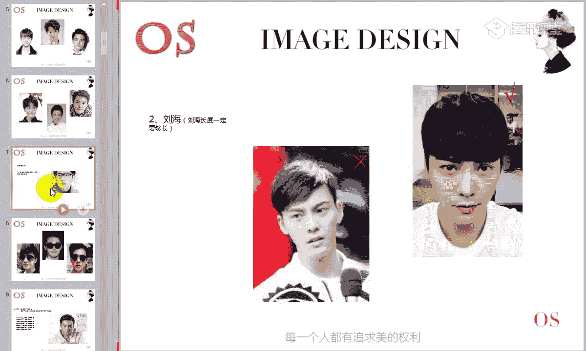
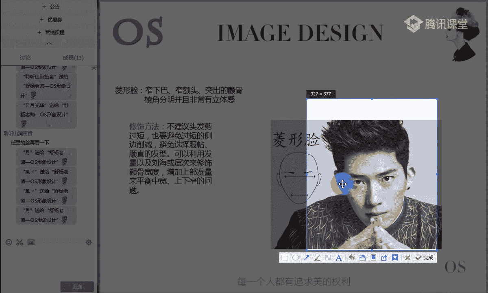
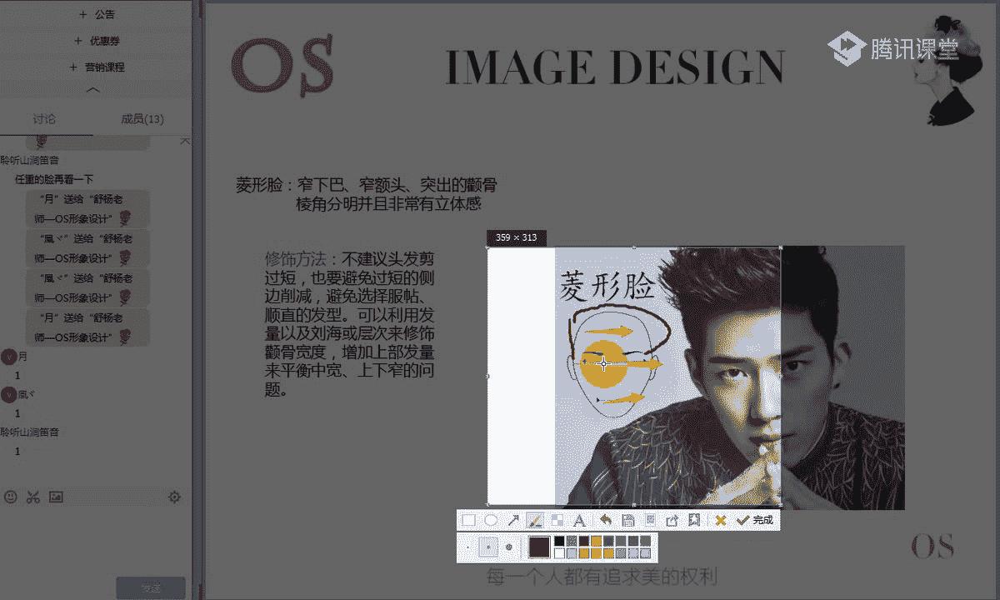
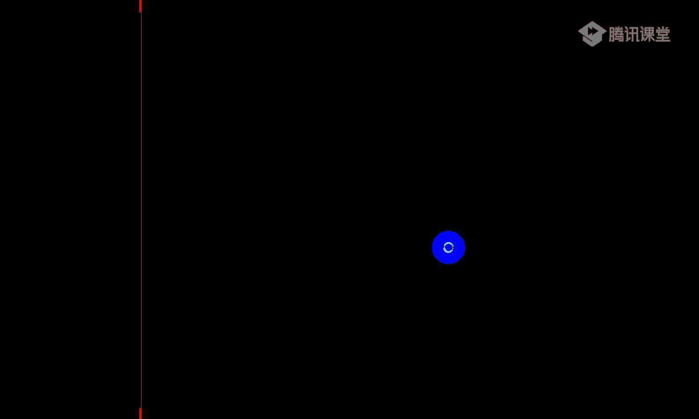
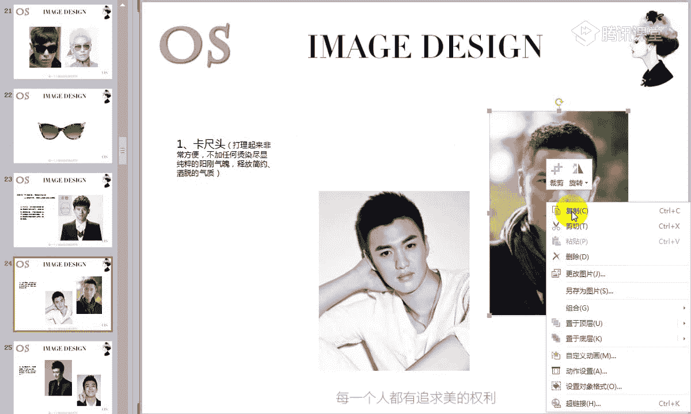
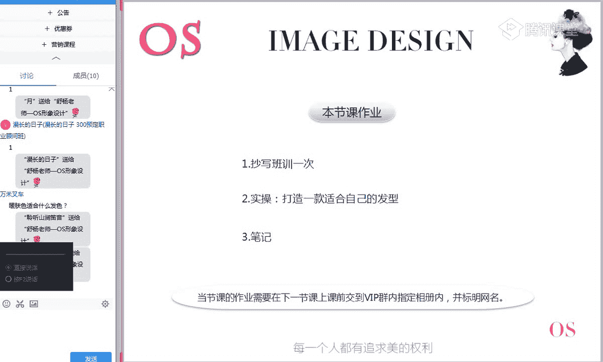

# 男士个人形象班（中级版）VIP课程：第2节：发型设计 💇‍♂️

在本节课中，我们将要学习如何根据脸型选择最适合的发型、眼镜和发色。发型是个人形象中至关重要的一环，理解自己的脸型特征是打造理想造型的第一步。

## 课程概述

本节课的核心是掌握“三庭五眼”的面部美学标准，并以此为基础，分析七种常见脸型的特点。我们将逐一讲解每种脸型适合的发型、眼镜款式以及发色选择原则，帮助你建立一套清晰的个人形象打理逻辑。

---

## 第一部分：面部美学基础——三庭五眼

在分析具体脸型之前，我们必须先了解一个基础的面部美学概念：三庭五眼。这是判断脸型是否标准以及后续进行修饰调整的根本依据。

### 1. 什么是“三庭”？

“三庭”是指将面部的纵向长度平均分为三等份。标准的三庭长度应基本一致。

*   **上庭**：从**发际线**到**眉心（眉头连线）** 的距离。
*   **中庭**：从**眉心**到**鼻翼下缘**的距离。
*   **下庭**：从**鼻翼下缘**到**下巴尖**的距离。

**判断方法**：你可以用手指大致测量这三个部分的长度。如果三者长度相近，则属于标准三庭。如果不一致（如上庭过长、中庭偏短等），请记下这个特征，它将是后续选择发型的重要参考。

### 2. 什么是“五眼”？

“五眼”是指以自身一只眼睛的宽度（从眼头到眼尾）为标准，将面部平视时的横向宽度平均分为五等份。

**判断方法**：平视前方，观察面部。理想状态下，面部宽度应刚好能容纳五只眼睛的宽度。其中，第一只和第五只“眼睛”的宽度，对应的是两侧**太阳穴**的饱满度。如果太阳穴凹陷或颧骨突出，会导致第一和第五眼宽度不足，这属于五眼不标准的情况。

---

## 第二部分：七种常见脸型分析与修饰方案

上一节我们介绍了判断脸型的基础标准，本节中我们来看看具体的七种脸型及其修饰方法。请结合讲解，对照镜子或照片，判断自己属于哪种脸型。

以下是七种常见脸型的详细分析：

### 1. 椭圆形脸（鹅蛋脸）🥚

**特征**：这是最标准、最完美的男性脸型。三庭五眼比例标准，面部外轮廓线条流畅、柔和、匀称，形似鹅蛋。**注意**：椭圆形脸不等于“瓜子脸”（心形脸），后者额头更宽、下巴更尖。

**发型选择**：由于脸型完美，几乎可以驾驭任何发型，如刘海、侧分、后梳、中分、板寸等。可以根据个人喜好和风格自由选择。

**眼镜选择**：同样拥有极大自由度。椭圆形镜框最为契合，方形或圆形镜框也可尝试。可以根据场合和服装随心搭配。

### 2. 心形脸（倒三角脸）🔺

**特征**：额头较宽，下巴窄而尖，面部上宽下窄，呈倒三角形。

**发型选择**：核心是平衡上宽下窄的视觉感受。
*   **成熟风格**：可选择**旁分油头**，顶部发量保持丰盈，两侧及后方剪短。
*   **年轻风格**：可选择**带刘海的发型**，但**刘海长度要足够**，并剪出层次感和纹理，避免死板贴头皮。

**眼镜选择**：应选择**纵向线条明显**的镜框（如椭圆形、圆形），以在视觉上拉长面部，平衡宽额头。**避免**镜框上半部分有复杂装饰或过于宽大的横向款式。

### 3. 长形脸 📏

**特征**：脸型瘦长。可能是三庭中某一庭或全部偏长，同时面部宽度较窄。

**发型选择**：核心是**在视觉上增加面部宽度、缩短长度**。
*   **利用刘海**：选择带有空气感和碎发层次的刘海，能有效修饰额头和部分中庭，显脸小。
*   **增加顶部丰盈度**：选择**朋克飞机头**或**旁分油头**时，注重头顶发量的饱满。这会产生“反平衡”效果，反而衬托得脸不会过长。两侧鬓角可修短。

**眼镜选择**：应选择**宽边、大框**的眼镜，以遮挡部分面颊，在横向上拉宽视觉。**避免**窄边眼镜和异形镜框（特别是上扬款），它们会进一步强调脸长。

### 4. 方形脸（国字脸）⬛

**特征**：下颚宽大，腮帮处棱角分明，面部轮廓硬朗，阳刚气足。

**发型选择**：核心是**柔和面部棱角，增加头顶高度**。
*   **利落短发**：**卡尺头（板寸）** 是简单又凸显气质的选择。
*   **增加头顶长度**：选择**头顶上抓**的发型，但**两侧和后方一定要剪短**，避免增加脸部宽度。
*   **成熟油头**：**旁分油头**同样适合，但两侧需剪短。特别适合古典型、浪漫型风格的男士。

**眼镜选择**：应选择**线条柔和**的镜框来中和硬朗的脸部线条，如**椭圆形**或**方中带圆**的款式。**避免**纯方形或过圆的镜框。金属细框镜架是很好的选择。

### 5. 圆形脸 ⭕

**特征**：面部外轮廓圆润柔和，没有明显棱角，给人亲切、显年轻的印象。

**发型选择**：核心是**塑造长度和棱角，增加成熟干练感**。
*   **增加头顶高度**：选择**上抓的飞机头**，拉长脸部视觉。
*   **利用侧分刘海**：选择带**侧分刘海**的发型，并剪出纹理层次。可根据场合将刘海放下（休闲）或梳起（正式）。
*   **关键**：**头顶发量绝不能少**，避免过于服帖或过短的发型（如板寸）。

**眼镜选择**：应选择**有角度、偏方形**的镜框来增加面部的立体感和纵向线条。**避免**圆形镜框。镜框宽度不宜过宽，选择窄长型为佳。

### 6. 菱形脸（钻石脸）💎

**特征**：额头窄，太阳穴凹陷，颧骨突出，下巴尖。面部立体感强，但线条不流畅。

**发型选择**：核心是**修饰额头窄和太阳穴凹陷，平衡颧骨宽度**。
*   **增加上半部宽度**：选择**上抓飞机头**或**侧分/中分刘海**，**两侧头发需保留一定长度和厚度**，以填充太阳穴区域。
*   **避免**：过短、服帖顺直的发型。

**眼镜选择**：应选择**椭圆形或圆形**等流线型镜框，以柔和面部多角的线条。**避免**方形镜框和框架过于厚重的款式。镜框大小应与偏小的脸型量感相符。

### 7. 三角形脸（梨形脸）🔻

**特征**：额头窄，太阳穴凹陷，下颚宽大。与方形脸的区别在于，三角形脸存在太阳穴凹陷的问题。

**发型选择**：可参考方形脸和菱形脸的修饰思路，**注重增加头顶及两侧上半部分的发量感和饱满度**，以平衡下颚的宽度。发型不宜过短。

**眼镜选择**：可参考方形脸的选择，**椭圆形镜框**和**金属镜框**是安全且适合的选择。

---

## 第三部分：发色选择与肤色季型

说完了发型和眼镜，我们最后来看看如何根据肤色选择发色。这与女士的染发原理相通。

男士的肤色季型分为春夏秋冬四季，其中：
*   **暖肤色**（春季型、秋季型）：肤色基调偏暖。
*   **冷肤色**（夏季型、冬季型）：肤色基调偏冷。

**发色选择原则如下**：

*   **冷肤色男士**：适合能强化冷峻、时尚感的发色。
    *   推荐：**酒红色**、**深棕色（交茶色/褐色）**、**深闷青亚麻色**。
    *   注意：后两种颜色容易掉色偏黄，需定期补染。
*   **暖肤色男士**：驾驭发色的自由度较高。
    *   推荐：各种**棕色系**（从浅棕到深棕）、**亚麻色系**等偏暖色调的发色。

---

## 课程总结与发型打理模式

本节课中，我们一起学习了：
1.  **面部美学基础**：“三庭五眼”的判断标准。
2.  **七种脸型分析**：椭圆形脸、心形脸、长形脸、方形脸、圆形脸、菱形脸、三角形脸的特征，以及各自适合的发型与眼镜选择方案。
3.  **发色选择**：根据冷/暖肤色季型选择适合的染发颜色。

最后，请牢记打理发型的正确模式，这个模式可以概括为一个公式：**自己 → 发型师 → 自己**。

1.  **先自己**：了解自己的脸型、风格和需求，明确什么适合自己。这是与发型师有效沟通、获得满意效果的前提。
2.  **再发型师**：寻找一位技术优秀的发型师，向他清晰表达你的想法，让他帮你完成基础的剪裁和造型。
3.  **再自己**：向你的发型师学习日常打理技巧和头发保养知识。大部分时间需要你自己维护发型，掌握方法才能让造型持久有型。

发型是男人的“第二张脸”。你不打理它，它就会让你显得邋遢；你精心打理并选对款式，它就能让你容光焕发，为整体形象大大加分。