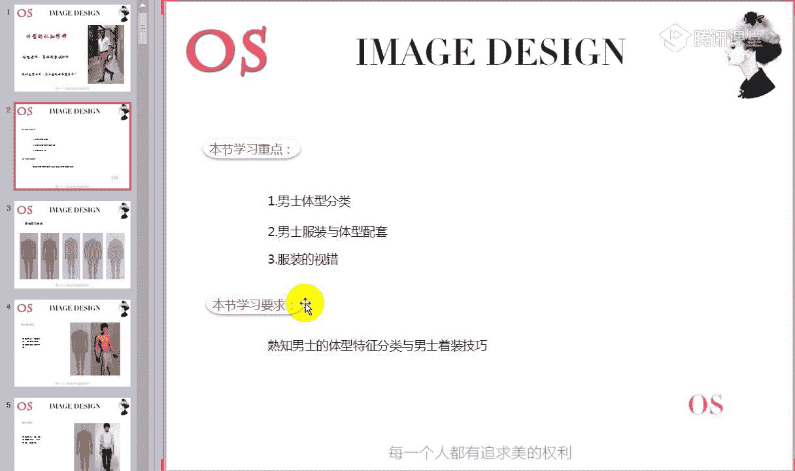
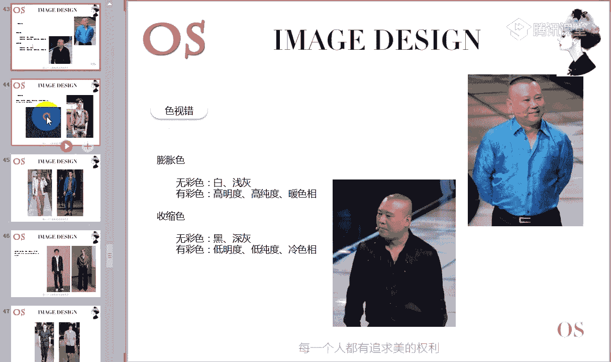
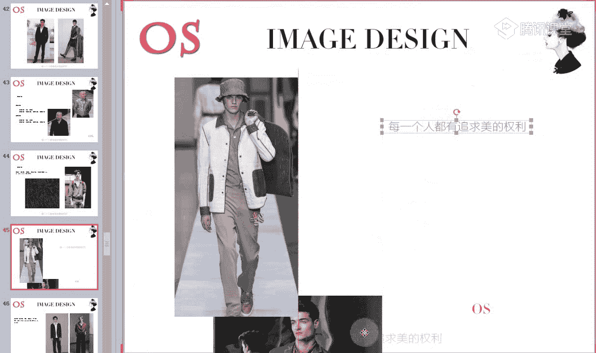
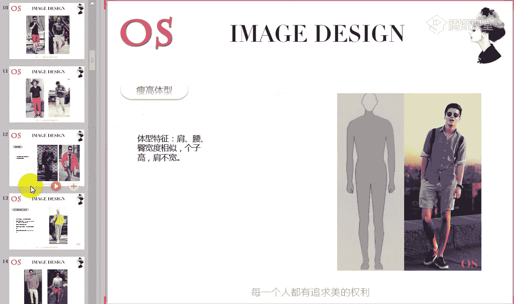
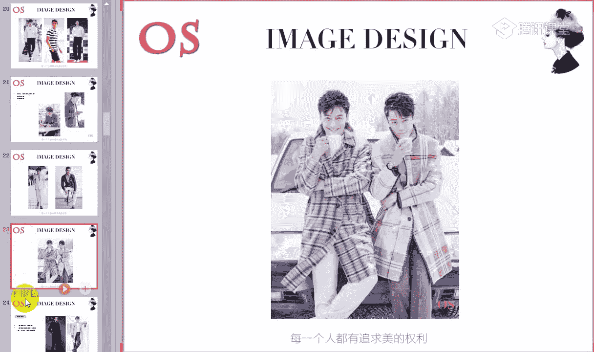
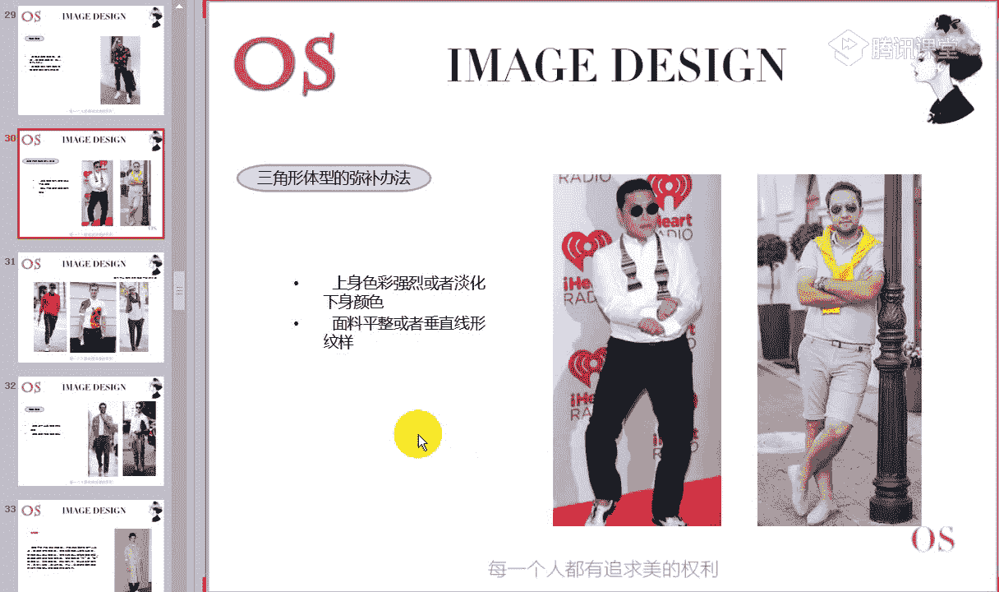
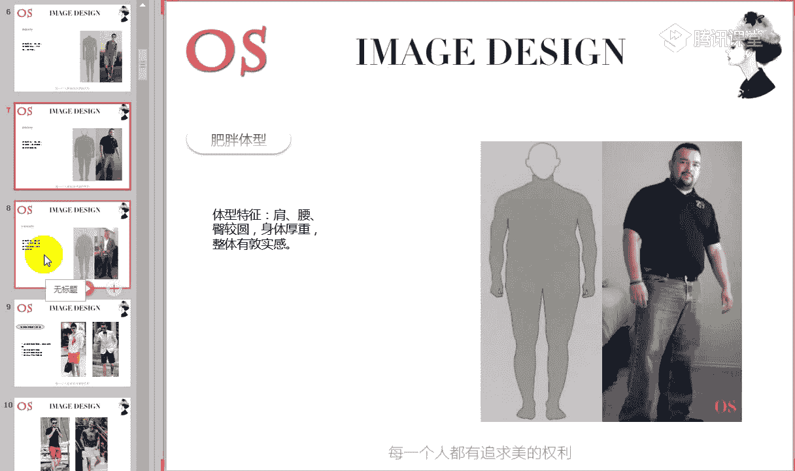
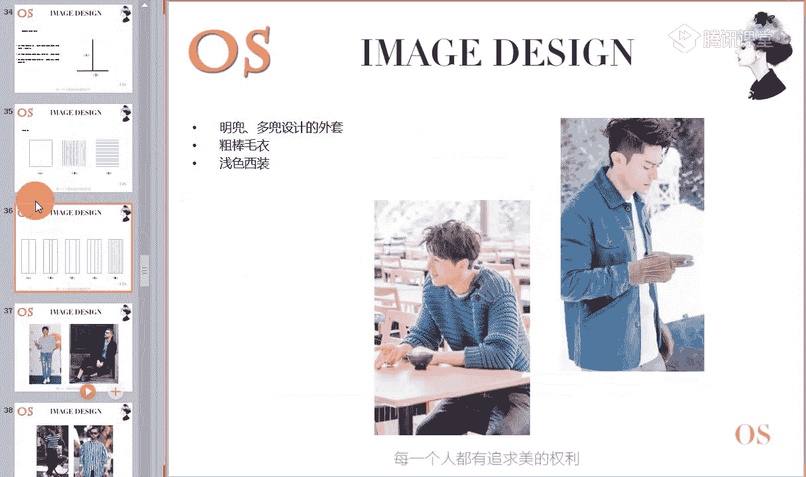
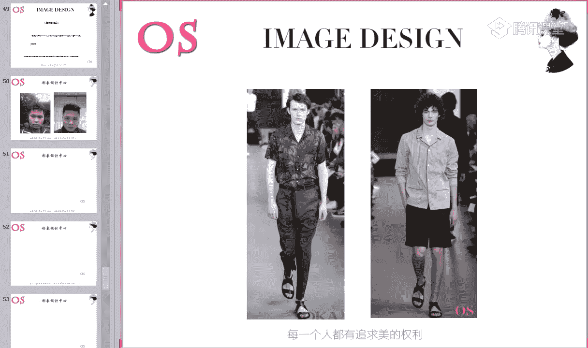

# 男士个人形象班（中级版）VIP课程：第3节：体型修饰

在本节课中，我们将要学习如何通过服装的“视错觉”原理来修饰不同的男性体型，使体型在视觉上更接近理想标准。

上一节课我们学习了发型设计，本节课中我们来看看体型。对于体型标准的男士，只需依据色彩与风格规律选择服装即可。但在生活中，标准体型的人并不多。对于体型不标准的男士，我们需要通过一些手段进行调整，使体型在视觉上接近标准。

在正式学习前，我们先明确本节课的三个重点：
1.  懂得男士体型的分类与判断方法。
2.  了解如何利用服装与饰品调整不同体型。
3.  掌握核心的“服装视错觉”原理。

## 第一部分：服装视错觉原理

在学习体型认知和修饰之前，我们首先来了解服装的“视错觉”。因为在修饰体型时，我们正是依据这一原理来操作的。掌握好视错觉知识后，再来分辨和修饰各种体型就会清晰很多。

生活中常有奇妙的现象：同一人穿不同服装，效果差异巨大。有的服装让人显胖，有的则显瘦。这涉及色彩、图案、材质等多方面的影响。服装本身具有矫正作用，掌握视错觉原理对服饰形象设计有重要指导意义。

### 图案与视错觉

以下是图案视错觉的核心原理，请先记下这三句话：
*   服饰图案整体效果越表现横向感，就越显胖（同时显矮）。
*   服饰图案整体效果越表现纵向感，就越显瘦（同时显高）。
*   图案越密集、越复杂、排列越规则，视觉效果越膨胀；图案越简单、越稀疏、排列越不规则，视觉效果越收缩。

为了理解这一点，请看下图中的A、B两条线，在视觉上你觉得哪条更长？

（此处应有图片占位符：两条等长线，一条纵向排列，一条横向排列）

视觉上，A线（纵向）显得更长。实际上A和B长度一致。因为纵向线条在视觉上会拓展长度，从而显瘦显高；横向线条则会拓展宽度，从而显胖显矮。

以下是关于条纹图案的具体分析：
*   **横条纹**：并非所有横条纹都显胖。当横条纹**非常密集**时，视觉上会形成纵向感，反而显瘦。当横条纹**较宽、不密集**时，则表现横向感，会显胖。
*   **竖条纹**：并非所有竖条纹都显瘦。当竖条纹**非常密集**时，视觉上会形成横向感，反而显胖。当竖条纹**较宽、不密集**时，才表现纵向感，会显瘦。

这个原理同样适用于其他图案（如格子、几何图案等）。图案越多、越杂、排列越规则，膨胀效果越强；图案越少、越简单、排列越不规则，收缩效果越强。

### 服装廓形与视错觉

接下来我们看看服装款式廓形形成的视错觉。

核心原理如下：
*   服装廓形越**流畅、垂直、合体**，视觉效果越显瘦、显高。
*   服装廓形越**外放、宽松、啰嗦**（如欧版、带有大量口袋等复杂设计），视觉效果越显胖、显矮。

“流畅垂直”指的是服装外轮廓线条利落、贴合身体。“外放”指的是版型宽松、向外扩张。例如，同样一个人，穿合体西装比穿宽松外套在视觉上更显高、挺拔。

### 色彩与视错觉

色彩同样具有膨胀与收缩的视错觉效果。这部分知识建立在色彩美学基础上，请确保你已掌握相关概念。

膨胀色与收缩色的分类：
*   **膨胀色**：在无彩色中，如**白色、浅灰色**；在有彩色中，如**高明度、高纯度、暖色相**的色彩。
*   **收缩色**：在无彩色中，如**黑色、深灰色**；在有彩色中，如**低明度、低纯度、冷色相**的色彩。

例如，同款真丝衬衫，穿黑色比穿高明度暖色（如亮橙色）更显瘦。

### 材质与视错觉

最后，服装材质也影响视错觉。

判断材质膨胀与收缩的关键词：
*   **膨胀材质特征**：柔软、厚重、肌理感强（粗糙）、有光泽感。
    *   例如：粗棒针织毛衣、皮草、粗糙的麻料、某些肌理感强的呢子大衣。
*   **收缩材质特征**：挺括、薄、哑光（无光泽）、平滑平整。
    *   例如：精纺羊毛西装、平滑的棉质衬衫、薄而挺括的风衣。

需要综合判断。例如，两套西装，一套是浅灰色且有纹理感（膨胀），另一套是深蓝色且平整精细（收缩），后者会更显瘦。

---

**第一部分总结**：我们的眼睛像客观的照相机。通过有意识地运用图案、廓形、色彩、材质的视错觉原理，我们可以“欺骗”视觉系统，引导它向我们希望的方向（显高、显瘦、平衡等）产生错觉，从而修饰体型。

## 第二部分：男士体型分类与修饰方法

上一部分我们掌握了修饰体型的核心工具——视错觉。现在，我们来看看男士体型的分类，并学习如何运用这些工具进行针对性修饰。

首先，了解什么是标准体型：
*   **身高**：约1.78米（黄金分割比例）。
*   **比例**：胸围略宽于臀围。
*   **轮廓**：整体匀称，呈**倒三角形**视觉感。

标准体型男士只需根据色彩和风格选择服装即可。其他体型则需通过服饰进行修正，使视觉感受接近标准型。

男士体型综合分为以下五类：

### 1. 倒三角体型

**特征**：肩宽明显大于臀宽，上半身非常健壮，与下半身对比显得不平衡。

**修饰方法**（目标：平衡上下半身）：
1.  **色彩**：上半身多用**收缩色**，下半身可适当用**膨胀色**。
2.  **视觉焦点**：在脖子周围（如领口、方巾）使用**艳色**，将视觉焦点向中心引导，弱化肩部外轮廓。
3.  **腰部填充**：选择在**腰部带有明兜（翻盖口袋）**的上衣，增加腰部量感。
4.  **下半身丰富**：下半身服饰在**款式、图案、材质**上可稍作丰富，使用具有膨胀效果的元素。

**注意事项**：
*   上身避免过强的膨胀色。
*   避免选择**过宽的翻领**，以免进一步增加肩部宽度和厚重感。

### 2. 窄小体型

**特征**：肩、腰、臀宽度相似，个子不高（通常低于1.75米），偏瘦，肩可能过窄。

**修饰方法**（目标：增加量感与高度）：
1.  **色彩**：多穿**浅淡、明亮**的膨胀色。
2.  **对比搭配**：可采用**弱对比**配色来增加身体分量感（避免强对比导致显矮）。
3.  **款式**：选择**合体且稍有宽松度**的服装，避免紧身或过于宽松。面料应有**质感、挺括**，以提升挺拔感。
4.  **裤型**：多选择**锥形裤**（上宽下窄），搭配**短款上衣**以优化比例。
5.  **鞋子**：搭配**尖头皮鞋**有助于视觉延伸。

**注意事项**：
*   避免深暗的收缩色。
*   避免紧身服装。

### 3. 瘦高体型

**特征**：身高1.78米以上，瘦，身材呈H型，肩腰臀宽度相似。

**修饰方法**（目标：增加宽度，避免竹竿感）：
1.  **色彩**：多用**浅淡、明亮**的膨胀色。
2.  **对比搭配**：可利用**对比配色**来增加膨胀感，身高优势允许这样做。
3.  **款式与图案**：选择**稍宽松**的款式，以及**横向线条**或**密集竖条纹**的上衣。
4.  **设计细节**：上衣多采用**明兜、肩章**等设计，增加上半身层次和宽度。
5.  **材质**：秋冬可多选**粗棒针织、肌理感强**的膨胀材质。

**注意事项**：
*   避免过深过暗的收缩色。
*   避免过于硬挺、直线条且紧身的服装。

### 4. 肥胖体型

**特征**：肩、腰、臀都很圆润，身材厚实，有敦实感。（注：与三角形体型区别在于，肥胖体型从上到下都胖。）

**修饰方法**（目标：收缩显瘦，营造挺拔感）：
1.  **色彩**：整体多用**收缩色**。身躯中部（躯干）颜色需偏深，四肢可稍亮。
2.  **搭配**：多采用**统一配色或渐变配色**，避免强对比。
3.  **领型**：多穿**V领**服装，形成纵向线条，引导视觉显瘦。衬衫领子宜选**大领型**。
4.  **材质与款式**：选择**硬挺、平整、垂感好**的收缩材质与**流畅垂直**的款式。

**注意事项**：
*   避免上身色彩过亮、图案过繁。
*   避免与肩部同高的横线设计或腰部过于宽松的款式。
*   避免柔软、贴身的材质。

### 5. 三角形体型

**特征**：肩窄，腰、腹、臀、大腿部厚重，呈三角形，通常个子不高，属矮胖型。

**修饰方法**（目标：加宽肩部，收缩下半身，平衡整体）：
1.  **色彩**：上半身可用**强烈、鲜艳**的色彩（如领带、披肩）进行强调；下半身务必用**收缩色**。
2.  **面料与款式**：选择**平整、垂直、流畅**的收缩性面料和款式。
3.  **图案与配饰**：上半身可使用**膨胀感图案**；秋冬可用**大围巾**填充肩部，增加宽度。

**注意事项**：
*   避免上下半身色彩对比过强。
*   避免全身使用柔软、垂感过强（易贴身）的面料。

---

**第二部分总结**：人长成什么样子并不最重要，重要的是学会控制人们的视线。通过综合运用视错觉原理，针对自身体型特征选择正确的服装“形、色、质”，就能有效扬长避短，塑造出更理想的视觉形象。

## 课程总结与作业

本节课我们一起学习了：
1.  **服装视错觉原理**：包括图案、廓形、色彩、材质如何影响视觉上的胖瘦高矮。
2.  **男士五大体型分类**：倒三角、窄小、瘦高、肥胖、三角形体型的特征。
3.  **体型修饰方法**：针对每种体型，如何运用视错觉原理进行服装搭配和调整。

**课后作业**：
1.  **实操找图**：确定自己的体型（或为指定模特），根据本节课所学的视错觉原理和体型修饰方法，寻找**完全符合要求**的服装搭配图片（需综合考量色彩、廓形、材质、图案）。提交以供检查。
2.  **整理笔记**：系统整理本节课知识点，加深理解，及时复习。

多观察时尚图片、翻阅杂志、逛街感受，不断积累对服装“形、色、质”的敏感度，这对你未来塑造个人形象将有极大帮助。

---
**本节课到此结束。如有疑问，请及时提出。**