# 男士个人形象班（中级版）VIP课程：第4节：场合着装常识

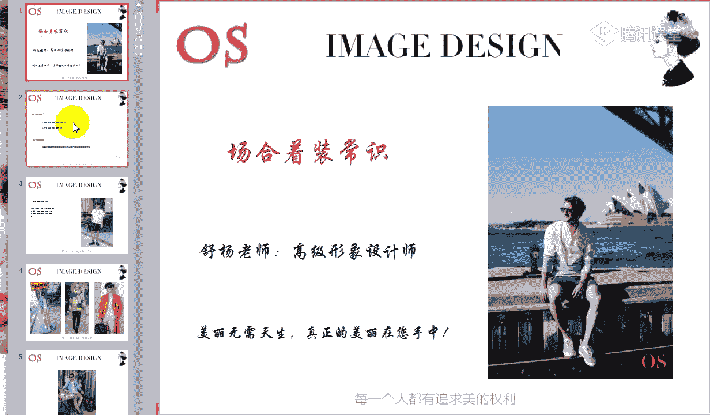

在本节课中，我们将要学习如何根据不同的年龄段和场合选择合适的着装。掌握这些知识，能帮助你在各种情境下都展现出得体、自信的个人形象。

上一节课我们学习了体型修饰，知道了色彩、材质、图案和款式对体型的影响。掌握这些后，我们还需要根据场合的不同，对服装的色彩、材质、图案和款式进行相应的调整。接下来，我们先来看本节课的重点知识。

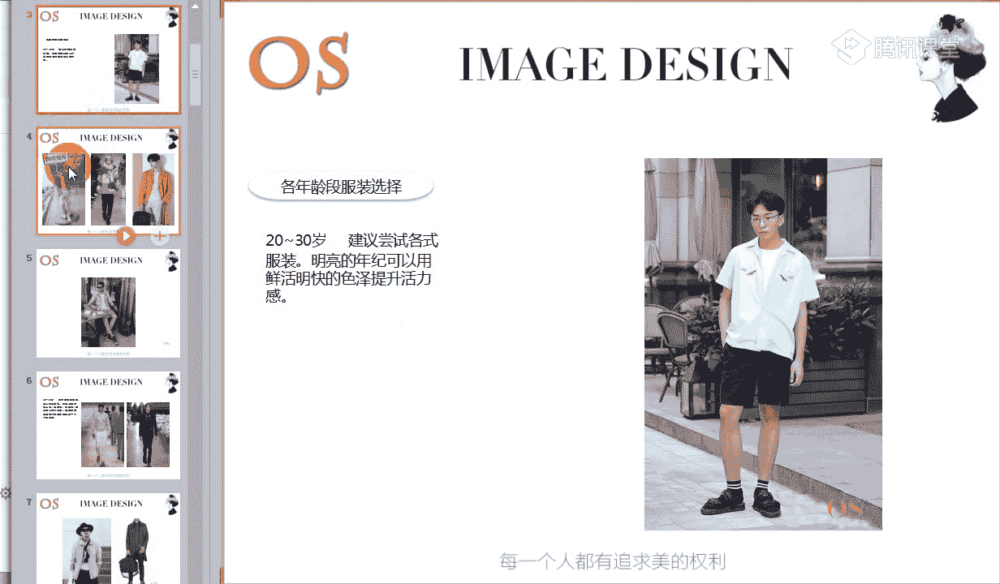

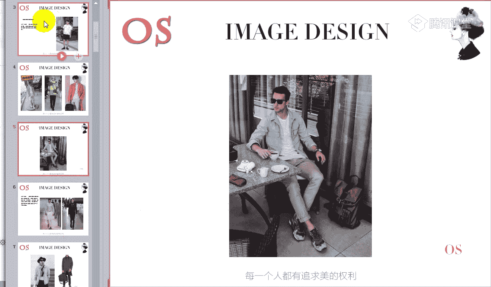

## 一、不同年龄段的服装选择

首先，我们来学习不同年龄段的服装选择。本节课的第一个重点是掌握各年龄段服装的选择要点。学习完后，你应该能够清楚在自己所处的年龄段，如何基于个人色彩和风格基础来选择服装，以及如何针对不同场合进行调整。

在讲解各年龄段服装选择的知识前，需要强调一个重要的前提：**所有年龄段装扮的技巧和关键词，都必须建立在个人整体色彩、风格和体型的基础之上**。这意味着，我们不能完全脱离自身的色彩季型、风格和体型，而仅仅按照年龄段的通用建议去穿衣。

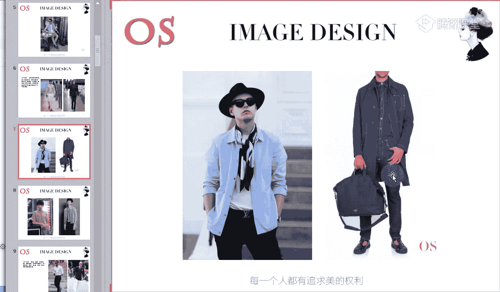

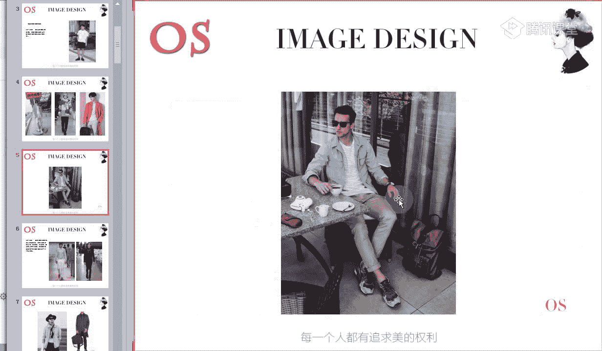

例如，在讲解20-30岁年龄段的服装选择时，会建议尝试鲜活明快的色彩来提升活力。但这里所说的“鲜活明快的色彩”，必须是在你个人用色范围内的、高明度或高纯度的色彩。如果你是夏季型，就应在冷色调中选择浅淡的色彩；如果你是冬季型，则应在暗青色调中选择鲜明、纯度高的色彩。核心原则是：**万变不离其宗**，一切调整都要围绕你自身的体型、色彩季型和风格来进行。

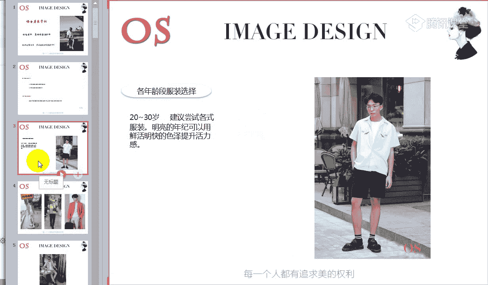

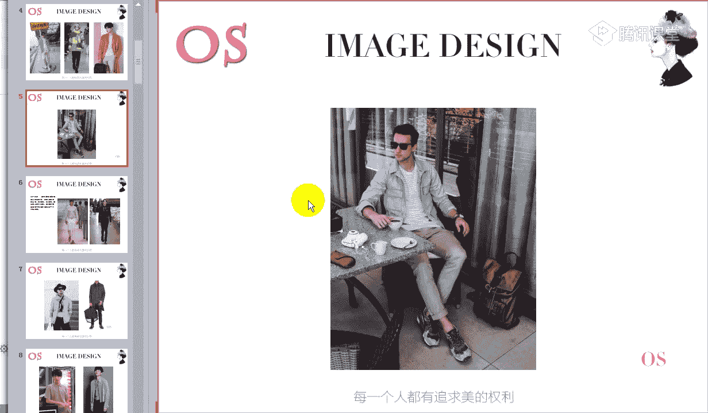

以下是各年龄段服装选择的要点：

### 1. 20-30岁
*   **色彩**：多选择个人用色范围内鲜活、明快的色彩（高明度或高纯度）。
*   **材质与图案**：可完全依据个人风格和体型进行选择，尝试范围较广。

### 2. 30-40岁
这个年龄段对服装材质开始有要求，着装需体现职业感和精致感。
*   **核心要求**：凸显职业感、精致感与品质感。
*   **平衡之道**：在稳重与时尚间找到平衡。例如，在正装中加入拉链等尖锐的流行元素。
*   **品质感**：对服装品质的要求提高。即使是牛仔服，也应选择剪裁利落、无明显做旧抛光处理的款式，以体现稳重与职业。

### 3. 40-50岁
这个年龄段追求简单、经典，注重细节和品质。
*   **核心要求**：简单经典、做工上乘、追求品牌（如有实力）。
*   **细节焦点**：利用口袋巾、领带、袖扣、丝巾等配饰制造视觉焦点，体现情调与生活品质。
*   **服装版型**：多选择带领子的服装，以增加刚毅感，修饰因年龄增长可能带来的身形松弛感。

### 4. 50-60岁及以上
*   **仍在工作**：在经典款式中加入舒适感，例如选择版型稍宽松的西装，或搭配羊毛衫。
*   **已退休**：以个人风格为基础，首要考虑舒适度。
*   **70-80岁**：以舒适为主。色彩上建议多选浅淡色彩，以提升气色，避免深色带来的压抑感。

**总结**：各年龄段的着装调整，都是在个人色彩、风格、体型这三要素基础上的适当变化，年龄建议是辅助参考，而非绝对标准。

## 二、不同场合的着装要点（TPO原则）

接下来，我们学习本节课的第二个重点：不同场合的着装。TPO穿着原则指的是服饰要符合**时间（Time）、地点（Place）、场合（Occasion）**。
*   **时间**：服饰需随自然界的四季和昼夜变化。
*   **地点**：服饰需与社会环境（如城市/乡村、室内/室外）相适应。
*   **场合**：服饰需与周围环境气氛（如开会、谈判、宴会）相协调。

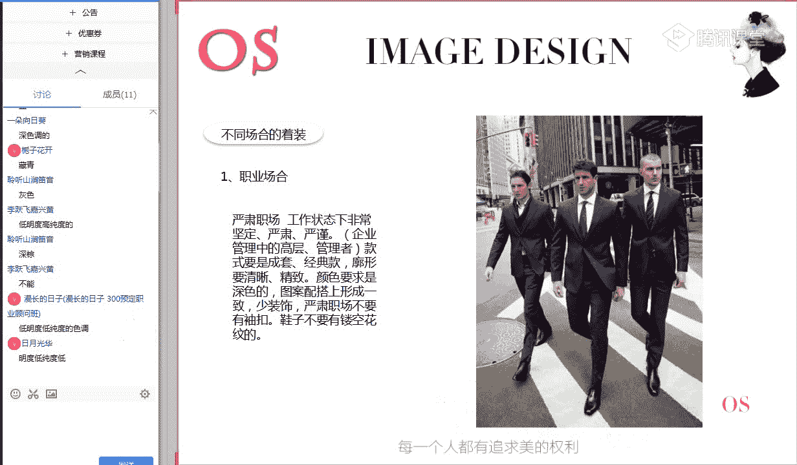

对于男士而言，**场合是着装考虑的第一顺位，其次才是个人风格，最后是色彩**。在某些正式场合，即使某种颜色或款式不完全符合你的个人风格，为了场合的得体性，也需要优先遵守场合着装规则。

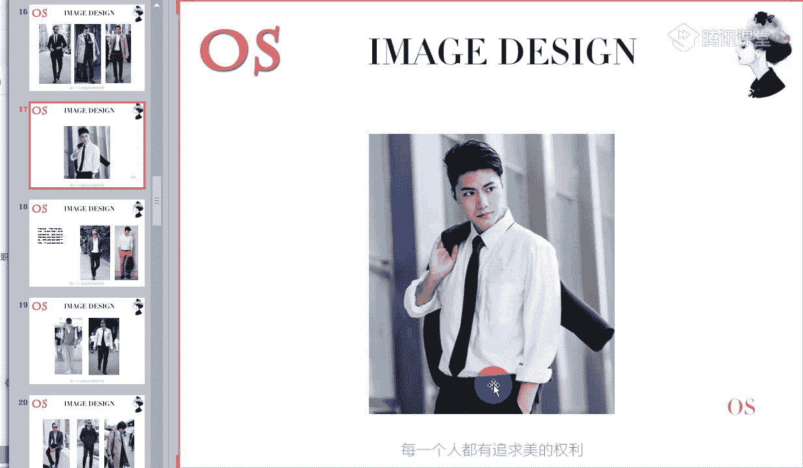

### 1. 职业场合
职业场合可细分为以下三类：

#### (1) 严肃职业场合
（如：正式会议、商务谈判、高管日常）
*   **氛围**：严肃、理性、严谨、强硬。
*   **色彩**：选择个人用色范围内偏稳重的色彩，如黑色、深蓝色、藏青色、深棕色。
*   **服装**：必须穿着**成套的正式西装**，不可拆套混穿。
*   **鞋履**：选择光面皮鞋，避免镂空花纹款式。
*   **配饰**：需系领带，颜色以稳重为主。可搭配简洁的正式大衣或风衣。

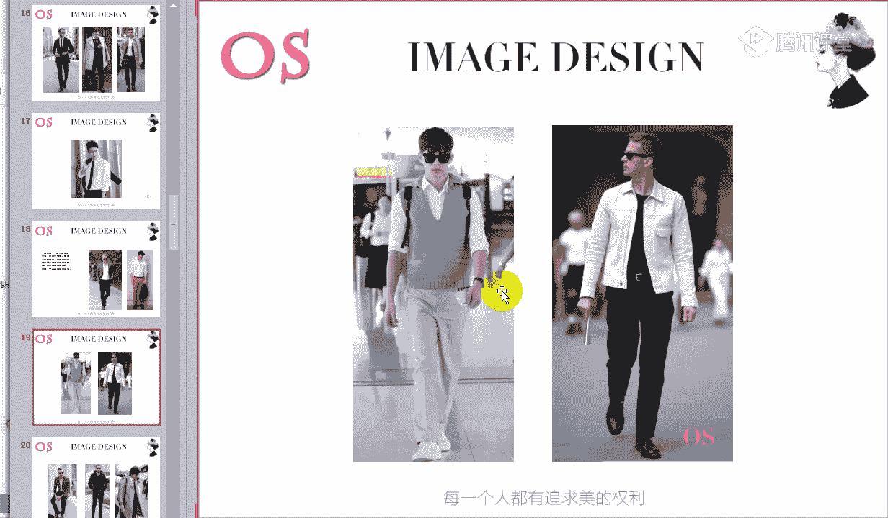

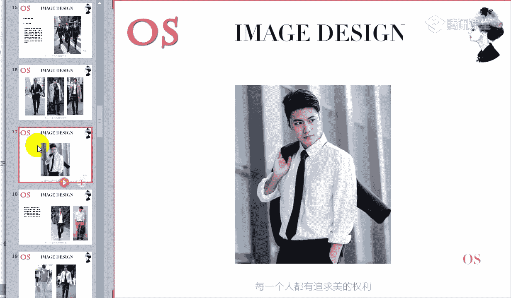

#### (2) 一般职业场合
（如：普通办公室职员、对着装无严格规定的公司）
*   **氛围**：平和，不突出个性。
*   **色彩**：以浊色（带灰调的颜色）为主，辅以个人用色中的浅淡或深色调。
*   **服装**：上装需体现正式感（必须有领子，如衬衫、Polo衫），下装可体现休闲感（如休闲裤、锥形西裤，但避免牛仔裤）。外套应选择设计简洁的夹克或休闲感西装。
*   **配饰**：可系领带，但颜色无需过于稳重。

#### (3) 时尚职业场合
（如：形象设计师、时尚编辑、造型师）
*   **氛围**：在表达一定职业感的基础上，可大胆展现个性。
*   **着装**：完美结合个人色彩、体型和风格。可适当增加适合的流行元素、色彩或配饰（如小方巾、口袋巾）。

**注意**：在咖啡厅等非办公室地点进行工作会谈，仍属于“半职业场合”，着装需体现专业与稳重，不能等同于休闲场合。

### 2. 休闲场合
休闲场合主要分为以下四类：

#### (1) 都市休闲场合
（如：逛街、看电影、逛商场）
*   **核心**：突出个人个性与时尚感。
*   **着装**：完全依据个人风格、体型和色彩进行穿着，无拘束。可大胆运用流行色和时尚款式。

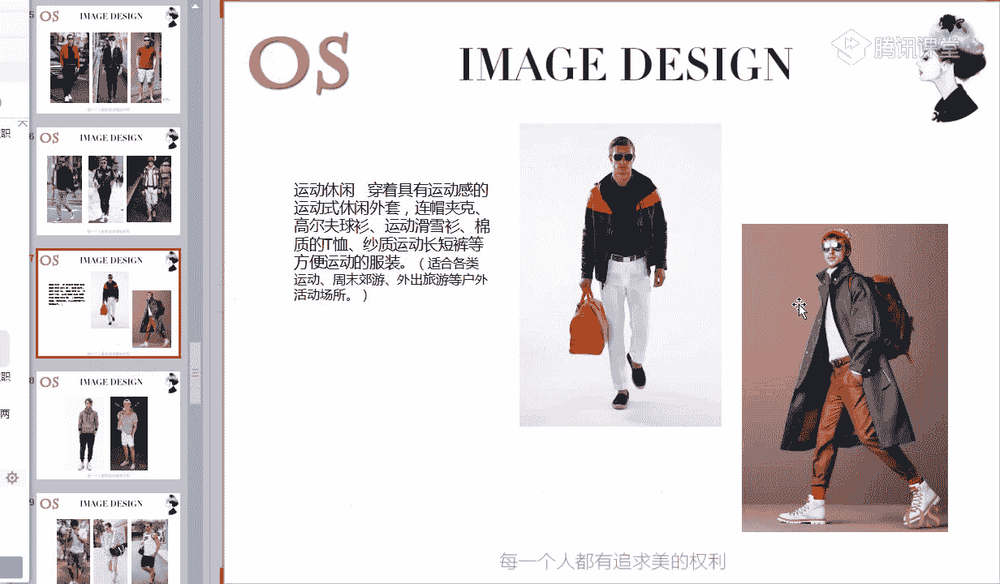

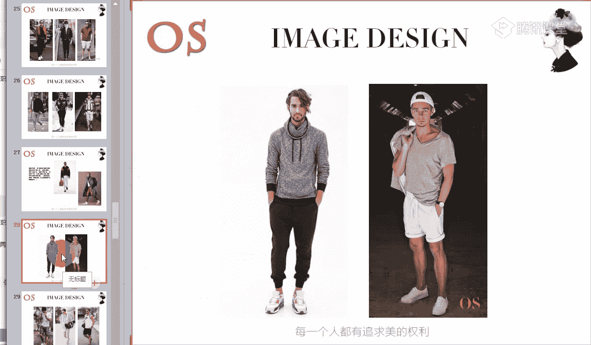

#### (2) 运动休闲场合
（如：郊游、徒步、登山、户外烧烤）
*   **核心**：舒适、方便运动，体现活力与动感。
*   **着装**：选择连帽夹克、运动外套、功能裤装等。色彩可选择纯度较高的颜色。鞋履需便于运动。
*   **区分**：运动休闲服装的时尚感较弱，不应与都市休闲服装混淆。

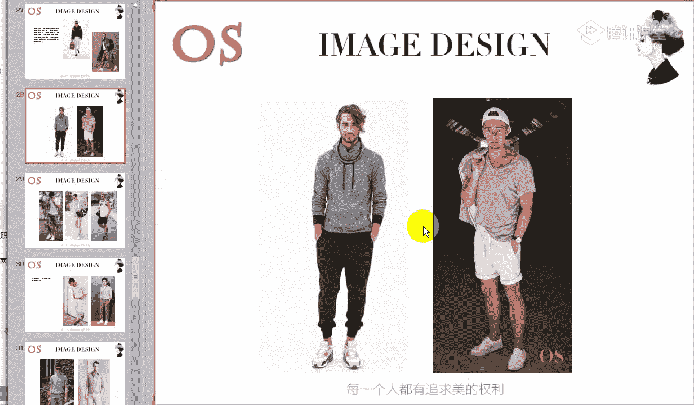

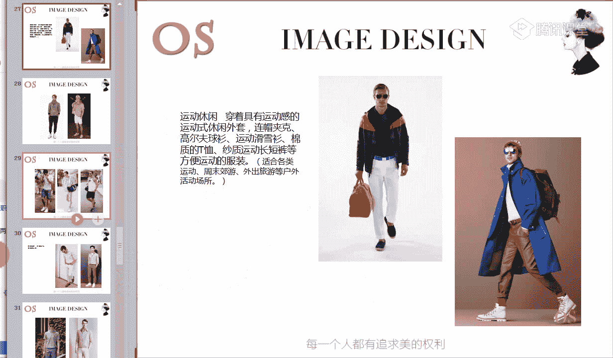

#### (3) 约会场合
*   **核心**：营造轻松、浪漫的氛围，拉近距离感。
*   **着装**：避免过于个性、夸张或带有距离感的设计（如大量破洞、铆钉）。选择个人用色范围内柔和、浅淡的色彩，款式上体现轻松与优雅。

#### (4) 居家休闲场合
*   **核心**：舒适、符合居家环境。
*   **着装**：宽松的毛衣、衬衫、睡衣、睡袍等。

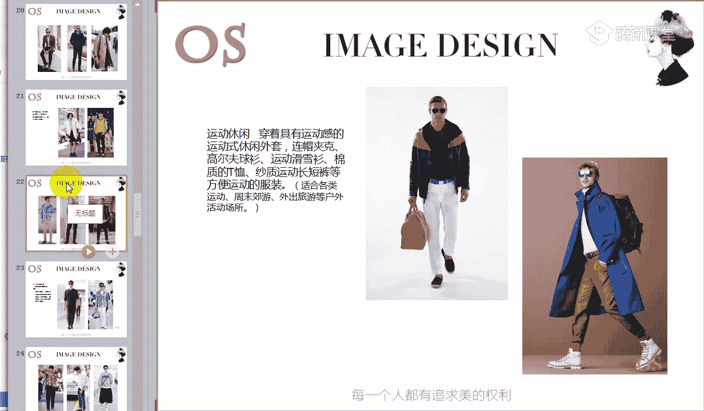

### 3. 社交场合
社交场合也可分为三类：

#### (1) 正式社交场合
（如：特定要求的晚宴、舞会）
*   **着装**：请柬会注明着装要求（如燕尾服、吸烟装）。需严格按照要求穿着。

#### (2) 一般社交场合
（如：普通酒会、音乐会）
*   **着装**：穿着合体的西装。可通过选择带有光泽感的面料来增加华丽感，以适应社交氛围。

#### (3) 时尚社交场合
（如：时尚圈酒会、明星活动）
*   **着装**：在西装的基础上，可更大胆地突出个性，如选择夸张的图案、特殊光泽面料或个性鞋履。

**练习**：观察一套服装的“形、色、质”，快速判断其适合的场合，是提升场合着装意识的有效方法。

## 课程总结

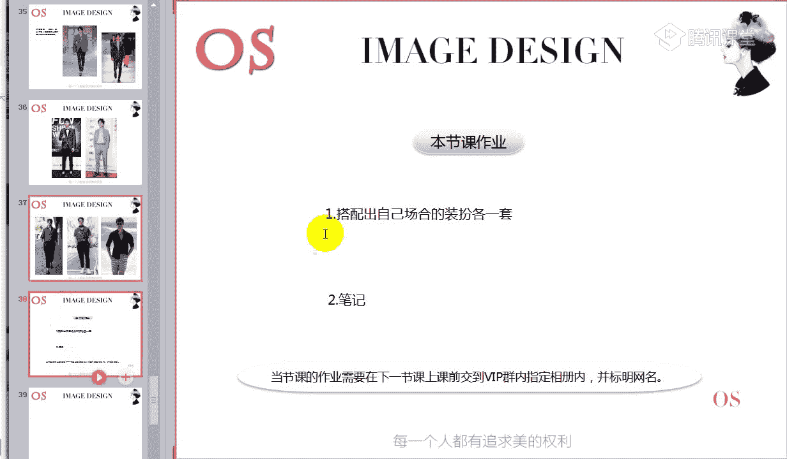

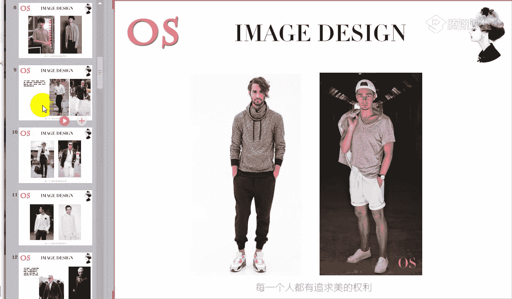

本节课我们一起学习了两个核心内容：
1.  **不同年龄段的服装选择**：所有调整都需基于个人色彩、风格和体型，年龄是辅助参考。
2.  **不同场合的着装要点（TPO原则）**：对于男士，场合是着装的第一考量，其次才是风格和色彩。我们详细分析了职业、休闲、社交三大类场合下的具体着装规则。

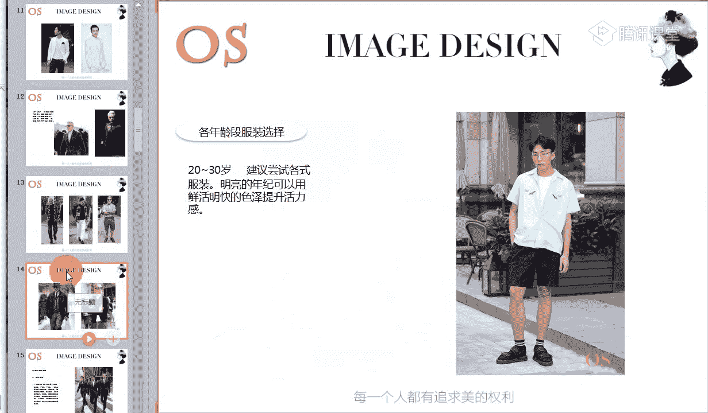

请记住，良好的场合着装意识是塑造专业、得体形象的关键。建议多观察、多练习，将理论知识转化为实际的搭配能力。

## 课后作业
1.  为自己或指定模特，搭配出适合**严肃职业**、**一般职业**、**都市休闲**、**运动休闲**四个场合的装扮各一套（可从现有衣柜搭配或从杂志中寻找灵感）。
2.  整理好本节课的笔记。