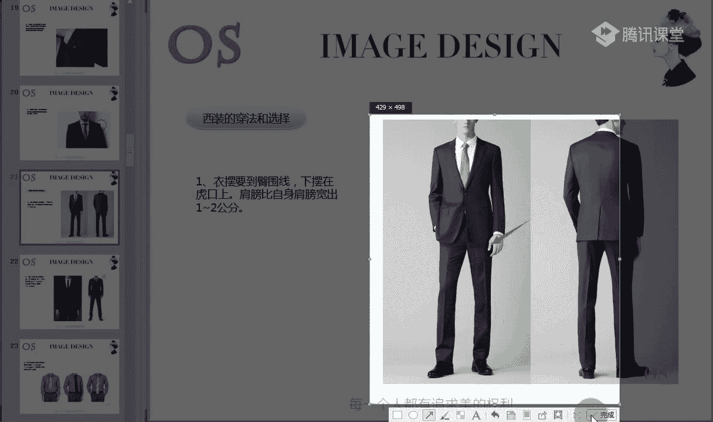
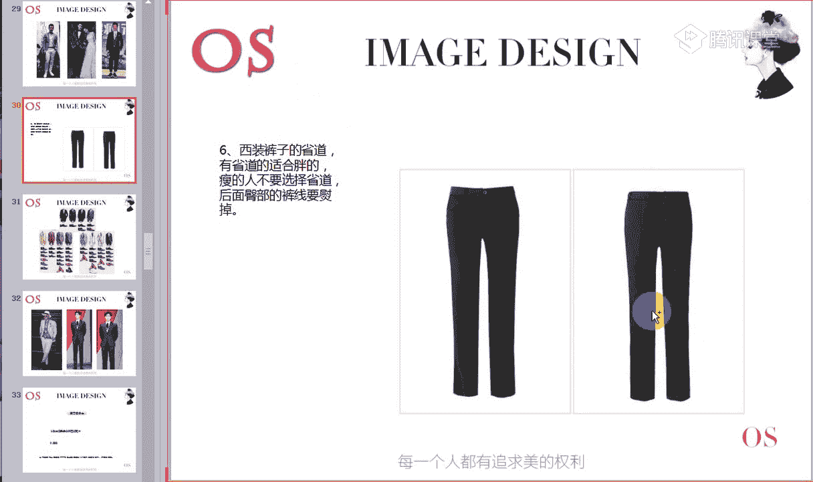
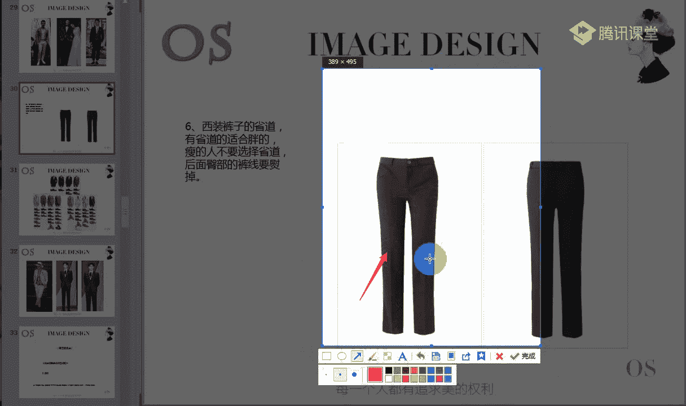
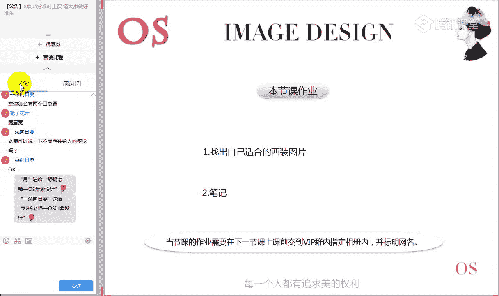

# 男士个人形象班第二期（中级版）VIP课程：第5节：正装的着装原则（一）

在本节课中，我们将要学习正装，特别是西装的核心知识。我们将从西装的种类、装饰物以及正确的穿法三个方面入手，帮助你系统地掌握如何选择和穿着西装。

## 概述

本节课将分为三个主要部分。首先，我们将认识西装的不同种类及其特点。其次，我们会了解西装上各种装饰物的作用。最后，也是最重要的，我们将详细讲解如何正确地选择和穿着西装，确保你的着装得体、精神。

---

## 一、西装的种类

上一节我们介绍了职业场合的着装要求，本节中我们来看看职业场合的核心单品——西装。西装的样式非常丰富，但万变不离其宗，从廓形上基本可以分为三大类：**Y型（T型）**、**H型**和**X型**。

在正式分析西装种类之前，首先要教大家认识几个领型。西装有不同的领型，这对于判断西装风格至关重要。

以下是三种主要领型的介绍：
*   **枪驳领**：其特征是领子的尖角非常尖锐，冲击力强，属于明显的直线条设计。
*   **平驳领**：领角开口适中，线条相对平和，在直与曲的划分中较为居中。
*   **青果领**：领面形似青果，线条流畅圆润，属于偏曲的设计。

主要需要清楚辨别枪驳领和平驳领的不同，因为不同款式的西装会搭配不同的领型。

### 1. 欧式西装 (T型/Y型)

欧式西装廓形呈明显的T字状，其核心特点是强调肩部设计，同时收腰、收臀。

以下是欧式西装的主要特征：
*   **廓形**：**T型**。肩部宽阔突出，腰部收紧，臀部也收紧，整体干净利落。
*   **经典款式**：传统且最典型的是**双排扣**设计。
*   **领型**：通常为**枪驳领**，凸显力量感。
*   **后摆开叉**：多为后开叉或无开叉设计。
*   **量感**：整体量感偏大，风格大气、雄性感强。

**适合人群**：
*   **身材**：身材高大、量感大的男士。如果腹部或臀部较大但匀称，也可尝试。
*   **风格**：大量感风格（如戏剧风格）的男士。
*   **造型**：适合高层管理者或需要展现权威、力量的场合。

### 2. 英式西装 (X型)

英式西装廓形呈X型，其核心特点是强调肩部的同时，明显收腰，并略微放宽臀部线条。

以下是英式西装的主要特征：
*   **廓形**：**X型**。肩部有力量感，腰部收紧，臀部微放，整体贴合身体，有束腰感。
*   **后摆开叉**：一般为双开叉或单开叉。
*   **领型与扣子**：以**平驳领**、**单排扣**为主。
*   **量感**：相比欧式西装，量感较小，风格儒雅、内敛。

**适合人群**：
*   **身材**：身材均匀、偏儒雅或内敛型的男士。
*   **风格**：古典、优雅等风格的男士。
*   **造型**：适合中层人士、机关单位等场合。

### 3. 美式西装 (H型)

美式西装廓形呈H型，其核心特点是整体线条流畅、松弛，休闲感较强。

以下是美式西装的主要特征：
*   **廓形**：**H型**或休闲的O型。肩部自然，腰部和臀部线条直筒，较为放松。
*   **穿着方式**：适合敞开穿，内搭可选择毛衣。
*   **后摆开叉**：多为**单开叉**。
*   **扣子**：以**两粒扣**居多。
*   **量感**：休闲感强，舒适度较高。

**适合人群**：
*   **身材**：对身材包容性强，偏胖或偏瘦的男士都适合。尤其适合年纪偏长、身材发福的男士。
*   **风格**：自然风格等追求舒适感的男士。
*   **场合**：一般职业场合或休闲场合。

### 4. 改良版西装

基于亚洲男士的身材特点，衍生出两种主要的改良版西装。

以下是两种改良版西装的介绍：
*   **日式改良西装 (窄版H型)**：在美式H型基础上改良，版型更窄、更修身，凸显身体流畅线条，非常适合个子偏小的东方男性。
*   **韩式西装 (精巧版X型)**：在英式X型基础上改良，版型更短、更修身，收腰明显，多以一粒扣或双排扣为主，适合身材瘦小、希望凸显身高的男士。

### 西装量感排序

根据整体廓形和量感大小，可以将上述西装进行排序（从大到小）：
1.  **欧式西装** (量感最大)
2.  **美式西装**
3.  **日式改良西装**
4.  **英式西装**
5.  **韩式西装** (量感最小)

---

## 二、西装的装饰物及其作用

认识了西装的种类后，我们来看看西装上的各种装饰物。它们并非单纯为了美观，许多都有其历史渊源和实用功能。

以下是西装上常见的四种装饰物及其作用：
*   **插花眼**：位于西装左侧领子上的扣眼。早期用于插花，现在多用于佩戴徽章，是西装上的一个精致细节。
*   **口袋巾**：放置在西装左侧胸袋中的装饰巾。在社交场合可用于擦拭眼镜等，但主要作用是提升着装的层次感和时尚度。在正式场合，应选择**白色口袋巾**，折叠方法以简洁的对折或三角折法为主。
*   **袖口纽扣**：西装袖子上的纽扣。最初在拿破仑军队中用于防止袖口磨损，现在主要起装饰作用，增加服装美感。
*   **垫肩**：位于西装肩部内侧。主要作用是让肩部线条看起来平整、挺括，增加力量感。对于溜肩的男士，选择有垫肩的款式可以改善肩部轮廓。

---

## 三、西装的正确穿法与选择

了解了西装种类和装饰后，最关键的一步是如何正确地穿着。合身是西装穿着的第一要义，以下是一些具体的衡量标准。

### 1. 上衣长度

西装上衣的长度应恰到好处。

判断方法是：穿上西装并扣好扣子，手臂自然下垂。此时，**西装下摆的边缘应与虎口（大拇指与食指连接处）保持平行**。

### 2. 肩部与袖子

肩部和袖子的合身度直接影响整体精神面貌。

具体标准如下：
*   **肩宽**：西装肩线应比你的实际肩宽宽出**1-2厘米**，过宽或过窄都不合适。
*   **袖长**：西装袖子长度应位于**手腕外侧凸起的骨骼上方**，不能再长。合适的袖长会让人显得精干。

### 3. 衬衫搭配

衬衫是与西装搭配的内搭，其露出部分有严格讲究。

具体标准如下：
*   **袖长**：穿上西装后，**衬衫袖子应露出1-1.5厘米**。
*   **领高**：从后方看，**衬衫领子应高出西装领子1-1.5厘米**。

### 4. 领带长度

领带的长度应与身高相匹配。

打领带时的一个小技巧是：将领带较短（窄）的一端置于胸部上方，较长（宽）的一端垂到膝盖位置，这样打出的领带，其尾部（剑头）尖端应刚好落在**腰带扣的上方**，既不会太高到腹部，也不会太低。

### 5. 裤子与鞋袜

裤子与鞋袜的搭配是完成正装造型的最后一步，细节决定成败。

需要注意以下几点：
*   **裤长**：西装裤的长度至关重要。最佳长度是裤脚落在**鞋帮（鞋后跟上部）的位置**，避免堆积在鞋面造成拖沓感。九分长度或刚好及鞋面都是不错的选择。
*   **鞋款**：搭配正装最正式的皮鞋是**系带皮鞋**。鞋面可以是**横截面（雕花）** 设计，也可以是光滑无装饰的，但应避免镂空、异形等过于休闲的款式。
*   **袜子**：颜色应**深于西装裤的颜色**（例如，藏蓝色西装配黑色袜子）。长度要足够，确保坐下时不会露出小腿皮肤。

### 6. 裤中线

西装裤前面的笔直折痕称为“裤中线”或“裤线”。

有裤中线的裤子能产生视觉上的延伸感，有**显瘦效果**，因此更适合偏胖的男士。穿着前需将裤线熨烫平整。偏瘦的男士则不太适合。

---

## 总结

本节课我们一起学习了关于西装的三大核心知识。首先，我们认识了欧式（T型）、英式（X型）、美式（H型）三大基础西装及其改良版的特点与适合人群。其次，我们了解了插花眼、口袋巾等西装装饰物的用途。最后，也是最重要的，我们详细拆解了从上衣长度、肩袖合身度到裤长、鞋袜搭配等一系列正确的西装穿法准则。

掌握这些原则，你就能更好地选择适合自己身材和风格的西装，并在各种场合中展现出得体、自信、专业的个人形象。