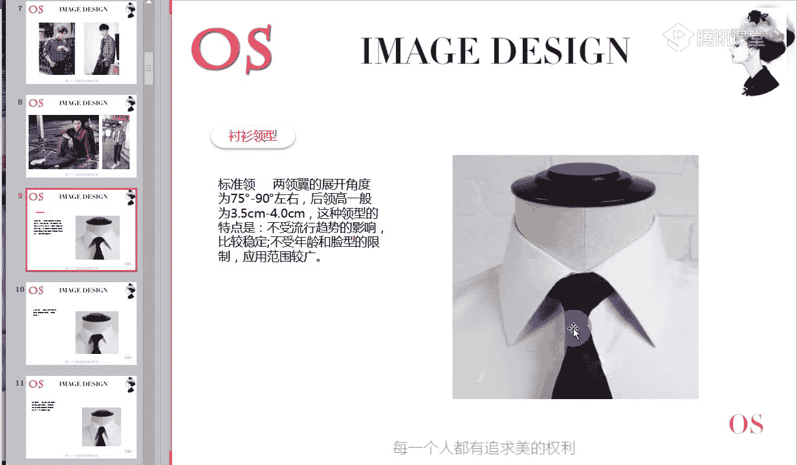
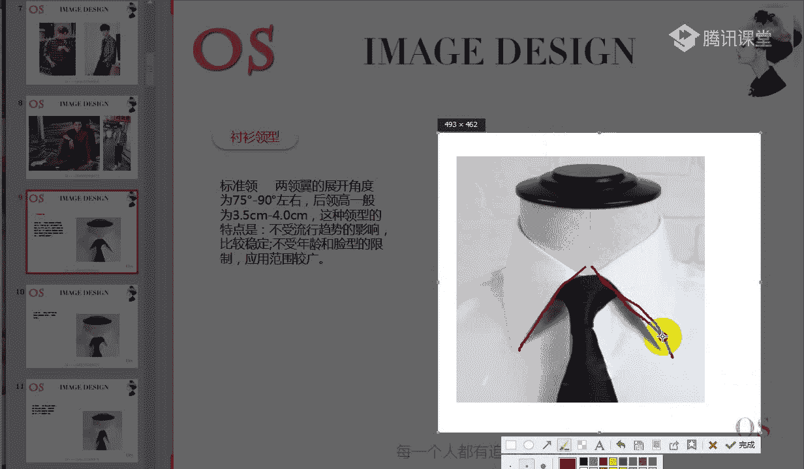
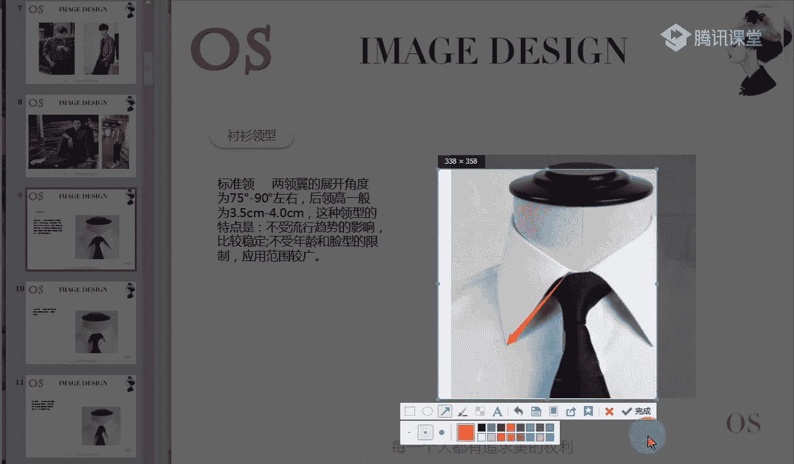
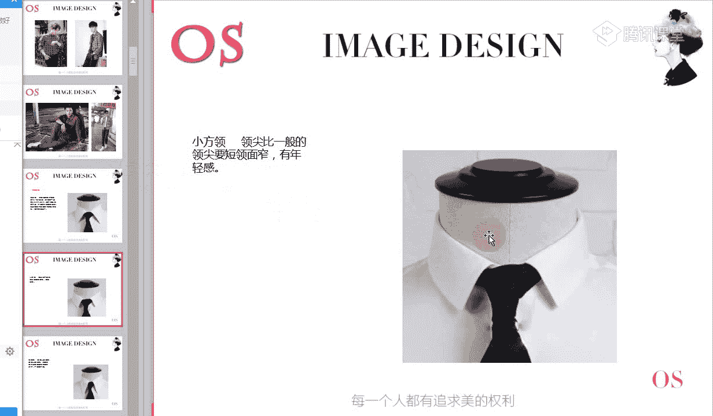
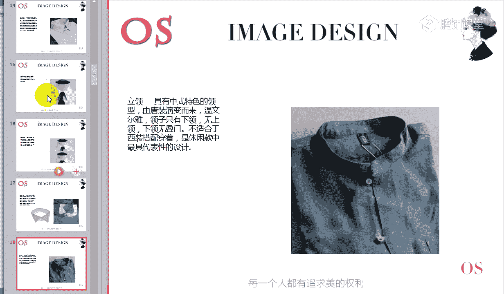
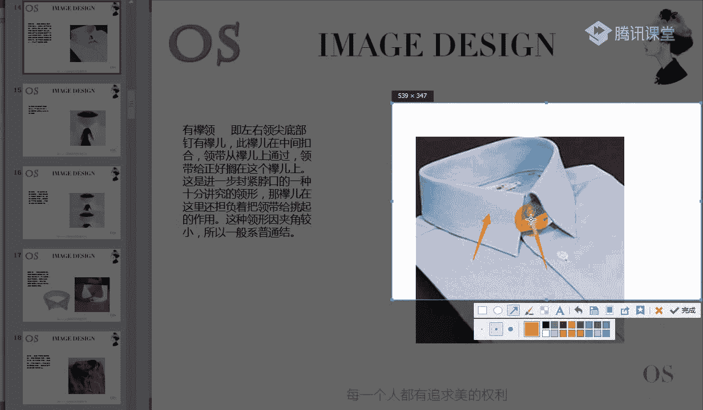
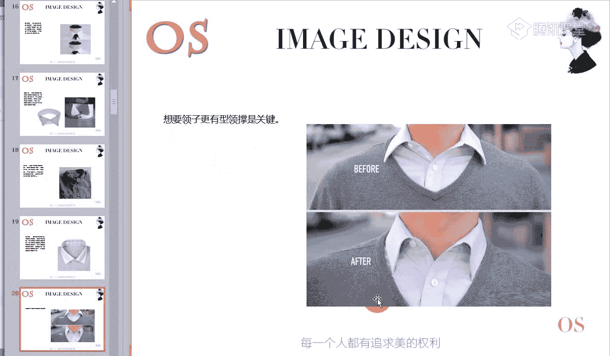
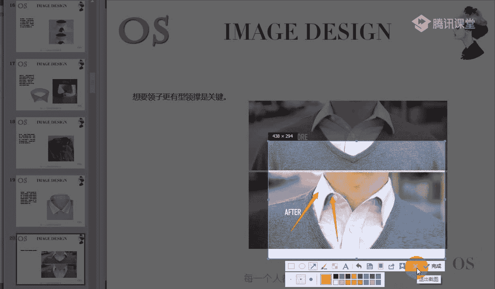
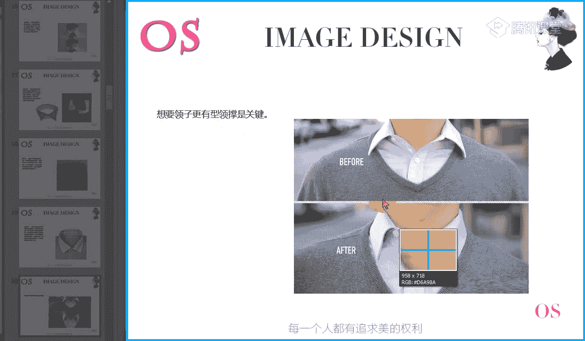
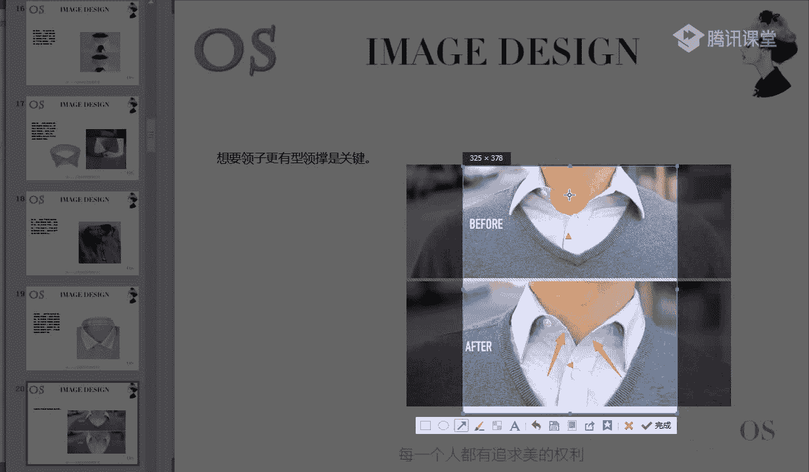

# 男士个人形象班（中级版）VIP课程：第6节：正装着装原则（二）👔

在本节课中，我们将继续深入学习正装的着装原则，重点聚焦于衬衫、领带/领结以及鞋类的详细分类与搭配。通过学习，你将能够精准辨别不同单品的风格与适用场合，从而构建更专业、更得体的个人形象。

---

## 第一部分：男士衬衫的分类与选择

上一节我们介绍了正装的基本轮廓与西装选择，本节中我们来看看男士衣橱中另一核心单品——衬衫。衬衫种类繁多，了解其质地、样式与场合要求，是现代男性的必备常识。

根据款式与用途，男士衬衫大致可分为以下三类：

1.  **社交衬衫（礼服衬衫）**
    *   **搭配对象**：与晨礼服、吸烟装等**礼服**搭配，而非日常正式西装。
    *   **关键特征**：
        *   **前胸衬**：前胸有一块较厚、有设计感的胸衬。
        *   **下摆**：呈**圆弧状**，通常较长，便于整齐地塞入裤内。
        *   **袖口**：为**双层袖口**，用于搭配袖扣。

2.  **商务衬衫（普通衬衫）**
    *   **适用场合**：职业场合，与西装搭配或单穿。
    *   **关键特征**：
        *   **花色**：**素色**、**单色**，或带有不明显的**细条纹**、**小格子**。
        *   **设计**：左胸常有一个小口袋，设计简洁，无明显装饰。
        *   **领型**：常见直角领、尖角领或温莎领（八字领）。

3.  **休闲衬衫**
    *   **适用场合**：度假、休闲等非正式场合。
    *   **关键特征**：
        *   **花色**：格纹、条纹、花卉图案、刺绣等，变化丰富。
        *   **设计**：可能有明线、多口袋、做旧等突出细节的设计。
        *   **版型**：衣身通常较为宽松。
        *   **下摆**：多为**平直下摆**，适合外穿；若为圆摆也可塞入裤内。

**关于衬衫下摆与穿法**：
*   **圆摆**：长度足够，便于整齐塞入裤内，适合需要严谨形象的场合。
*   **平摆**：通常外穿。若想优化比例，可只塞一边或稍微塞入一角。

---

## 第二部分：衬衫领型与风格搭配

了解衬衫大类后，我们深入看看领型。领型的选择与个人面部风格息息相关，合适的领型能与五官和谐共处。

以下是常见的男士衬衫领型及其特点：

1.  **标准领**
    *   **特征**：领翼展开角度约 **75° - 90°**，后领高约3.5-4厘米，领尖长度约9厘米。
    *   **风格**：不受流行趋势影响，适用性广，不挑年龄和脸型。

2.  **小方领**
    *   **特征**：领翼更短，领面更窄。
    *   **风格**：量感小，有**年轻感**，适合风格量感小或年轻的男士。

3.  **扣角领**
    *   **特征**：领尖处有扣子固定。
    *   **风格**：**休闲感**强，源于美国。适用于休闲场合，**正式场合避免使用**。

4.  **宽角领（温莎领）**
    *   **特征**：领翼夹角大，在 **120° - 180°** 之间。
    *   **风格**：个性鲜明，需搭配**较大的温莎结**。在意大利颇受年轻人欢迎。

5.  **针孔领/夹洞领**
    *   **特征**：领子中央各有一个小洞，可用领针固定领带。
    *   **风格**：装饰性与固定性兼具，适合正装，**不适用于休闲装**。

6.  **尖角领**
    *   **特征**：领翼展开角度**小于90度**，领尖挺直修长。
    *   **风格**：给人修长、精致的感觉。

7.  **圆角领**
    *   **特征**：领尖呈圆弧状。
    *   **风格**：古典、柔和，**弱化尖锐感**，适合休闲场合。

8.  **翼领（异形领）**
    *   **特征**：领口立起，前领尖向外翻折。
    *   **风格**：是**礼服衬衫**的常见领型，**必须搭配领结**，而非领带。

9.  **立领**
    *   **特征**：只有领座（下领），没有翻领（上领），领口无叠门。
    *   **风格**：源自中式唐装，温文尔雅。**不适合搭配正式西装**，可与休闲西装混搭，常见于休闲款。

10. **牧师领（异色领）**
    *   **特征**：领子与衣身颜色不同，通常领子为白色。
    *   **风格**：源于神职人员的服饰，现在颜色搭配更多样。

**选择领型的关键**：需与个人风格量感协调。例如，戏剧型、浪漫型等大量感风格应避免小方领，以免显得小气；反之，小量感风格应避免过于夸张的领型。

**衬衫穿着贴士**：
*   **使用领撑**：可使领子更挺括有型。
*   **内搭背心**：穿着轻薄衬衫时，内搭浅色背心可防止透视尴尬并吸汗。

---

## 第三部分：领带的图案分类与场合

领带是正装中重要的装饰，其图案直接关系到场合的正式度与个人风格的表达。

以下是领带图案的主要分类及其适用场合：

1.  **小纹均匀**
    *   **特征**：图案**小号**，排列**紧密**。
    *   **感受**：带来严谨、紧凑的状态。
    *   **场合**：适合**正式上班、严肃职业场合**。

2.  **小纹间隔**
    *   **特征**：图案**小号**，但图案间有**分散感**。
    *   **感受**：比小纹均匀稍显轻松。
    *   **场合**：适合**一般职业场合**。

3.  **大纹均匀**
    *   **特征**：图案**大号**（如拇指盖大小），排列仍有紧密感。
    *   **感受**：图案相对稳定、平和。
    *   **场合**：可根据图案具体样式，用于**一般职业场合**。

4.  **斜条纹**
    *   **特征**：经典的斜向条纹图案。
    *   **感受**：比小纹领带更偏休闲。
    *   **场合**：适合**谈判、一般职业场合**。

5.  **无图案**
    *   **特征**：**纯色**，无其他图案。
    *   **感受**：焦点完全在**色彩**上。
    *   **场合**：明艳色彩适合**社交场合**；柔和色彩可用于一般职业场合；**严肃职业场合不建议**。

6.  **自然图案**
    *   **特征**：图案色彩常有**浊色感**（加了灰调），显得不那么清晰。
    *   **感受**：带有一定的自然、朴实感，略有年龄感。
    *   **场合**：适合气质沉稳或自然风格的男士。

7.  **曲线图案**
    *   **特征**：图案由曲线、弧线构成。
    *   **感受**：**减弱理性，增加感性**。
    *   **场合**：适合婚礼、浪漫风格男士的时尚或休闲场合。

8.  **前卫图案**
    *   **特征**：图案**个性、抽象、有设计感**。
    *   **感受**：年轻、阳光、锐利、个性。
    *   **场合**：适合时尚行业或追求个性的男士。

**领带通用知识**：
*   **宽度**：常见8厘米，更窄（4-5厘米）则休闲感更强。
*   **长度**：标准长度在 **133 - 145 厘米** 之间，需根据身高选择。

---

## 第四部分：领结与鞋类的风格化选择

### 领结的风格匹配
领结与领带一样，需根据风格选择。核心在于观察其大小、图案和装饰物带来的视觉感受。

*   **戏剧型**：**大气、摩登、夸张**，图案醒目，有冲击力。
*   **浪漫型**：**华丽、性感、大气**，比戏剧型更富感性元素。
*   **新锐前卫型**：**个性、时尚、标新立异**，有一定锐利感，量感较戏剧/浪漫型小。
*   **阳光前卫型**：**年轻、个性、调皮、可爱**，比新锐前卫型更平和。
*   **自然型**：**随性、潇洒、朴实**，适合天然去雕饰的质感，避免过多人工装饰。
*   **古典型**：**稳重、端庄、精致、高级**，图案规则，质感上乘。

### 男士鞋类分类与风格
皮鞋分为正式与休闲两大方向。正装皮鞋皮质精良、硬挺、光泽感好；休闲皮鞋则追求舒适，材质多样（如反毛皮、帆布）。

以下是经典鞋型及其风格导向：

1.  **牛津雕花鞋**
    *   **特征**：鞋面有翼状雕花。
    *   **场合**：**正式场合不可穿**，适用于时尚社交或休闲场合。

2.  **镂花鞋**
    *   **特征**：鞋面有精美孔洞雕花。
    *   **场合**：华丽度高，常与**礼服**搭配，休闲款也可用于休闲场合。

3.  **横饰鞋（一字拼皮鞋）**
    *   **特征**：鞋面有一条横向装饰缝线。
    *   **场合**：**严谨度最高**，是搭配**正式西装**的首选，适用于严肃职业场合。

4.  **孟克鞋**
    *   **特征**：采用扣带设计（单扣或双扣）。
    *   **场合**：装饰感较强，严谨度低于横饰鞋，可用于一般职业或商务休闲场合。

5.  **乐福鞋**
    *   **特征**：无鞋带、易穿脱的便鞋，包括豆豆鞋等变体。
    *   **场合**：适用于一般职业场合和休闲场合。

6.  **素面鞋（懒人鞋）**
    *   **特征**：鞋面光滑无装饰，一脚蹬款式。
    *   **场合**：休闲感强，欧式风格明显。

**各风格选鞋要点**：
*   **戏剧型**：选择**大气、摩登、夸张**，有现代感的款式。
*   **自然型**：选择**造型简洁大方、皮质天然柔软**的款式，避免过多人工痕迹。
*   **浪漫型**：适合**圆润、曲线感强**的鞋头，皮质柔软有光泽，可有一定装饰。
*   **古典型**：必须**皮质精良、做工上乘、样式经典**，追求品质与精致感。
*   **新锐前卫型**：适合**光泽感强、造型独特、设计感强**的个性款式。
*   **阳光前卫型**：可选择**流行、造型独特、带点可爱调皮元素**的款式，但比新锐前卫型稍显收敛。

---

## 总结与作业

本节课中，我们一起学习了正装着装的三大核心配饰：衬衫、领带/领结和鞋类。我们从**分类辨别**深入到**风格匹配**，明确了不同单品的设计特征、适用场合以及与个人风格的关联。

**核心要点回顾**：
1.  衬衫按场合分为社交、商务、休闲三类，通过下摆、袖口等细节辨别。
2.  领型是衬衫的灵魂，需与个人面部量感及风格协调。
3.  领带图案直接影响场合正式度，从小纹到前卫图案，适用性逐渐偏向休闲与个性。
4.  领结和鞋子的选择需紧密贴合个人风格，从戏剧型的大气夸张到自然型的随性天然，各有其道。

**课后作业**：
请根据你的个人风格诊断结果（如未完成请尽快提交），完成以下实操练习：
1.  找出至少一款适合你个人风格的**领结**图片。
2.  找出至少一款适合你个人风格的**皮鞋**图片（可区分正式或休闲）。
3.  在提交作业时，请务必备注你的**风格、色彩季型、体型**信息。

通过有目的地搜集和审视适合你的单品图片，你将能强化对风格的理解，并在未来购物时做出更精准的选择。

---

我们今天的课程就到这里，感谢大家的聆听。